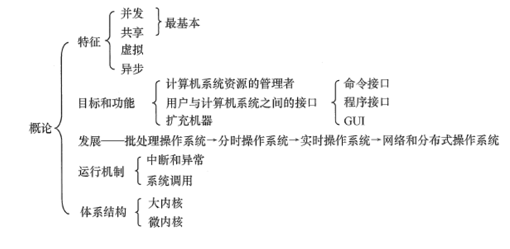

# 操作系统

## 计算机系统概述

### 操作系统的基本概念

1. **操作系统的概念**

    操作系统是指**控制和管理**整个计算机系统**硬件和软件资源**，合理组织调度计算机的**工作与资源分配**，为用户提供方便的接口与环境的**程序的集合**

2. **操作系统的特征**:star:

    1. **并发**：两个或多个事件，在同一时间间隔内发生
        1. 并行是在同一时间上进行的操作
        2. 并发是同一个时间段内交替操作，宏观上看起来是同时执行的
    2. **共享**
        1. 互斥共享
        2. 同时访问
    3. **虚拟**：将一个物理实体变为若干逻辑上的对应物
        1. 时分复用技术：虚拟处理器
        2. 空分复用技术：虚拟存储器
        3. 虚拟设备技术：虚拟IO设备
    4. **异步**：允许多个程序并发执行，但是资源有限，进程不是一贯到底的，走走停停

3. **操作系统的目标和功能**:star:

    1. 操作系统是计算机资源管理者
        1. 处理机管理（进程控制、进程同步、进程通信、死锁处理、处理机调度）
        2. 存储器管理（提高内存利用率、内存分配和回收、地址映射、内存保护共享、内存扩充）
        3. 文件管理（计算机中的信息都是以文件存在的）
        4. 设备管理（完成用户的IO请求、方便用户使用设备、提高设备的利用率）
    2. 操作系统为用户和计算机硬件提供接口
        1. 命令接口
        2. 程序接口（由系统调用组成，用户在程序中使用这些系统调用请求操作系统为其提供服务）
    3. 操作系统用作扩充机器

### 操作系统的发展历程

1. 手工操作阶段
2. 批处理阶段（操作系统开始出现）
    1. 单道批处理系统
    2. 多道批处理系统（宏观上并行，微观上串行，自动控制）
3. 分时操作系统（将处理器的运行时间分成时间片，作业在时间片内运行，可以人为干预）
4. 实时操作系统（在某个时间限制内完成某些紧急任务，而不需要时间片排队）
5. 网络操作系统（各种资源共享，各台计算机通信）和分布式计算机系统（若干计算机协同完成一个工作）
6. 个人操作系统

### 操作系统的运行机制

1. **内核程序和应用程序（内核态和用户态）**:star:

    CPU执行两种性质不同的程序：**内核程序和用户自编程序**，根据这个将CPU运行模式划分为管态（内核态）和目态（用户态），当处于管态时，可以执行**特权指令**，当处于目态时，可以执行**非特权指令**，特权指令如“IO执行、中断指令”

2. **层次式结构**

    操作系统各项功能在不同的层次上。与硬件关联紧密的模块，如**时钟管理、中断管理、设备驱动**处在最底层，其次是运行频率较高的程序，比如**进程管理、存储管理、设备管理**等。上面这两部分组成了操作系统的内核，运行在**内核态。**

3. **内核**

    内核是计算机配置上的底层软件，包括

    1. 时钟管理：通过时钟中断，实现进程切换（时间片用完）
    2. 中断机制：中断机制中只有一小部分属于内核，负责保护和恢复中断现场的信息
    3. 原语：底层可以被调用的**公用小程序**

4. **系统控制的数据结构以及处理**

    进程管理、存储器管理、设备管理

**系统调用的执行过程**:star:

计算机系统的各种硬件资源有限,为了管理这些资源,进程不允许直接操作，对这些资源的访问必须经过操作系统控制，也就是说**操作系统是使用这些资源的唯一入口，这个入口就是系统调用**

**中断和异常的概念**:star:

CPU运行**用户程序**唯一可以进入内核态的途径就是通过**中断或异常**

1. 中断：来自CPU执行指令**外部**的事件，IO中断表示输入输出完成，时钟中断表示固定的时间片用完
2. 异常：来自CPU执行指令**内部**的事件，非法操作码，地址越界，运算溢出，缺页异常等

**大内核和微内核**:star:

1. 大内核：将**操作系统的功能作为一个紧密结合的整体**放到内核。由于各个模块共享信息，因此由很高的性能
2. 微内核：将一部分操作系统的功能移出内核，降低内核的复杂性，移出的部分根据分层原则划分为若干服务，相互独立

### 操作系统引导

常见的操作系统引导的过程：

1. 激活CPU：激活的CPU读取**ROM**中的boot程序，将**指令寄存器**设置为BIOS的第一条指令，即开始执行BIOS的指令
2. 硬件自检
3. 加载带有操作系统的硬盘
4. 加载主引导记录
5. 扫描硬盘分区表
6. 加载分区引导记录
7. 加载启动器管理
8. 加载操作系统

## 进程管理

==进程概念、进程调度、信号量机制实现同步互斥、进程死锁==

### 进程与线程

==进程与线程的基本概念、进程线程的状态切换==

==进程间的通信：共享内存、消息传递、管道==

==线程的实现：内核支持的线程、线程库支持的线程==

==进程与线程的组织与控制==

1. **进程的概念和特征**

    为了管理好并发执行的程序，引入**进程概念**，对此为每个程序配置了一个专门的数据结构，称为**进程控制块**（PCB）。由程序段、相关数据段、PCB三部分构成了**进程实体**。所谓创建进程就是创建PCB，撤销进程就是撤销PCB

    概念：**进程是进程实体的运行过程，是系统进行资源分配和调度的一个独立单位** :star:

    特征：程序是静态的，进程是动态的，动态并发独立异步

    

2. **进程的组成**

    1. **进程控制块**

        

        PCB是进程存在的**唯一标志**

    2. **程序段**

        程序段是能被**进程调度程序**调度到CPU的程序代码段，可以被多个进程共享

    3. **数据段**

        进程对应的程序**加工处理的原始数据**

        **程序执行产生的中间或最终结果**
        
        

3. **进程状态切换**:star:

    

    **就绪态**：进程获得**除CPU外的一切资源**，一旦得到CPU就可以立即运行，多个处于就绪态的进程组成**就绪队列**

    **运行态**：进程正在CPU上运行

    **阻塞态**：进程正在等待某一事件而暂停运行，如等待某个资源可用、等待IO完成，即使CPU空闲也不能运行，多个处于阻塞态的进程组成**阻塞队列**

    **创建态**：进程正在被创建（创建PCB，分配运行资源）

    **终止态**：进程从系统中**消失**

    

    三态转换：

    **就绪态到运行态**：处于就绪态的进程**获得CPU资源**（分配CPU时间片）

    **运行态到就绪态**：分配的时间片用完

    **运行态到阻塞态**：进程**请求某一资源**（如外设）**的使用**或**等待某一事件的发生**（如IO操作完成）

    **阻塞态到就绪态**：进程等待的事件到来

    

4. **进程的通信**:star:

    1. **共享存储**

        

        通信的进程之间存在一块**可以直接访问的共享空间**，通过对共享空间的读写操作实现进程之间的信息交换

    2. **消息传递**

        

        进程之间的数据交换以**格式化的消息**为单位，进程通过操作系统提供的**发送消息和接收消息**这两个**原语**进行数据交换

    3. **管道**

        

        管道是特殊的**共享文件**，**pipe**文件。数据在管道中是**先进先出的**。

        只要管道不满，写进程就能一直往里写入数据；只要管道不空，读进程就能一直读取数据。

        管道必须满足**互斥（一个进程读写、另外的进程等待），同步**，从管道读数据是一次性操作，普通管道只允许**单向通信**，若实现两个进程双向通信，需要定义两个管道

        

5. **线程**:star:

    1. **线程**的基本概念：线程最直接的理解是**轻量级的进程**，可与同一个进程的多个线程共享拥有的全部资源，**线程是操作系统能够运算调度的最小单位**
    2. **进程和线程的比较**：
        1. 进程是系统进行**资源分配和调度的基本单位**；线程是**CPU调度和分派的基本单位**
        2. 线程依赖于进程，一个进程至少有一个线程
        3. 进程有自己独立的地址空间，线程共享进程的地址空间
        4. 进程是系统拥有资源的基本单位，而线程不拥有系统资源
        5. 进程切换的开销大于线程切换，进程切换涉及保存当前进程CPU环境以及新的CPU调度的环境，线程只需要保存寄存器内容
        6. 进程通信依靠IPC，同一进程的线程共享全局变量
        7. 多线程程序一个线程崩溃，整个程序崩溃，多进程程序并不会
    3. 线程三态：执行态、就绪态、阻塞态
    4. **线程的实现方式**
        1. 用户级线程：有关线程管理（创建、撤销、切换）都是在**用户态**下完成的
        2. 内核级线程：系统进程和用户进程都是在操作系统内核的支持下进行的

    

### CPU调度

==调度的基本概念；调度的目标==

==调度的实现：调度器/调度程序，调度时机，调度方式（抢占式与非抢占式），内核级线程与用户级线程调度==

==典型调度算法：先来先服务、多作业优先、时间片轮转、优先级调度、高响应比优先、多级队列==

==上下文及其切换机制==

1. **调度的基本概念**

   多道程序系统中，**进程的数量往往多于CPU的数量**，进程会争用CPU，CPU调度是对就绪队列中的进程进行CPU分配

2. **作业三级调度**

   

   1. 高级调度（作业调度）

      按照某种规则从**外存上**处于后被队列的作业中选择一个，给他们分配**内存、IO设备**等必要的资源，并建立相应的进程，使他们获得**竞争CPU的权利**

   2. 中级调度（内存调度）

      将那些暂时不能运行的进程调度至**外存**等待，此时的进程处于**挂起态**。当具备运行条件时，在将其重新调入**内存**，进入就绪队列中等待

   3. 低级调度（进程调度）

      按照某种算法，从**就绪队列**中选取一个进程，将CPU分配给它，进程调度是**最基本的调度**

3. **进程调度的方式**

   1. 抢占式：当一个进程在CPU上执行，某个优先级高的进程需要使用CPU，允许停止原来正在进行的进程
   2. 非抢占式：当一个进程在CPU上执行，某个优先级高的进程需要使用CPU，需要让当前执行的进程执行完成或进入阻塞态时，才将CPU分配给该进程

4. **调度的目标**

   1. CPU的利用率
      $$
      CPU的利用率=\frac{CPU的有效工作时间}{CPU的有效工作时间+CPU的空闲等待时间}
      $$

   2. 系统吞吐量

      表示**单位时间内CPU完成作业的数量**

   3. 周转时间

      表示**从提交作业到作业完成所经历的时间**，是**作业等待、在就绪队列排队、在CPU上运行、IO操作花费时间**的总和
      $$
      周转时间=作业完成时间-作业提交时间
      $$
      **平均周转时间：多个作业周转时间的平均值**
      $$
      平均周转时间=\frac{1}{n} \sum_{i=1}^{n}{t_i}
      $$
      **带权周转时间：作业周转时间与作业实际运行时间的比值**
      $$
      带权周转时间=\frac{作业周转时间}{作业实际运行时间}
      $$
      **平均带权周转时间：多个作业带权周转时间的平均值**
      $$
      平均带权周转时间=\frac{1}{n} \sum_{i=1}^{n}{w_i}
      $$

   4. 等待时间

      进程处于等待CPU的时间**之和**

   5. 响应时间

      从用户提交请求到系统首次响应所用的时间

5. **典型的调度算法** :star:

   1. 先来先服务**FCFS**

      每次从后备队列中选择**最先进入队列**的作业

      

      **非抢占式算法、长作业有利、短作业不利**

   2. 短作业优先**SJF**

      从后备队列中选择**估计运行时间最短**的作业

      

      **非抢占式、短作业有利、长作业不利、平均等待时间和周转时间最优**

      **长作业可能长期无法分配资源，造成饥饿现象**

   3. 高响应比优先

      **考虑到了每个作业的等待时间和估计运行时间**
      $$
      响应比R_p=\frac{等待服务时间+要求服务时间}{要求服务时间}
      $$
      观察公式可以发现

      1. 作业等待时间相同，要求服务时间越短，响应比越高，类似于SJF
      2. 要求服务时间相同，响应比由等待服务时间决定，等待时间越长，响应比越高，类似于FCFS

   4. 优先级调度算法

      选择**优先级高的进程**进行调度

      **抢占式和非抢占式**

   5. 时间片轮转调度算法RR

      按照FCFS策略排成一个队列，设置时间片，在规定的时间片内完成，则转换到下一个进程，若没完成，则剥夺当前进程，排入队列末尾，选择下一个进程运行

   6. 多级队列调度算法

      在系统中设置多个就绪队列，每个队列实施不同的调度算法，使用多种调度策略

### 同步与互斥

1. 同步

    同步也称**直接制约关系**，**多个进程需要协作完成任务**，其有一定的先后顺序。比如，输入进程A向进程B提供数据，缓冲区空时，进程B不能获得数据而堵塞，一旦A将数据送进缓冲区，B进程就被唤醒。反之，缓冲区满时，A被堵塞，当进程B取走数据时，A被唤醒。

2. 互斥

    互斥也称**间接制约关系**，一个进程进入临界区使用临界资源时，另一个进程必须等待，当占用临界资源的进程退出临界区，另一个进程才允许访问临界资源，没有协作关系

    打印进程，AB，当B打印时，A想要打印，进程A必须堵塞，进程B将打印机释放，进程A被唤醒，由阻塞态变为就绪态

3. 同步机制的四个准则 :star:

    为了禁止两个进程同时进入临界区，同步机制应当遵守

    1. 空闲让进：当无进程处于临界区，可以允许一个请求进入临界区的进程进入临界区
    2. 忙则等待：当有进程处于临界区，所有请求进入临界区的进程应当等待
    3. 有限等待：对请求访问临界区的进程，应保证该进程在有限时间内可以进入临界区
    4. 让权等待：当进程不能进入自己的临界区，应当释放处理器

4. 进程同步的相关概念:star:

    1. 互斥量：Mutex，互斥量是内核对象，**只有拥有互斥对象的线程才有访问互斥资源的权限**。因为互斥对象只有一个，当拥有互斥对象的线程处理完任务后**必须把互斥对象交出**，以便于其他线程访该资源

    2. 信号量：Semaphore，信号量是内核对象，**允许同一时刻多个线程访问同一资源**，但是需要控制访问此资源的最大线程数量，**信号量对象保存了最大资源计数和当前可用资源计数**，每增加一个线程对共享资源的访问，当前可用资源--，只有当前可用资源计数大于0，可以发出信号量，如果为0，将线程放入队列中等待。当线程处理完共享资源，当前可用资源++。**如果信号量只能取0或1，那么信号量就变成了互斥量**
    3. 事件：Event，允许一个线程处理完任务后主动唤醒另一个线程执行任务。事件分为手动重置事件和自动重置事件。手动重置事件被设置为激发状态后面会唤醒所有等待的线程，一直保持激发状态，直到程序把它设置为未激发状态。自动重置事件被设置为激发状态后会唤醒一个等待中的线程，然后自动恢复为未激发状态
    4. 临界区：Critical Section，指的是访问资源的那段代码，任意时刻只允许一个线程对临界资源进行访问。拥有互斥对象的线程可以访问临界区

    

### 死锁

1. 死锁的定义

    两个或两个以上的进程在执行过程中，因争夺资源产生的一种互相等待的现象，若无外力作用，他们都无法推进下去。此时称为死锁

2. 死锁的原因

    1. 系统资源不足
    2. 进程推进的顺序不当

3. 产生死锁的必要条件:star:

    1. **互斥条件**：一段时间内资源被一个进程占用
    2. **请求和保持条件**：一个进程已经保持至少一个资源，此时提出新的资源请求，但是该资源被其他进程占用，此时请求进程堵塞，但是它又不释放自己保持的资源
    3. **不剥夺条件**：进程已经获得的资源，在未使用完之前不能被剥夺，只能使用完自己释放
    4. **环路等待条件**：发生死锁时，必然存在一个进程资源的环形链

4. 饥饿和死锁

    饥饿并不代表系统已经死锁，但是至少有一个程序的执行被无限期的推迟

    1. 进入饥饿的进程可以只有一个，死锁必须大于等于两个
    2. 处于饥饿状态的进程可以是一个就绪进程，但**死锁状态的进程必定是阻塞进程**

5. 银行家算法:star:

    假定系统中有五个进程{P1,P2,P3,P4,P5}，和三类资源{A,B,C}，各种资源的数量为{10,5,7},在T0时刻的资源分配如下表

    

    max-allocation

    

    观察（3，3，2） > （1，2，2）

    ​		（3，3，2） > （0，1，1），可以分配给P1（也可以分配给P3）

    分配给P1后，**释放所占有的资源**

    work+allocation = （3，3，2）+（2，0，0）= （5，3，2） = work'

    更新need矩阵

    

    重复上述步骤，得到安全序列{P1，P3，P4，P2，P0}

    

## 内存管理

### 内存管理概念

1. 内存管理的主要功能:star:

    1. 内存空间的分配与回收，操作系统记录内存空闲情况和分配情况
    2. 地址转换，程序的逻辑地址和物理地址可能不一样，因此需要将逻辑地址转换为物理地址
    3. 内存空间的扩充，利用虚拟存储技术扩充内存
    4. 内存共享：允许多个进程访问内存的同一部分
    5. 存储保护：保证各个进程在各自的存储空间运行，互不干扰

2. 将用户程序变为内存中可执行程序的步骤：:star:

    1. 编译：编译程序将用户源代码编译成若干目标模块
    2. 链接：由链接程序将编译后形成的一组目标模块以及所需要的库函数链接在一起，形成一个完整的装入模块
    3. 装入：由装入程序的将装入模块装入内存中运行

    

3. 程序的链接方式

    1. 静态链接：在程序运行之前，先把目标模块以及所需要的库链接为一个完整的可执行程序，以后不再拆
    2. 装入时动态链接：将应用程序编译后的得到的一组目标模块在装入内存时采用边装入边链接的方式
    3. 运行时动态链接：直到程序运行过程中需要一些模块时，才对这些模块进行链接

4. 程序的装入方式

    1. 绝对装入：编译时就知道要驻留在内存中的物理直至，编译程序产生含有物理地址的目标代码
    2. 可定位装入：根据内存的当前情况，分配一个内存，重定位时将程序中的操作数的逻辑地址+起始地址=物理地址
    3. 动态运行装入：运行程序运行时在内存中移动位置，在程序执行时，访问将相对地址转为物理地址

5. 逻辑地址和物理地址

    1. 逻辑地址从0开始编号，对于32为系统，逻辑地址从$0 到2^{32}-1$，进程运行时，看到和使用的都是逻辑地址
    2. 物理地址则是内存中物理单元的集合，是地址转换的最终地址，装入程序将可执行代码装入内存，必须将逻辑地址转为物理地址，这个过程为地址重定位

6. 内存连续分配管理方式:star:

    1. 

7. 

### 虚拟内存管理

## 文件管理

### 文件系统基础

### 目录

### 文件系统

## I/O管理

### I/O管理概述

### 设备独立性软件

### 磁盘和固态硬盘

