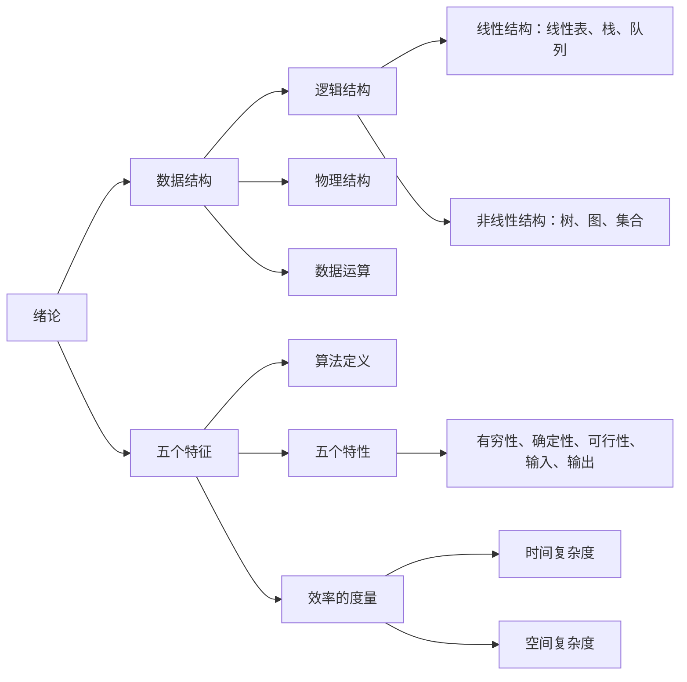
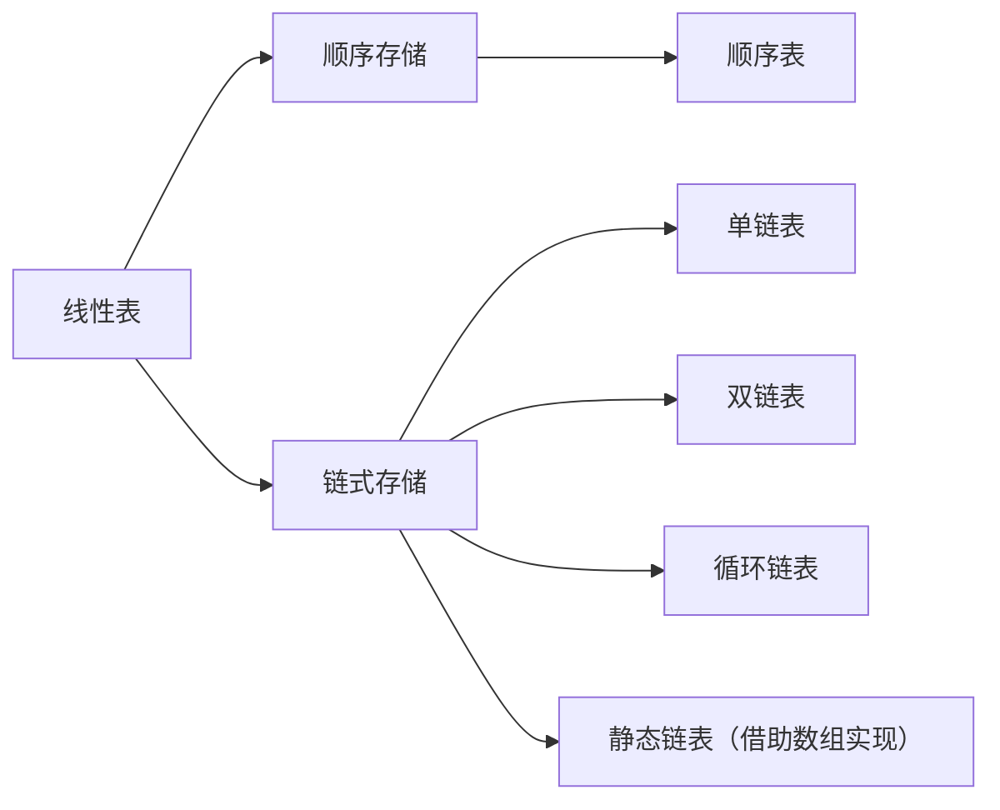
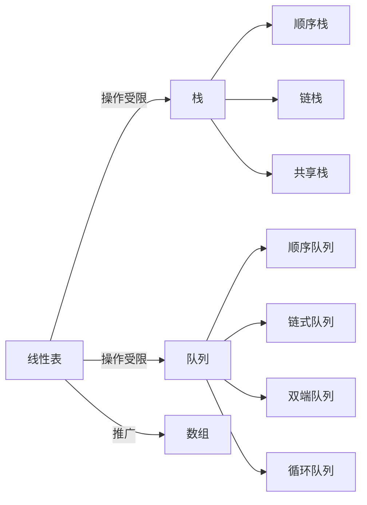
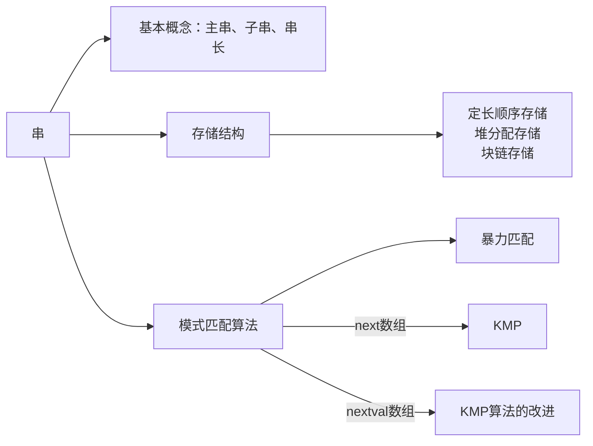
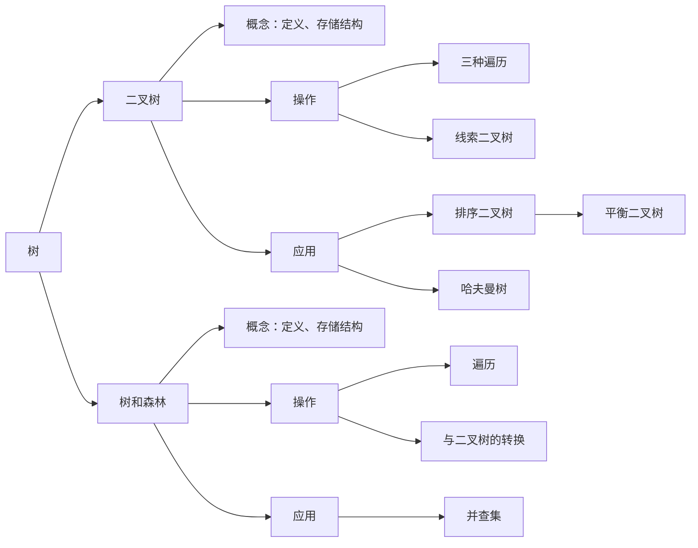
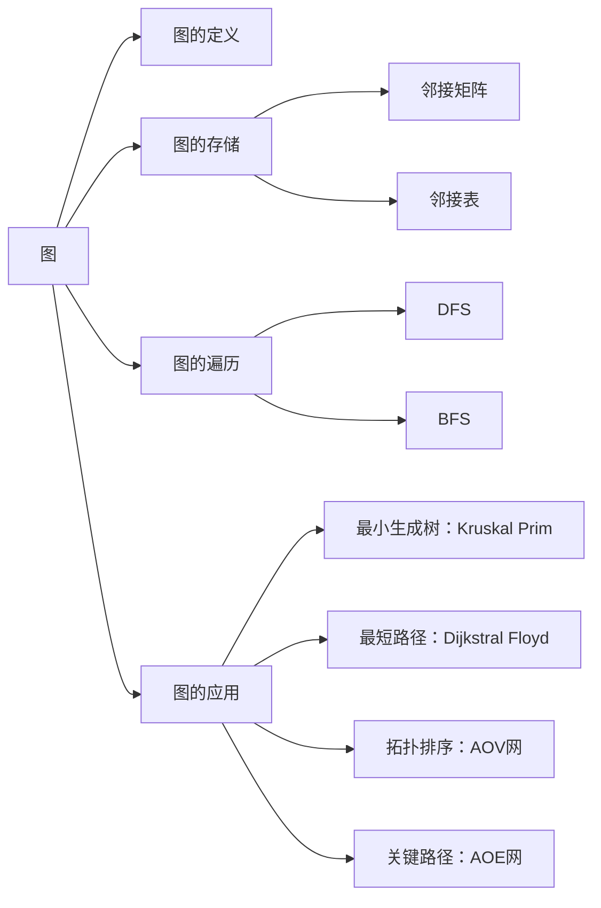
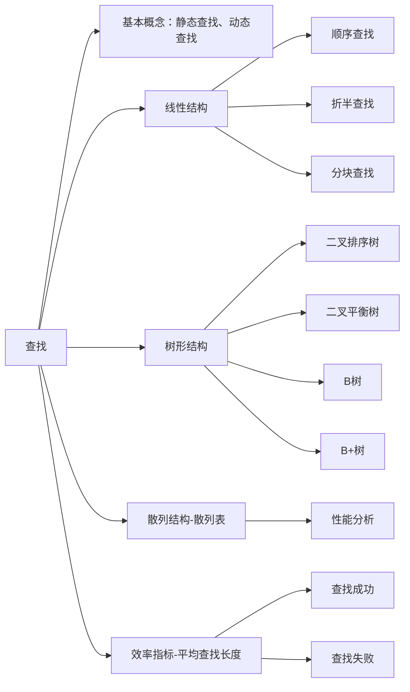
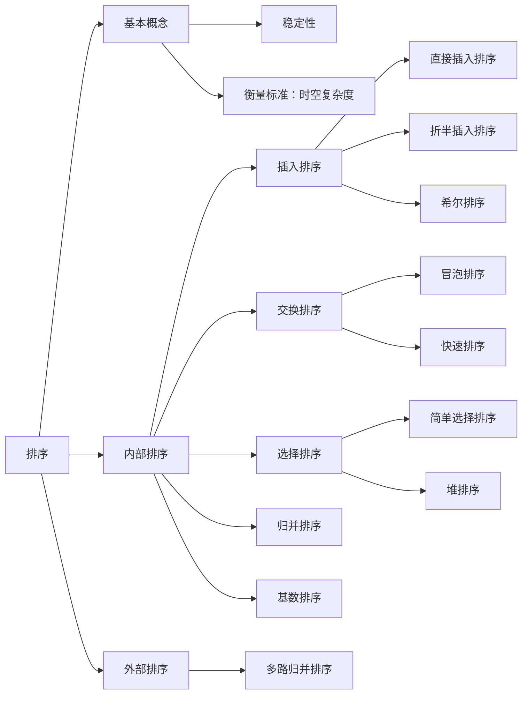

# 数据结构

## 绪论

### 数据结构的基本概念

#### 数据结构的三要素

1. 逻辑结构
    1. 线性结构：线性表（1对1）
    2. 非线性结构：集合（同属于一个集合）、树（1对多）、图（多对多）
2. 存储结构（物理结构）
    1. 顺序存储：**逻辑上相邻**的元素存储在物**理位置上也相邻**的存储单元中；优：随机存取、每个元素占空间少 缺：只能使用相邻的整块存储单元，产生较多外部碎片
    2. 链式存储：不要求逻辑上相邻的元素在物理位置上也相邻，借助**指针**来表示元素之间的逻辑关系；优：不会出现外部碎片 缺：指针占用额外的存储空间，只能实现顺序存取
    3. 索引存储：存储信息元素同时建立附加的**索引表**，索引表中的每项为**索引项（关键字+地址）**优：检索快 缺：索引表占用额外空间，增删数据需要修改索引表
    4. 散列存储（哈希存储）：根据元素的**关键字**直接**计算存储地址** 优：检索、增加、删除节点速度快 缺：散列函数不好，会产生冲突
3. 数据的运算

### 算法和算法评价

#### 算法效率的度量

##### 时间复杂度

一个语句的**频度**是指该语句在算法中被重复执行的次数。所有语句的频度之和为$T(n)$，他是该算法问题规模$n$的函数，时间复杂度主要分析$T(n)$的数量级。**算法中最深层循环内的语句的频度与$T(n)$ 同数量级，因此通常采用最深层循环内的语句的频度$f(n)$来分析算法的时间复杂度**。因此时间复杂度为$T(n) = O(f(n))$

上式中$O$的含义是$T(n)$的数量级，表示同阶，同等数量级
$$
T(n) = O(f(n)) \iff \lim_{n \to \infty} \frac{T(n)}{f(n)} = k
$$

**数量级比较：**
$$
O(1) \lt O(\log_2{n}) \lt O(n) \lt O(n\log_2{n}) \lt O(n^2) \lt O(n^3) \lt O(2^n) \lt O(n!) \lt O(n^n)
$$

**主定理求时间复杂度**

形如：
$$
T(n) = aT(\frac{n}{b}) + f(n)\\
$$
$n^{\log_{a}{b}}$与$f(n)$比较

1. $n^{\log_{a}{b}} \lt f(n)$: $O(f(n))$
2. $n^{\log_{a}{b}} \gt f(n)$: $O(n^{\log_{a}{b}})$
3. $ n^{\log_{a}{b}} = f(n)$: $O(n^{\log_{a}{b}}\log_2{n})$

##### 空间复杂度

算法的空间复杂度$S(n)$定义为该算法所需要的存储空间，它是问题规模为$n$的函数，记为：
$$
S(n) = O(g(n))
$$
只需要关注**存储空间的大小和与问题规模相关的变量**

### Q&A

1. 用循环比递归的效率高吗？

    循环和递归两者是可以互换的，不能决定性的说循环的效率比递归高

    递归的优点是：代码清晰，容易检查正确性；缺点是：当递归调用的次数较多时，要增加额外的堆栈处理，有可能产生堆栈溢出的情况

    循环的优点是：结构简单，速度快；缺点是：它不能解决全部的问题，有的问题适合用递归来解决，不适合用循环

2. 贪心法，动态规划法以及分治法的区别？

    **贪心算法**顾名思义就是做出当前来看是最好的结果，它不从整体上加以考虑，也就是**局部最优解**。贪心从上往下，从顶部一步一步最优，得到最后的结果，它不能保证全局最优解，与贪心选择的策略有关

    **动态规划法**把问题分解成子问题，这些子问题可能有重复，可以**记录**下前面的子问题的结果防止重复计算，前一个子问题对后一个子问题产生一定的影响。

    **分治法**将原问题划分为n个小规模的子问题，**递归的**解决这些子问题，然后再**合并**子问题的解，就是原问题的解

## 线性表

### 线性表的基本定义和基本操作

#### 线性表的定义

线性表是具有**相同数据类型**的n个数据的**有限序列**，除第一个元素和最后一个元素，每个元素都有一个**直接前驱**和**直接后继**

#### 线性表的基本操作

1. `InitList(&L)`：初始化
2. `Length(L)`：表长
3. `LoacteElem(L, e)`：按值查找，返回位置
4. `GetElem(L, i)`：按位置查找，返回值
5. `ListInsert(&L, i, e)`：插入元素
6. `ListDelete(&L, i, &e)`：删除元素
7. `PrintList(L)`：打印表
8. `Empty(L)`：判空
9. `DestoryList(&L)`：销毁表

### 顺序表和链表的比较

1. 存取方式

    顺序表可以顺序存取也可以随机存取，链表只能从表头顺序存取元素。例如在第i个位置上执行存/取操作，顺序表仅需一次访问，而链表需要从头访问

2. 物理结构

    都是线性结构，顺序表：逻辑上相邻的元素，存储的物理位置也相邻；链表：逻辑上相邻的元素，存储物理位置不一定相邻

3. 查找、插入、删除操作

    对于按值查找，顺序表无序时，两者时间复杂度都是$O(n)$；顺序表有序时，二分查找，时间复杂度为$O(logn)$

    对于按序号查找，顺序表时间复杂度为$O(1)$，链表的时间复杂度为$O(n)$

    对于插入删除操作，顺序表需要**平均移动半个表长**，链表只需要修改指针即可

4. 空间分配

    顺序表在静态存储空间分配下一旦装满就不能扩充；预先分配过大造成浪费，过小造成溢出。

    链表只需要在需要时申请分配，只要内存有空间就可以分配

### Q&A

1. 头指针和头节点的区别？

    **头指针：**指向第一个节点存储位置的指针，具有标识作用，无论链表为空，头指针必须存在

    **头节点：**是放在第一个元素的节点之前，**便于在第一个元素之前进行插入和删除操作**，头节点不是链表的必须元素可有可无，数据域也不存放任何信息

2. 

## 栈、队列、数组

### 栈

#### 栈的基本概念

栈（stack）只允许**在一端进行插入和删除的线性表**

#### 顺序栈、链栈、共享栈

顺序栈：后进先出

链栈：

共享栈：利用**栈底相对位置不变的特性**，可以让两个顺序栈共享一个一维数组空间，将两个共享栈的栈底设置为两端，栈顶指针向中间靠拢

### 队列

#### 队列的基本概念

队列（queue）只允许在**一端插入**，在**另一端删除**

#### 顺序队列、链式对联、双端队列、循环队列

顺序队列：先进先出，**队头指针，队尾指针**，存在假溢出现象

链式队列：

循环队列：将队列臆造为一个环状空间，利用除法取余解决溢出问题

双端队列：允许两端都可以插入和删除的线性表

### 栈和队列的应用

#### 栈在括号匹配中的算法思想

1. 凡是出现左括号，则进栈
2. 凡是出现右括号
    1. 首先检查栈是否空？若空，则右括号多余
    2. 否则和栈顶元素进行比较，若相匹配，则栈顶左括号出栈
3. 表达式检验结束
    1. 若栈空，则匹配正确
    2. 否则说明左括号有多余

#### 栈在后缀表达式求值中的算法思想

中缀转后缀：

1. 按运算顺序加括号
2. 将运算符移动至对应右括号的前面
3. 除去所有的括号

计算机中缀转后缀：

1. 遇到操作数，直接加入后缀表达式
2. 遇到左括号，直接入栈，遇到右括号，依次弹出栈中的运算符，加入后缀表达式，直到弹出左括号。（**左括号删除，不加入后缀表达式**）
3. 遇到运算符，优先级高于栈顶或（，入栈，低于栈顶，一直出栈直至高于，然后把当前符号入栈

顺序扫描表达式的每一项，根据它的类型做出相应的操作：

1. 若是操作数。压栈
2. 若是操作符，从栈顶退出两个操作数**y x**， 形成运算指令 **x y**，将结果重新压栈
3. 表达式求完，栈顶的数就是结果

#### 栈在递归中的应用

递归算法转换为非递归算法，通常需要借助栈来实现

#### 队列在层次遍历中的应用

二叉树的层次遍历：每次队头出队，扩展队头，直到队空

#### 队列在计算机系统中的应用

1. 解决主机与外部设备之间速度不匹配的问题

    （以主机和打印机为例）主机输出数据给打印机打印，输出数据的速度比打印机快得多，若直接把输出数据送给打印机显然不行，解决的方法是设置一个**打印缓冲区**，主机把打印数据写入这个缓冲区，写满后就**暂停输出**，打印机从缓冲区按照**先进先出**的原则进行打印，打印完后**向主机发出请求**，主机再把数据写入缓冲区。保证的打印的数据准确由提高了主机的效率。由此可见，打印数据缓冲区中所存储的数据就是一个队列。

2. 解决由多用户引起的资源竞争问题

    （以CPU的资源竞争为例）在一个多终端的计算机上，多个用户需要CPU运行程序，通过各自的终端提出占用CPU的请求。操作系统**按照请求的时间先后顺序，把他们排成一个对立，每次把CPU分给队首用户使用**，当用户程序执行完毕或者是分配的CPU时间片用完，令其出队，再把CPU给新的队首使用。

### 数组和特殊矩阵

#### 数组的存储方式

**按行优先**存储和**按列优先**存储

#### 特殊矩阵

对称矩阵、三角矩阵、稀疏矩阵

### Q&A

1. 如何区分循环队列是空还满

    普通情况下，循环队列队空和队满的条件一样  `q.front == q.rear`

    ps:队头指针指向第一个数，队尾指针指向最后一个数的下一个位置，即**即将入队的位置**

    法1：牺牲一个存储单元来区分队空和队满 `( q.rear + 1 ) % Max_size == q.front` 

    法2：增设标识元素个数的数据成员 队空 `q.size == 0`  队满 `q.size == Max_size` 

2. 

## 串

### 串的模式匹配

求模式串在子串中的位置

## 树与二叉树

## 图

## 查找

## 排序

