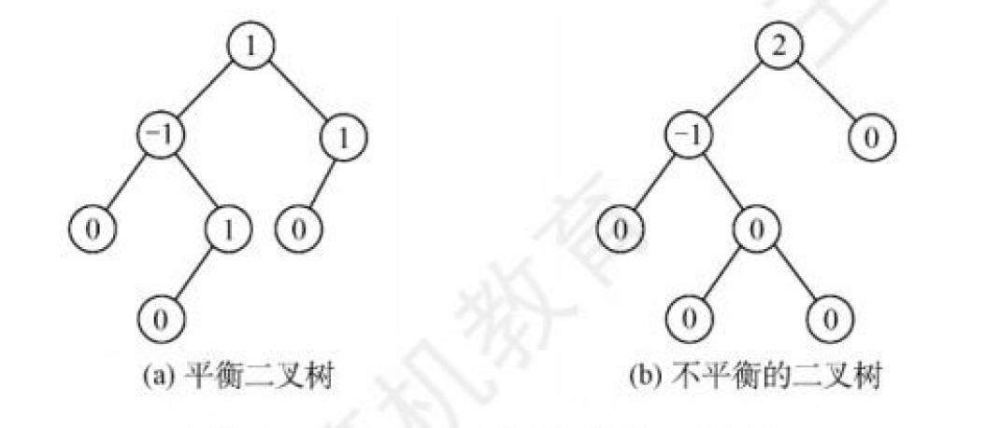
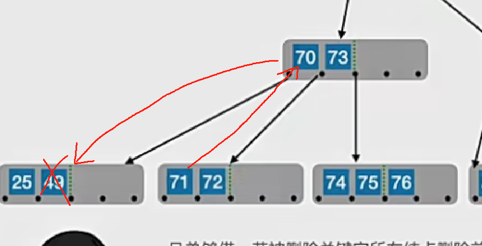

# 数据结构

## 绪论


### 数据结构的基本概念

#### 数据结构的三要素


1. 逻辑结构
    1. 线性结构：线性表（1对1）
    2. 非线性结构：集合（同属于一个集合）、树（1对多）、图（多对多）
2. 存储结构（物理结构）
    1. 顺序存储：**逻辑上相邻**的元素存储在物**理位置上也相邻**的存储单元中；优：随机存取、每个元素占空间少 缺：只能使用相邻的整块存储单元，产生较多外部碎片
    2. 链式存储：不要求逻辑上相邻的元素在物理位置上也相邻，借助**指针**来表示元素之间的逻辑关系；优：不会出现外部碎片 缺：指针占用额外的存储空间，只能实现顺序存取
    3. 索引存储：存储信息元素同时建立附加的**索引表**，索引表中的每项为**索引项（关键字+地址）**优：检索快 缺：索引表占用额外空间，增删数据需要修改索引表
    4. 散列存储（哈希存储）：根据元素的**关键字**直接**计算存储地址** 优：检索、增加、删除节点速度快 缺：散列函数不好，会产生冲突
3. 数据的运算


### 算法和算法评价

#### 算法效率的度量

##### 时间复杂度

一个语句的**频度**是指该语句在算法中被重复执行的次数。所有语句的频度之和为$T(n)$，他是该算法问题规模$n$的函数，时间复杂度主要分析$T(n)$的数量级。**算法中最深层循环内的语句的频度与$T(n)$ 同数量级，因此通常采用最深层循环内的语句的频度$f(n)$来分析算法的时间复杂度**。因此时间复杂度为$T(n) = O(f(n))$

上式中$O$的含义是$T(n)$的数量级，表示同阶，同等数量级
$$
T(n) = O(f(n)) \iff \lim_{n \to \infty} \frac{T(n)}{f(n)} = k
$$

**数量级比较：**
$$
O(1) \lt O(\log_2{n}) \lt O(n) \lt O(n\log_2{n}) \lt O(n^2) \lt O(n^3) \lt O(2^n) \lt O(n!) \lt O(n^n)
$$

**主定理求时间复杂度**

形如：
$$
T(n) = aT(\frac{n}{b}) + f(n)\\
$$
$n^{\log_{a}{b}}$与$f(n)$比较

1. $n^{\log_{a}{b}} \lt f(n)$: $O(f(n))$
2. $n^{\log_{a}{b}} \gt f(n)$: $O(n^{\log_{a}{b}})$
3. $ n^{\log_{a}{b}} = f(n)$: $O(n^{\log_{a}{b}}\log_2{n})$


##### 空间复杂度

算法的空间复杂度$S(n)$定义为该算法所需要的存储空间，它是问题规模为$n$的函数，记为：
$$
S(n) = O(g(n))
$$
只需要关注**存储空间的大小和与问题规模相关的变量**


### Q&A

1. 用循环比递归的效率高吗？

    循环和递归两者是可以互换的，不能决定性的说循环的效率比递归高

    递归的优点是：代码清晰，容易检查正确性；缺点是：当递归调用的次数较多时，要增加额外的堆栈处理，有可能产生堆栈溢出的情况

    循环的优点是：结构简单，速度快；缺点是：它不能解决全部的问题，有的问题适合用递归来解决，不适合用循环

2. 贪心法，动态规划法以及分治法的区别？

    **贪心算法**顾名思义就是做出当前来看是最好的结果，它不从整体上加以考虑，也就是**局部最优解**。贪心从上往下，从顶部一步一步最优，得到最后的结果，它不能保证全局最优解，与贪心选择的策略有关

    **动态规划法**把问题分解成子问题，这些子问题可能有重复，可以**记录**下前面的子问题的结果防止重复计算，前一个子问题对后一个子问题产生一定的影响。

    **分治法**将原问题划分为n个小规模的子问题，**递归的**解决这些子问题，然后再**合并**子问题的解，就是原问题的解

## 线性表


### 线性表的基本定义和基本操作

#### 线性表的定义

线性表是具有**相同数据类型**的n个数据的**有限序列**，除第一个元素和最后一个元素，每个元素都有一个**直接前驱**和**直接后继**

#### 线性表的基本操作

1. `InitList(&L)`：初始化
2. `Length(L)`：表长
3. `LoacteElem(L, e)`：按值查找，返回位置
4. `GetElem(L, i)`：按位置查找，返回值
5. `ListInsert(&L, i, e)`：插入元素
6. `ListDelete(&L, i, &e)`：删除元素
7. `PrintList(L)`：打印表
8. `Empty(L)`：判空
9. `DestoryList(&L)`：销毁表

### 顺序表和链表的比较

1. 存取方式

    顺序表可以顺序存取也可以随机存取，链表只能从表头顺序存取元素。例如在第i个位置上执行存/取操作，顺序表仅需一次访问，而链表需要从头访问

2. 物理结构

    都是线性结构，顺序表：逻辑上相邻的元素，存储的物理位置也相邻；链表：逻辑上相邻的元素，存储物理位置不一定相邻

3. 查找、插入、删除操作

    对于按值查找，顺序表无序时，两者时间复杂度都是$O(n)$；顺序表有序时，二分查找，时间复杂度为$O(logn)$

    对于按序号查找，顺序表时间复杂度为$O(1)$，链表的时间复杂度为$O(n)$

    对于插入删除操作，顺序表需要**平均移动半个表长**，链表只需要修改指针即可

4. 空间分配

    顺序表在静态存储空间分配下一旦装满就不能扩充；预先分配过大造成浪费，过小造成溢出。

    链表只需要在需要时申请分配，只要内存有空间就可以分配

### Q&A

1. 头指针和头节点的区别？

    **头指针：**指向第一个节点存储位置的指针，具有标识作用，无论链表为空，头指针必须存在

    **头节点：**是放在第一个元素的节点之前，**便于在第一个元素之前进行插入和删除操作**，头节点不是链表的必须元素可有可无，数据域也不存放任何信息

2. 

## 栈、队列、数组


### 栈

#### 栈的基本概念

栈（stack）只允许**在一端进行插入和删除的线性表**

#### 顺序栈、链栈、共享栈

顺序栈：后进先出

链栈：


共享栈：利用**栈底相对位置不变的特性**，可以让两个顺序栈共享一个一维数组空间，将两个共享栈的栈底设置为两端，栈顶指针向中间靠拢


### 队列

#### 队列的基本概念

队列（queue）只允许在**一端插入**，在**另一端删除**

#### 顺序队列、链式对联、双端队列、循环队列

顺序队列：先进先出，**队头指针，队尾指针**，存在假溢出现象


链式队列：


循环队列：将队列臆造为一个环状空间，利用除法取余解决溢出问题


双端队列：允许两端都可以插入和删除的线性表


### 栈和队列的应用

#### 栈在括号匹配中的算法思想

1. 凡是出现左括号，则进栈
2. 凡是出现右括号
    1. 首先检查栈是否空？若空，则右括号多余
    2. 否则和栈顶元素进行比较，若相匹配，则栈顶左括号出栈
3. 表达式检验结束
    1. 若栈空，则匹配正确
    2. 否则说明左括号有多余

#### 栈在后缀表达式求值中的算法思想

中缀转后缀：

1. 按运算顺序加括号
2. 将运算符移动至对应右括号的前面
3. 除去所有的括号

计算机中缀转后缀：

1. 遇到操作数，直接加入后缀表达式
2. 遇到左括号，直接入栈，遇到右括号，依次弹出栈中的运算符，加入后缀表达式，直到弹出左括号。（**左括号删除，不加入后缀表达式**）
3. 遇到运算符，优先级高于栈顶或（，入栈，低于栈顶，一直出栈直至高于，然后把当前符号入栈

顺序扫描表达式的每一项，根据它的类型做出相应的操作：

1. 若是操作数。压栈
2. 若是操作符，从栈顶退出两个操作数**y x**， 形成运算指令 **x y**，将结果重新压栈
3. 表达式求完，栈顶的数就是结果


#### 栈在递归中的应用

递归算法转换为非递归算法，通常需要借助栈来实现

#### 队列在层次遍历中的应用

二叉树的层次遍历：每次队头出队，扩展队头，直到队空


#### 队列在计算机系统中的应用

1. 解决主机与外部设备之间速度不匹配的问题

    （以主机和打印机为例）主机输出数据给打印机打印，输出数据的速度比打印机快得多，若直接把输出数据送给打印机显然不行，解决的方法是设置一个**打印缓冲区**，主机把打印数据写入这个缓冲区，写满后就**暂停输出**，打印机从缓冲区按照**先进先出**的原则进行打印，打印完后**向主机发出请求**，主机再把数据写入缓冲区。保证的打印的数据准确由提高了主机的效率。由此可见，打印数据缓冲区中所存储的数据就是一个队列。

2. 解决由多用户引起的资源竞争问题

    （以CPU的资源竞争为例）在一个多终端的计算机上，多个用户需要CPU运行程序，通过各自的终端提出占用CPU的请求。操作系统**按照请求的时间先后顺序，把他们排成一个对立，每次把CPU分给队首用户使用**，当用户程序执行完毕或者是分配的CPU时间片用完，令其出队，再把CPU给新的队首使用。


### 数组和特殊矩阵

#### 数组的存储方式

**按行优先**存储和**按列优先**存储

#### 特殊矩阵

对称矩阵、三角矩阵、稀疏矩阵


### Q&A

1. 如何区分循环队列是空还满

    普通情况下，循环队列队空和队满的条件一样  `q.front == q.rear`

    ps:队头指针指向第一个数，队尾指针指向最后一个数的下一个位置，即**即将入队的位置**

    法1：牺牲一个存储单元来区分队空和队满 `( q.rear + 1 ) % Max_size == q.front` 

    法2：增设标识元素个数的数据成员 队空 `q.size == 0`  队满 `q.size == Max_size` 

2. 

## 串


### 串的模式匹配

求模式串在子串中的位置

## 树与二叉树


### 树和二叉树的基本概念

1. **树**：树是非线性结构，节点之间有明显的**层次关系**。根节点没有前驱，除根结点每个节点有且只有一个前驱；叶节点没有后继，除叶节点每个节点有多个后继

    递归定义：

    a.或者为空树

    b.或者由一个根节点和$m$个不相交的被称为根的有限集$T_1,T_2,...,T_m$子树组成。每个集合又是一棵树。

    

    **祖先**（根到某个节点路径上的所有节点）、**子孙**（某个节点下面的所有节点）、**双亲**（父节点）、**孩子**（子节点）、**兄弟**（相同父节点的子节点）、**堂兄弟**（双亲在同一层的子节点）

    **节点的度**：孩子节点的个数； **树的度**：节点的最大度数

    **分支节点**：度大于0的节点；**叶子节点**：度为0的节点

    **节点层次**：节点所在的层的深度（根为1） **树高度**：节点的最大层数  **节点的高度**：以该节点为根的子树的高度

    **有序树**：各个子树不能交换 **路径**：两个节点路径序列 **路径长度**：两个节点路径的边数

2. **二叉树**：二叉树每个节点**最多有两颗子树**，并且二叉树的子树有左右之分，次序不能任意颠倒

    递归定义：

    a.或者为空二叉树

    b.或者由一个根节点和两个互不相交的被称为根的左子树和右子树组成。左子树和右子树又分别为二叉树。

3. **满二叉树**：除了叶子节点，每个节点均有两棵子树

    特点：高度为$h$，有$2^h-1$个节点，根节点编号为1，左孩子为$2i$，右孩子为$2i+1$，双亲为$\lfloor i/2 \rfloor$

    

4. **完全二叉树**：除了最后一层外，其他任何一层的节点数均达到最大值，**且最后一层也只是在最右侧缺少节点**

    

5. **二叉排序树**：左子树关键字小于根节点，右子树关键字大于根节点；左子树和右子树又分别是二叉排序树

6. **平衡二叉树**：树中任意一个节点的左子树和右子树高低之差的**绝对值不超过1**

7. **正则二叉树**：每个分支节点的出度为$m$，当$m=2$是满二叉树

8. **森林**：不相交的树的集合


### 树和二叉树的性质

1. 树的节点数等于所有节点的度数之和+1

    节点的度数等于节点的孩子数，最后在加上根节点

2. **非空二叉树上的叶子节点数=度为2的节点数+1，$n_0=n_2+1$**

    证明：$n=n_0+n_1+n_2$

    分支数 $B = n_1 + 2n_2$

    $n = B + 1$，得到  $n_0=n_2+1$

3. 非空二叉树的第$k$层最多有$2^{k-1}$个节点

4. 高度为$h$的二叉树最多有$2^h-1$个节点

5. 对于完全二叉树从上到下，从左到右编号$1,2,...,n$

    1. 若$i ≤ \lfloor n/ 2 \rfloor$，则节点$i$为分支节点，即最后一个分支节点的编号是$\lfloor n/2 \rfloor$
    2. 度为1的节点只可能是最后一个分支节点
    3. $i$的双亲节点为$\lfloor i /2 \rfloor$
    4. 节点$i$所在的层次（深度）为 $\lfloor log_i +1\rfloor$

6. 具有$n$个节点的完全二叉树的高度为$\lceil\log_2(n+1)\rceil$ 或  $\lfloor\log_2n\rfloor+1$

    证明：根据完全二叉树的定义
    $$
    2^{h-1}-1＜n≤2^h - 1 \ or \ 2^{h-1} ≤ n ＜ 2^h\\
    h - 1＜ log(n + 1) ≤ h \ or \ h - 1 ≤ logn ＜ h
    $$
    $h$为整数，$h = \lceil\log_2(n+1)\rceil$或者 $h = 1 + \lfloor logn \rfloor$

### 树的存储结构

1. 双亲表示法

    采用顺序存储结构，每个节点增设伪指针，值为双亲的存储下标

    

2. 孩子表示法

    每个节点的孩子表示为一个线性表（以单链表为存储结构），头指针组成线性表（以顺序表为存储结构）

    

3. 孩子兄弟表示法（二叉树表示法）

    以二叉链表作为树的存储结构。每个节点包括：节点值、指向节点第一个孩子的指针、指向孩子下一个兄弟的指针，**孩子兄弟表示法可以作为将普通树转化为二叉树的最有效方法**，简记为**左儿子，右兄弟**

    

    

### 二叉树的存储结构

1. 顺序存储结构

    数组下标为二叉树节点的编号 $i,2i,2i+1$，**建议数组下标从1开始**

2. 链式存储结构

    数据域、指针域

    

### 二叉树的遍历

1. dfs遍历

    二叉树的先序中序后序，实际上就是看**先根、中根、后根**

    ```C++
    void dfs(int u){
    	print(u);//先根
    	dfs(2*u);
    	print(u);//中根
    	dfs(2*u+1);
    	print(u);//后根
    }
    ```

    

2. 层次遍历bfs

    1. 根节点入队
    2. 取出队头
    3. 扩展队头入队

    

3. **由遍历序列构造二叉树**

    中序遍历+else可以得到唯一的二叉树

    **中序+先序：** 中序（BC**A**EDGHFI） 先序（**A**BCDEFGHI）先序是走根，中序把根分为了左右，左侧为左子树，右侧为右子树，然后递归分析下去

    **中序+后序： **中序（BC**A**EDGHFI） 后序（CBEHGIFD**A**）后序最后一个节点是根

    **中序+层次：** 层序遍历中，第一个节点一定是根节点，将中序序列分割成了，左子树的中序序列和右子树的中序序列。若存在左子树，则层序序列的第二个节点一定是左子树的根，可以进一步划分左子树


### 树和森林的遍历

1. 树的遍历

    1. 先根遍历
    2. 后根遍历
    3. 层次遍历

2. 森林的遍历

    1. 先序遍历森林

        访问第一棵树的根节点；先序遍历**第一棵树中根节点的子树森林**；再访问森林中的其他树组成的森林

        先序遍历森林=对森林组成的二叉树的先序遍历=**对各个树先序遍历**

        

    2. 中序遍历森林

        中序遍历**第一棵树中根节点的子树森林**；访问第一棵树的根节点；中序遍历其他的树组成的森林

        中序遍历森林===对森林组成的二叉树的中序遍历=**对各个树后序遍历**

        

==最靠谱的方法==

==把森林转为二叉树，左孩子、右兄弟，先序遍历or中序遍历==

### 线索二叉树（没学）

1. 定义：以一定的规则将二叉树的节点排成一个线性序列，从而得到几种遍历序列，使得该序列中的每个节点都有一个直接前驱和直接后继（首位节点除外） **理解就是把树变成线性表**

### 树、二叉树、森林的转换

1. 树转为二叉树

    **左儿子，右兄弟**

    

2. 森林转换为二叉树

    1. 先将每棵树转为二叉树
    2. 因为每棵**转换后二叉树的右儿子必空**，因此用另一棵二叉树作为右儿子

3. 二叉树转为森林

    1. 每次都将二叉树的根和左子树组在一起和右子树分开，直到右子树不能再分
    2. 再把每棵二叉树转为树，就得到了原始的森林

    

    

    

    

### 树和二叉树的应用

#### 哈夫曼树和哈夫曼编码

1. WPL：带权路径长度之和

2. 哈夫曼树的构造

    

3. 哈夫曼编码：左0右1

#### 并查集

详见算法

## 图


### 图的基本概念

1. 图的定义：顶点集和边集组成$G=(V,E)$，$V(G)=\{v_1,V_2,...,v_n\},E=\{(u,v)\}$

2. 各种图：

    1. 有向图、无向图
    2. 简单图：不存在重边和自环
    3. 完全图(简单完全图)：有$\frac {n(n-1)}{2}$条边的无向图或者$n(n-1)$条边的有向图称为完全图
    4. 子图：两个图$G,G'$,$V'$是$V$的子集，$E'$是$E'$的子集。若有满足$V(G')=V(G)$的子图，则称$G'$为$G$的生成子图，（点全部包括）
    5. 连通、连通图和连通分量
        1. 连通：从v到w有路径，则v到w连通
        2. 连通图：任意两个点都有路径
        3. 连通分量：**无向图**的极大**连通子图**，称为连通分量
        4. 强连通图，强连通分量：v到w有路径，w到v有路径，则是强连通。**有向图**的极大**强连通子图**称为强连通分量
    6. 生成树、生成森林
        1. 生成树：连通图的生成树是**包含图中全部顶点的一个极小连通子图**，n个顶点，n-1条边
        2. 生成森林：在非连通图中，连通分量的生成树构成了分连通图的生成森林

3. 顶点的度、入度、出度

    有向图的度=入度+出度

4. 边的权和网

    边上带权重的图为网

5. 稠密图、稀疏图

    $|E|< |V|log|V|$，课视为稀疏图

6. 路径、路径长度、回路

    v到w路径边数为路径长度，n个顶点大于n-1条边，此图一定有环

7. 简单路径、简单回路

    路径序列中，顶点不重复出现称为简单路径；回路中，除了第一个点，其余点不重复出现为简单回路

8. 距离

9. 有向树

    一个顶点的入度为0，其余顶点入度为1的有向图称为有向树

### 图的存储

1. 邻接矩阵法（稠密图）

    

2. 邻接表法（稀疏图）

    

    存储空间：无向图$O(|V|+2|E|)$，有向图$O(|V|+|E|)$

3. 十字链表：有向图的链式存储结构

    每个弧有一个节点，每个顶点也是一个节点

    

4. 邻接多重表：无向图的链式存储结构

    

### 图的遍历

1. 深度优先搜索
2. 广度优先搜索

### 最小生成树

一个连通图的生成树包含图的所有顶点，并且含有尽可能少的边，对于带权的连通无向图，权值之和最小的树为最小生成树

#### Kruskal（稀疏图）

`fa[x]`存`x`点的父节点

1. 初始化并查集，把`n`个点放在`n`个独立的集合
2. 将所有边按边权**从小到大**排序(贪心思想)
3. 按顺序枚举每条边，如果这条边连接的两个点不在同一个集合，就把这条边加入最小生成树，并且**合并**这两个集合；如果这条边连接的两个点在同一个集合，就**跳过**，因为不能成环
4. 重复执行3，直到选取了`n - 1`条边为止


#### Prim（稠密图）

算法流程类似于Dijkstra，不断选取**不在圈内且距离圈最小的点**，直到所有点都加入了圈

1. 初始化，所有点都不在圈内，`vis = 0 d[s] = 0 d[其他点] = + ∞`
2. 每次选取**不在当前集合中且离圈最近的点**`u`，打标记加入集合
3. 对`u`的所有邻点的距离执行**更新操作**
4. 重复2，3步操作，直到没有点能加入集合中


### 最短路径

#### Dijkstra

时间复杂度-$O(mlogm)$

Dijkstra算法是基于**贪心思想**的**单源最短路**算法

**集合：**已经确定好最短路的节点组成的集合

1. 初始时，所有的点都不在集合中，`st[i] = false`，`d[s] = 0`，`d[其他点] = +∞`
2. 迭代`n`次，每次选出**不在当前集合中且离源点最近的点**，将该点放入集合`st[t] = true`
3. 用该点进行**松弛操作**，更新与它相邻的点的距离

#### Bellman-Ford

**Bellman-Ford**算法是基于**松弛操作**的单源最短路算法

`e[u][j]`存`u`点的出边的邻点和边权，`dist[u]`存`u`点到源点的距离

1. 初始化，`d[s] = 0, d[其他点]=+∞`
2. 执行多轮循环。每轮循环，对**所有边**都尝试进行一次松弛操作
3. 当一轮循环中没有成功的松弛操作时，算法停止

#### Spfa

时间复杂度-$O(km,nm)$

Bellman-Ford算法的优化

只有本轮被更新的点，其**出边终点**才有可能引起下一轮的松弛操作，因此用**队列**来维护被更新的**出边终点**的集合。

`vis[u]`标记`u`点是否在队内，`cnt[v]`记录边数，判负环

1. 初始化，`s`入队，标记`s`在队内，`d[s] = 0 d[其他点] =  +∞`
2. 从**队头**弹出`u`点，标记`u`不在队内
3. 枚举`u`的所有出边，进行松弛操作。记录`s`到`v`走过的边数，并判负环。如果`v`不在队内则把`v`压入队尾，并打上标记
4. 重复步骤2，3，直到队内为空

#### Floyd

时间复杂度-$O(n^3)$

Floyd(弗洛伊德)算法是**动态规划**算法，也称为插点法。是**全源**最短路算法

**状态表示**

`d[k, i, j]`表示从`i`到`j`，且中间只经过节点编号为`1~k`的最短路径的长度

**状态计算**

路径的选择分为**两类**

1. 路径不经过`k`点，继承原值：`d[k, i, j] = d[k - 1, i, j]`
2. 路径经过`k`点，松弛操作：`d[k, i, j] = d[k - 1, i, k] + d[k - 1, k, j]`

**说明**

1. 计算第`k`层的`d[i, j]`时，必须先将`k - 1`层的所有状态计算出来，所以需要把**k放在最外层**

2. 状态可以理解为，第`k - 1`层的二维表向第`k`层的二维表的**投射**

3. 两类状态都是调用的上一层，因此用滚动数组就可以优化掉

**初始化**

1. `i≠j`，无边`d[i][j] = ∞`，有边`d[i][j] = w`
2. `i=j`，`d[i][j] = 0`

## 查找


### 查找的基本概念

1.  静态查找和动态查找：一个查找表的操作只涉及查找操作，则无需动态地修改查找表。反之，需要动态地插入和删除的查找称为动态查找，适合静态查找有：顺序查找、折半查找、散列查找；适合动态查找有二叉排序树的查找、散列查找

2. 平均查找长度：一次查找的长度是指需要比较关键字的次数，平均查找长度是查找过程进行关键字次数比较的平均值
    $$
    ASL=\sum_{i=1}^{n}P_iC_i
    $$
    n是查找表的长度，$P_i$是查找第$i$个数据元素的概率，一般认为是$1/n$，$C_i$是找到第$i$个数据元素需要进行比较的次数


### 查找类型

#### 线形查找

##### 顺序查找

从线性表的一端开始，逐个检查关键字是否符合条件，若查找的关键字符合条件，则查找成功，若查找到表的另一端，则查找失败。时间效率为$O(n)$
$$
ASL = \frac{(1 + 2 + ... + n)}n = \frac{(1+n)n}{2n}=\frac{1 + n}{2}
$$

##### 折半查找（二分查找）

适用于所有**有序的顺序表**


时间复杂度-$O(logn)$

**最大化查找--可行区在左侧**


​	

```c++
int find(int x){// a[1~n]
    int l = 0, r = n + 1; // 开区间
    while(l + 1 < r){// l + 1 = r时结束
        int mid = l + r >> 1;
        if(a[mid] <= x) l = mid;
        else r = mid;
    }
    return l;
}
```


**最小化查找--可行区在右侧**

```C++
int find(int x){// a[1~n]
    int l = 0, r = n + 1; // 开区间
    while(l + 1 < r){// l + 1 = r时结束
        int mid = l + r >> 1;
        if(a[mid] >= x) r = mid;
        else l = mid;
    }
    return r;
}
```


1. 指针跳跃的次数为$logn$
2. 指针指向区间的**两侧外面**
3. $l + 1 = r$时循环结束
4. 可行区的**指针最后一定指向答案**
5. **开区间可以正确处理边界**

##### 分块查找

先把查找表分为若干子表，要求**每个子表的元素都要比它后面子表的元素小**，也就是保证块间是有序的（但是子表内部不一定有序），**把各个子表的最大关键字构成一张索引表，表中还含各个子表的起始地址**。特点是快间有序，块内无序，查找时，**块间进行索引查找，块内进行顺序查找**


#### 树形查找

##### 二叉排序树（BST）

查找插入删除 O(n)

或者是一棵空树，或者是一棵有特点的树，如果该树有左子树，左子树所有节点小于根节点，如果有右子树，右子树所有节点大于根节点；左右子树都是二叉排序树。在查找时可以进行动态插入和删除。**因此对二叉排序树进行中序遍历，可以得到一个有序序列**

1. 查找

    ```C++
    // 伪代码
    int find(int x, int u){
    	if(u!=null){
    		// 比较根节点
    		if(x == u.data) return u;
    		// 大于根节点,查找右儿子
    		if(x > u.data) find(x, u.rchlid);
    		// 小于根节点查找左儿子
    		else find(x, u.lchlid);
    	}
    }
    ```

2. 插入

    若原二叉排序树为空，直接插入；

    关键字k小于根节点，则插入到左子树，关键字大于根节点，插入到右子树，插入的节点一定是一个新添加的叶子节点

    

3. 删除

    二叉排序树删除一个节点时，不能把以该节点为根的子树上的节点都删除，**必须先把被删除节点从二叉排序树的链表上摘下，将因删除节点而断开的二叉链表重新连接起来**，确保二叉排序树的性质不会丢失

    1. 若删除节点是叶子节点，直接删除

    2. 若节点z只有一棵左子树或者只有一棵右子树，则让z的子树称为z父节点的子树，代替z的位置

        

    3. 若节点z有左右两棵子树，则**令z的直接后继（或直接前驱）代替z，然后从二叉排序树中删去这个直接后继（或直接前驱）**，这样就转换成了第一种或第二种情况

        

    两个思路：

    1. 修改左子树

        ```
        1.找到将被删除节点的左子树中的最大值，走到左子树，一路往右下走
        2.将这个最大值保存，并删除这个节点
        3.将我们保存到的左子树最大值替换给将被删除的节点的值
        ```

        

    2. 修改右子树

        ```
        1.找到将被删除节点的右子树中的最小值，走到左子树，一路往左下走
        2.将这个最小值保存，并删除这个节点
        3.将我们保存的右子树的最小值替换给将被删除节点的值
        ```

##### 平衡二叉树（AVL）

查找插入删除 O(logn)

1. 平衡二叉树的定义：为了避免树的高度增长过快，降低二叉排序树的性能，**规定在插入和删除节点时，要保证任意节点的左右子树高度差的绝对值不超过，这样的二叉树称为平衡二叉树，也称AVL树。定义左子树的高度和右子树高度差为该节点的平衡因子，取值为-1，0，1

    

2. 插入

    **右孩子左旋，左孩子右旋**

    每当在二叉排序树插入或删除节点时其路径上的节点是否因为此次操作会导致不平衡。若导致了不平衡，**则先找到插入路径上离插入节点最近的平衡因子的绝对值大于1的节点A**，再对以A为根的子树，调整位置，使之平衡

    ==每次调整的对象都是最小不平衡子树，即以查找路径上离插入节点最近的不平衡因子节点为根的子树==

    ==从插入节点，往上找==

    

    前半部分和二叉排序树一样，新节点插入以后，关注查找路径上的不平衡因子，有四种情况

    1. LL：在A的**左孩子**的**左子树**中插入导致不平衡

        

        ==BL<B<BR<A<AR==

        ==B向右上旋转，成为根节点，A向右下旋转成为B的右子树==，其余节点，按照顺序进行排列

        

        

         

    2. RR：在A的**右孩子**的**右子树**中插入导致不平衡

        

        ==AL<A<BL<B<BR==

        ==B向左上旋转，成为根节点，A向左下旋转成为B的左子树==，其余节点，按照顺序进行排列

        

    3. LR：在A的**左孩子**的**右子树**中插入导致不平衡

        

        把BR节点拆开看，情况

        

         问题分为两步：第一步，让C向**左上**旋转，代替B,让B向**左下**旋转成为C的左子树  （RR）

        

        第二步：让C向**右上**旋转，代替A，让A向**右下**旋转成为C的右子树 （LL）

        

    4. RL：在A的**右孩子**的**左子树**中插入导致不平衡

        

        把BL节点拆开看，情况

        

         问题分为两步：第一步，让C向**右上**旋转，代替B,让B向**右下**旋转成为C的右子树  （LL）

        

        第二步：让C向**左上**旋转，代替A，让A向**左下**旋转成为C的左子树 （RR）

        

        RR

    

    ​	RL

    右旋

    

    左旋

    

    

     

3. 删除

    1. 删除节点（方法同二叉排序树）左子树的最大值或右子树的最小值代替删除的节点

    2. 一路向北找到最小不平衡树，找不到就结束了 

    3. 找最小不平衡树下。“个头最高”的**儿子**、**孙子**

        

    4. 根据孙子的位置，调整平衡（LL RR LR  RL）

        **孙子在LL位置，儿子右旋**

        **孙子在RR位置，儿子左旋**

        

        **孙子在LR位置：孙子先左旋后右旋**

        **孙在在RL位置，孙子先右旋后左旋**

    5. 如果不平衡向上传导，继续2

        检查不平衡是否向上传导了，右侧的子树高度变矮，导致上方的节点又不平衡了

        

    

4. 查找


##### 红黑树（RBT）


==左根右、根叶黑、不红红、黑路同==

查找插入删除$ O(logn)$，avl树插入或删除会影响平衡特性，因此需要频繁调整平衡树，这就造成了时间开销变大，红黑树插入和删除，很多时候不会破坏红黑特性，无需频繁调整树的形态，即便是要调整，也能在常数级的时间内完成

1. 红黑树的定义：红黑树是二叉排序树，左根右；

    1. 每个节点是红色的或是黑色的

    2. 根节点是黑色的

    3. 叶子节点（null、失败节点）是黑色的

    4. 不存在两个相邻的红节点（**即红节点的父节点和孩子节点均是黑色**）

    5. 对于每个节点，从该节点到任一叶节点的**简单路径**上，所含**黑节点的数目相同**

        

        黑高：bh，从某个节点出发（**不含该节点**）到任一空叶节点的路径上黑节点的总数

        

2. 红黑树的性质

    1. 从根节点到叶节点的**最长路径，不大于最短路径的2倍**

        ==路径最长的情况是红节点穿插在每个黑节点之间==，还有可能一条路径上，全是黑节点没有红节点

    2. 有n个内部节点的红黑树高度$h<=2log(n+1)$，时间复杂度$O(logn)$

3. 插入

    1. 查找，确定插入的位置（同二叉排序树），插入新新节点

        1. 新节点是根：黑色

        2. 新节点非根：红色，判断破坏不红红这个规则没

        3. 插入后满足，则结束；不满足，调整，使其重新满足红黑树定义

            

            1. 黑色的叔叔：旋转+染色

                1. LL：右单旋，父换爷+染色

                    

                2. RR：左单旋，父换爷+染色 染色是染父和爷

                    

                3. LR：左右双旋，儿换爷+染色，染色是染儿和爷

                    

                4. RL：右左双旋，儿换爷+染色

            2. 红色的叔叔：染色+变新

                **叔、父、爷染色，爷节点变为新节点**，用同样的逻辑判断新节点

                

                

                

4. 删除（比较难）

5. 查找

    从根出发，左小右大，如果查到空叶节点，则查找失败

 

#### B树和B+树

**五叉排序树**，每个节点**四个关键字**，**最多五个孩子**


**如何保证查找效率** 

策略：m叉查找树，规定除了根节点之外，任何节点至少有$\lceil m/2\rceil $个分叉，至少含有$\lceil m/2\rceil -1$个关键字

m叉查找树，规定任何一个节点，所有子树的高度相同。满足这些要求，就是B树，


##### B树

1. 定义：B树。多路平衡查找树，B树种所被允许的孩子个数的最大值称为B树的阶（分叉数的最大值）

2. 特性：

    1. 根节点关键字数$[1,m-1]$,分支数$[2,m]$

    2. 分支节点关键字数$[\lceil m/2\rceil -1,m-1]$,分支数$[\lceil m/2\rceil,m]$

    3. 分支数=关键字数+1

    4. 所有叶子节点出现在同一个层次上，并且不带信息，**可以视为查找失败的节点**

    5. 非叶子节点的数据结构

        

3. 查找

    1. 在B树中查找节点
    2. 在节点内查找关键字

4. 插入

    1. 定位。利用查找算法，找出插入关键字的终端节点（不是叶节点，虽然会查找失败）

    2. 插入。每个非根节点的关键字的个数在$\lceil m/2\rceil -1$到$m-1$。若插入后在这个范围内，则可以插入。若大于$m-1$个，必须对节点进行分裂，**插入的一定是倒数第二层的终端节点**

        **分裂的方法：**从第$\lceil m/2\rceil $个关键字分裂，让他成为父节点

        

        

        

5. 删除

    1. 若被删除的关键字在**终端节点**，则直接删除关键字（要注意关键字的下限是否是$\lceil m/2\rceil -1$）

    2. 若被删除的关键字有左右子树，找它的直接前驱或者是直接后继来顶替它：走进左子树一直往右下找，或走进右子树一直往坐下找

        

    3. 若删除后低于下限了

        1. 兄弟够借：右兄弟很宽裕，用当前节点的后继、后继的后继来填补空缺

            

        2. 左兄弟很宽裕，用当前节点的前驱、前驱的前驱来填补空缺

            

        3. 兄弟不够借：合并兄弟以及父节点被夹的关键字

            

        4. 

##### B+树

B+树是应数据库所需而出现的一种B树的变形树，和分块查找差不多，**索引表存的是最大的关键字**


1. 根节点关键字数$[1,m]$,分支数$[1,m]$
2. 分支节点关键字数$[\lceil m/2\rceil,m]$,分支数$[\lceil m/2\rceil,m]$
3. 分支数=关键字数
4. 所有的叶子节点包含全部的关键字，叶子节点**按照关键字从小到大排列**，并且**相邻叶子节点按大小顺序互相链接**


**查找**


**m阶B树和B+树的区别**

1. B树n个关键字对应n+1棵子树,B+树，n个关键字对应n棵子树，

2. B树，  根节点关键字数$[1,m-1]$，其他节点$[\lceil m/2\rceil-1,m-1]$

3. B+树，根节点关键字数$[1,m]$，其他节点$[\lceil m/2\rceil,m]$

4. B树节点的关键字不会重复，包含了对应记录的存储地址

5. B+树叶子节点包含全部关键字，非叶节点出现的关键字在叶子节点也会出现，非叶子节点只起索引作用，不包含对应记录的存储地址

6. B+树非叶子节点不含存储地址，同样大小的磁盘块，可**以使得一个磁盘块包含更多的关键字**，B+树的阶更大，树高更矮，读磁盘数更少，查找更快

    

#### 散列表

1. 散列表的基本概念

    散列表：是一种数据结构，**可以根据数据元素的关键字计算出它在散列表中的存储地址**

    散列函数：addr=H(key)，建立了**关键字到存储地址的映射关系**

    

    冲突：插入关键字，计算得到的addr处已经存储了其他元素，则产生了碰撞

2. 散列函数的构造

    1. 设计散列函数的目标：定义域涵盖所有关键字、值域不能超过散列表的地址范围、尽可能减少冲突，均匀分布在整个地址空间内、散列函数尽量简单，能够快速计算出散列地址

    2. 除留余数法（最常用）
        $$
        H(key)=key\%p
        $$
        散列表长度为m，**取一个不大于m但是接近或等于m的质数p**

    3. 直接定址法（关键字分布基本连续）
        $$
        H(key)=key\\
        H(key)=a*key+b
        $$
        例如连续的学生学号，可以进行线性映射

    4. 数字分析法（关键字集合已知，且关键字某几个数码位分布均匀 ）

        选取数码分布较均匀的若干位作为散列地址，例如手机号的后四位

        

    5. 平方取中法（关键字的每位取值都不够均匀）

        

        对关键字求平方，然后取中间两个数值位作为散列地址

        

3. 处理冲突的方法

    1. 拉链法

        1. 如何插入：把所有冲突的存储在一个链表中，默认头插法

            

        2. 如何查找（分析查找长度）

            

            

            

        3. 如何删除

            先查找后删除

    2. 开放寻址法

        ==第一次冲突$d_i=0$==

        1. 原理：如果插入元素时，发生冲突，**就另外找一个空闲的位置**，加上一个偏移序列
            $$
            H_i=(H(key)+d_i)\%m
            $$
            
        2. 线性探测法
        
            对应第$i$次冲突
            $$
            d_i=0,1,2,3,..,m-1
            $$
            其实就是一个个往后找，直到找到为空的地方，将元素放进去
        
            
        
            
        
        3. 平方探测法
            $$
            d_i=0^2,1^2,-1^2,2^2,-2^2,...,k^2,-k^2,\ \ k<=m/2
            $$
            
        
        4. 双散列法
        
            $hash_2(key)=13-(key\%13)$
            $$
            d_i=i*hash_2(key)
            $$
            
        
        5. 伪随机序列法
        
            让$d_i$是一个伪随机序列，然后根据这个$d_i$处理冲突
            $$
            d_i=0,5,3,11
            $$
            


## 排序


#### 排序的基本概念

sort关键字有序，**关键字可能重复，和前面不一样**

1. 排序算法的稳定性：经过排序算法处理后，相同的关键字，原本的相对位置没有改变
2. 内部排序和外部排序：**内部排序**全在内存中，**外部排序**因为数据太多无法放入内存，也要关注磁盘的读写次数

 

#### 插入排序

##### 插入排序

1. 算法思想：每次将一个待排序的记录，按其关键字大小**插入到前面已经排序好的子序列中**，直到全部插入

    

2. 时间复杂度$O(n^2)$、稳定的

3. 优化：折半插入排序，因为前面已经有序了，因此可以用二分找到应该插入的位置 $O(nlogn)$

##### 希尔排序

1. 算法思想：使得原本的序列保持基本上有序，这样插入排序的效率可以提高一点，然后逐步逼近全局有序

    将排序表分割成若干子表， $L[i,i+d,i+2d,..,i+kd]$，对各个子表进行直接插入排序，**缩小增量d**重复上述过程，直到$d=1$为止

    

    

    

    总体基本有序了，然后再进行一次直接插入排序

2. 时间复杂度$O(n^2)$、不稳定的

#### 交换排序

##### 冒泡排序

1. 算法思想：从后往前，两两比较，大的元素下沉，小的元素上浮，**每趟排序都会使得最小的元素浮到最上方**，第$i$趟排序交换到第$i$个位置停下来就可以了，i从1开始，两个元素相同不必交换位置，可以保证稳定性，n-1趟即可

    

2. 时间复杂度$O(n^2)$、稳定的

##### 快速排序

1. 算法思想

    主要利用**分治思想**，详见算法

    1. 令指针`i,j`指向数列的区间**外侧**，数列的中值记为`x`
    2. 将数列中`≤x`的数放左段，`≥x`的数放右段
    3. 对于左右两段，再递归以上两个过程，直到每段只有一个数，即全部有序

2. 时间复杂度`O(nlogn)`、不稳定的

#### 选择排序

##### 选择排序

1. 算法思想：每一趟在待排序元素中选取**关键字最小或最大的元素**加入到有序子序列（实现方式是和待排序元素的头部节点交换（图中蓝色）），n-1趟即可完成

    

2. 时间复杂度$O(n^2)$、不稳定的

##### 堆排序

1. 算法思想

    1. **堆的插入：**先将元素从**堆尾插入**，然后**上浮**到合适的位置   `O(logn)`

        ```C++
        int a[1000005], cnt;
        
        void up(int u){ //上浮
            if(u / 2 && a[u] < a[u / 2])
                swap(a[u], a[u / 2]), up(u / 2);
        }
        void push(int x){ //压入
            a[++ cnt] = x;
            up(cnt);
        }
        ```

        

    2. **堆的删除：**（删除最小的元素）先将**堆顶**的数和**堆尾**的数**交换**，**删除堆尾**，然后**下沉**操作 `O(logn)`

        ```C++
        int a[1000005], cnt;
        
        void down(int u){ //下沉
            int v = u;
            // 找出子节点中较小的那个数
            if (2 * u <= cnt && a[2 * u] < a[v]) v = 2 * u;
            if (2 * u + 1 <= cnt && a[2 * u + 1] < a[v]) v = 2 * u + 1;
            //存在父节点比子节点大
            if (v != u) swap(a[v], a[u]),down(v);
        }
        void pop(){ //删除
            a[1] = a[cnt --];
            down(1);
        }
        ```

        

2. 时间复杂度`O(nlogn)`、不稳定的

#### 归并排序和基数排序

##### 归并排序

1. 算法思想

    主要利用**分治思想**，时间复杂度`O(nlogn)`

    1. 对数组不断的等长**拆分**，直到一个数的长度
    2. 回溯时，按升序**合并**左右两段
    3. 重复以上两个过程，直至递归结束

    **回溯合并**

    1. `i,j`指针分别指向`a`的左右段起点，`k`指向`b`的起点
    2. 枚举`a`数组，如果左数 **≤** 右数，把左数放入`b`数组，否则，把右数放入`b`数组
    3. 把左段或右段剩余的数放入`b`数组
    4. 把`b`数组当前段复制回`a`数组，用于`a`数组的上一层回溯

2. 时间复杂度`O(nlogn)`、稳定的

##### 基数排序

1. 算法思想：建立r个队列

    以关键字的个位数排队，放入队列中

    

    按顺序收集队列中的元素，组成链表 ，**得到按照个位递减的排序序列**

    

    以关键字的十位数排队，放入队列中，**个位越大的越先入队，使得大数在前，小数在后**

    

    收集，得到**按十位递减的排序序列，十位相同的按照个位递减排序**

    

    以关键字的百位数排队，放入队列中，**十位越大的越先入队，使得大数在前，小数在后**

    

    

    收集，得到**按百位递减的排序序列，百位相同按照十位递减排序，十位相同的按照个位递减排序**，最终有序

    

2. 时间复杂度$O(d(n+r))$，稳定的

#### 外部排序
