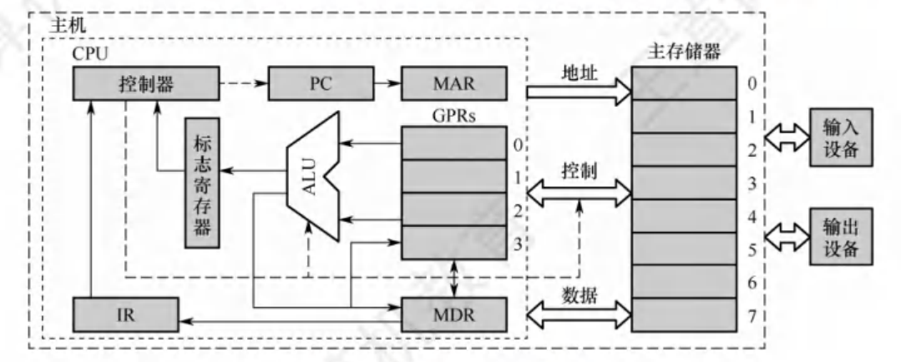
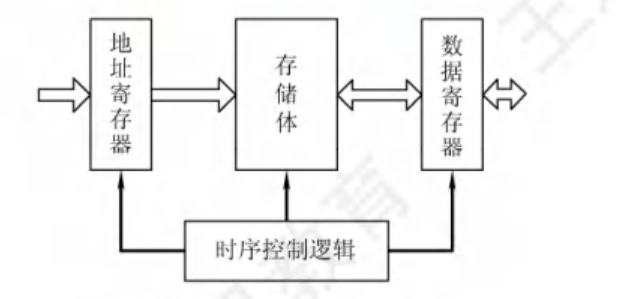
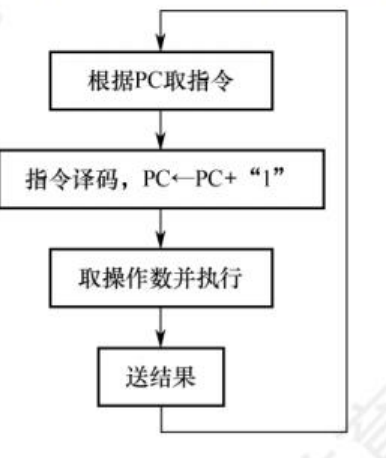
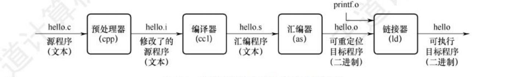

# 计算机组成原理

## 计算机系统概述

### 计算机系统层次结构

==计算机系统的基本组成==

==计算机硬件的基本组成==

==计算机硬件和软件的关系==

==计算机系统的工作原理：存储程序方式、高级语言程序和机器语言程序的转换、程序和指令的执行过程==

1. **计算机硬件**

    1. 冯诺依曼计算机

        采用**存储程序**的工作方式，计算机硬件系统有**运算器、存储器、控制器、输入设备、输出设备**五部分组成

        **指令和数据**以同等地位存储在存储器中，均用二进制代码表示

        指令由**操作码和地址码**组成，操作码给出**操作**的类型，地址码给出**操作数**的地址

        **存储程序**的基本思想是将实现编制好的程序和原始数据送入主存储器后才能执行，一旦启动，无须人为干预，逐条执行

    2. 计算器的功能部件

        

        1. 输入设备输出设备

        2. 存储器（内存+外存）

            **CPU可以直接访问内存，外存中的信息必须调入内存后才能供CPU访问**

            

            存储器地址寄存器（MAR）存放访存地址：MAR用于寻址，位数表示最多课寻址的存储单元数，10位就是1024个存储单元

            存储器数据寄存器（MDR）存放从存储器读或写的信息：位数等于存储字长

            **MAR和MDR都在CPU中**

        3. 运算器

            算术运算逻辑单元（ALU）+ 程序状态寄存器（PSW），ALU包含若干通用寄存器

        4. 控制器

            计数器（PC）+指令寄存器（IR）+控制单元（CU）组成

            PC存放当前执行的指令的地址，自动加1的功能，**与MAR有通路**

            IR存放当前执行的指令，**内容来自MDR**

            指令中操作码OP（IR）送往CU，而地址码AD（IR）送往MAR，用于取操作数

            

2. **计算机系统的工作原理**

    1. 存储程序工作方式

        

        一个程序的执行就是周而复始的执行一条条指令的结果：从主存储器中取指令、对指令进行译码、计算下一条指令的地址、取操作数并执行、将结果送回存储器

    2. 从源程序到可执行文件

        

        1. 预处理阶段：预处理器对以字符#开头的命令进行处理
        2. 编译阶段：对预处理后的源程序进行编译，生成一个汇编语言程序
        3. 汇编阶段：对汇编语言翻译成机器语言
        4. 链接阶段：将可重定位目标程序和标准库函数合并，生成可执行文件

    3. **指令执行过程描述**

        1. 取指令

            PC - MAR-M-MDR-IR

            **根据PC取指令到IR**。将PC的内容送到MAR，MAR中的内容直接送到地址线，同时将控制器打开读信号，主存储器根据地址线的地址和读信号，读出指令，经过数据总线送到MDR，在由MDR送达IR

        2. 分析指令 

            OP（IR）- CU

            **指令译码并送出控制信号**。控制器根据IR指令中的操作码，生成相应的控制信号，送到不同的执行部件

        3. 执行指令

            AD（IR）- MAR - M - MDR - ACC

            **取数操作**。将IR指令中的地址码送到MAR，MAR中的内容送到地址线，同时控制器打开信号，主存储器根据地址线的地址和读信号，读出操作数，经过数据总线送到MDR，在由MDR送达ACC

        4. 每取完一条指令，还要为下一条指令准备**（PC）**+1 - > PC，带括号表示PC中的内容

### 计算机性能指标

==吞吐量、响应时间、CPU时钟周期、主频、CPI、CPU执行时间==

==MIPS、MLOPS、GFLOPS、TFLOPS、PFLOPS、EFLOPS、ZFLOPS==

1. **机器字长**

    32位 64位：计算机一次整数运算所能处理的二进制数据的位数，一般等于**通用寄存器的位数和ALU的宽度**

2. **数据通路带宽**

    数据总线一次所能传送信息的位数。指外部数据总线的宽度

3. **主存容量**

    主存储器所能存储信息的最大容量，以字节来衡量

    **MAR的位数**：反映存储单元的个数

    **MDR的位数**：反映存储单元的字长

    例如：MAR=16位，表示有$2^{16}=65536$个存储单元 64k；MDR有32位，表示机器字长位32

    总存储容量为$64k×32$

4. **运算速度**

    吞吐量（单位时间内处理请求的数量）和响应时间（用户发出请求到得到结果所需要的时间）；

    主频（CPU的时钟频率）和CPU时钟周期（CPU工作的最小时间单位）

    **CPI：执行一条指令所需要的CPU时钟周期数**，平均值

    **IPS：每秒执行多少条指令**

    ​	主频为1s有的时钟周期数，CPI为一条指令需要的平均周期数，相除就是1s执行的指令数
    $$
    IPS = \frac{主频}{CPI}
    $$
    **CPU的执行时间：执行一个程序花费的时间**
    $$
    CPU的执行时间=\frac{指令条数×CPI}{主频} = 指令条数×CPI×CPU时钟周期
    $$
    **MIPS：每秒执行多少百万条指令**
    $$
    MIPS=\frac{指令条数}{执行时间×10^6}=\frac{主频}{CPI×10^6}
    $$
    **FLOPS：每秒执行多少次浮点数运算**

## 数据的表示和运算

### 数制与编码

==进位计数制及其相互转换，定点数的编码表示==

### 运算方法和运算电路

==基本运算部件：加法器、ALU==

==加减法运算：补码加/减运算，标志位的生成==

==乘除法运算：乘除法运算的原理，乘除法运算的逻辑电路==

### 整数的表示和运算

==无符号整数的表示和运算==

==有符号整数的表示和运算==

### 浮点数的表示和运算

==浮点数的表示==

==浮点数的加减运算、IEEE754浮点数表示==

## 存储系统

### 存储器概述

### 主存储器

### 主存储器与CPU的连接

### 外部存储器

### 高速缓冲存储器

### 虚拟存储器

## 指令系统

### 指令系统

### 指令的寻址方式

### 程序的机器级代码表示

### CISC和RISC的基本概念

## 中央处理器

### CPU的功能和基本结构

### 指令执行过程

### 数据通路的功能和基本结构

### 控制器的功能和基本原理

### 异常和中断机制

### 指令流水线

### 多处理器的基本概念

## 总线

### 总线概述

### 总线事务和定时

## 输入/输出系统

### I/O系统的基本概念

### I/O接口

### I/O方式
