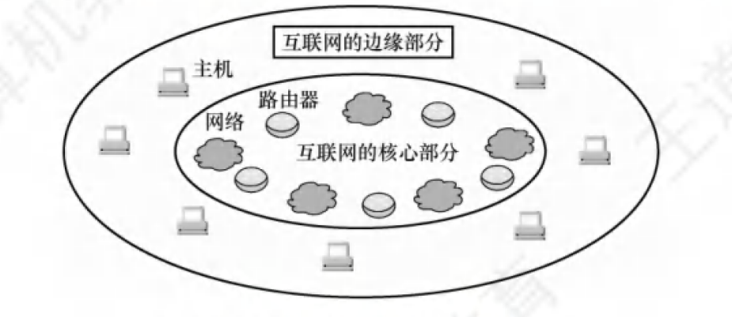

## 计算机网络体系结构

### 计算机网络概述

1. 计算机网络的概念

    计算机网络是将分散的、自治的计算机系统，通过通信设备与线路连接起来，由软件实现资源共享和信息传递的系统

2. 计算机网络的组成

    1. 组成成分：硬件、软件、协议

        

    2. 工作方式：边缘部分（连接到互联网上的主机）、核心部分（路由器，为边缘部分提供连通性和交换服务）

    3. 功能组成：通信子网（传输介质、通信设备、网络协议）、资源子网（实现资源共享功能的硬件和软件）

3. 计算机网络的功能

    1. 数据通信：文件传输、电子邮件
    2. 资源共享：硬件共享、软件共享、数据共享
    3. 分布式处理：利用空闲计算机资源
    4. 提高可靠性：互为替代机
    5. 负载均衡：均衡分配任务

4. 电路交换、分组交换、报文交换

    

    1. 电路交换：连接建立、数据传输、连接释放

        1. 进行数据传输前，建立双方独占的通信链路，通信结束后释放
        2. 通信时延小、有序传播、没有冲突，但是建立连接的时间长、利用率低
        3. 除源点和终点，中间节点采取直通方式，不存在存储转发耗时

    2. 报文交换：存储转发技术

        1. 数据存储的单位是报文，数据+源地址+目的地址 = 报文
        2. 到达相邻节点，存储、查找转发表，转发到下一个节点
        3. 无需建立连接，动态分配线路、利用率高，但转发时延、缓存大

        

    3. 分组交换：存储转发技术

        1. 解决报文过长的问题，将报文数据拆分称报文段，加上首部（源地址、目的地址、编号）
        2. 无需建立连接、利用率高、加速传输，但转发时延大，需要传输额外信息

    **传送数据量大且传送时间大于呼叫时间-电路交换**

    **端到端通路由多道链路组成-分组交换**

5. 计算机网络的分类

    1. 分布范围：广域网（WAN）城域网（MAN）局域网（LAN）个人区域网（PAN）
    2. 传输技术：广播式网络（1对多）、点对点式网络（1对1）
    3. 拓扑结构：总线形、星形、环形、网状
    4. 使用者：公用网、专用网
    5. 传输介质：有线网、无线网

6. 计算机网络的性能指标

    1. 速率

        数据传输速率、数据传输率、数据率、比特率 bit/s 、bps、kb/s （$k = 10^3、M=10^6、G=10^9$）
    
    2. 带宽
    
        最高数据传输率
    
    3. 吞吐量
    
        单位时间通过某个网络的实际数据量
    
    4. 时延
    
        1. 发送时延（传输时延）：发送分组的**第一个比特开始到最后一个比特结束**
            $$
            \text{发送时延} =  \frac {\text{分组长度}}{\text{发送速率}}
            $$
    
        2. 传播时延：**一个比特从链路一段到另一端**
            $$
            传播时延 = \frac{信道长度}{电磁波在信道上的传输速率}
            $$
            
    
        3. 处理时延：交换节点为存储转发进行的处理所消耗的时间，比如分析首部、差错检验
    
        4. 排队时延：分组进入路由器后，要在输入队列和输出队列中排队
    
        $$
        总时延 = 发送时延 + 传播时延 + 处理时延  + 排队时延
        $$
    
    5. 时延带宽积：**发送端发送的第一个bit到达终点时，发送端已经发送了多少个比特**
    
        可以想象到，就是比特充满整个信道
    
        
        $$
        时延带宽积  = 传播时延 * 信道带宽
        $$
        
    
    6. 往返时延（RTT）：发送端发送一个短分组到发送端收到来自接收端的确认总共净琉璃的时延
    
    7. 信道利用率：信道的百分之多少的时间是有数据通过的
        $$
        信道利用率 = \frac{有数据通过的时间}{有数据通过的时间+无数据通过的时间}
        $$
        

​		

​        

​         

### 计算机网络体系结构和参考模型

## 物理层

### 通信基础

### 传输介质

### 物理层设备

## 数据链路层

### 数据链路层的功能

### 组帧

### 差错控制

### 流量控制与可靠传输机制

### 介质访问控制

### 局域网

### 广域网

### 数据链路层设备

## 网络层

### 网络层功能

### IPv4

### IPv6

### 路由算法与路由协议

### IP多播

### 移动IP

### 网络层设备

## 传输层

### 传输层提供的服务

### UDP协议

### TCP协议

## 应用层

### 网络应用模型

### 域名系统（DNS）

### 文件传输协议（FTP）

### 电子邮件

### 万维网（WWW）

