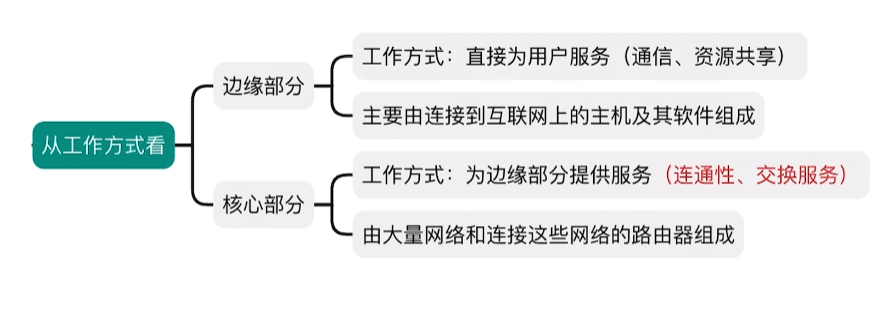

# 计算机网络

## 计算机网络体系结构

### 计算机网络概述

1. 计算机网络的概念

   计算机网络是将**分散的、自治的**计算机系统，通过**通信设备**与**线路**连接起来，由软件实现**资源共享**和**信息传递**的系统

   计算机网络、互连网（internet）、互联网（Internet）

   

2. 计算机网络的组成

   1. 组成成分：硬件、软件、协议  

   2. 工作方式：边缘部分（连接到互联网上的**主机**）、核心部分（**路由器**，为边缘部分提供**连通性**和**交换服务**）

       

   3. 功能组成：通信子网（传输介质、通信设备、网络协议）、资源子网（实现资源共享功能的硬件和软件）

       

3. 计算机网络的功能

   1. 数据通信：文件传输、电子邮件，**最基本最重要**
   2. 资源共享：硬件共享、软件共享、数据共享
   3. 分布式处理：利用空闲计算机资源，分别处理任务
   4. 提高可靠性：互为替代机
   5. 负载均衡：均衡分配任务

4. 电路交换、分组交换、报文交换

   

   1. 电路交换（电话网络）：连接建立、数据传输、连接释放  

      1. 进行数据传输前，建立双方**独占**的通信链路，**通信结束后释放**
      2. 通信时延小、有序传播、**没有冲突**，但是建立连接的时间长、利用率低
      3. 除源点和终点，中间节点采取直通方式，**不存在存储转发耗时**
      4. **无法进行差错控制**，建立连接时间久

   2. 报文交换（电报网络）：存储转发技术

      1. 数据存储的单位是报文，**数据+源地址+目的地址 = 报文**
      2. 到达相邻节点，**交换机**存储、查找转发表，转发到下一个节点
      3. **无需建立连接**，动态分配线路、利用率高，但**转发时延、缓存大**
      4. **支持差错控制**，不利于长报文的转发

      

   3. 分组交换（现代计算机网络）：存储转发技术

      1. 解决报文过长的问题，将报文数据拆分称**报文段**，加上**首部（源地址、目的地址、编号）**
      2. 无需建立连接、利用率高、加速传输，但**转发时延大**，需要传输**额外的控制信息**
      3. 报文失序、丢失，处理难度加大

   **传送数据量大且传送时间大于呼叫时间-电路交换**

   **端到端通路由多道链路组成-分组交换**

   4. 虚电路交换

   

5. 计算机网络的分类

   1. 分布范围：**广域网（WAN**）城域网（MAN）**局域网（LAN）**个人区域网（PAN）
   2. 传输技术：广播式网络（1对多）、点对点式网络（1对1）
   3. 拓扑结构：**总线形、星形、环形、网状**
   4. 使用者：公用网、专用网
   5. 传输介质：有线网、无线网

6. 计算机网络的性能指标

   

   1. 速率

      数据传输速率、数据传输率、数据率、比特率 bit/s 、bps、kb/s （$k = 10^3、M=10^6、G=10^9$）

   2. 带宽

      **最高数据传输率**

   3. 吞吐量

      单位时间通过某个网络的实际数据量

   4. 时延

      1. 发送时延（传输时延）：发送分组的**第一个比特开始到最后一个比特结束**

         $$
         \text{发送时延} =  \frac {\text{分组长度}}{\text{发送速率}}
         $$
      2. 传播时延：**一个比特从链路一段到另一端**

         $$
         传播时延 = \frac{信道长度}{电磁波在信道上的传输速率}
         $$
      3. 处理时延：交换节点为存储转发进行的处理所消耗的时间，比如分析首部、差错检验
      4. 排队时延：分组进入路由器后，要在输入队列和输出队列中排队

      $$
      总时延 = 发送时延 + 传播时延 + 处理时延  + 排队时延
      $$

   5. 时延带宽积：**发送端发送的第一个bit到达终点时，发送端已经发送了多少个比特**

      可以想象到，就是比特充满整个信道

      

      $$
      时延带宽积  = 传播时延 * 信道带宽
      $$

   6. 往返时延（RTT）：发送端发送一个短分组到发送端收到来自接收端的确认总共经过的时延，不包含发送方的发送时延

       

   7. 信道利用率：信道的百分之多少的时间是有数据通过的

      $$
      信道利用率 = \frac{有数据通过的时间}{有数据通过的时间+无数据通过的时间}
      $$

### 计算机网络体系结构和参考模型

1. 计算机网络的分层结构

    网络的体系结构：计算机网络的各层 + 协议的集合

    分层的基本原则：

    ​	每层实现相对独立的功能，降低大系统的复杂度

    ​	各层的接口自然清晰，保持下层对上层的独立性，上层单向使用下层提供的服务

2. 计算机网络协议、接口、服务的概念

    1. 协议：事先约定好的规则，控制**对等实体**进行通信规则的集合，是**水平的**，不对等的实体是没有协议的

        协议有**语法、语义、同步**三部分组成

        1. 语法：数据与控制信息的格式
        2. 语义：需要发出何种控制信息、完成何种动作、做出何种应答
        3. 同步（时序）：执行各种操作的条件、时序关系

    2. 接口

        同一节点内，**相邻两层**实体交换信息的逻辑接口称为**服务访问点**，每层只能为紧邻的层之间定义接口，而不能跨层定义接口

    3. 服务

        服务是下层为上层提供的功能调用，是**垂直的**

3. ISO/OSI 参考模型和TCP/IP模型

    1. OSI参考模型

        

        1. 物理层

            物理层的传输单位是**比特**，功能是在物理介质上为数据端设备透明地传输原始的比特流

        2. 数据链路层

            数据链路层的单位是**帧**，将网络层交来的IP封装分组成帧，并且可靠地传输到相邻节点的网络层

        3. 网络层

            网络层的单位是**数据报**，将网络层的协议数据单元（分组）从源节点传输到目的节点，为分组交换的网上的不同主机提供通信服务

        4. 传输层

            负责主机中**两个进程**的通信，功能是为端到端的连接提供可靠的传输服务

        5. 会话层

            会话层允许不同的主机各个进程进行会话

        6. 表示层

            处理在两个通信系统中交换信息的表示方式

        7. 应用层

            最高层，是用户与网络的接口

        

    2. TCP/IP模型

        

        1. 网络接口层（物理层+数据链路层）

        2. 网际层（主机-主机）IP

            网际层将分组发往任何网络，并为其独立的选择合适的路由

        3. 传输层（应用-应用 进程-进程） TCP UDP

            使发送端和目的端的主机上的对等实体进行会话

        4. 应用层（用户-用户） FTP DNS HTTP

## 物理层

**物理层考虑的是  怎样在连接各台的计算机的传输介质上  传输数据比特流**

### 通信基础

==信道、信号、带宽、码元、波特、速率、信源、信宿==

==奈奎斯特定理、香农定理、编码与调制==

==电路交换、分组交换、报文交换、数据报与虚电路==

1. 数据、信号、码元

    数据：传送信息的**实体**，01二进制序列

    信号：数据的电气或电磁表现（数字信号、模拟信号）

    码元：代表不同离散数值的**固定时长**的**信号波形**，**一个码元可携带若干比特的信息**

    ==几进制码元 表示 几种离散状态 对应二进制的位数==

    

2. 信源、信道、信宿

    

    信源：产生和发送数据的源头

    信宿：数据的终点

    信道：信号的传输介质

    通信交互方式：**单工通信（你说我听着）、半双工通信（你一句我一句）、全双工通信（同时发送和接收消息）**

3. 速率、波特、带宽

    速率：数据传输速率

    ​	码元传输速率（波特率）：单位时间内传输的码元数 （Baud）

    ​	信息传输速率（比特率）：单位时间内传输的比特数 （bit/s）

    ​	**若一个码元携带nbit信息，则M Baud码元传输速率对应的信息传输速率为  nM bit/s**

    带宽：计网中，带宽用来表示**最高的数据传输速率**，单位是bit/s

4. **奈奎斯特定理（奈氏准则）**

    在理想的低通信道中（没有噪声、带宽有限），为了避免**码间串扰**，极限码元的传输速率是**2W**波特（**这个是固定不动的**），其中**W**是信道的频率带宽（最高频率和最低频率之差）单位为**Hz**，若用**V**表示**每个码元的离散状态的种类**，则2W*码元bit位数
    $$
    \text{理想低通信道下的极限数据传输速率}=2Wlog_{2}{V}（bit/s）
    $$
    **理解：**若有16种不同的码元，则需要$$log_{2}{16}=4$$个二进制位，所以要一次传输四个bit，信息传输速率是码元传输速率的4倍，说明在任何信道中，码元传输速率是有上限的，**奈氏准则给出了码元传输速率的上限，但没有限制信息的传输速率**，设法使每个码元携带更多的bit信息量可以提高信息传输速率

5. **香农定理**

    香农定理给出了**带宽受限且有高斯噪声干扰的**信道极限传输速率
    $$
    信道的极限传输速率=Wlog_2{(1+\frac{S}{N})}\ (bit/s)\\
    信噪比（dB）=10log_{10}{\frac{S}{N}}
    $$
    $W$为信道的频率带宽（Hz）$S$为信道内所传输信号的平均功率，$N$为信道内高斯噪声功率，$信噪比（dB）=10log_{10}{\frac{S}{N}}$，若$\frac{S}{N}=1000$，信噪比=30dB

    **理解：**信噪比越大，信息的传输速率越高，奈氏准则只考虑了带宽和极限码元传输速率的关系，香农定理不仅考虑了带宽，也考虑了信噪比，从另一个侧面说明**一个码元对应的二进制位数是有限的**

    ==信噪比是有比值形式（无单位）和分贝形式（dB）==

6. 编码与调制

    

    1. 编码：**数据**转换为**数字信号**

        1. **数字数据**编码为数字信号

            编码的形式有多种，只要能区分0和1即可

            

            反向非归零编码：用电平的**跳变表示0，不跳变表示1**（每个码元开始处是否跳变）

            **曼彻斯特编码**：每个都跳变，上跳表示0（前低后高），下跳表示1（前高后低）

            **差分曼彻斯特编码**：**中间**总会跳变，虚线处，**跳变表示0，不跳变表示1**（每个码元开始处是否跳变）

            

        2. **模拟数据**编码为数字信号

            采样、量化、编码

    2. 调制：**数据**转换为**模拟信号**

        1. **数字数据**调制为模拟信号

            

        2. **模拟数据**调制为模拟信号
        
            4个相位，4个振幅=16种变化

### 传输介质

==双绞线、同轴电缆、光纤与无线传输介质==（无线电波、微波）

==物理层接口特性==

1. 物理层接口特性
    1. 机械特性：指明接口所用接线器的形状和尺寸、引脚数目和排列
    2. 电气特性：指明接口电缆各条线的电压范围，传输速率和距离
    3. 功能特性：某一电平电压的含义、每条线的功能
    4. 过程特性：不同功能的各种可能事件的出现顺序

### 物理层设备

==中继器、集线器==

1. 中继器

    主要功能：**整型、放大并转发信号**，以消除信号经过一段长电缆后产生的失真和衰减，使信号的波形和强度达到所需的要求，进而扩大网络的传输距离，**使用中继器连接的网络仍处于同一个局域网，放大的是数字信号，而放大器放大的是模拟信号**，中继器用来**再生**数字信号

2. 集线器

    集线器**实质上是一个多端口的中继器**，**物理上星形，逻辑上总线形**
    
    

## 数据链路层

### 数据链路层的功能

1. **数据链路层的主要功能是**：实现**帧**在一个**链路**或一个**网络**上进行传输，有三个基本问题**封装成帧、透明传输、差错检验**

    

    数据链路层在物理层提供的服务的基础上**向网络层提供服务**，其最基本的服务是将来自于网络层的数据**可靠地**传输到相邻节点目标主机的网络层。其主要作用是**加强物理层传输原始比特流的功能**，将物理层提供的可能出错的物理连接改成**逻辑上无差错的数据链路**，使之对网络层表现为一条无差错的链路

2. **使用的信道**

   1. 点对点信道，PPP协议
   2. 广播信道：有线局域网 CSMA/CD，无线局域网 CSMA/CS

3. **数据链路层的地位**

   

   我们可以**只关注协议栈水平方向的个数据链路层，可以想象成数据从H1链路层-R1链路层-R2链路层-H2链路层**，其中**三段不同的数据链路可能采用不同的数据链路层协议**

   

4. **点对点信道的概念**

   1. 链路：一个节点到另一个节点的物理线路
   2. 数据链路：链路+通信协议
   3. 帧：数据链路层对等实体进行**逻辑通信**的基本单元。**数据链路把网络层下交的数据封装成帧发送到链路上，并把接收到的帧的数据取出来上交给网络层**

5. **封装成帧与透明传输**

   封装成帧：在一段数据的前后添加首部和尾部，构成帧，**帧长=数据长+首部尾部长**，首部尾部含有控制信息，他们一个重要作用就是**确定帧的界限**

   透明传输：无论数据传送什么样的**比特组合**，都能够无差错的在链路上传播。比如在**帧的数据部分**有的比特组合是控制信息，接收方不会认为这是控制信息

6. 流量控制

   限制发送方的发送速率，使之不超过接受方的接收能力

7. 差错检测

   1. 位错：帧中某些位出现错误（CRC检验）
   2. 帧错：帧丢失、帧重复、帧失序

### 组帧

**发送方按照一定的规则将网路层递交的IP数据报分装成帧**，组帧主要解决**帧定界、帧同步、透明传输**的问题

组帧的方法

1. **字符计数法**

   在帧首使用一**个计数字段**记录该帧含的字节数（**包含计数字段的一个字节**），当接收方读出帧首的字节计数值，就可以找到帧尾，**由于帧是连续传输的，也能确定下一帧的开始**

   

2. **字节填充法**

   使用特定的字节来**定界一帧的开始和结束**，SOH表示帧的开始，EOT表示帧的结束，ESC是转义字符

   

   网络层发出的数据，经过数据链路层的处理（添加转移符号），发送给网络层（去除转移符号）

3. **零比特填充法**

   

   允许数据帧包含任意个数的比特，使用特定的**01111110**来表示一个帧的开始和结束

   

   发送方先扫描整个数据字段，**每遇到5个连续的1，就在后面插入一个0**，经过这种填充后，可以确保**数据中不会出现6个连续的1**

   接收方做该过程的逆操作：**每收到5个连续的1，就删除后面的0**，恢复原始数据

4. 违规编码法

    曼彻斯特编码只会出现高低，低高（**比较常用**）

    

### 差错控制

==检错编码（重传）、纠错编码==

1. 常见错误

    1. **位错**：0变1，1变0  （**检错编码和纠错编码**）

        1. **检错编码**：

            1. **奇偶校验码**：n-1位信息源+1位的校验元，==添加字符后==    **奇校验-1的个数为奇数，偶校验-1的个数为偶数**
        
            2. **循环冗余码CRC**：发送数据时，**发送数据+冗余编码**，接收方，根据发送来的码字是否符合规则判断是否出错
        
                发送端（**r+1位生成多项式**）
        
                
        
                
        
                接收端（加上了余数，必然除完余数以后为0）
        
                
        
        2. **纠错编码**：**海明码**
        
            发现错误，找到位置、纠正错误
        
            
        
            **两个合法编码**对应比特位取值不同的总和为海明距离；一个有效的**编码集**中，**任意两个合法编码**的海明距离的**最小值**为该编码集的海明距离
        
            ==检测d位比特错，码距d+1；纠正d位比特错，码距2d+1==
        
            1. 确定校验码位数
        
                数据位有m位，校验码有r位，校验码有$2^r$种取值（**表示第几位出错**，检验d位出错，$2^r>d+1$）
                $$
                2^r>=m+r+1
                $$
                比如：要发送$D_4D_3D_2D_1$=1010
        
                m=4，穷举r=3时 8>=4+3+1,所以校验码有3位，海明码位数m+r=7
        
            2. 确定校验位的分布
        
                校验位$P_3P_2P_1$，海明码$H_7H_6H_5H_4H_3H_2H_1$
        
                ==规定检验位，在海明位号$2^{i-1}$的位置==，那么就在4，2，1的位置
        
                信息位按原来的插入，校验位按计算出来的插入得到
                $$
                \ H_7\ H_6\ H_5\ H_4\ H_3\ H_2\ H_1\ \\
                D_4\ D_3\ D_2\ P_3\ D_1\ P_2\ P_1
                $$
        
            3. 分组以形成检验关系
        
                ==被检验数据位的海明号等于检验数据位的海明号之和==
        
                D1-H3=H1	+	H2	 +  （）  (P2P1检验)
        
                D2-H5=H1	+  （）	+    H4   (P3P1检验)
        
                D3-H6=（）  +    H2 	+   H4 (P3P2检验)
        
                D4-H7=H1	 +    H2	 +   H4   (P3P2P1检验)
        
                ​				1组        2组           3组
        
            4. 检验位取值
        
                ==检验位$P_i$的值为第$i$组所有位求异或==
        
                P1=D1$\oplus$D2$\oplus$D4=0$\oplus$1$\oplus$1=0
        
                P2=D1$\oplus$D3$\oplus$D4=0$\oplus$0$\oplus$1=1
        
                P3=D2$\oplus$D3$\oplus$D4=1$\oplus$0$\oplus$1=0
        
                所以1010对应的海明码为 101**（0）**0**（1）（0）**
        
            5. 海明码检验原理
        
                S1=P1$\oplus$D1$\oplus$D2$\oplus$D4
        
                S2=P2$\oplus$D1$\oplus$D3$\oplus$D4
        
                S3=P3$\oplus$D2$\oplus$D3$\oplus$D4
        
                若S3S2S1=000,无差错，**S3S2S1=001，第1位出错，即H1出错，按位取反即可**
        
    2. **帧错**：帧丢失、帧重复、帧失序（**定时器、编号机制**）  

### 流量控制与可靠传输机制

==流量控制、可靠传输机制、滑动窗口机制、停止等待协议==

==后退N帧协议、选择重传协议==

1. 流量控制

    由于发送方和接收方各自的**工作速率和缓存空间**的差异，可能出现发送方的发送能力大于接收方的接收能力，如果不限制发送速率，接收方会被后面的帧淹没，造成帧丢失，**因此流量控制就是限制发送方的数据流量**

    ==数据链路层的流量控制是节点对节点的，传输层的流量控制是端到端的==

    - 数据层流量控制的手段：接收方接收不下就**不回复确认**
    - 传输层流量控制手段：接收端给发送端发送一个窗口

    1. **停止等待协议**：每发送完一个帧后就停止发送，等到对方的确认以后再发送下一帧（**发送窗口和接收窗口都是1**）

        

        当接收不到确认帧后，**在发送后有一个超时重传计时器，时间略大于RTT**，当接受不到ack时，就会重传

        

        **ack丢失**，还是会超时重传，接收方会丢弃重复发送的帧

        

        **ack迟到**，还是会超时重传，接收方会丢弃重复发送的帧，迟到的确认帧到了，会丢弃ack0

        

    2. **滑动窗口协议**(解决了流量控制和可靠传输)

        

        ==后退N帧协议：发送窗口>1,接收窗口=1==

        **比如有四个窗口0 1 2 3，那么n=2**

        若采用**n个bit对帧**编号，发送窗口的尺寸满足$[1,2^n-1]$大小之内，否则接收方无法区分新帧和旧帧；

        **累计确认；**    

        **接收方只按顺序接收帧，不按序无情丢弃；**

        **确认序列号最大的、按序到达的帧；**

        

        **可以不用一个窗口发送一个ack，可以累计确认，这样效率就高了**，当接收方收到ack3，**表示已经收到了3号帧和以前的所有帧**窗口可以直接移动到4了

        

        **超时事件**

        如果发送方发送第0帧丢失了，接收方接收不到发送的帧，此时发送方也得不到ack0，如果此时发送方发送后面的第1帧，接收方接收到了，发送ack1，此时发送方想要ack0，但收到ack1，它就认为第0帧丢失了，于是会重传此时发送窗口内的所有帧

        **接收方如果接收不到自己想要的帧，后面的接收到的帧就扔掉**

        ==这个图很形象==

        

        ==选择重传协议：发送窗口>1,接收窗口>1==

        ​	后退N帧协议中一旦超时，会重传窗口内所有的帧，那我可不可以只重传出错的帧的呢？

        ​	解决办法：设置单个确认，同时加大接收窗口，设置接收缓存，缓存乱序到达的帧

        ​	**发送窗口最好等于接收窗口 大小为$2^{n-1}$**

        ​	**对数据帧逐一确认，收到一个确认一个**

        ​	**只重传出错的帧**

        ​	**接收方和发送方都有缓存**

        

        **发送方窗口类型**

        

        **接收方窗口类型**

        

        **发送方收到ack2，直接移动到4，因为ack3之前已经收到了**

        

        

        **接收窗口内的帧，来着不拒，不管是否是按序的，然后发送对应的ack，收到谁确认谁**

        当收到6、7发送ack6，7，然后此时5来了，发送ack5，直接移动到0

        

        

    ==直观==

    

### 介质访问控制

==信道划分：频分复用、时分复用、波分复用、码分复用==

==随机访问：ALOHA协议、CSMA协议、CSMA/CD协议、CSMA/CA协议==

==轮询访问：令牌传递协议==

1. 数据传输中的两种链路
    1. 点对点链路（广域网）ppp协议
    2. 广播链路（局域网）

### 局域网

==局域网的基本概念和体系结构，以太网于IEEE802.3==

==IEEE802.11无线局域网，VLAN的基本概念与基本原理==

### 广域网

==广域网的基本概念，PPP协议==

### 数据链路层设备

==以太网交换机==，物理上星形，逻辑上星形

==网桥==

## 网络层

### 网络层功能

### IPv4

### IPv6

### 路由算法与路由协议

### IP多播

### 移动IP

### 网络层设备

家用路由器=交换机+路由器+其他功能

**互连网**

## 传输层

### 传输层提供的服务

### UDP协议

### TCP协议

## 应用层

### 网络应用模型

### 域名系统（DNS）

### 文件传输协议（FTP）

### 电子邮件

### 万维网（WWW）
