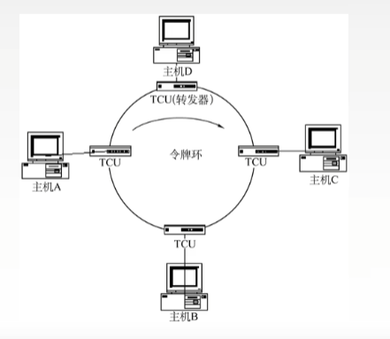
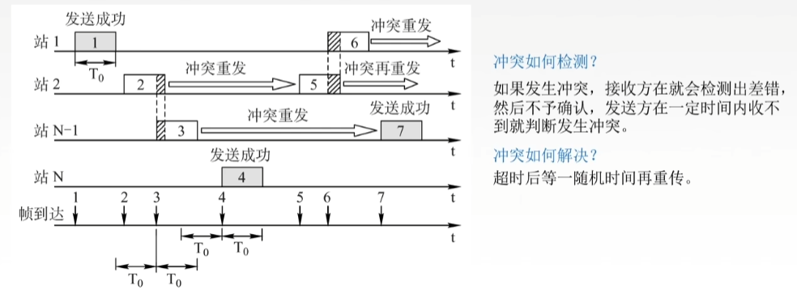
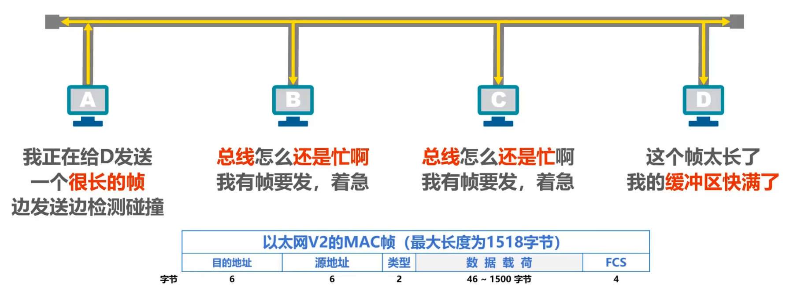
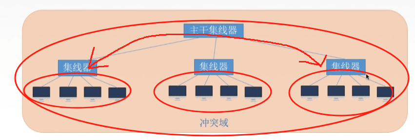
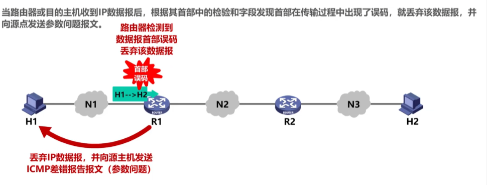
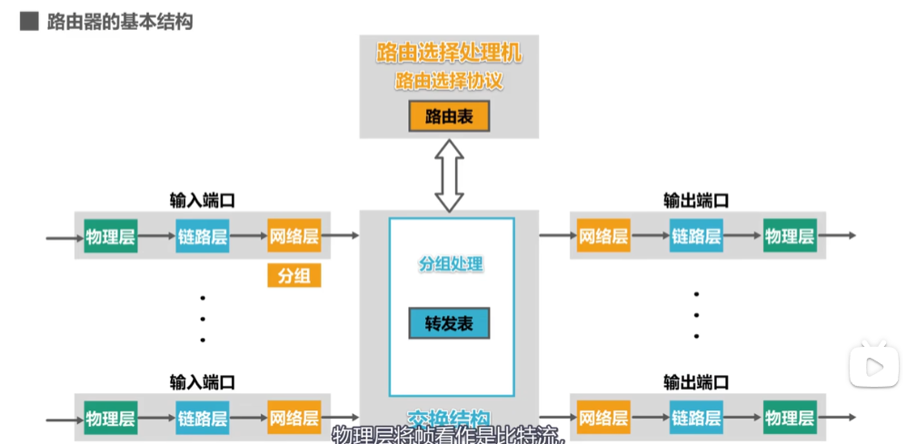
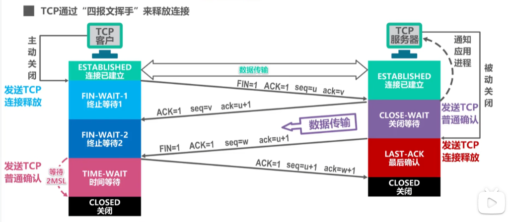
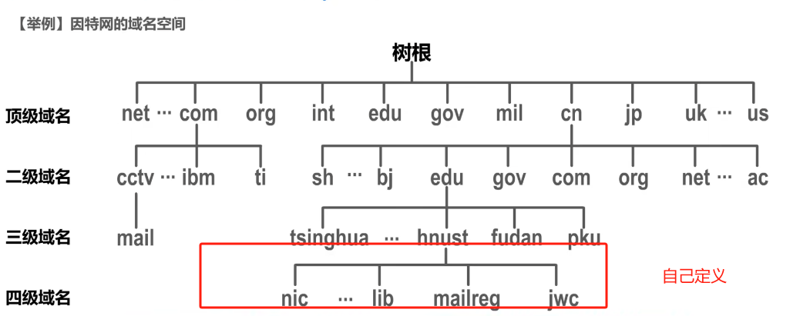
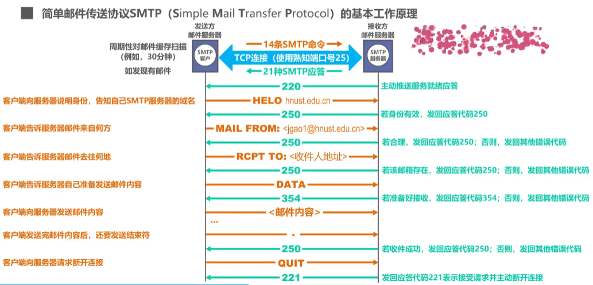

# 计算机网络

## 计算机网络体系结构

### 计算机网络概述

1. 计算机网络的概念

   计算机网络是将**分散的、自治的**计算机系统，通过**通信设备**与**线路**连接起来，由软件实现**资源共享**和**信息传递**的系统

   计算机网络、互连网（internet）、互联网（Internet）

   

2. 计算机网络的组成

   1. 组成成分：硬件、软件、协议  

   2. 工作方式：边缘部分（连接到互联网上的**主机**）、核心部分（**路由器**，为边缘部分提供**连通性**和**交换服务**）

       

   3. 功能组成：通信子网（传输介质、通信设备、网络协议）、资源子网（实现资源共享功能的硬件和软件）

       

3. 计算机网络的功能

   1. 数据通信：文件传输、电子邮件，**最基本最重要**
   2. 资源共享：硬件共享、软件共享、数据共享
   3. 分布式处理：利用空闲计算机资源，分别处理任务
   4. 提高可靠性：互为替代机
   5. 负载均衡：均衡分配任务

4. 电路交换、分组交换、报文交换

   

   1. 电路交换（电话网络）：连接建立、数据传输、连接释放  

      1. 进行数据传输前，建立双方**独占**的通信链路，**通信结束后释放**
      2. 通信时延小、有序传播、**没有冲突**，但是建立连接的时间长、利用率低
      3. 除源点和终点，中间节点采取直通方式，**不存在存储转发耗时**
      4. **无法进行差错控制**，建立连接时间久

   2. 报文交换（电报网络）：存储转发技术

      1. 数据存储的单位是报文，**数据+源地址+目的地址 = 报文**
      2. 到达相邻节点，**交换机**存储、查找转发表，转发到下一个节点
      3. **无需建立连接**，动态分配线路、利用率高，但**转发时延、缓存大**
      4. **支持差错控制**，不利于长报文的转发

      

   3. 分组交换（现代计算机网络）：存储转发技术

      1. 解决报文过长的问题，将报文数据拆分称**报文段**，加上**首部（源地址、目的地址、编号）**
      2. 无需建立连接、利用率高、加速传输，但**转发时延大**，需要传输**额外的控制信息**
      3. 报文失序、丢失，处理难度加大

   **传送数据量大且传送时间大于呼叫时间-电路交换**

   **端到端通路由多道链路组成-分组交换**

   4. 虚电路交换

   

5. 计算机网络的分类

   1. 分布范围：**广域网（WAN**）城域网（MAN）**局域网（LAN）**个人区域网（PAN）
   2. 传输技术：广播式网络（1对多）、点对点式网络（1对1）
   3. 拓扑结构：**总线形、星形、环形、网状**
   4. 使用者：公用网、专用网
   5. 传输介质：有线网、无线网

6. 计算机网络的性能指标

   

   1. 速率

      数据传输速率、数据传输率、数据率、比特率 bit/s 、bps、kb/s （$k = 10^3、M=10^6、G=10^9$）

   2. 带宽

      **最高数据传输率**

   3. 吞吐量

      单位时间通过某个网络的实际数据量

   4. 时延

      1. 发送时延（传输时延）：发送分组的**第一个比特开始到最后一个比特结束**

         $$
         \text{发送时延} =  \frac {\text{分组长度}}{\text{发送速率}}
         $$
      2. 传播时延：**一个比特从链路一段到另一端**

         $$
         传播时延 = \frac{信道长度}{电磁波在信道上的传输速率}
         $$
      3. 处理时延：交换节点为存储转发进行的处理所消耗的时间，比如分析首部、差错检验
      4. 排队时延：分组进入路由器后，要在输入队列和输出队列中排队

      $$
      总时延 = 发送时延 + 传播时延 + 处理时延  + 排队时延
      $$

   5. 时延带宽积：**发送端发送的第一个bit到达终点时，发送端已经发送了多少个比特**

      可以想象到，就是比特充满整个信道

      

      $$
      时延带宽积  = 传播时延 * 信道带宽
      $$

   6. 往返时延（RTT）：发送端发送一个短分组到发送端收到来自接收端的确认总共经过的时延，不包含发送方的发送时延

       

   7. 信道利用率：信道的百分之多少的时间是有数据通过的

      $$
      信道利用率 = \frac{有数据通过的时间}{有数据通过的时间+无数据通过的时间}
      $$

### 计算机网络体系结构和参考模型

1. 计算机网络的分层结构

    网络的体系结构：计算机网络的各层 + 协议的集合

    分层的基本原则：

    ​	每层实现相对独立的功能，降低大系统的复杂度

    ​	各层的接口自然清晰，保持下层对上层的独立性，上层单向使用下层提供的服务

2. 计算机网络协议、接口、服务的概念

    1. 协议：事先约定好的规则，控制**对等实体**进行通信规则的集合，是**水平的**，不对等的实体是没有协议的

        协议有**语法、语义、同步**三部分组成

        1. 语法：数据与控制信息的格式
        2. 语义：需要发出何种控制信息、完成何种动作、做出何种应答
        3. 同步（时序）：执行各种操作的条件、时序关系

    2. 接口

        同一节点内，**相邻两层**实体交换信息的逻辑接口称为**服务访问点**，每层只能为紧邻的层之间定义接口，而不能跨层定义接口

    3. 服务

        服务是下层为上层提供的功能调用，是**垂直的**

3. ISO/OSI 参考模型和TCP/IP模型

    1. OSI参考模型

        

        1. 物理层

            物理层的传输单位是**比特**，功能是在物理介质上为数据端设备透明地传输原始的比特流

        2. 数据链路层

            数据链路层的单位是**帧**，将网络层交来的IP封装分组成帧，并且可靠地传输到相邻节点的网络层

        3. 网络层

            网络层的单位是**数据报**，将网络层的协议数据单元（分组）从源节点传输到目的节点，为分组交换的网上的不同主机提供通信服务

        4. 传输层

            负责主机中**两个进程**的通信，功能是为端到端的连接提供可靠的传输服务

        5. 会话层

            会话层允许不同的主机各个进程进行会话

        6. 表示层

            处理在两个通信系统中交换信息的表示方式

        7. 应用层

            最高层，是用户与网络的接口

        

    2. TCP/IP模型

        

        1. 网络接口层（物理层+数据链路层）

        2. 网际层（主机-主机）IP

            网际层将分组发往任何网络，并为其独立的选择合适的路由

        3. 传输层（应用-应用 进程-进程） TCP UDP

            使发送端和目的端的主机上的对等实体进行会话

        4. 应用层（用户-用户） FTP DNS HTTP

## 物理层

**物理层考虑的是  怎样在连接各台的计算机的传输介质上  传输数据比特流**

### 通信基础

#### 基本概念

==信道、信号、带宽、码元、波特、速率、信源、信宿==

==奈奎斯特定理、香农定理、编码与调制==

==电路交换、分组交换、报文交换、数据报与虚电路==

1. 数据、信号、码元

    数据：传送信息的**实体**，01二进制序列

    信号：数据的电气或电磁表现（数字信号、模拟信号）

    码元：代表不同离散数值的**固定时长**的**信号波形**，**一个码元可携带若干比特的信息**

    ==几进制码元 表示 几种离散状态 对应二进制的位数==

    

2. 信源、信道、信宿

    

    信源：产生和发送数据的源头

    信宿：数据的终点

    信道：信号的传输介质

    通信交互方式：**单工通信（你说我听着）、半双工通信（你一句我一句）、全双工通信（同时发送和接收消息）**

3. 速率、波特、带宽

    速率：数据传输速率

    ​	码元传输速率（波特率）：单位时间内传输的码元数 （Baud）

    ​	信息传输速率（比特率）：单位时间内传输的比特数 （bit/s）

    ​	**若一个码元携带nbit信息，则M Baud码元传输速率对应的信息传输速率为  nM bit/s**

    带宽：计网中，带宽用来表示**最高的数据传输速率**，单位是bit/s

    

#### 信道的极限容量

**奈奎斯特定理（奈氏准则）**

在理想的低通信道中（没有噪声、带宽有限），为了避免**码间串扰**，极限码元的传输速率是**2W**波特（**这个是固定不动的**），其中**W**是信道的频率带宽（最高频率和最低频率之差）单位为**Hz**，若用**V**表示**每个码元的离散状态的种类**，则2W*码元bit位数
$$
\text{理想低通信道下的极限数据传输速率}=2Wlog_{2}{V}（bit/s）
$$
**理解：**若有16种不同的码元，则需要$$log_{2}{16}=4$$个二进制位，所以要一次传输四个bit，信息传输速率是码元传输速率的4倍，说明在任何信道中，码元传输速率是有上限的，**奈氏准则给出了码元传输速率的上限，但没有限制信息的传输速率**，设法使每个码元携带更多的bit信息量可以提高信息传输速率

**香农定理**

香农定理给出了**带宽受限且有高斯噪声干扰的**信道极限传输速率
$$
信道的极限传输速率=Wlog_2{(1+\frac{S}{N})}\ (bit/s)\\
信噪比（dB）=10log_{10}{\frac{S}{N}}
$$
$W$为信道的频率带宽（Hz）$S$为信道内所传输信号的平均功率，$N$为信道内高斯噪声功率，$信噪比（dB）=10log_{10}{\frac{S}{N}}$，若$\frac{S}{N}=1000$，信噪比=30dB

**理解：**信噪比越大，信息的传输速率越高，奈氏准则只考虑了带宽和极限码元传输速率的关系，香农定理不仅考虑了带宽，也考虑了信噪比，从另一个侧面说明**一个码元对应的二进制位数是有限的**

==信噪比是有比值形式（无单位）和分贝形式（dB）==

#### 编码与调制

1. 编码与调制

    

    1. 编码：**数据**转换为**数字信号**

        1. **数字数据**编码为数字信号

            编码的形式有多种，只要能区分0和1即可

            

            反向非归零编码：用电平的**跳变表示0，不跳变表示1**（每个码元开始处是否跳变）

            **曼彻斯特编码**：每个都跳变，上跳表示0（前低后高），下跳表示1（前高后低）

            **差分曼彻斯特编码**：**中间**总会跳变，虚线处，**跳变表示0，不跳变表示1**（每个码元开始处是否跳变）

            

        2. **模拟数据**编码为数字信号

            采样、量化、编码

    2. 调制：**数据**转换为**模拟信号**

        1. **数字数据**调制为模拟信号

            

        2. **模拟数据**调制为模拟信号
        
            4个相位，4个振幅=16种变化

### 传输介质

==双绞线、同轴电缆、光纤与无线传输介质==（无线电波、微波）

==物理层接口特性==

1. 物理层接口特性
    1. 机械特性：指明接口所用接线器的形状和尺寸、引脚数目和排列
    2. 电气特性：指明接口电缆各条线的电压范围，传输速率和距离
    3. 功能特性：某一电平电压的含义、每条线的功能
    4. 过程特性：不同功能的各种可能事件的出现顺序

### 物理层设备

==中继器、集线器==

1. 中继器

    主要功能：**整型、放大并转发信号**，以消除信号经过一段长电缆后产生的失真和衰减，使信号的波形和强度达到所需的要求，进而扩大网络的传输距离，**使用中继器连接的网络仍处于同一个局域网，放大的是数字信号，而放大器放大的是模拟信号**，中继器用来**再生**数字信号

2. 集线器

    集线器**实质上是一个多端口的中继器**，**物理上星形，逻辑上总线形**
    
    

## 数据链路层

### 数据链路层的功能

1. **数据链路层的主要功能是**：实现**帧**在一个**链路**或一个**网络**上进行传输，有三个基本问题**封装成帧、透明传输、差错检验**

    

    数据链路层在物理层提供的服务的基础上**向网络层提供服务**，其最基本的服务是将来自于网络层的数据**可靠地**传输到相邻节点目标主机的网络层。其主要作用是**加强物理层传输原始比特流的功能**，将物理层提供的可能出错的物理连接改成**逻辑上无差错的数据链路**，使之对网络层表现为一条无差错的链路

2. **使用的信道**

   1. 点对点信道，PPP协议
   2. 广播信道：有线局域网 CSMA/CD，无线局域网 CSMA/CS

3. **数据链路层的地位**

   

   我们可以**只关注协议栈水平方向的个数据链路层，可以想象成数据从H1链路层-R1链路层-R2链路层-H2链路层**，其中**三段不同的数据链路可能采用不同的数据链路层协议**

   

4. **点对点信道的概念**

   1. 链路：一个节点到另一个节点的物理线路
   2. 数据链路：链路+通信协议
   3. 帧：数据链路层对等实体进行**逻辑通信**的基本单元。**数据链路把网络层下交的数据封装成帧发送到链路上，并把接收到的帧的数据取出来上交给网络层**

5. **封装成帧与透明传输**

   封装成帧：在一段数据的前后添加首部和尾部，构成帧，**帧长=数据长+首部尾部长**，首部尾部含有控制信息，他们一个重要作用就是**确定帧的界限**

   透明传输：无论数据传送什么样的**比特组合**，都能够无差错的在链路上传播。比如在**帧的数据部分**有的比特组合是控制信息，接收方不会认为这是控制信息

6. 流量控制

   限制发送方的发送速率，使之不超过接受方的接收能力

7. 差错检测

   1. 位错：帧中某些位出现错误（CRC检验）
   2. 帧错：帧丢失、帧重复、帧失序

### 组帧

**发送方按照一定的规则将网路层递交的IP数据报分装成帧**，组帧主要解决**帧定界、帧同步、透明传输**的问题

组帧的方法

1. **字符计数法**

   在帧首使用一**个计数字段**记录该帧含的字节数（**包含计数字段的一个字节**），当接收方读出帧首的字节计数值，就可以找到帧尾，**由于帧是连续传输的，也能确定下一帧的开始**

   

2. **字节填充法**

   使用特定的字节来**定界一帧的开始和结束**，SOH表示帧的开始，EOT表示帧的结束，ESC是转义字符

   

   网络层发出的数据，经过数据链路层的处理（添加转移符号），发送给网络层（去除转移符号）

3. **零比特填充法**

   

   允许数据帧包含任意个数的比特，使用特定的**01111110**来表示一个帧的开始和结束

   

   发送方先扫描整个数据字段，**每遇到5个连续的1，就在后面插入一个0**，经过这种填充后，可以确保**数据中不会出现6个连续的1**

   接收方做该过程的逆操作：**每收到5个连续的1，就删除后面的0**，恢复原始数据

4. 违规编码法

    曼彻斯特编码只会出现高低，低高（**比较常用**）

    

### 差错控制

==检错编码（重传）、纠错编码==

1. 常见错误

    1. **位错**：0变1，1变0  （**检错编码和纠错编码**）

        1. **检错编码**：

            1. **奇偶校验码**：n-1位信息源+1位的校验元，==添加字符后==    **奇校验-1的个数为奇数，偶校验-1的个数为偶数**
        
            2. **循环冗余码CRC**：发送数据时，**发送数据+冗余编码**，接收方，根据发送来的码字是否符合规则判断是否出错
        
                发送端（**r+1位生成多项式**）
        
                
        
                
        
                接收端（加上了余数，必然除完余数以后为0）
        
                
        
        2. **纠错编码**：**海明码**
        
            发现错误，找到位置、纠正错误
        
            
        
            **两个合法编码**对应比特位取值不同的总和为海明距离；一个有效的**编码集**中，**任意两个合法编码**的海明距离的**最小值**为该编码集的海明距离
        
            ==检测d位比特错，码距d+1；纠正d位比特错，码距2d+1==
        
            1. 确定校验码位数
        
                数据位有m位，校验码有r位，校验码有$2^r$种取值（**表示第几位出错**，检验d位出错，$2^r>d+1$）
                $$
                2^r>=m+r+1
                $$
                比如：要发送$D_4D_3D_2D_1$=1010
        
                m=4，穷举r=3时 8>=4+3+1,所以校验码有3位，海明码位数m+r=7
        
            2. 确定校验位的分布
        
                校验位$P_3P_2P_1$，海明码$H_7H_6H_5H_4H_3H_2H_1$
        
                ==规定检验位，在海明位号$2^{i-1}$的位置==，那么就在4，2，1的位置
        
                信息位按原来的插入，校验位按计算出来的插入得到
                $$
                \ H_7\ H_6\ H_5\ H_4\ H_3\ H_2\ H_1\ \\
                D_4\ D_3\ D_2\ P_3\ D_1\ P_2\ P_1
                $$
        
            3. 分组以形成检验关系
        
                ==被检验数据位的海明号等于检验数据位的海明号之和==
        
                D1-H3=H1	+	H2	 +  （）  (P2P1检验)
        
                D2-H5=H1	+  （）	+    H4   (P3P1检验)
        
                D3-H6=（）  +    H2 	+   H4 (P3P2检验)
        
                D4-H7=H1	 +    H2	 +   H4   (P3P2P1检验)
        
                ​				1组        2组           3组
        
            4. 检验位取值
        
                ==检验位$P_i$的值为第$i$组所有位求异或==
        
                P1=D1$\oplus$D2$\oplus$D4=0$\oplus$1$\oplus$1=0
        
                P2=D1$\oplus$D3$\oplus$D4=0$\oplus$0$\oplus$1=1
        
                P3=D2$\oplus$D3$\oplus$D4=1$\oplus$0$\oplus$1=0
        
                所以1010对应的海明码为 101**（0）**0**（1）（0）**
        
            5. 海明码检验原理
        
                S1=P1$\oplus$D1$\oplus$D2$\oplus$D4
        
                S2=P2$\oplus$D1$\oplus$D3$\oplus$D4
        
                S3=P3$\oplus$D2$\oplus$D3$\oplus$D4
        
                若S3S2S1=000,无差错，**S3S2S1=001，第1位出错，即H1出错，按位取反即可**
        
    2. **帧错**：帧丢失、帧重复、帧失序（**定时器、编号机制**）  

### 流量控制与可靠传输机制

==流量控制、可靠传输机制、滑动窗口机制、停止等待协议==

==后退N帧协议、选择重传协议==

1. 流量控制

    由于发送方和接收方各自的**工作速率和缓存空间**的差异，可能出现发送方的发送能力大于接收方的接收能力，如果不限制发送速率，接收方会被后面的帧淹没，造成帧丢失，**因此流量控制就是限制发送方的数据流量**

    ==数据链路层的流量控制是节点对节点的，传输层的流量控制是端到端的==

    - 数据层流量控制的手段：接收方接收不下就**不回复确认**
    - 传输层流量控制手段：接收端给发送端发送一个窗口

    1. **停止等待协议**：每发送完一个帧后就停止发送，等到对方的确认以后再发送下一帧（**发送窗口和接收窗口都是1**）

        

        当接收不到确认帧后，**在发送后有一个超时重传计时器，时间略大于RTT**，当接受不到ack时，就会重传

        

        **ack丢失**，还是会超时重传，接收方会丢弃重复发送的帧

        

        **ack迟到**，还是会超时重传，接收方会丢弃重复发送的帧，迟到的确认帧到了，会丢弃ack0

        

    2. **滑动窗口协议**(解决了流量控制和可靠传输)

        

        ==后退N帧协议：发送窗口>1,接收窗口=1==

        **比如有四个窗口0 1 2 3，那么n=2**

        若采用**n个bit对帧**编号，发送窗口的尺寸满足$[1,2^n-1]$大小之内，否则接收方无法区分新帧和旧帧；

        **累计确认；**    

        **接收方只按顺序接收帧，不按序无情丢弃；**

        **确认序列号最大的、按序到达的帧；**

        

        **可以不用一个窗口发送一个ack，可以累计确认，这样效率就高了**，当接收方收到ack3，**表示已经收到了3号帧和以前的所有帧**窗口可以直接移动到4了

        

        **超时事件**

        如果发送方发送第0帧丢失了，接收方接收不到发送的帧，此时发送方也得不到ack0，如果此时发送方发送后面的第1帧，接收方接收到了，发送ack1，此时发送方想要ack0，但收到ack1，它就认为第0帧丢失了，于是会重传此时发送窗口内的所有帧

        **接收方如果接收不到自己想要的帧，后面的接收到的帧就扔掉**

        ==这个图很形象==

        

        ==选择重传协议：发送窗口>1,接收窗口>1==

        ​	后退N帧协议中一旦超时，会重传窗口内所有的帧，那我可不可以只重传出错的帧的呢？

        ​	解决办法：设置单个确认，同时加大接收窗口，设置接收缓存，缓存乱序到达的帧

        ​	**发送窗口最好等于接收窗口 大小为$2^{n-1}$**

        ​	**对数据帧逐一确认，收到一个确认一个**

        ​	**只重传出错的帧**

        ​	**接收方和发送方都有缓存**

        

        **发送方窗口类型**

        

        **接收方窗口类型**

        

        **发送方收到ack2，直接移动到4，因为ack3之前已经收到了**

        

        

        **接收窗口内的帧，来着不拒，不管是否是按序的，然后发送对应的ack，收到谁确认谁**

        当收到6、7发送ack6，7，然后此时5来了，发送ack5，直接移动到0

        

        

    ==直观==

    
    
    **可靠传输机制：确认和超时重传**
    
    **确认**是一种无数据的控制帧，这种控制帧使得接收方可以让发送方知道哪些内容被正确接收。有
    些情况下为了提高传输效率，将确认捎带在一个回复帧中，称为捎带确认。**超时重传**是指发送方
    在发送某个数据帧后就开启一个计时器，在一定时间内如果没有得到发送的数据帧的确认帧，那
    么就重新发送该数据帧，直到发送成功为止。

### 介质访问控制

==信道划分：频分复用、时分复用、波分复用、码分复用==

==随机访问：ALOHA协议、CSMA协议、CSMA/CD协议、CSMA/CA协议==

==轮询访问：令牌传递协议==

1. 数据传输中的两种链路
    1. 点对点链路（广域网）ppp协议
    2. 广播链路（局域网）

2. 介质访问控制：采取一定的措施，使得两对节点之间的通信不会发生互相干扰

    1. 静态划分信道

        

        1. 频分复用FDM：用户分配到一定的频带，通信中始终占用这个频带。**所有用户同一时间占用不同的频带**

            

        2. 时分复用TDM：将时间划分为等长的时分复用帧，**每个用户在每一个TDM帧占用固定序号的时隙**

            

            统计时分复用STDM 

            先到的先占用STDM帧，满了就发送，类似于**输入缓存**

            

        3. 波分复用WDM

            **光的频分多路复用**，借助光的频率不同

            

        4. 码分复用CDM

            码分多址CDMA：将每**1个bit**划分为**m个bit**短的时间间隔，称为码片。**一个站要发送1，就发送m bit码片序列，如果发送0，就发送m bit码片序列二进制反码**

            例如：指定00011011，发送1对应：00011011，发送0对应11100100，通常指定0为-1，1为+1

            发送1对应： -1 -1 -1 +1 +1 -1 +1 +1

            发送0对应：+1 +1 +1 -1 -1 +1 -1 -1

            **分配给每个站的码片序列必须不相同，且分配给每个站的码片序列必须正交**

            例如一个站码片序列为S，另一个为T
            $$
            S\cdot T\equiv\frac{1}{m}\sum_{i=1}^{m}S_{i}T_{i}=0 \\
            S\cdot\bar{T}=0\\ \\
            S\cdot S\equiv\frac{1}{m}\sum_{i=1}^{m}S_{i}S_{i}=\frac{1}{m}\sum_{i=1}^{m}S_{i}^{2}=\frac{1}{m}\sum_{i=1}^{m}\left(\pm I\right)^{2}=1 \\
            S\cdot\bar{S}=-1
            $$
            

    2. 动态分配信道

        1. **轮询访问**介质访问控制

            既要不产生冲突，又要占用全部带宽

            ==轮询协议==

            ​	主节点轮流邀请从属节点发送数据

            

            ==令牌传递协议==

            ​	令牌：一个特殊格式的mac控制帧，不含任何信息，控制信道的使用，确保同一时刻只有一个节点独占信道

            

        2. **随机访问**介质访问控制（只有这个会发生冲突，其他两种不会冲突）

            ALOHA协议

            ​	不监听信道，不按时间槽发送，随机重发，想发就发

            

            CSMA协议

            ==CSMA/CD协议（总线局域网）==

            

            

            

            **多址接入MA**：多个主机连接到一根总线上

            **载波监听CS**：每个站在发送帧之前，先检测一下总线上是否有其他站点在发送帧，若检测到空闲96bit时间就发送这个帧；若总线忙，就等待。

            **碰撞检测CD**：每个正在发送帧的站，一边发送一边检测碰撞，一旦发现碰撞，立刻停止发送，退避一段时间重新发送

            

            **争用期（碰撞窗口）**

            t=0，A发送，t=T-delta D发送，在 delta/2后发生碰撞，根据对称性，再过delta/2后D检测到碰撞，理论上，2T A发送得到确认的消息，但是中间发生碰撞了，因此2（T-delat/2）后检测到碰撞 

            

            

            **最小帧长**

            如果帧比较小，很快发送完了，此时如果发生碰撞，发送帧的站不知道发送完毕的帧产生了碰撞（因为已经不执行碰撞检测了）所所以以太网的帧不能太短
            $$
            最小帧长=争用期（端到端往返时延）*数据传输速率（信道带宽）
            $$
            **规定以太网的帧最小长度为64字节，即512bit（512bit为争用期的时间）**

            如果发送的数据少，就填充字节至64字节。**以太网的最小帧长保证了主机在帧发送完毕之前就检测到了该帧发送过程中是否遭遇碰撞**

              

            **最大帧长**

             

            **截断二进制指数退避算法**

             

            **信道利用率**

            

            **a尽量小，传播时延小，发送时延大，（缩短距离，增大帧长）**

            

            

            ==CSMA/CA协议（无线局域网）==

            **多址接入MA**：多个主机连接到一根总线上

            **载波监听CS**：每个站在发送帧之前，先检测一下总线上是否有其他站点在发送帧，若检测到空闲96bit时间就发送这个帧；若总线忙，就等待。

            不能使用CD：由于无线信道传输条件特殊，其信号强度的动态范围非常大，无线网卡上实际接收到的信号强度往往小于发送信号的强度，如果想要CD，对硬件要求太高了

            **随机接入CA：**

            

            **源站**为什么在检测到信道空闲后还要等待一段时间DIFS？考虑到其他的站可能有高优先级的帧要发送，若有就让高优先级的帧先发送

            **目的站**为什么要正确接收数据帧后还要等待一段时间SIFS？ SIFS最短帧间间隔，用来分割开属于一次对话的各个帧。在这段时间内，一个站点**应当能够从发送方式切换到接收方式**

            

            **以下几种情况必须使用退避算法**

            1. 防止忙等待后，多个站点**同时发送数据**，产生碰撞

            2. 每一次重传数据帧时

            3. 每一次发送成功后发送下一个帧时（避免一个站点长时间占用信道）

### 局域网

==局域网的基本概念和体系结构，以太网于IEEE802.3==

==IEEE802.11无线局域网，VLAN的基本概念与基本原理==

1. 局域网：LAN，在某个区域内多台计算机互组，使用**广播信道**

2. 决定局域网的主要要素：网络拓扑、传输介质、介质访问控制

3. VLAN（虚拟局域网）：将局域网内的设备划分成与物理位置无关的逻辑组（使用软件的方式）。每个**VLAN是单独的广播域（子网）**

    

4. VLAN通信

    ==基于接口的VLAN技术==

    

    A想广播VLAN1：A查看转发表，从1端口发送，再查看BCD的VlANID，若是1，就从对应端口转发出去

    A想发送给B：A从1端口发送，找到B端口2，查看B的VLANID，发现是1，于是可以发送

    ==基于mac地址的VLAN技术==

    

### 广域网

广域网的通信子网主要使用**分组交换技术**。达到资源共享，因特网是最大的广域网

==广域网的基本概念，PPP协议，HDLC协议==

1. **PPP协议**

    点到点协议（Point to Point Protocol，PPP）是为在同等单元之间传输数据包这样的简单链路设计的链路层协议。这种链路提供全双工操作，并按照顺序传递数据包。设计目的主要是用来通过拨号或专线方式建立点对点连接发送数据，**使其成为各种主机、网桥和路由器之间简单连接的一种共通的解决方案**。

    PPP具有以下功能：
    （1）PPP具有动态分配IP地址的能力，允许在连接时刻协商IP地址；
    （2）PPP支持多种网络协议，比如TCP/IP、NetBEUI、NWLINK等；
    （3）PPP具有错误检测能力，但不具备纠错能力，所以ppp是不可靠传输协议；
    （4）无重传的机制，网络开销小，速度快。
    （5）PPP具有身份验证功能。
    （6） PPP可以用于多种类型的物理介质上，包括串口线、电话线、移动电话和光纤（例如
    SDH），PPP也用于Internet接入。

2. **HDLC协议**

    HDLC协议使用统一的帧格式，运用方便；采用零比特插入法，易于硬件实现，且支持任意的位流传输，实现信息的透明传输；全双工通信，吞吐率高，在未收到应答帧的情况下，可连续发送信息帧，提高数据链路传输的效率；采用CRC帧校验序列，可防止漏帧，提高信息传输的可靠性。

    主要有四个特点：

    （1）对于任何一种比特流都可透明传输。
    （2）较高的数据链路传输效率。
    （3）所有的帧都有帧校验序列（FCS），传输可靠性高。
    （4）用统一的帧格式来实现传输。

### 数据链路层设备

==以太网交换机==，物理上星形，逻辑上星形

==网桥==

冲突域、广播域

判断冲突域和广播域：一个交换机端口是一个冲突域，一个路由器端口是一个广播域，集线器不能分割冲突域

==试分析中继器、集线器、网桥和交换机这四种网络互联设备的区别与联系==

这四种设备都是用于**互联、扩展局域网**的连接设备，但它们**工作的层次**和**实现的功能**不同。

1. **中继器**工作在**物理层**，用来连接两个相同的网段，其功能是消除数字信号在传输中失真和衰减，使信号的波形和强度达到所需的
    要求；其原理是信号再生。

2. **集线器(Hub)** 也工作在**物理层**，相当于一个**多接口的中继器**，它可将多个结点连接成一个共享式的局域网，但任何时刻都只能有一个结点通过公共信道发送数据。

    扩大冲突域,实现跨域通信

    

3. **网桥**工作在**数据链路层**，可以互联不同的物理层、不同的MAC 子层及不同速率的以太网。网桥具有过滤帧及存储转发帧的功能，可以隔离冲突域，但不能隔离广播域。

    网桥根据**mac帧**的目的地址对帧进行**转发和过滤**  当网桥收到一个帧时,并不向所有的接口转发帧，而是先检查此帧的**目的mac地址**，然后再确定将该帧转发到哪个接口，或者是把它丢弃

    

4. **交换机**工作在**数据链路层**，相当于一个**多端口的网桥**，是交换式局域网的核心设备。它允许端口之间建立多个并发连接，实现多个结点之间的并发传输。因此，交换机的每个端口结点所占用的带宽不会因为端口结点数目的增加而减少，且整个交换机的总带宽会随着端口结点的增加而增加。交换机一般工作在全双工方式，有的局域网交换机采用存储转发方式进行转发，也有的交换机采用直通交换方式（即在收到帧的同时立即按帧的目的MAC 地址决定该帧的转发端口，而不必先缓存再处理）。

    

    

## 网络层

### 网络层功能

1. 概述：网络层的主要任务是**实现网络的互连**，进而实现**数据包**在网络中的传输，仅靠物理层和数据链路层无法实现在异构网络中传播

2. 解决问题：

    1. 网络层要向**运输层**提供**可靠传输服务/不可靠传输服务**

    2. 寻址问题

        

    3. 路由选择问题

        

        因特网使用TCP/IP协议，运输层是TCP协议，网络层是IP协议

3. 网络层提供的两种服务

    1. **面向连接的虚电路服务**

        可靠通信有网络层来保证，在网络层建立虚电路（逻辑链接），沿着建立的虚电路发送分组，通信结束后，释放虚电路

        

    2. **面向无连接的数据报服务**

        可靠通信由用户主机来保证，不需要建立网络层连接，每个分组可以走不同的路径，每个分组的首部必须携带**目的主机的完整地址**，不太可靠，丢失重复失序。**将复杂的网络处理功能置于因特网的边缘、将相对简单的尽最大努力交付置于因特网核心**

### IPv4

#### IPV4分组

1. IPV4地址概述：给因特网上的每一台主机（或路由器）的每一个接口分配一个在全世界范围内唯一的**32比特**标识符

2. IPV4表示方法

    **点分十进制表示方法**

    

3. **分类编址的IPV4地址**

    ABCDE五类

     

    **A类的分析**

    

    **B类的分析**

    

    **C类的分析**

    

    ==IP地址类别判断 **0 10 110 1110 1111**==

    1. 根据左起第一个十进制数判断**（<127 A类 128~191B类 192~223C类）**
    2. 网络号，A第一个字节、B第二个字节、C第三个字节是网络号
    3. A类网络号0，127不能指派，全0和全1的主机号不能指派（对应网络地址和广播地址）

    

    ==IP地址分配==

    1.  找出图中有哪些网络

    2. 根据各网络中主机和路由器接口的数量来决定分配**哪个类别的网络号**

        

    3. 在范围内挑一个网络号分配即可，主机号不给全0和全1即可

        

4. **划分子网的IPV4地址**

    **从主机号借用一部分作为子网号，划分子网**

    

    **子网掩码**：32bit的子网掩码可以表明**分类的IPv4地址借用了几个bit作为子网号**，用连续的比特1对应网络号和子网号，用连续的0对应主机号

    **默认子网掩码**：就是不划分子网的时候的子网掩码

    

    ==划分子网==

    

    

    

    

5. **无分类编址的IPV4地址** 

    CIDR消除了传统的ABCD类以及划分子网的概念，更加有效的分配IPv4地址，使用斜线记法，**斜线后面写上网络前缀占用的比特位数**

    

    

    ==路由聚合（构造超网）==

    

     **若路由器查找转发分组时发现有多条路由可以选择，则选则网络前缀最长的那条，称为最长前缀匹配，这样的路由更具体**

    

    #### IPV4地址应用规划

    1. 定长的子网掩码划分子网

        

        需要划分5个子网，因此子网号占3位，2^3=8，采用定长子网号，子网上的主机数为 2^5=32个，也能满足要求

        

    2. 变长的子网掩码划分子网 

        

        

        ==关键就是确定地址块的位数，从主机数多的往主机数小的划分，做到前面的子网号互不相同==

        

        **可以看到同样的CIDR后面的子网号等于前面的+1**

#### IP数据报的发送和转发过程

1. **主机发送IP数据报**

    主机C向F发送，主机C将自己的IP和子网掩码相与得到自己的网络号

    然后将F的IP和子网掩码相与，得到的网络号不一样，因此它需要通过路由器间接交付

    

    **网络中的各个主机相较于路由器都有一个默认网关，当需要间接交付时，就找这个默认网关（实际上这个默认网关就是路由器一个端口的IP地址）**

    

    **检查IP数据报首部是否出错，没有出错，就根据首部的目的地址转发给下一跳**

    

    将目的地址和路由表中的地址掩码，按顺序相与，得到的网络相同，就转发到对应的下一跳

​        

​    

​    路由器隔离广播域，只能给本网络内的站点广播，当然也不能给其他网络发送广播域

​    

​        

#### 静态路由配置以及可能产生路由环路问题

静态路由配置

默认路由，如果橘色网络想要给因特网发送IP数据报，需要对每个因特网每个ip配置路由，太麻烦，因此使用默认路由，目的网络是0.0.0.0/0

特定主机路由

多个匹配，**选择最长前缀匹配**

 

聚合路由，**取两个网络最长公共前缀**

当发送一个不存在的IP，到了R1走默认路由，产生了路由环路

**黑洞路由，聚合的不存在的网络，下一跳为null**，故障线路也会添加黑洞路由，线路恢复了自动添加原先的路由

#### IPv4数据报的首部格式

**IP数据报的长度4字节为单位**

Ip数据报在数据链路层封装成帧，当大于最大传输单元MTU，进行IP数据报分片

生存时间：经过一个路由器跳数-1，当为0时，就丢弃该ip数据报，防止兜圈子

标识字段：标识属于同一个IP数据报，片偏移标识是第几个分片，以8字节为单位

#### 网际控制报文协议ICMP

为了更有效地转发IP数据报和提高成功交付的机会，在网络层使用网际控制报文协议ICMP，主机或路由器使用ICMP来发送**差错报告报文**和**询问报文**，ICMP报文被封装在**IP数据报中发送**

==询问报文==

1. 回答和请求回答

    主机或路由器向特定的目的主机发出的**询问报文**，收到此报文的主机必须给源主机和路由器发送**回答报文**

    用来测试**目的站是否可达**

2. 时间戳请求回答

    请求某个主机或路由器回答当前日期或时间，用来进行**时钟同步和测量时间**

==差错报文类型==

1. 终点不可达

2. 源点抑制

    

3. 时间超过 

    

4. 参数问题

    

5. 改变路由 

    

==ICMP应用==

**ping**，测试连通性

**跟踪路由**，用来测试从源主机到目的主机经过哪些路由器

### IPv6

### 路由算法与路由协议

1. 路由选择协议概述

    因特网采用**分层次的路由选择协议**

    

2. 路由选择协议

    1. 内部网关协议IGP

        1. **路由信息协议RIP**

            RIP要求自治系统AS内的**每一个路由器**都要维护从它**自己到AS内其他每一个网络**的距离记录，称为距离向量（D-V），使用**跳数**度量距离 

            

            RIP认为好的路由就是经过路由器数量最少的路由，如果多条距离相等，进行等价负载均衡

            RIP包含要点：

            1. 仅和相邻路由器交换信息
            2. 交换自己的路由表
            3. 周期性交换信息

            

            ==RIP更新规则==

            C的更新报文到达，距离+1，下一跳改为C

            

            更新

            

            **RIP存在坏消息传得慢的问题**

            出现故障

            

        2. IGRP

        3. EIGRP

        4. **开放式最短路径优先OSPF**

            OSPF是**基于链路状态**，而不像RIP是基于距离向量的

            使用SPF算法计算路由，从算法上保证了**不会产生路由环路**

            OSPF不限制网络规模，更新速度快

            **链路状态指的是本路由器和哪些路由器相连**，以及相应**链路的代价**    

            

            OSPF相邻路由器之间通过交换**hello分组**，建立和维护**邻居关系**

            

            使用OSPF的每个路由器都会产生**链路状态通告LSA**，LSA包含直连网络的链路状态信息以及邻居路由器的链路状态信息，**LSA被封装在链路状态更新分组LSU中**，使用**洪泛法**进行发送，就会传递给系统中all路由器。每个路由器都有自己的LSDB链路状态数据库，用来存储LSA，通过个路由器洪泛发送封装有自己LSA的LSU分组，各个路由器的LSDB最终达到一致

            

            

            最短路径

            

            ==分组类型==

            

            OSPF工作过程，最终链路状态数据库实现同步

            

            

            OSPF区域划分，减少信息交换，适用于大规模网络

            

        5. IS-IS 

    2. 外部网关协议EGP

        1. **边界网关协议BGP**

            在不同的自治系统内，度量路由的代价（距离带宽费用）可能不同，因此对于自治系统之间的路由选择，使用代价作为度量寻找最佳路由是不行的，还需要考虑某些自治系统不让访问（政治经济安全），因此**BGP只能找一个比较好的路由，不能找到最佳路由，不兜圈子即可**

            

            

            

            

3. 路由器的基本结构

    ​      

### 虚拟专用网VPN和地址转换NAT

让专用网络进行通信

**虚拟专用网：**利用公用因特网作为本机构各个专用网之间的通信载体，这种专用网又称为虚拟专用网；在本机构内部自行设置ipv4地址，在**因特网上使用公有地址**，也成为IP隧道技术

==网络地址转换NAT==

ipv4耗尽， 使用nat路由器进行转发ip数据报，nat路由器记录了内网地址和外网地址的对应关系

**这种方法存在问题，就是如果nat路由器具有n个全球IP地址，最多只能与N个内网主机能同时和因特网上的主机通信**

由于绝大多数网络应用都是通过TCP或UDP传送数据，因此可以利用**运输层的端口号和IP地址**一起进行转换。这样用一个全球IP地址就可使多个拥有本地地址的主机同时和因特网上的主机进行通信。这种端口号和IP地址一起进行转换的技术叫做**网络地址与端口转换NAPT**

### IP多播

### 移动IP

### 网络层设备

家用路由器=交换机+路由器+其他功能

**互连网**

## 运输层

### 运输层概述

物理层+数据链路层+网络层实现了**主机到主机的通信**，但是实际上，通信的主体是通信**两端主机的应用进程**

**如何为运行在不同主机上的应用进程提供直接的通信服务是运输层的任务**，运输层协议又称为**端到端协议**

### 运输层端口号、复用、分用

运行在计算机上的进程使用**进程标识符PID**来标识，不同的操作系统有不同的进程标识符格式，为了使不同的计算机能够通信，就**必须使用统一的进程标识符**，TCP/IP体系使用端口号来区分不同的应用进程

1. 端口号

    **16bit，0~65535**

    数值端口：ftp 21/20 http 80 dns 53

    登记端口：1024-49151

    短暂端口：

2. 发送方复用和接收方分用

    使用端口号复用和分用

    

    

3. 主机访问web

    发送dns查询请求报文，得到封装在IP数据报中的 UDP响应报文

    

    发送HTTP请求，向web服务器，得到http响应报文

    

    

### UDP和TCP对比

UDP支持单播、多播、广播（1对1，1对多，1对全），TCP仅支持单播

小结：

### UDP协议

### TCP协议

#### TCP流量控制

让发送方发送的的速度不要太快，让接收方来得及接收，利用**滑动窗口**机制可以实现流量控制

发送窗口=min【拥塞控制窗口，接收窗口】

==累计确认+选择重传==

 

==零窗口探测报文段==

#### TCP拥塞控制

某段时间内，对网络中的某一资源的需求超过了资源所能提供的可用部分，网络性能就要变坏，这种情况叫拥塞

**拥塞控制类型**

假设数据是单方向发送的，而另一个方向只传送确认

接收方有足够大的缓存空间，因而发送窗口的大小由网络的拥塞程度决定

以最大报文段的个数为单位讨论，而不是字节数

1. 慢开始+拥塞避免

    

    

    

2. 快重传+快恢复

    有时候，个别报文段会在网络中丢失，**实际上网路并没有发生拥塞**，显然拥塞避免算法不太合理

    

    **发送方一旦收到三个重复的确认，不启动慢开始，而执行快恢复算法**；

    发送方将**门限**和**拥塞窗口值**调整为**当前窗口**值的一半，执行**拥塞避免算法**

    ==一图胜千言==

    

#### TCP超时重传时间选择

超时重传是TCP最复杂的问题之一，**超时重传时间RTO应该略大于往返时间RTT**

#### TCP可靠传输

TCP**以字节为单位的滑动窗口**来实现可靠传输 累计确认+选择重传

使用三个指针进行区分

#### TCP运输连接管理

1. TCP连接建立

    三报文握手

    

    不能简化为两报文握手 

    

    防止失效的TCP连接报文段又突然到达TCP服务器，导致TCP服务器进入连接建立状态，导致服务器资源浪费

    

2. TCP连接释放

    四报文挥手

    

#### TCP报文首部

## 应用层

### 应用层概述

设计建立计算机网路的最终目的

### 客户-服务器方式（C/S）和对等方式（P2P）

网路应用程序在各种端系统上的组织方式和他们之间的联系

1. cs

    涉及两个应用进程。服务与被服务的关系。

    客户是服务器的请求方，服务器是服务的提供方

    

2. p2p

    没有固定的请求者和提供者，对等方既是请求者。又是提供者

### 动态主机配置协议（DHCP）

手工配置ip麻烦，用DHCP服务器运行DHCP服务器进程，进行动态主机Ip分配

DHCP工作过程：

1. DHCP客户广播DHCP发现报文，源地址因为没有ip默认0.0.0.0，广播ip255.255.255.255，所有设备都能接收到广播报文，但是只有DHCP服务器开放端口67，于是能够接收到报文

    

2. DHCP服务器发送DHCP提供报文，目的ip为广播ip地址，只有dhcp客户开放68端口，可以交付报文，根据事务id看是否是自己之前请求的报文，选择先到的那个

    

3. 挑选一个DHCP，发送一个请求DHCP报文

    

4. 发送DHCP确认报文，客户就可以使用这个ip了，并使用arp检测ip是否被其他的占用

    

5. 请求更新ip，得到新的ip地址   

    

    

    

### 域名系统（DNS）

当在浏览器中输入某个web服务器的域名时，用户主机**首先在自己的DNS高速缓存中查找域名对应的ip地址**，如果没有找到则会**向网络中的某台DNS服务器查询**，查询后向用户主机发送对应的ip

分布式域名系统（树状结构）

**域名服务器类型**

**域名解析过程**

1. 递归查询

    

2. 迭代查询 

    从请求主机到本地域名服务器的查询是递归查询。其余查询是迭代查询

    主机递查询本地服务器的ip地址，本地服务器迭代查询根域名服务器ip地址，返回顶级域名服务器的ip地址给本地域名服务器

    

    

3. 有高速缓存，存储上次的查询结果。定期更新高速缓存

### 文件传输协议（FTP）

文件传输协议（file Transfer Protocol, FTP) 是因特网上使用得最广泛的文件传输协议。FTP提供交互式的访问，允许客户指明文件的类型与格式，并允许文件具有存取权限。它屏蔽了各计算机系统的细节，因而适合于在异构网络中的任意计算机之间传送文件。FTP 提供以下功能

FTP 采用**客户／服务器**的工作方式，它使用TCP 可靠的传输服务。一个FTP 服务器进程可同时为多个客户进程提供服务。FTP 的服务器进程由两大部分组成：一个主进程，负责接收新的请求；另外有若干从属进程，负责处理单个请求。其工作步骤如下：
（1）ftp服务器打开熟知端口21 (控制端口），使客户进程能够连接上。
（2）等待客户进程发tcp连接请求。
（3）启动从属进程来处理客户进程发来的请求。主进程与从属进程并发执行，从属进程对客户进程的请求处理完毕后即终止。
（4）回到等待状态，继续接收其他客户进程的请求

==控制连接一直打开，数据连接传输完成就关闭，控制连接要发送控制信息==

### 电子邮件

电子邮件使用**客户/服务器**模式

电子邮件的三个主要组成构件：用户代理、邮件服务器、电子邮件所需协议

用户代理是**用户和电子邮件系统**的接口，又称为**电子邮件客户端软件**，邮件服务器是电子邮件系统的基础设施

**SMTP**

只能传输ascii码，音频视频图片以及中文，俄文不可以，除非进行转换

**POP3**

基于tcp连接，客户服务器方式

邮件读取协议

1. 下载删除方式
2. 下载保留方式

**不允许用户在邮件服务器上管理自己的邮件**

**IMAP**

用户在计算机上就可以**操控邮件服务器内的邮箱**

### 万维网（WWW）

万维网利用网页之间的超链接，将不同的网页连接成一个逻辑上的信息网

http1.0和http1.1

http请求报文格式

http响应报文格式

使用cookie在服务器上记录用户信息

用户将cookie存入文件，下次访问的时侯携带cookie访问

