## 基础算法

### 排序

#### 快速排序-$O(nlogn)$

https://www.luogu.com.cn/problem/P1177


主要利用**分治思想**，时间复杂度`O(nlogn)`

1. 令指针`i,j`指向数列的区间**外侧**，数列的中值记为`x`
2. 将数列中`≤x`的数放左段，`≥x`的数放右段
3. 对于左右两段，再递归以上两个过程，直到每段只有一个数，即全部有序

```c++
int n, a[100005];

void quicksort(int l, int r){
    if(l == r) return;
    int i = i - 1, j = r + 1, x = a[l + r >> 1];
	while(i < j){
    	do i ++; while(a[i] < x);	//向右找>=x的数
    	do j --; while(a[j] > x);	//向左找<=x的数
    	if(i < j) swap(a[i], a[j]);
    }
    quicksort(l, j);
    quicksort(j+1, r);
}
```

1. 退出while时， `i=j或i=j+1`，所以以`j`为分界线可以做到不重不漏
2. 稳定性：相同元素的顺序可能会交换，是不稳定的

**时间复杂度分析**


如果每次选的`x`，能让左右两段近似等分，会生成一棵 `logn`层的**均衡二叉树**，每一层`i,j`指针会遍历所有的`n`个元素，时间复杂度为`nlogn`


如果每次选的`x`，只能分离出一个元素，会退化成有`n`层的**链**，`i,j`指针走的总步数`=n+(n-1)+(n-2)+ ...+1=n(n+1)/2`，时间复杂度退化成`O(n^2)`

**STL**已经实现高效率的**快排函数**：`sort(a, a + n)`

```c++
# include <iostream>
# include <cstring>
# include <algorithm>
using namespace std;
int n, a[100005];
void quicksort(int l, int r){
    if (l == r) return;
    int i = l - 1, j = r + 1, x = a[l + r >> 1];
    while (i < j){
        do i ++; while(a[i] < x);
        do j --; while(a[j] > x);
        if(i < j) swap(a[i], a[j]);
    }
    quicksort(l, j);
    quicksort(j + 1, r);
}
int main(){
    cin >> n;
    for(int i = 0; i < n; i ++) cin >> a[i];
    quicksort(0, n - 1);
    for(int i = 0; i < n; i ++) cout << a[i] << " ";
    return 0;
}
```

**第k个数**

https://www.luogu.com.cn/problem/P1923


每次取**一半**递归，`i,j`指针每层走的步数为`n, n/2, n/4, ... , 1`，总步数 `= n + n/2 + n/4  + ... +1 = 2n`

时间复杂度为`O(n)`

```c++
int n, k, a[5000005];

int qnth_element(int l, int r){
    if(l == r) return a[l]; // 找到了第k小的数
    int i = l - 1, j = r + 1, x = a[l + r >> 1];
    while(i < j){
        do i ++; while(a[i] < x);
        do j --; while(a[j] > x);
        if (i < j) swap(a[i], a[j]);
    }
    if (k <= j) return qnth_element(l, j);  //第k小的数在左半段
    else return qnth_elemrnt(j + 1, r);		//第k小的数在右半段
}
```


```c++
# include <iostream>
# include <cstring>
# include <algorithm>
using namespace std;
int n, k, a[5000005];
int qnth_element(int l, int r){
    if (l == r) return a[l];
    int i = l - 1, j = r + 1, x = a[l + r >> 1];
    while(i < j){
        do i ++; while(a[i] < x);
        do j --; while(a[j] > x);
        if(i < j) swap(a[i], a[j]);
    }
    if(k <= j) return qnth_element(l, j);
    else return qnth_element(j + 1, r);
}
int main(){
    scanf("%d%d", &n, &k);
    for(int i = 0; i < n; i ++) scanf("%d", &a[i]);
    printf("%d", qnth_element(0, n - 1));
    return 0;
}
```

#### 归并排序--$O(nlogn)$

https://www.luogu.com.cn/problem/P1177


主要利用**分治思想**，时间复杂度`O(nlogn)`

1. 对数组不断的等长**拆分**，直到一个数的长度
2. 回溯时，按升序**合并**左右两段
3. 重复以上两个过程，直至递归结束

**回溯合并**

1. `i,j`指针分别指向`a`的左右段起点，`k`指向`b`的起点
2. 枚举`a`数组，如果左数 **≤** 右数，把左数放入`b`数组，否则，把右数放入`b`数组
3. 把左段或右段剩余的数放入`b`数组
4. 把`b`数组当前段复制回`a`数组，用于`a`数组的上一层回溯

```C++
int n, a[100005], b[100005];

void msort(int l, int r){
    if(l == r) return;
    int mid = l + r >> 1;
    msort(l, mid);
    msort(mid + 1, r);  //到这时，等长拆分
    
   	int i = l, j = mid + 1, k = l; //回溯时，升序合并
    while(i <= mid && j <= r){
		if(a[i] <= a[j]) b[k ++] = a[i ++];
        else b[k ++] = a[j ++];
    }
    while(i <= mid) b[k ++] = a[i ++];
    while(j <= r) b[k ++] = a[j ++];
    
    for(int i = l; i <= r; i ++) a[i] = b[i];
}
```

归并排序是**稳定的**，因为左数 **≤** 右数，才会将放入`b`数组，相同的元素不会改变顺序

**时间复杂度分析**


每次都取一半（奇数时近似），`n`个节点有`logn`层，时间复杂度`O(nlogn)`

```C++
# include <iostream>
# include <cstring>
# include <algorithm>
using namespace std;
int n, a[100005], b[100005];
void msort(int l, int r){
    if (l == r) return;
    int mid = l + r >> 1;
    msort(l, mid);
    msort(mid + 1, r);
    
    int i = l, j = mid + 1, k = l;
    while(i <= mid && j <= r){
        if(a[i] <= a[j]) b[k ++] = a[i ++];
        else 		     b[k ++] = a[j ++];
    }
    while(i <= mid) b[k ++] = a[i ++];
    while(j <= r) 	b[k ++] = a[j ++];
    for(int i = l; i <= r; i ++) a[i] = b[i];
}
int main(){
    cin >> n;
    for(int i = 0; i < n; i ++) cin >> a[i];
    msort(0, n-1);
    for(int i = 0; i < n; i ++) cout << a[i] << " ";
    return 0;
}
```


**逆序对**


https://www.luogu.com.cn/problem/P1908

逆序对是指下标大比前面的大，但是数值比前面的**严格小**，所以在归并排序中，在**回溯时**取右数就表示这个数比前面`i`指针到`mid`指针所有的数都小，因此满足逆序关系，统计当前逆序的数 `res += mid - i + 1`

```C++
# include <iostream>
# include <cstring>
# include <algorithm>
using namespace std;
int n, a[500005], b[500005];
long long res;
void merge(int l, int r){
    if(l == r) return;
    int mid = l + r >> 1;
    merge(l, mid);
    merge(mid + 1, r);
    
    int i = l, j = mid + 1, k = l;
    while(i <= mid && j <= r){
        if(a[i] <= a[j]) b[k ++] = a[i ++];
        else b[k ++] = a[j ++], res += mid - i + 1; //统计逆序对的个数
    }
    while(i <= mid) b[k ++] = a[i ++];
    while(j <= r) b[k ++] = a[j ++];
    for(int i = l; i <=r; i ++) a[i] = b[i];
}
int main()
{
    scanf("%d", &n);
    for(int i = 0; i < n; i ++) scanf("%d", &a[i]);
    merge(0, n - 1);
    printf("%lld", res);
    return 0;
}
```

#### 中位数 距离和的最小值

http://noi-test.zzstep.com/contest/0x00%E3%80%8C%E5%9F%BA%E6%9C%AC%E7%AE%97%E6%B3%95%E3%80%8D%E4%BE%8B%E9%A2%98/0501%20%E8%B4%A7%E4%BB%93%E9%80%89%E5%9D%80


问题：`x=?`，求`|A0 - x| + |A1 - x| + ... +|An-1 - x|`的最小值

思路：

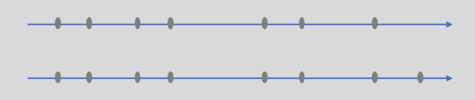


1. 将`A[0]~A[N-1]`排序，假设货仓建在`x`处，左侧有`P`家，右侧有`Q`家
2. 若`P < Q`，把货仓向右移动一个单位，右侧距离减少`Q`，左侧距离增加`P`，总距离减少`Q-P`
3. 若`P > Q`，把货仓向左移动一个单位，右侧距离增加`Q`，左侧距离减少`P`，总距离减少`P-Q`
4. 因此货仓应该建在**中位数**处，当`N`为**奇数**时，建在`A[N / 2]`处，当`N`为**偶数**时，建在`A[(N - 1) / 2]~A[N / 2]`之间任何一个位置都可以

```C++
# include <iostream>
# include <cstring>
# include <algorithm>
using namespace std;
int n, a[100005];
long long res;
int main(){
    cin >> n;
    for(int i = 0; i < n; i ++) cin >> a[i];
    sort(a, a + n);
    for(int i = 0; i < n; i ++) res += abs(a[i] -a[n / 2])
    cout << res;
    return 0;
}
```

https://www.luogu.com.cn/problem/CF1486B

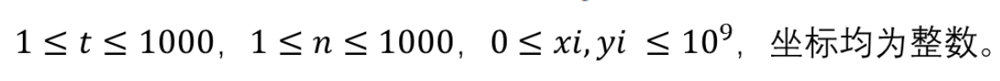

问题：二维平面上有`n`个点，要找一个点，使得所有点到它的曼哈顿距离（x和y坐标差距的和）之和最小，请问有几个满足该要求的点

思路：遇到二维问题看看能不能转化为一维问题，可以发现当改变`x`坐标时，`y`坐标的差距的和不变，因此可以分别求`x`轴和`y`轴最优点的数量，然后相乘即可。每个轴的最优的点数等于`a[n / 2] -  a[(n - 1) / 2] + 1`

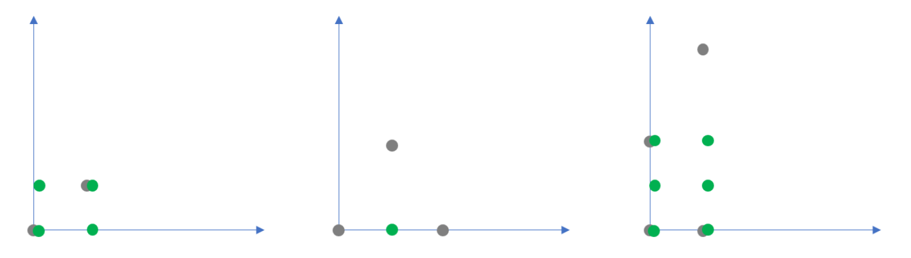


```C++
# include <iostream>
# include <cstring>
# include <algorithm>
using namespace std;
int t, n, a[1005], b[1005];
int main(){
    cin >> t;
    while(t --){
        cin >> n;
        for(int i = 0; i < n; i ++) cin >> a[i] >> b[i];
        sort(a, a + n);
        sort(b, b + n);
        
        int x = a[n / 2] - a[(n - 2) / 2] + 1;
        int y = b[n / 2] - b[(n - 2) / 2] + 1;
        cout << 1LL * x * y << endl;
    }
    return 0;
}
```


#### 堆排序--$O(nlogn)$

https://www.luogu.com.cn/problem/P3378


**堆：**是一棵完全二叉树

**小根堆：**父节点的值 **≤** 子节点的值

**大根堆：**父节点的值 **≥** 子节点的值


对节点编号使用 **左右孩子编号法**

1. 节点`i`的左孩子是`2i`
2. 节点`i`的右孩子是`2i+1`
3. 节点`i`的父节点是`i/2`

**堆**（完全二叉树）可以用**一维数组**存储，下标从**1**开始


1. **堆的插入：**先将元素从**堆尾插入**，然后**上浮**到合适的位置   `O(logn)`

   ```C++
   int a[1000005], cnt;
   
   void up(int u){ //上浮
       if(u / 2 && a[u] < a[u / 2])
           swap(a[u], a[u / 2]), up(u / 2);
   }
   void push(int x){ //压入
       a[++ cnt] = x;
       up(cnt);
   }
   ```

2. **堆的删除：**（删除最小的元素）先将**堆顶**的数和**堆尾**的数**交换**，**删除堆尾**，然后**下沉**操作 `O(logn)`

   ```C++
   int a[1000005], cnt;
   
   void down(int u){ //下沉
       int v = u;
       // 找出子节点中较小的那个数
       if (2 * u <= cnt && a[2 * u] < a[v]) v = 2 * u;
       if (2 * u + 1 <= cnt && a[2 * u + 1] < a[v]) v = 2 * u + 1;
       //存在父节点比子节点大
       if (v != u) swap(a[v], a[u]),down(v);
   }
   void pop(){ //删除
       a[1] = a[cnt --];
       down(1);
   }
   ```

3. **删除任意元素**

   ```C++
   //因为不知道删除之后新加入的元素是大还是小，于是上浮和下沉都要试一次只能执行一个
   a[k] = a[cnt --];
   down(k);
   up(k);
   ```

4. **修改任意元素**

   ```C++
   a[k] = x;
   down(k);
   up(k);
   ```


```C++
# include <iostream>
# include <cstring>
# include <algorithm>
using namespace std;
int a[1000005], t, cnt;
void up(int u){
    if(u / 2 && a[u] < a[u / 2])
        swap(a[u], a[u / 2]), up(u / 2);
}
void push(int x){
    a[++ cnt] = x;
    up(cnt);
}
void down(int u){
    int v = u;
    if(2 * u <= cnt && a[2 * u] < a[v]) v = 2 * u;
    if(2 * u + 1 <= cnt && a[2 * u + 1] < a[v]) v =2 * u + 1;
    if(v != u) swap(a[v], a[u]), down(v);
}
void pop(){
    a[1] = a[cnt --];
    down(1);
}
int main(){
    cin >> t;
    while(t --){
        int op; cin >> op;
        if (op == 1){
            int x; cin >> x;
            push(x);
        }
        else if(op == 2) cout << a[1] << endl;
        else pop();        
    }
    return 0;
}
```


https://www.luogu.com.cn/problem/P1177


```C++
# include <iostream>
# include <cstring>
# include <algorithm>
using namespace std;
int n, a[100005], cnt;
void up(int u){
    if(u / 2 && a[u] < a[u / 2]) 
        swap(a[u], a[u / 2]), up(u / 2);
}
void push(int x){
    a[++ cnt] = x;
    up(cnt);
}
void down(int u){
    int v = u;
    if(2 * u <= cnt && a[2 * u] < a[v]) v = 2 * u;
    if(2 * u + 1 <= cnt && a[2 * u + 1] < a[v]) v = 2 * u  + 1;
    if(v !=u) swap(a[u], a[v]), down(v);
}
void pop(){
    a[1] = a[cnt --];
    down(1);
}
int main(){
    cin >> n;
    int x;
    for(int i = 0; i < n; i ++) cin >> x, push(x); //建堆
    for(int i = 0; i < n; i ++) cout << a[1] << " ", pop(); //输出并删去堆顶
    return 0;
}
```

**STL代码**

```C++
# include <iostream>
# include <cstring>
# include <algorithm>
# include <queue>
using namespace std;
int n;
priority_queue <int, vector<int>, greater<int>> q;
int main(){
    cin >> n;
    int x;
    for(int i = 0; i < n; i ++) cin >> x, q.push(x); //建堆
    for(int i = 0; i < n; i ++) cout << q.top() << " ", q.pop(); //输出并删去堆顶
    return 0;
}
```

### 高精度

#### 高精度加法-$O(n)$

[P1601 A+B Problem（高精） - 洛谷 | 计算机科学教育新生态 (luogu.com.cn)](https://www.luogu.com.cn/problem/P1601)

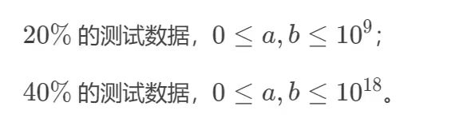

**核心思想：**输入字符串，用数组来模拟计算过程

```C++
void add(int a[], int b[]){
    for(int i = 0; i < lc; i ++){
        c[i] += a[i] + b[i];        //累加
        c[i + 1] += c[i] / 10;      //进位
        c[i] %= 10;                 //存余
    }
    if(c[lc]) lc ++;                //最高位有进位
}
```

**要正向输入字符串，反向存储数组**

**时间复杂度O(n)**

```C++
# include <iostream>
# include <cstring>
# include <algorithm>
using namespace std;
const int N = 500 + 5;
int a[N], b[N], c[N];
string sa, sb;
int la, lb, lc;
void add(int a[], int b[]){
    for(int i = 0; i < lc; i ++){
        c[i] += a[i] + b[i];        //累加
        c[i + 1] += c[i] / 10;      //进位
        c[i] %= 10;                 //存余
    }
    if(c[lc]) lc ++;                //最高位有进位
}
int main(){
    cin >> sa >> sb;
    la = sa.size();
    lb = sb.size();
    lc = max(la, lb);
    for(int i = 0; i < la; i ++) a[i] = sa[la - 1 - i] - '0';
    for(int i = 0; i < lb; i ++) b[i] = sb[lb - 1 - i] - '0';
    add(a, b);
    for(int i = lc - 1; i >= 0; i --) cout << c[i];
    return 0;
}
```

#### 高精度减法-$O(n)$

https://www.luogu.com.cn/problem/P2142

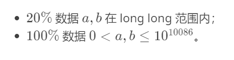

高精度实际上就是运用了**数组存储**和**模拟运算**

高精度减法的步骤：

1. 高精度数字用**字符串**读入
2. 把字符串**翻转**读入两个数组`a,b`
3. 若`a < b`，则交换`a,b`输出负号
4. 从低位到高位，**逐位求差、借位、存差**
5. 把数组`c`从高位到低位依次输出

```C++
const int N = 10086 + 5;
int a[N], b[N], c[N];
string sa, sb;
int la, lb, lc;

// 比较a和b谁大（a大于b吗）
bool cmp(int a[], int b[]){
    if(la != lb) return a > b;    		// 位数不同
    for(int i = la - 1; i >= 0; i --){  // 位数相同
        if(a[i] != b[i]) return a[i] > b[i];
    }
    return true;                        // 防止完全相同的时候返回-0
}
void sub(int a[], int b[]){
    for(int i = 0; i < lc; i ++){
        if(a[i] < b[i]){
            a[i + 1] --;     //借位
            a[i] += 10; 
        }
        c[i] = a[i] - b[i];  //存差
    }
    //此时lc指向了c中第一个不为0的数
    while(lc > 0 && c[lc] == 0) lc --;   //处理前导0 
}
```

**时间复杂度O(n)**

```C++
# include <iostream>
# include <cstring>
# include <algorithm>
using namespace std;
const int N = 10086 + 5;
int a[N], b[N], c[N];
int la, lb, lc;
string sa, sb;
bool cmp(int a[], int b[]){
    if(la != lb) return la > lb;            //位数不同
    for(int i = la - 1; i >= 0; i --){      //位数相同
        if(a[i] != b[i]) return a[i] > b[i];
    }
    return true;                            //大小相同，防止输出-0
}
void sub(int a[], int b[]){
    for(int i = 0; i < lc; i ++){
        if(a[i] < b[i]){
            a[i + 1] --;     //借位
            a[i] += 10; 
        }
        c[i] = a[i] - b[i];  //存差
    }
    //此时lc指向了c中第一个不为0的数
    while(lc > 0 && c[lc] == 0) lc --;   //处理前导0 
}
int main(){
    cin >> sa >> sb;
    la = sa.size(), lb = sb.size(), lc = max(la, lb);
    for(int i = 0; i < la; i ++) a[i] = sa[la - 1 - i] - '0';
    for(int i = 0; i < lb; i ++) b[i] = sb[lb - 1 - i] - '0';
    if(!cmp(a, b)) swap(a, b), cout <<"-";
    sub(a, b);
    for(int i = lc; i >= 0; i --) cout << c[i];
    return 0;
}
```


#### 高精度乘法-$O(n^2)$

https://www.luogu.com.cn/problem/P1303


高精度实际上就是运用了**数组存储**和**模拟运算**

高精度乘法的步骤：

1. 高精度数字用**字符串**读入
2. 把字符串**翻转**读入两个数组`a,b`
3. 从低位到高位，**累加乘积、进位、存余**
4. 把数组`c`从高位到低位依次输出

利用了一个小**性质**：


下标之和相同的处在`c`数组的同一个位置，可以先存起来，然后进行`累加、进位、存余`

**时间复杂度O(n^2)**

```C++
const int N = 2000 * 2 + 5;
int a[N], b[N], c[N];
int la, lb, lc;
string sa, sb;
void mul(int a[], int b[]){
    // 累加乘积
    for(int i = 0; i < la; i ++){
        for(int j = 0; j < lb; j ++){
            c[i + j] += a[i] * b[j];
        }
    }
    // 进位存余
    for(int i = 0; i < lc; i ++){
        c[i + 1] += c[i] / 10;
        c[i] %= 10;
    }
    // 处理前导0
    while(lc > 0 && c[lc] == 0) lc --;
}
```


```C++
# include <iostream>
# include <cstring>
# include <algorithm>
using namespace std;
const int N = 2000 * 2 + 5;
int a[N], b[N], c[N];
int la, lb, lc;
string sa, sb;
void mul(int a[], int b[]){
    for(int i = 0; i < la; i ++){
        for(int j = 0; j < lb; j ++){
            c[i + j] += a[i] * b[j];
        }
    }
    for(int i = 0; i < lc; i++){
        c[i + 1] += c[i] / 10;
        c[i] %= 10;
    }
    while(lc > 0 && c[lc] == 0) lc --;
}
int main(){
    cin >> sa >> sb;
    la = sa.size(), lb = sb.size(), lc = la + lb;
    for(int i = 0; i < la; i ++) a[i] = sa[la - 1 - i] - '0';
    for(int i = 0; i < lb; i ++) b[i] = sb[lb - 1 - i] - '0';
    mul(a, b);
    for(int i = lc; i >= 0; i --) cout << c[i];
    return 0;
}
```


#### 高精度除法--$O(n)$

https://www.luogu.com.cn/problem/P1480

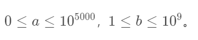

高精度实际上就是运用了**数组存储**和**模拟运算**

高精度除法的步骤：

1. 高精度数字用**字符串**读入
2. 把字符串**翻转**读入两个数组`a,b`
3. 从**高位到低位，当前被除数，存商，求余数**
4. 把数组`c`从高位到低位依次输出

**时间复杂度O(n)**

```C++
const int N = 5000 + 5;
int a[N], b, c[N];
string sa, sb;
int la, lc;
void div(int a[], int b){
    long long r = 0;
    for(int i = lc - 1; i >= 0; i --){
        r = 10 * r + a[i];  		   // 存当前被除数
       	c[i] = r / b;                  // 存商
        r = r % b;					   // 求余数
    }
    while(lc > 0 && c[lc] == 0) lc --; //处理前导0
}
```

```C++
# include <iostream>
# include <cstring>
# include <algorithm>
using namespace std;
const int N = 5000 + 5;
int a[N], b, c[N];
string sa;
int la, lc;
void div(int a[], int b){
    long long r = 0;
    for(int i = lc - 1; i >=0; i --){
        r = 10 * r + a[i];
        c[i] = r / b;
        r = r % b;
    }
    while(lc > 0 && c[lc] == 0) lc --;
}
int main(){
    cin >> sa >> b;
    la = lc = sa.size();
    for(int i = 0; i < la; i ++) a[i] = sa[la - 1  -i] - '0';
    div(a, b);
    for(int i = lc; i >= 0; i --) cout << c[i];
    return 0;
}
```

### 前缀和

#### 一维前缀和-$O(n)$

https://www.luogu.com.cn/problem/P8218

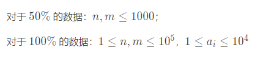

**前缀和构造：**

**时间复杂度O(n)**

**$s_i = s_{i-1} + a_i$**


**区间和查询：**

**时间复杂度O(1)**

**$s_{l-r}=s_r-s_{l-1}$**


```C++
# include <iostream>
# include <cstring>
# include <algorithm>
using namespace std;
const int N = 1e5 + 5;
int a[N], s[N];
int n, m;
int main(){
    cin >> n;
    // 边读入边构造
    for(int i = 1; i <= n; i ++) cin >> a[i], s[i] = s[i - 1] + a[i];
    cin >> m;
    while(m --){
        int l, r;
        cin >> l >> r;
        cout << s[r] - s[l - 1] << endl;
    }
    return 0;
}
```


#### 二维前缀和-$O(n^2)$

**前缀和构造：**

**$s_{i,j} = s_{i-1,j} + s_{i,j-1} - s_{i-1, j - 1} + a_{i,j}$**

**时间复杂度O(n^2)**

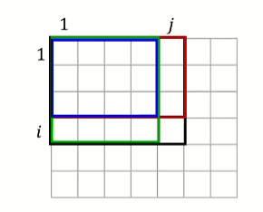

**求区间和：**

**$s_{x1,y1-x2,y2} = s_{x2,y2} - s_{x2, y1-1} - s_{x1 - 1, y2} + s_{x1 - 1, y1 - 1}$**

**时间复杂度O(1)**

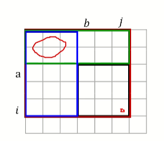


https://www.luogu.com.cn/problem/P2280

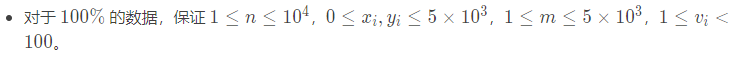

```C++
# include <iostream>
# include <cstring>
# include <algorithm>
using namespace std;
const int N = 5000 + 5;
int s[N][N];
int n, m;
int main(){
    cin >> n >> m;
    for(int i = 1; i <= n; i ++){
        int x, y, v;
        cin >> x >> y >> v;
        x ++, y ++;     //偏移一下从（1，1）开始
        s[x][y] += v;
    }
    // 预处理前缀和
    for(int i = 1; i <= 5001; i ++){
        for(int j = 1; j <= 5001; j ++){
            s[i][j] += s[i - 1][j] + s[i][j - 1] -s[i - 1][j - 1];
        }
    }
    int res = 0;
    for(int i = m; i <= 5001; i ++){
        for(int j = m; j <= 5001; j ++){
            res = max(res, s[i][j] - s[i - m][j] - s[i][j - m] + s[i - m][j - m]);
        }
    }
    cout << res;
    return 0;
}
```

https://www.luogu.com.cn/problem/P1387


```C++
# include <iostream>
# include <cstring>
# include <algorithm>
using namespace std;
const int N = 100 + 5;
int s[N][N];
int n, m, l;
int main(){
    cin >> n >> m;
    for(int i = 1; i <= n; i ++){
       for(int j = 1; j <= m; j ++){
           cin >> s[i][j];
            s[i][j] += s[i - 1][j] + s[i][j - 1] -s[i - 1][j - 1];
       }
    }
 
    int res = 0;
    int ans = 0;
    for(int l = 1; l <= min(n, m); l ++){
        for(int i = l; i <= n; i ++){
            for(int j = l; j <= m; j ++){
                res =s[i][j] - s[i - l][j] - s[i][j - l] + s[i - l][j - l];
                if(res == l * l) 
                    ans = l;
            }
        }
    }
    cout << ans;
    return 0;
}
```


#### 树上前缀和


### 差分

#### 一维差分--$O(n)$

对于一个给定的序列`a`，它的差分序列`b`定义为：

`b[1] = a[1]		b[i] = a[i] - a[i - 1], (2 ≤ i ≤ n)  `

`b`是`a`的差分序列，`a`是`b`的前缀和序列，前缀和与差分是一对**互逆运算**

`b[1] = a[1]`

`b[2] = a[2] - a[1]`

`b[3] = a[3] - a[2]`


`a[1] = b[1]`

`a[2] = b[1] + b[2]`

`a[3]  = b[1]  + b[2] + b[3]`，证毕


**差分思想：**

把序列`a`的区间`[l, r]`加`d`，等价于其差分序列`b`的点`b[l]`加`d`，点`b[r + 1]`减`d`，其他位置不变。

```C++
b[l] += d;
b[r + 1] -= d;
```

即把原序列的“**区间操作**”转换为差分序列的“**两点操作**”。多次区间操作完成后，再利用前缀和**还原**。

时间复杂度从O(n ^ 2) 降为O(n)。

https://www.luogu.com.cn/problem/P4552

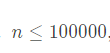

让序列`a1 a2 ... an`进行区间加减操作使它们相等，我们可以想象到，相等之后他们的差分序列 `b1 = x , b2 = b3 =...= bn = 0`

 

先求出`a`的差分序列`b`

`b[1] = a[1], b[i] = a[i] - a[i - 1], b[n + 1] = 0`

把对`a`的区间操作，转化为对`b`的两点操作。

即每次可以选出`b1, b2, ... , bn, bn+1`中的任意两个数，一个数 + 1， 一个数 - 1

目标是**把 b2, b3, ... , bn全变为0**，最终得到的序列`a`就是由`n`个`b1'`组成


选出`b1, b2, ... , bn, bn+1`中的任意两个数，一个数 + 1， 一个数 - 1，操作可分为4类：

1. 选出$b_i和b_j$，$2 ≤ i, j ≤ n$，应该让正负匹配相消，让$b_i和b_j$靠近0 （贪心思想）
2. 选出$b_1和b_j$，$2 ≤ j ≤ n$，让$b_j$靠近0 
3. 选出$b_i和b_{n+1}$，$2 ≤ j ≤ n$，让$b_i$靠近0 
4. 选出$b_1和b_{n+1}$，没有意义，因为不能改变

设$b_2, b_3 , ... , b_n$正数总和为$p$，负数总和的绝对值为$q$

1. 首先以正负配对方式执行操作1，执行的次数为$min(p, q)$
2. 剩余$abs(p - q)$个未配对，每个可以选择与$b_1$或者$b_{n + 1}$配对，执行操作2或者3，执行的次数为$abs(p - q)$
3. 根据$abs(p - q)$的第2、3类的操作情况，能产生$abs(p - q) + 1$种不同的$b_1$值，假设最后剩下的全是正数，最小就是$b_1$，最大就是$b_1 + abs(p - q)$，种类数$1 + abs(p - q)$


#### 二维差分--$O(n^2)$

对于一个给定的序列`a[i][j]`，它的差分序列`b[i][j]`定义为：

`b[1][1] = a[1][1]		b[i][j] = a[i][j] - a[i - 1][j] - a[i][j - 1] + a[i - 1][j - 1], (2 ≤ i ≤ n)  `

`b`是`a`的差分序列，`a`是`b`的前缀和序列，前缀和与差分是一对**互逆运算**

**差分思想：**

把序列`a[i][j]`的区间`(x1, y1) 到 (x2, y2)`加`c`

```C++
b[x1][y1] += c;
b[x1][y2 + 1] -= c;
b[x2 + 1][y1] -= c;
b[x2 + 1][y2 + 1] += c;
```

即把原序列的“**区间操作**”转换为差分序列的“**两点操作**”。多次区间操作完成后，再利用前缀和**还原**。

时间复杂度从O(mn ^ 2) 降为O(n^2)。


https://www.luogu.com.cn/problem/P3397


```C++
# include <iostream>
# include <cstring>
# include <algorithm>
using namespace std;
const int N = 1000 + 5;
int a[N][N], b[N][N];
int n, m;
int main(){
    cin >> n >> m;
    while(m --){
        int x1, y1, x2, y2;
        cin >> x1 >> y1 >> x2 >> y2;
        b[x1][y1] += 1;
        b[x1][y2 + 1] -= 1;
        b[x2 + 1][y1] -= 1;
        b[x2 + 1][y2 + 1] += 1;
    }
    for(int i = 1; i <= n; i ++){
        for(int j = 1; j <= n; j ++){
            a[i][j] = a[i - 1][j] + a[i][j - 1] - a[i - 1][j - 1] + b[i][j];
            cout << a[i][j] << " "; 
        }
        cout << endl;
    }
    return 0;
}
```


#### 树上差分

### 双指针

**双指针**(又称尺取法)是一个常用的优化技巧，常用来解决序列的区间问题

两个指针`i,j`有两种扫描方向：

1. 反向扫描：`i,j`方向相反，`i`从头到尾，`j`从尾到头，在中间相会
2. 同向扫描：`i,j`方向相同，都是从头到尾，可以让`j`跑在`i`的前面

同向扫描的指针称为快慢指针，快慢指针在序列上可以产生一个大小可变的滑动窗口，具有灵活的应用

#### 连续自然数的和

https://www.luogu.com.cn/problem/P1147


对一个给定的正整数 `M`，求出所有的连续的正整数段（每一段至少有两个数），这些连续的自然数段中的全部数之和为 `M`。

**思路**：把自然数看成一个升序的序列，`i`指针指向序列的左端，`j`指针指向序列的右端，`sum`维护这段数的和

- 如果`sum < m`，那么`j ++; sum += j`
- 如果`sum >= m`，那么` sum -= i; i ++`

注意`sum == m`时要输出结果，这里的`i < m /2 `因为题目说每一段最多有两个数，当`i = m / 2, i <= j `此时为结束条件

```C++
# include <iostream>
# include <cstring>
# include <algorithm>
using namespace std;
int m;
int main(){
    cin >> m;
    int i = 1, j = 1, sum = 1;
    while(i <= m / 2){
        if(sum < m) j ++, sum += j;
		else if(sum >= m){
			if(sum == m) cout << i << " " << j << endl;
			sum -= i, i ++;
		}  
    }
    return 0;
}
```

#### A-B数对

https://www.luogu.com.cn/problem/P1102


**思路：**

先把数列升序排列

- `k`指针枚举每个数
- `i`指针指向满足`a[i] - a[k] = c`的一段数的左端
- `j`指针指向满足`a[i] - a[k] = c`的一段数的右端+1
- `ans += j - i `

```C++
# include <iostream>
# include <cstring>
# include <algorithm>
using namespace std;
typedef long long LL;
const int N = 2e5 + 10;
int a[N];
int n, c;
LL ans;
int main(){
    cin >> n >> c;
    for(int i = 1; i <= n; i ++) cin >> a[i];
    sort(a + 1, a + 1 + n);
    // i, j指针不会回头，一直走下去
    int i = 1, j = 1;
    for(int k = 1; k <= n; k ++){
        while(i <= n && a[i] - a[k] < c)  i ++;  //直至刚好a[i] - a[k] = c
        while(j <= n && a[j] - a[k] <= c) j ++;  //直至a[j] - a[k] > c
        ans += j - i;
    }
    cout << ans;
    return 0;
}
```


### 二分

#### 二分查找-$O(logn)$

**最大化查找--可行区在左侧**


​	

```c++
int find(int x){// a[1~n]
    int l = 0, r = n + 1; // 开区间
    while(l + 1 < r){// l + 1 = r时结束
        int mid = l + r >> 1;
        if(a[mid] <= x) l = mid;
        else r = mid;
    }
    return l;
}
```

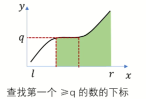

**最小化查找--可行区在右侧**

```C++
int find(int x){// a[1~n]
    int l = 0, r = n + 1; // 开区间
    while(l + 1 < r){// l + 1 = r时结束
        int mid = l + r >> 1;
        if(a[mid] >= x) r = mid;
        else l = mid;
    }
    return r;
}
```


1. 指针跳跃的次数为$logn$
2. $l + 1 = r$时循环结束
3. 可行区的指针最后一定指向答案
4. 开区间可以正确处理边界


#### 二分答案-$O(logn)$

**最大化答案（求$x_{max}$）**

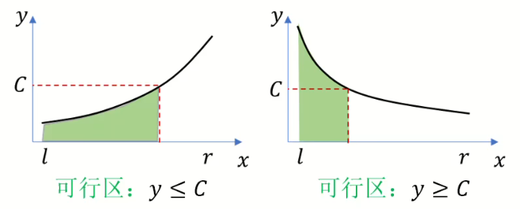

x在可行区 $\rarr$ check为真  $\rarr$ l右移

```C++
bool  check(int x){
    .....           // 计算y
    return y <= C;  // x小y小（单调增）
    return y >= C;  // x小y大（单调减）
}
int find(){
    int l = 下界 - 1, r = 上界 + 1;
    while(l + 1 < r){
        int mid = l + r >> 1;
        if(check(mid)) l = mid; //最大化
        else r = mid;           
    }
    return l;
}
```

**最小化答案（求$x_{min}$）**

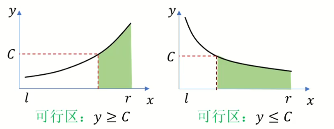

```C++
bool  check(int x){
    .....           // 计算y
    return y >= C;  // x大y大（单调增）
    return y <= C;  // x大y小（单调减）
}
int find(){
    int l = 下界 - 1, r = 上界 + 1;
    while(l + 1 < r){
        int mid = l + r >> 1;
        if(check(mid)) r = mid; // 最小化
        else l = mid;           
    }
    return r;
}
```


1. 如何计算y

   模拟过程 y：计数型、求和型、是否型

2. 如何确定板子

   画图象

### 贪心

#### 合并果子-$O(nlogn)$

有`n`堆果子，需要合成一堆。每次把两堆果子合并到一起，消耗的体力等于两堆果子的数量之和。所有的果子经过`n-1`次合并之后，就只剩下-堆。求合并果子总共消耗的体力的最小值。

**思路**

每次贪心的合并最小的两堆，每次消耗的体力是最小的，最终得到最优解

用小根堆维护最小值，小根堆的插入和删除是`O(logn)`的，一共执行`n - 1`次，时间复杂度为`O(nlogn)`

```C++
# include <iostream>
# include <cstring>
# include <algorithm>
# include <vector>
# include <queue>
using namespace std;
priority_queue<int, vector<int>, greater<int>> q; //小根堆
int n, ans;
int main(){
    cin >> n;
    for(int i = 0; i < n; i ++){
        int x; 
        cin >> x;
        q.push(x);
    }
    while(q.size() > 1){
        int a = q.top(); q.pop();
        int b = q.top(); q.pop();
        ans += a + b;
        q.push(a + b);
    }
    cout << ans;
    return 0;
}
```

#### 奶牛玩杂技-$O(nlogn)$

https://www.luogu.com.cn/problem/P1842

贪心：奶牛越重，力量越大放在下面越好

证明：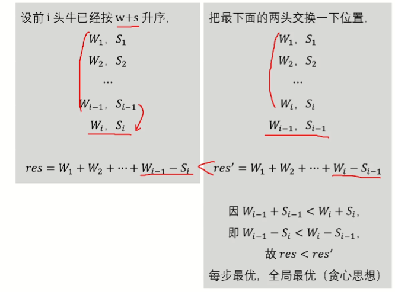

```C++
# include <iostream>
# include <cstring>
# include <algorithm>
using namespace std;
const int N = 5e4 + 10;
struct node{
    int s, w;
    bool operator< (node &t){
        return w + s < t.w + t.s;
    }
}a[N];
int n;
int main(){
    cin >> n;
    for(int i = 1; i <= n; i ++) cin >> a[i].w >> a[i].s;
    sort(a + 1, a + 1 + n);
    int res = -2e9, t = 0;
    for(int i = 1; i <= n; i ++){
        t += a[i - 1].w;
        res = max(res, t - a[i].s);
    }
    cout << res;
}
```

#### 排队接水-$O(nlogn)$

贪心：让接水时间短的排在前面，接水时间长的排在后面

证明：

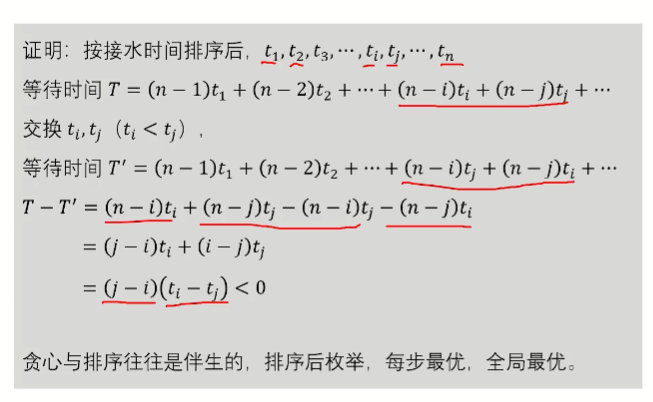

```C++
# include <iostream>
# include <cstring>
# include <algorithm>
using namespace std;
const int N = 1000 + 10;
struct node{
    int t, id;
    bool operator< (node &b){
        return t < b.t;
    }
}a[N];
int n;
int main(){
    cin >> n;
    for(int i = 1; i <= n; i ++){
        cin >> a[i].t;
        a[i].id = i;
    }
    sort(a + 1, a + 1 + n);
    for(int i = 1; i <= n; i ++) cout << a[i].id << " ";
    cout << endl;
    double ans = 0;
    for(int i = 1; i <= n; i ++) ans += (n - i) * a[i].t;
    printf("%.2f", ans / n);
}
```


#### 排队接水-$O(nm) O(nlogm)$

https://www.luogu.com.cn/problem/P1190

贪心：枚举接水量，枚举每个水龙头，找到当前出水量最小的那个，把接水量加上去，继续枚举下一个人的接水量

这样一个水龙头下最大出水量就是时间

```C++
# include <iostream>
# include <cstring>
# include <algorithm>
using namespace std;
const int N = 1e4 + 10, M = 100 + 10;
int w[N]; // w:每个人的接水量
int s[M]; // s:每个水龙头的出水量
int n, m;
int main(){
    cin >> n >> m;
    for(int i = 1; i <= n; i ++) cin >> w[i];
    
    for(int i = 1; i <= n; i ++){ // 枚举每个人
        int t = 1;//找到出水量最小的水龙头
        for(int j = 2; j <= m; j ++){
            if(s[j] < s[t]) t = j;
        }
        s[t] += w[i];
    }
    int ans = 0;
    for(int i = 1; i <= m; i ++) ans = max(ans, s[i]);
    cout << ans;
    return 0;
}
```

**用小根堆维护当前出水量最小的水龙头**

```C++
# include <iostream>
# include <cstring>
# include <algorithm>
# include <queue>
using namespace std;
const int N = 1e4 + 10, M = 100 + 10;
int w[N]; // w:每个人的接水量
priority_queue <int, vector<int>, greater<int> > q; //小根堆 每个水龙头的出水量
int n, m;
int main(){
    cin >> n >> m;
    for(int i = 1; i <= n; i ++) cin >> w[i];
    for(int i = 1; i <= m; i ++) q.push(0);
    
    for(int i = 1; i <= n; i ++){ // 枚举每个人
        int t = q.top();
        q.pop();
        q.push(t + w[i]);
    }
    for(int i = 1; i < m; i ++) q.pop();
    cout << q.top();
    return 0;
}
```

#### 修理牛棚-$O(nlogn)$

https://www.luogu.com.cn/problem/P1209

贪心：

对于牛所占的牛棚编号排序

如果木板数≥牛数，给每个牛一个木板

如果木板数≤牛数，每次去掉最小的空档，把两块木板合成一块木板（贪心思想）去掉c - m个空档即可

```C++
# include <iostream>
# include <cstring>
# include <algorithm>
using namespace std;
const int N = 200 + 10;
int m, s, c, ans; // 木板数、牛棚总数、牛数
int a[N]; //牛所在的牛棚的编号
int d[N]; //相邻牛之间的牛棚数
int main(){
    cin >> m >> s >> c;
    for(int i = 1; i <= c; i ++) cin >> a[i];
    
    sort(a + 1, a + 1 + c);
    for(int i = 2; i <= c; i ++) d[i - 1] = a[i] - a[i - 1] - 1;
    sort(d + 1, d + c);
    
    ans += c; //先给每个牛加上一个板子
    if(m < c){//木板数小于牛数
        for(int i = 1; i <= c - m; i ++) ans += d[i]; //取间隔最小的加上,加c - m次
    }
    cout << ans << endl;
    return 0;
}
```

#### 奶牛晒衣服-$O(nlogn)$

https://www.luogu.com.cn/problem/P1843

贪心：

最少时间取决于最后一件被弄干的衣服的时间

每次找出剩余的湿度最大的衣服，用烘干机烘干（贪心思想）

用大根堆维护衣服的剩余湿度

```C++
# include <iostream>
# include <cstring>
# include <algorithm>
# include <queue>
using namespace std;
priority_queue <int, vector <int>, less<int> > q; //维护剩余衣服的湿度
int n, a, b;
int tim, mx;
int main(){
    cin >> n >> a >> b;
    int x;
    for(int i = 1; i <= n; i ++){
        cin >> x;
        q.push(x);
    }
    // 每次找出湿度最大的衣服，使用烘干机
    // 这里不考虑自然风干对衣服湿度的减小
    mx = q.top(); q.pop();
    while(mx > tim * a){ //如果当前堆顶要等于 tim * a说明到这能自然风干
        tim ++;       // 时间多1s
        mx -= b;      // 使用烘干机烘干
        q.push(mx);   // 再次压入堆中
        mx = q.top(); //再取堆顶 
        q.pop();
    }
    cout << tim;
    return 0;
}
```

#### 均分纸牌-$O(n)$

https://www.luogu.com.cn/problem/P1031

贪心：

先计算出平均数

然后贪心的取，一次调整好一堆

先摆平第一堆，向第二堆多退少补

再摆平第二堆，向第三堆多退少补

...

如果第i堆已经摆平，则跳过

```C++
# include <iostream>
# include <cstring>
# include <algorithm>
# include <queue>
using namespace std;
const int N = 100 + 10;
int n, avg, cnt;
int a[N];
int main(){
    cin >> n;
    for(int i = 0; i < n; i ++){
        cin >> a[i];
        avg += a[i];
    }
    avg /= n;
    for(int i = 0; i < n; i ++){
        if(a[i] - avg != 0){
            a[i + 1] += a[i] - avg; // 下一堆多退少补
            cnt ++;
        }
    }
    cout << cnt;
    return 0;
}
```

#### 糖果传递-$O(nlogn)$

`n`个小朋友坐成一圈，每人有`a[i]`个糖果，每个人只能给左右两人传递糖果，每次传递一个糖果的代价为`1`，求所有人均分糖果的最小代价

思路：

环形区间问题，首先想到破环成链，朴素的做法是直接枚举`n`个断点的位置，然后从每个断点做均分指纸牌，时间为`O(n^2)`TLE

`a[i]`:表示第`i`个小朋友有的糖果数量

`b`:表示所有小朋友糖果的平均数

`xi`:表示第`i`个小朋友向左传糖果的数量，正数表示给，负数表示拿

$$\begin{aligned}a_1,a_2,&\cdots,a_{n-1},a_n\\x_1,x_2,&\cdots,x_{n-1},x_n\end{aligned}$$

目标：最小化$$|x_{1}|+|x_{2}|+\cdots+|x_{n}|$$

经过给和拿之后：

$$\begin{aligned}
&a_{1}-x_{1}+x_{2}=b \\
&a_2-x_2+x_3=b \\
&.. \\
&a_{n-1}-x_{n-1}+x_n=b \\
&a_{n}-x_{n}+x_{1}=b
\end{aligned}$$

观察这个方程，左右两边相加是一个恒等式，**说明只有n - 1个方程是独立的**

用x1表示其他的x：

$$\begin{aligned}
&{\boldsymbol{x}_2} =x_1+b-a_1  \\
&{\boldsymbol{x}_{3}} =x_2+b-a_2  \\
&=x_1+b-a_1+b-a_2 \\
&{\boldsymbol{x}_{4}} =x_3+b-a_3  \\
&=x_1+b-a_1+b-a_2+b-a_3
\end{aligned}$$

所以：

$$\begin{aligned}x_i&=x_1+\sum_{j=1}^{i-1}(b-a_j)\\&=x_1-c_i,\end{aligned}$$


$$\text{令 }c_i=\sum_{j=1}^{i-1}(a_j-b),2\leq i\leq n$$


$$\begin{aligned}
&c_1 =0  \\
&c_2 =a_1-b  \\
&c_3 =a_1-b+a_2-b  \\
&=c_2+a_2-b \\
&··· \\
&c_{i} =c_{i-1}+a_{i-1}-b 
\end{aligned}$$


$$\begin{aligned}ans&=|x_1|+|x_2|+\cdots+|x_n|\\&=|x_1-0|+|x_1-c_2|+\cdots+|x_1-c_n|\end{aligned}$$

数轴上选取点，然后取中位数时，有最小值


```C++
# include <iostream>
# include <cstring>
# include <algorithm>
using namespace std;
const int N = 1e6 + 10;
int a[N], c[N];
long long n, b, ans;
int main(){
    cin >> n;
    for(int i = 1; i <= n; i ++){
        cin >> a[i];
        b += a[i];
    } 
    b /= n;
    // 预处理c[i]
    for(int i = 2; i <= n; i ++) c[i] = c[i - 1] + a[i - 1] - b;
    // 选取中位数
    c[1] = 0;
    sort(c + 1, c + 1 + n);
    for(int i = 1; i <= n; i ++){
        ans += abs(c[i] - c[(1 + n) / 2]);
    }
    cout << ans;
    return 0;
}
```


#### 区间问题

##### 区间选点

##### 最大不相交区间数量

##### 区间分组

##### 区间覆盖

https://www.luogu.com.cn/problem/P1803

贪心：

n个区间通常看作n个线段。

目标就是找出不重叠的线段的最大条数。

**结束越早的段**，就应该越被优先考虑。

先对所有的线段按照右端点排序，然后枚举每一个线段

如果**当前线段的左端点**≥**上一个线段的右端点**，则可选，更新答案，更新右端点

```C++
# include <iostream>
# include <cstring>
# include <algorithm>
using namespace std;
const int N = 1e6 + 10;
struct line{
    int l, r;
    bool operator< (line &t){
        return r < t.r;
    }
}a[N];
int n, cnt, last;
int main(){
    cin >> n;
    for(int i = 1; i <= n; i ++) cin >> a[i].l >> a[i].r;
    
    sort(a + 1, a + 1 + n);
    for(int i = 1; i <= n; i ++){
        if(a[i].l >= last){ // 当前区间左端点大于上一个区间右端点
            cnt ++;         // 更新答案
            last = a[i].r;  // 更新右端点
        }
    }
    cout << cnt;
    return 0;
}
```


## 搜索

### 深搜(DFS)-$O(n + m) \  O(a^n)$

1. **深搜的过程**

   从根进入，向下走，走到底，向上走

   即绕树兜圈子，最后从根退出

2. **深搜的实现**

   深搜是通过**系统栈**实现的

   递归调用的过程，系统自动通过栈去维护函数的**状态空间**

   **系统栈**记录函数的**返回地址、局部变量、参数传递**

   向下走，压栈；向上走，弹栈。

```C++
vector <int> e[N];
void dfs(int u, int fa){
    // cout << "入:" << u << endl; // 1
    for(auto v : e[u]){
        if(v == fa) continue; // 防止重复递归，又回到了父亲节点
        // cout << "下:" << u << endl; // 2 （向单个儿子传递父亲的信息）
        dfs(v, u);
        // cout << “回” << u << endl; // 3 (传递单个儿子相关信息)
    }
    // cout << "离" << u << endl; // 4
}
int main(){
    cin >> n >> m;
    for(int i = 1; i <= m; i ++){
        cin >> a >> b;
        e[a].push_back(b);
        e[b].push_back(a);
    }
    dfs(1, 0);
    return 0;
}
```


3. **深搜的计算**

   触碰节点的时机：

   **1入 2下 3回 4离**

   多次触碰同一个节点的**状态空间**

   **自顶向下：**父算子（1， 2）

   **自底向上：**子算父（3，4）

   

4. **二叉树触碰点的时机**

   **先，中，后**

```C++
void dfs(int u){
    // cout << "先序：" << endl; // 入
    dfs(2 * u);
    // cout << “中序：” << endl; // 回（从左子树回）
    dfs(2 * u + 1);
    // cout << "后序：" << endl; // 离（从右子树回）
}
```

   

5. **一条链触碰点的时机**

   **入，离**

```C++
void dfs(int u){
    // cout << "入:" << u << endl; //走儿子之前计算
    dfs(next[u]);
    // cout << "离：" << u << endl; //从儿子回来的时候计算（并查集）
}
```


6. **对图会生成DFS树**


```C++
// DFS树
int n, m, a, b;
bool vis[N]; // 判重数组
vector <int> e[N];
void dfs(int u){
    vis[u] = true;
    for(auto v : e[u]){
        if(vis[v]) continue;
        // cout << u << "->" << v << endl; // 下
        dfs(v);
    }
}
int main(){
    cin >> n >> m;
    for(int i = 1; i <= m; i ++){
        cin >> a >> b;
        e[a].push_back(b);
        e[b].push_back(a);
    }
    dfs(1);
    return 0;
}
```


### 宽搜(BFS)-$O(n + m)$

1. **宽搜的过程**

   从根开始，向下**逐层扩展**，逐层访问

2. **宽搜的实现**

   宽搜是通过**队列**实现的，用**queue**创建一个队列。

   宽搜的过程，通过队列来维护序列的状态空间

   入队就排队等待，出队**就扩展儿子们入队**

   `e[x] `存`x`的邻点，`vis[x]`标记`x`是否曾经入过队列，用来充当判重数组

   `q`存入队点的序列


```C++
vector <int> e[N];
bool vis[N];
queue <int> q;
void bfs(){
    q.push(1);
    vis[1] = true;
    while(q.size()){
        int x = q.front();
        q.pop();
        // cout << x << "出队" << endl;
        for(auto y : e[x]){
            if(vis[y]) continue; // 已经入过队的不用再入队
            q.push(y);
            vis[y] = true;
            // cout << y << "入队" << endl;
        }
    }
}
```

3. **宽搜的计算**

   **出队后、入队前、结束后**

4. **宽搜的性质**

   队列中的元素，关于层次满足**两段性和单调性**

5. 对图宽搜会生成BFS树

```C++
vector <int> e[N];
bool vis[N];
queue <int> q;
void bfs(){
    q.push(1);
    vis[1] = true;
    while(q.size()){
        int x = q.front();
        q.pop();
        for(auto y : e[x]){
            if(vis[y]) continue; // 已经入过队的不用再入队
            q.push(y);
            vis[y] = true;
            // cout << x << "->" << y << endl;
        }
    }
}
```


## 图论

### 图的存储

#### 邻接矩阵

**二维数组**`w[u][v]`存储从点`u`到点`v`的边权

**时间复杂度**：O($n^2$)  每个点都要被访问`n`次

**空间复杂度**：O($n^2$)

**应用**：点数不多的**稠密图**上（例 $n=10^3, m = 10^6$ ）


**输出**：

1	2	20

2	3	50

3	2	30   // 此时`vis[2] = true`

2	4	60   // 回溯到`dfs(2)`

1	4	40	// 回溯到`dfs(1)`  此时`vis[4] = true`

```C++
int w[N][N]; //边权
int vis[N];  //判重数组

void dfs(int u){ //节点编号
    vis[u] = true;
    for(int v = 1; v <= n; v ++){     // 遍历u的相邻节点
        if(w[u][v]){
            if(vis[v]) continue;	
            cout << u << " " << v << " " << w[u][v] << endl;  
            dfs(v);
        }
    }
}
int main(){
    cin >> n >> m;
    for(int i = 1; i <= m; i ++){
        int a, b, c;
        cin >> a >> b >> c;
        w[a][b] = c;
        // w[b][a] = c;
    }
    dfs(1);
    return 0;
}
```

#### 边集数组

**边集数组**`e[i]`存储第`i`条边的{起点`u`，终点`v`，边权`w`}

**时间复杂度**：O(nm)  每个节点要找`m`次的边

**空间复杂度**：O(m)

**应用**：在Kruskal算法中，需要按照边权排序，直接存边


**输入**：43 14 57 56 15 52

**输出**：

1	4	30

4	3	90

1	5	20

5	7	80

5	6	60

5	2	70


```C++
struct edge{
	int u, v, w;
}e[M]; //边集
int vis[N]; //判重数组

void dfs(int u){
    vis[u] = true;
    for(int i = 1; i <= m; i ++){ // 遍历边的编号
        if(e[i].u == u) { //找到当前以节点编号u为起点的那条边了
        	int v = e[i].v, w = e[i].w;
            if(vis[v]) continue;
            cout << u << " " << v << " " << w << endl;
            dfs(v);
        }
    }
}
int main(){
    cin >> n >> m;
    for(int i = 1; i <= m; i ++){
        int a, b, c;
        cin >> a >> b >> c;
        e[i] = {a, b, c};
        // e[i] = {b, a, c};
    }
    dfs(1);
    return 0;
}
```

#### 邻接表

**出边数组**`e[u][i]`存储`u`点的所有出边的{终点`v`和边权`w`}

**时间复杂度**：O(n + m)  对于一个节点，我们只枚举了跟他相邻的节点构成的边，而不像前面盲目的把m条边都试一遍

**空间复杂度**：O(n + m)

**应用**：各种图，**不能处理反向边**


**输入**：43 14 57 56 15 52

**输出**：

1	4	30

4	3	90

1	5	20

5	7	80

5	6	60

5	2	70

```C++
struct edge{
    int v, w;
}
vector<edge> e[M]; //边集
void dfs(int u, int fa){
    for(auto ed : e[u]){ // 遍历u的每个出边
        int v = ed.v, w = ed. w;
        if(fa == v) continue;
        cout << u << " " << v << " " << w << endl;
        dfs(v, u);
    }
}
int main(){
    cin >> n >> m;
    for(int i = 1; i <= m; i ++){
        int a, b, c;
        cin >> a >> b >> c;
        e[a].push_back({b, c});
        e[b].push_back({a, c});
    }
    dfs(1, 0); //节点编号以及父节点编号（这里的父节点记录的是从哪个点过来的，当然也可以用vis数组来实现）
    return 0;
}
```

#### 链式邻接表

**边集数组**：`e[i]`存储第`j`条边的{起点`u`，终点`v`，边权`w`}

**表头数组**：`h[u][i]`存储`u`点的所有出边的编号

**时间复杂度**：O(n + m)

**空间复杂度**：O(n + m)

**应用**：各种图，能处理反向边


**输出：**

1	4	30

4	3	90

1	5	20

5	6	60

5	2	70

```C++
struct edge{int u, v, w};
vector<edge> e;    //边集
vector<int> h[N];  //点的所有出边的编号
void add(int a, int b, int c){
    e.push_back({a, b, c});
    h[a].push_back(e.size() - 1);
}
void dfs(int u, int fa){
    for(int i = 0; i < h[u].size(); i ++){
        int j = h[u][i]; // 取出当前u节点的一条出边的编号
        int v = e[j].v, w = e[j].w;
        if(v == fa) continue;
        cout << u << " " << v << " " << w << endl;
        dfs(v, u);
    }
}
int main(){
    cin >> n >> m;
    for(int i = 1; i <= m; i ++){
        int a, b ,c;
        cin >> a >> b >> c;
        add(a, b, c);
        add(b, a, c);
    }
    dfs(1, 0);
    return 0;
}
```

#### 链式前向星

一个表头数组悬挂多个链表

**边集数组**：`e[i]`存储第`i`条边的{终点`v`，边权`w`，下一条边`ne`}

**表头数组**：`h[u]`存储`u`点的第一条出边的编号

**边的编号**：`idx`可取`0,1,...,n`

**时间复杂度**：O(n + m)

**空间复杂度**：O(n + m)

**应用**：各种图，能处理反向边


**输出**：

1	5	20

5	2	70

5	6	60

1	4	30

4	3	90

```C++
struct edge{int v, w, ne};
vector<edge> e;
int idx, h[N]; //点的第一条出边的编号
void add(int a, int b, int c){
	e[idx] = {b, c, h[a]};
    h[a] = idx ++;  // 头插法
}
void dfs(int u, int fa){
    for(int i = h[u]; i!= -1; i = e[i].ne){
        int v = e[i].v, w = e[i].w;
        if(v == fa) continue;
        cout << u << " " << v << " " << w << endl;
        dfs(v, u);
    }
}
int main(){
    cin >> n >> m;
    // 初始化所有点指向 -1
    memset(h, -1, sizeof h);
    for(int i = 1; i <= m; i ++){
        int a, b, c;
        cin >> a >> b >> c;
        add(a, b, c);
        add(b, a, c);
    }
    dfs(1, 0);
    return 0;
}
```

**另一种写法yxc**

```C++
int h[N]; 		//h[u]表示与u相连接的一条邻边的编号
int e[2 * N]; 	//当前边的终点
int ne[2 * N];  //下一条邻边的编号
int w[2 * N];  	//边权
void add(int a, int b, int c){
    e[idx] = b;
    ne[idx] = h[a];
    h[a] = idx ++;
}
```

### 最短路

#### 单源最短路

##### Dijkstra-$O(mlogm)$

Dijkstra算法是基于**贪心思想**的**单源最短路**算法

**集合：**已经确定好最短路的节点组成的集合

1. 初始时，所有的点都不在集合中，`st[i] = false`，`d[s] = 0`，`d[其他点] = +∞`
2. 迭代`n`次，每次选出**不在当前集合中且离源点最近的点**，将该点放入集合`st[t] = true`
3. 用该点进行**松弛操作**，更新与它相邻的点的距离

https://www.luogu.com.cn/problem/P3371

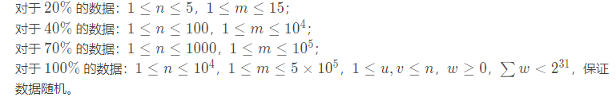

**朴素版Dijkstra**

**邻接矩阵**的写法空间复杂度过高，有部分样例AC不了

```C++
# include <iostream>
# include <cstring>
# include <algorithm>
using namespace std;
const int N = 1e3 + 5;
int n, m, s, g[N][N], dist[N];
bool st[N];
void Dijkstra(int s){
    memset(dist, 0x3f, sizeof dist);
    dist[s] = 0;
    for(int i = 1; i <= n; i ++){
         // 找到不在当前集合中且离源点最近的点
        int t = 0; 
        for(int j = 1; j <= n; j ++){
            if(!st[j] && dist[j] < dist[t])
                t = j;
        }
        // 将该点加入集合
        st[t] = true; 
        // 用新加入的点去更新所有点到源点的距离
        for(int j = 1; j <= n; j ++){
            dist[j] = min(dist[j], dist[t] + g[t][j]);
        }
    }
}
int main(){
    cin >> n >> m >> s;
    memset(g, 0x3f, sizeof g);
    while(m --){
        int a, b, c;
        cin >> a >> b >> c;
        g[a][b] = min(g[a][b], c);
    }
    Dijkstra(s);
    for(int i = 1; i <= n; i ++){
        if(dist[i] == 0x3f3f3f3f) cout << (1 << 31) - 1 << " ";
        else cout << dist[i] << " ";
    }
    return 0;
}
```

**邻接表**写法

```C++
# include <iostream>
# include <cstring>
# include <algorithm>
# include <vector>
using namespace std;
const int N = 1e4 + 5;
struct edge{               //终点边权
    int v, w;
    
};     
vector<edge> e[N];         //e[i][j]记录节点i的所有出边和边权
int n, m, s, dist[N];
bool st[N];
void Dijkstra(int s){
    memset(dist, 0x3f, sizeof dist);
    dist[s] = 0;
    for(int i = 1; i <= n; i ++){
        // 寻找不在集合中且离源点最近的点
        int t = 0;
        for(int j = 1; j <=n; j ++){
            if(!st[j] && dist[j] < dist[t])
                t = j;
        }
        // 将该点加入到集合中
        st[t] = true;
        // 枚举该点的邻边，松弛操作
        for(auto ed : e[t]){
            int v = ed.v, w = ed. w;
            dist[v] = min(dist[v], dist[t] + w);
        } 
    }
}
int main(){
    cin >> n >> m >> s;
    while(m --){
        int a, b, c;
        cin >> a >> b >> c;
        e[a].push_back({b, c});
    }
    Dijkstra(s);
    for(int i = 1; i <= n; i ++){
        if(dist[i] == 0x3f3f3f3f) cout << (1 << 31) - 1 << " ";
        else cout << dist[i] << " ";
    }
    return 0;
}
```

**堆优化版Dijkstra**

https://www.luogu.com.cn/problem/P4779

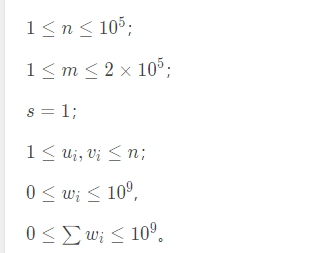

我们发现每次都需要找到不在当前`s`集合中且离源点最近的点，然后用这个点去更新它的邻边节点到源点的距离

因此，我们可以将已经更新过的点（即有`dist[i]`数值的点的**编号及其距离**放入小根堆中，每次取堆顶元素即是最小距离的点）

```c++
# include <iostream>
# include <cstring>
# include <algorithm>
# include <vector>
# include <queue>
using namespace std;
const int N = 1e5 + 5;
int n, m, s;
// 邻接表
struct edge{
    int v, w;
};
vector<edge> e[N];
int dist[N];
bool st[N];  //标记是否在s集合中
priority_queue<pair<int, int>> q; // 大根堆记录距离
void Dijkstra(int s){
    memset(dist, 0x3f, sizeof dist);
    dist[s] = 0;
    q.push({dist[s], s});
    while(q.size()){
        //取出不在集合中且离源点最近的点
        auto t = q.top();
        q.pop();
        
        // 取出当前队头节点编号
        int u = t.second;
        
        if(st[u]) continue;  //再出队跳过
        st[u] = true;
        
        // 枚举所有出边节点，更新距离并且入队
        for(auto ed : e[u]){
            int v = ed.v, w = ed.w;
            if(dist[u] + w < dist[v]){
                dist[v] = dist[u] + w;
                q.push({-dist[v], v});
            }
        }
    }
}
int main(){
    cin >> n >> m >> s;
    while(m --){
        int a, b, c;
        cin >> a >> b >> c;
        e[a].push_back({b, c});
    }
    Dijkstra(s);
    
    for(int i = 1; i <= n; i ++){
        if(dist[i] == 0x3f3f3f3f) cout << (1 << 31) - 1 << " ";
        else cout << dist[i] << " ";
    }
    return 0;
}
```

##### Bellman-Ford-$O(nm)$

https://www.luogu.com.cn/problem/P3385


**邻接表写法**

```C++
# include <iostream>
# include <cstring>
# include <algorithm>
# include <vector>
using namespace std; 
const int N = 2e3 + 5;
int dist[N], n, m, T; //点数 边数 源点
//int dist[N], n, m, k; //点数 边数 边数限制
struct edge{
  int v, w;  
};
vector<edge>e[N];     //邻接表
bool BellmanFord(int s){
    memset(dist, 0x3f, sizeof dist);
    dist[s] = 0;  //初始化源点的距离为0
    bool flag;    //表示每一轮是否进行了松弛操作
    for(int i = 1; i <= n; i ++){//循环n轮  （对于有边数限制的最短路，即最多走过k条边的最短路，就 i <= k 就可以）
        flag = false;
        for(int u = 1; u <= n; u ++ ){// 枚举所有点的所有出边
            if(dist[u]==0x3f3f3f3f) continue; //说明这条边的距离还没有更新，直接跳过就行
            for(auto ed : e[u]){   // 取出该点的所有出边
                int v = ed.v, w = ed.w;
                if(dist[u] + w < dist[v]){
                    dist[v] = dist[u] + w;
                    flag = true;    //说明当前轮进行了松弛操作
                }
            }
        }
        if(!flag) break; //如果当前轮，没有进行过松弛操作，即flag没有更新为true，就说明已经全部找到最短路了
    }
    return flag;  //如果第n轮结束时，仍然flag为true，说明到了第n论还进行了松弛操作，说明存在负环
}
int main(){
    cin >> T;
    while(T --){
        // 清空vector
        for(int i = 0; i < N; i ++) e[i].clear();
        cin >> n >> m;
        while(m --){
            int a, b, c;
            cin >> a >> b >> c;
            e[a].push_back({b, c});
            if(c >= 0) e[b].push_back({a, c});
        }
        if(BellmanFord(1)) cout << "YES" << endl;
        else cout << "NO" << endl;
    }
    return 0;
}
```

**链式前向星写法**

```C++
# include <iostream>
# include <cstring>
# include <algorithm>
using namespace std; 
const int N = 2010, M = 6010;
int dist[N], n, m, T; //点数 边数 源点
//int dist[N], n, m, k; //点数 边数 边数限制
int h[N], e[M], ne[M], w[M], idx;
void add(int a, int b, int c){
    e[idx] = b;
    ne[idx] = h[a];
    w[idx] = c;
    h[a] = idx ++;
}
bool BellmanFord(int s){
    idx = 0;
    memset(dist, 0x3f, sizeof dist);
    dist[s] = 0;  //初始化源点的距离为0
    bool flag;    //表示每一轮是否进行了松弛操作
    for(int i = 1; i <= n; i ++){//循环n轮  （对于有边数限制的最短路，即最多走过k条边的最短路，就 i <= k 就可以）
        flag = false;
        for(int u = 1; u <= n; u ++ ){// 枚举所有点的所有出边
            if(dist[u]==0x3f3f3f3f) continue; //说明这条边的距离还没有更新，直接跳过就行
            for(int j = h[u]; j != -1; j = ne[j]){ //取出该点的所有出边
                int v = e[j];
                if(dist[u] + w[j] < dist[v]){
                    dist[v] = dist[u] + w[j];
                    flag = true;
                }
            }
        }
        if(!flag) break; //如果当前轮，没有进行过松弛操作，即flag没有更新为true，就说明已经全部找到最短路了
    }
    return flag;  //如果第n轮结束时，仍然flag为true，说明到了第n论还进行了松弛操作，说明存在负环
}
int main(){
    cin >> T;
    while(T --){
        idx = 0; //因为要测试多组数据，要每次把原先的所有变量清空
        memset(h, -1, sizeof h);
        cin >> n >> m;
        while(m --){
            int a, b, c;
            cin >> a >> b >> c;
            add(a, b, c);
            if(c >= 0) add(b, a, c);
        }
        if(BellmanFord(1)) cout << "YES" << endl;
        else cout << "NO" << endl;
    }
    return 0;
}
```

**Bellman-Ford**算法是基于**松弛操作**的单源最短路算法

`e[u][j]`存`u`点的出边的邻点和边权，`dist[u]`存`u`点到源点的距离

1. 初始化，`d[s] = 0, d[其他点]=+∞`
2. 执行多轮循环。每轮循环，对**所有边**都尝试进行一次松弛操作
3. 当一轮循环中没有成功的松弛操作时，算法停止


```C++ 
i = 1
    u = 1
    u = 2
    u = 3 d[1] = 6 d[2] = 1
    u = 4
i = 2
    u = 1 d[4] = 9
    u = 2 d[1] = 2 d[4] = 6
    u = 3 
    u = 4 
i = 3
    u = 1 d[4] = 5
    u = 2
    u = 3
    u = 4
i = 4
    u = 1
    u = 2
    u = 3
    u = 4
    flag = false
```

**Bellman-Ford求有边数限制的最短路**

[853. 有边数限制的最短路 - AcWing题库](https://www.acwing.com/problem/content/855/)

```C++
# include <iostream>
# include <cstring>
# include <algorithm>
# include <vector>
using namespace std; 
const int N = 500;
int dist[N], n, m, s; //点数 边数 源点
//int dist[N], n, m, k; //点数 边数 边数限制
struct edge{
  int v, w;  
};
vector<edge>e[N];     //邻接表
bool BellmanFord(int s){
    memset(dist, 0x3f, sizeof dist);
    dist[s] = 0;  //初始化源点的距离为0
    bool flag;    //表示每一轮是否进行了松弛操作
    for(int i = 1; i <= n; i ++){//循环n轮  （对于有边数限制的最短路，即最多走过k条边的最短路，就 i <= k 就可以）
        flag = false; 
        for(int u = 1; u <= n; u ++ ){// 枚举所有点的所有出边
            if(dist[u]==0x3f3f3f3f) continue; //说明这条边的距离还没有更新，直接跳过就行
            for(auto ed : e[u]){   // 取出该点的所有出边
                int v = ed.v, w = ed.w;
                if(dist[u] + w < dist[v]){
                    dist[v] = dist[u] + w;
                    flag = true;    //说明当前轮进行了松弛操作
                }
            }
        }
        if(!flag) break; //如果当前轮，没有进行过松弛操作，即flag没有更新为true，就说明已经全部找到最短路了
    }
    return flag;  //如果第n轮结束时，仍然flag为true，说明到了第n论还进行了松弛操作，说明存在负环
}
int main(){
    cin >> n >> m >> s;
    while(m --){
        int a, b, c;
        cin >> a >> b >> c;
        e[a].push_back({b, c});
    }
    BellmanFord(s);
    for(int i = 1; i <=n; i ++){
        if(dist[i] > 0x3f3f3f/2) cout << (1 << 31) - 1 << " ";
        else cout << dist[i] << " ";
    }
    return 0;
}
```

**时间复杂度分析:**

每轮循环是`O(m)`的,因为枚举了所有的边，如果最短路存在，一轮松弛操作会使得确定的最短路的边数至少加1，而最短路的边数最多为`n-1`，因此最多执行`n-1`轮松弛操作，因此时间复杂度是`O(nm)`

如果第`n`轮循环时仍然存在能松弛的边，说明从`s`点出发，能抵达一个负环。算法能够判负环


##### Spfa--$O(km,nm)$

Bellman-Ford算法的优化

只有本轮被更新的点，其**出边终点**才有可能引起下一轮的松弛操作，因此用**队列**来维护被更新的**出边终点**的集合。

`vis[u]`标记`u`点是否在队内，`cnt[v]`记录边数，判负环

1. 初始化，`s`入队，标记`s`在队内，`d[s] = 0 d[其他点] =  +∞`
2. 从**队头**弹出`u`点，标记`u`不在队内
3. 枚举`u`的所有出边，进行松弛操作。记录`s`到`v`走过的边数，并判负环。如果`v`不在队内则把`v`压入队尾，并打上标记
4. 重复步骤2，3，直到队内为空


```C++
# include <iostream>
# include <cstring>
# include <algorithm>
# include <vector>
# include <queue>
using namespace std;
const int N = 2e3 + 5; 
struct edge{
    int v, w;
};
vector <edge> e[N];
int n, m, d[N];
int cnt[N];    //记录边数，判负环
bool vis[N];   //标记是否在队列中
queue <int> q; //记录被更新的点的出边的终点
bool Spfa(int s){
    memset(d, 0x3f, sizeof d);
    d[s] = 0; q.push(s); vis[s] = true;
    while(q.size()){
        // 取出队头
        int u = q.front(); q.pop(); vis[u] = false;
        // 遍历u的所有邻边
        for(auto ed : e[u]){
            int v =ed.v, w = ed.w;
            if(d[v] > d[u] + w){
                d[v] = d[u] + w;
                cnt[v] = cnt[u] + 1; //更新当前节点走过的边数
                if(cnt[v] > n) return true; //说明存在负环
                // v点被更新且不在队内，那么v就有资格再次入队去更新它的邻点
                if(!vis[v]) q.push(v), vis[v] = true;
            }
        }
    }
    return false;
}
int main(){
    int T;
    cin >> T;
    while(T --){
        // 清空一下vector cnt vis 
        for(int i = 0 ; i < N; i ++){
            e[i].clear();
            cnt[i] = 0;
            vis[i] = false;
        }
        cin >> n >> m;
        while(m --){
            int a, b, c;
            cin >> a >> b >> c;
            e[a].push_back({b, c});
            if(c >= 0) e[b].push_back({a, c});
        }
        if(Spfa(1)) cout << "YES" << endl;
        else cout << "NO" << endl;
    }
    return 0;
}
```

**打印路径**

开`pre[v] = u`数组记录前驱节点，`dfs`打印路径

```c++
void dfs_path(int u){
    if(u == 1) cout << u << " ", return;
    dfs_path(pre[u]);
    cout << u << " ";
}
```

==总结==


暴力Dijkstra

```C++
struct edge{ int v, w; };
vector <edge> e[N];
int d[N];
bool vis[N];
//int pre[N];

void dijkstra(int s){
    memset(d, 0x3f, sizeof d);
    d[s] = 0;
    for(int i = 1; i <= n; i ++){// 枚举次数
        int u = 0;
        for(int j = 1; j <= n; j ++){// 枚举点
            if(!vis[j] && d[j] < d[u]) 
                u = j;
        }
        
        vis[u] = true;// 标记u在当前集合中
        
        for(auto ed : e[u]){// 枚举邻边
            int v = ed.v , w = ed.w;
            if(d[v] > d[u] + w){
                d[v] = d[u] + w;
                //pre[v] = u;// 记录前驱节点
            }
        }
    }
}
```

堆优化Dijkstra

```C++
struct edge{ int v, w; };
vector <edge> e[N];
int d[N];
bool vis[N];
priority_queue< pair<int, int> > q;
// int pre[N];

void dijkstra(int s){
    memset(d, 0x3f, sizeof d);
    d[s] = 0;
    q.push({-0, s});
    while(q.size()){
        auto t = q.top(); q.pop();
        int u = t.second;
        if(vis[u]) continue;// 再出队，跳过
        
        vis[u] = true;// 在当前集合中
        
        for(auto ed : e[u]){
            int v = ed.v, w = ed.w;
            if(d[v] > d[u] + w){
                d[v] = d[u] + w;
                //pre[v] = u; // 记录前驱节点
                q.push({-d[v], v});// 大根堆
            }
        }
    }
}
```

Bellman-ford

```C++
struct edge{ int v, w; };
vector <edge> e[N];
int d[N]];
// int pre[N];

void bellmanford(int s){
	memset(d, 0x3f, sizeof d);
	d[s] = 0;
    bool flag; //记录当前迭代轮次是否进行过松弛操作
    for(int i = 1; i <= n; i ++){// n轮
        flag = false;
        for(int u = 1; u <= n; u ++){// n点
            if(d[u] == 0x3f3f3f3f) continue;
            for(auto ed : e[u]){ // u的出边
                int v = ed.v, w = ed.w;
                if(d[v] > d[u] + w){
                    d[v] = d[u] + w;
                    flag = true;
                    //pre[v] = u;
                }
            }
        }
    	if(!flag) break; //没有可以进行松弛操作的了，说明迭代结束了
    }
	return flag; //第n轮flag=true说明有环 
}
```

Spfa

```C++
struct edge{ int v, w; };
vector <edge> e[N];
int d[N], cnt[N];
bool vis[N];
//int pre[N];
queue<int> q;

bool spfa(int s){
    memset(d, 0x3f, sizeof d);
    d[s] = 0; q.push(s); vis[s] = true;
    while(q.size()){
        // 取出队头
        int u = q.front(); q.pop(); vis[u] = false;
        // 遍历u的所有邻边
        for(auto ed : e[u]){
            int v =ed.v, w = ed.w;
            if(d[v] > d[u] + w){
                d[v] = d[u] + w;
                // pre[v] = u;
                cnt[v] = cnt[u] + 1; //更新当前节点走过的边数
                if(cnt[v] > n) return true; //说明存在负环
                // v点被更新且不在队内，那么v就有资格再次入队去更新它的邻点
                if(!vis[v]) q.push(v), vis[v] = true;
            }
        }
    }
    return false;
}
```

#### 全源最短路

##### Floyd--$O(n^3)$

https://www.luogu.com.cn/problem/B3647


Floyd(弗洛伊德)算法是**动态规划**算法，也称为插点法。是**全源**最短路算法

**状态表示**

`d[k, i, j]`表示从`i`到`j`，且中间只经过节点编号为`1~k`的最短路径的长度

**状态计算**

路径的选择分为**两类**

1. 路径不经过`k`点，继承原值：`d[k, i, j] = d[k - 1, i, j]`
2. 路径经过`k`点，松弛操作：`d[k, i, j] = d[k - 1, i, k] + d[k - 1, k, j]`

**说明**

1. 计算第`k`层的`d[i, j]`时，必须先将`k - 1`层的所有状态计算出来，所以需要把**k放在最外层**

2. 状态可以理解为，第`k - 1`层的二维表向第`k`层的二维表的**投射**

3. 两类状态都是调用的上一层，因此用滚动数组就可以优化掉

**初始化**

1. `i≠j`，无边`d[i][j] = ∞`，有边`d[i][j] = w`
2. `i=j`，`d[i][j] = 0`

**时间复杂度O(n^3）**

```C++
void floyd()
{
    for(int k = 1; k <= n; k ++){
        for(int i = 1; i <= n; i ++){
            for(int j = 1; j <=  n; j ++)
                d[i][j] = min(d[i][j], d[i][k] + d[k][j]);
        }
    }
}
```

```C++
# include <iostream>
# include <cstring>
# include <algorithm>
using namespace std;
const int N = 210;
int n, m;
int d[N][N];
void floyd(){
    for(int k = 1; k <= n; k ++){
        for(int i = 1; i <= n; i ++){
            for(int j = 1; j <= n; j ++){
                d[i][j] = min(d[i][j], d[i][k] + d[k][j]);
            }
        }
    }
}
int main(){
    cin >> n >> m;
    
    memset(d, 0x3f, sizeof d);
    for(int i = 1; i <= n; i ++) d[i][i] = 0;
    
    while(m --){
        int a, b, c;
        cin >> a >> b >> c;
        d[a][b] = min(d[a][b], c); //重边
        d[b][a] = min(d[b][a], c); //无向图
    }
    
    floyd();
    
    for(int i = 1; i <= n; i ++){
        for(int j = 1; j <= n; j ++){
            cout << d[i][j] << " ";
        }
        cout << endl;
    }
    return 0;
}
```

**路径的记录与递归输出**


```C++
int d[N][N], p[N][N]; //记录i, j之间的插点是几
void floyd(){
    for(int k = 1; k <= n; k ++){
        for(int i = 1;  i <= n; i ++){
            for(int j = 1; j <= n; j ++){
                if(d[i][j] > d[i][k] + d[k][j]){
                    d[i][j] = d[i][k] + d[k][j];
                    p[i][j] = k; //记录插点
                }
            }
        }
    }
}
void path(int i, int j){
    if(p[i][j] == 0) return;
    int k = p[i][j];
    path(i, k);
    cout << k << " ";
    path(k, j);
}

floyd();
cout << a << " ";
path(a, b);
cout << b << " ";
```


##### Johnson

**全源最短路算法**

1. FLoyd，时间复杂度为`O(n^3)`
2. 跑`n`次Bellman-ford算法，时间复杂度为`O(n^2m)`
3. 跑`n`次Heap-dijkstra算法，时间复杂度为`O(nmlogm)`

第三种算法被Johnson做了改造，可以求解带**负权边的全源最短路**

**算法**

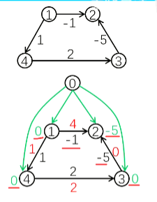

1. 新建一个**虚拟源点0**，从该点向其他所有点连一条边权为0的边，再利用**spfa算法**求出从0号点到其他所有点的最短路`h[i]`
2. 将新图的边权**改造**为`w[u][v] + h[u] - h[v] = w新` ,这样能够确保边权非负
3. 以每个点为起点，跑`n`轮**Heap-dijkstra**,求出任意两点间的最短路

### 最小生成树

#### Kruskal-$O(mlogm)$

https://www.luogu.com.cn/problem/P3366

**Kruskal（克鲁斯卡尔）算法**利用**并查集**求最小生成树（MST）

`e[i]`存第`i`条边的起点、终点、边权

`fa[x]`存`x`点的父节点

1. 初始化并查集，把`n`个点放在`n`个独立的集合
2. 将所有边按边权**从小到大**排序(贪心思想)
3. 按顺序枚举每条边，如果这条边连接的两个点不在同一个集合，就把这条边加入最小生成树，并且**合并**这两个集合；如果这条边连接的两个点在同一个集合，就**跳过**，因为不能成环
4. 重复执行3，直到选取了`n - 1`条边为止

```C++
struct edge{
    int u, v, w;
    bool operator< (const edge &t)const{
        return this->w < t.w;
    }
}e[M];
int fa[N], ans, cnt;
int find(int x){
    if(x == fa[x]) return x;
    return fa[x] = find(fa[x]);
}
bool kruskal(){
    for(int i = 1; i <= n; i ++) fa[i] = i; // 初始化
    sort(e, e + m); // 排序
    for(int i = 0; i < m; i ++){
        int x = find(e[i].u);
        int y = find(e[i].v);
        if(x != y){ //考虑合并
            fa[x] = y;
            ans += e[i].w; // 将权重加上
            cnt ++;  // 边数++
        }
    }
    return cnt == n - 1;
}
```

`kruskal`适合稀疏图，且算法的瓶颈在于排序函数

```C++
# include <iostream>
# include <cstring>
# include <algorithm>
using namespace std;
const int N = 5000 + 10, M = 2e5 + 10;
int n, m;
int fa[N], ans, cnt;
struct edge{
    int u, v, w;
    bool  operator< (const edge &t)const{
        return this->w < t.w;
    }
}e[M];
int find(int x){
    if(x == fa[x]) return x;
    return fa[x] = find(fa[x]);
}
bool kruskal(){
    for(int i = 1; i <= n; i ++) fa[i] = i;
    sort(e, e + m);
    for(int i = 0; i < m; i ++){
        int x = find(e[i].u);
        int y = find(e[i].v);
        if(x != y){
            fa[x] = y;
            ans += e[i].w;
            cnt ++;
        }
    }
    return cnt == n - 1;
}
int main(){
    cin >> n >> m;
    int a, b, c;
    for(int i = 0; i < m; i ++){
        cin >> a >> b >> c;
        e[i] = {a, b, c};
    }
    if(kruskal()) cout << ans;
    else cout << "orz";
    return 0;
}
```


#### Prim-$O(n^2)\ O(mlogm)$

**Prim（普里姆）算法**是基于**贪心思想**最小生成树（MST）算法

`e[u]`存`u`点的所有邻边的终点和边权

`d[u]`存`u`点与**圈外邻点**的最小距离

`vis[u]`标记`u`点是否在圈

算法流程类似于Dijkstra，不断选取**不在圈内且距离圈最小的点**，直到所有点都加入了圈

1. 初始化，所有点都不在圈内，`vis = 0 d[s] = 0 d[其他点] = + ∞`
2. 每次选取**不在当前集合中且离圈最近的点**`u`，打标记加入集合
3. 对`u`的所有邻点的距离执行**更新操作**
4. 重复2，3步操作，直到没有点能加入集合中

**朴素版Prim**

```C++
struct edge{ int v, w;};
vector <edge> e[N];
int d[N];
bool vis[N];
bool prim(int s){
    memset(d, 0x3f, sizeof d); //初始化所有点到圈的距离为无穷
    d[s] = 0;
    for(int i = 1; i <= n; i ++){ //迭代n次可以将所有点放入集合中
        int u = 0;
        for(int j = 1; j <= n; j ++){
            if(!vis[j] && d[j] < d[u]) u = j;
        }
        // 标记u加入集合中
       	vis[u] = true;
        ans += d[u];
        // 假如有两个不连通的区域，一个区域更新完了，另一个区域要从d[u] = 0x3f3f3f3f开始
        // 此时上面的判断条件应该改为 d[u] <= d[j], 这样可以保证再更新另一个区域
        // 但是cnt不能++
        
        // 要是不改，后面所有点永远到不了左端区域，cnt不会更新，最后也会输出不能组成最小生成树
        if(d[u] != 0x3f3f3f3f) cnt ++;
        //用u取更新其他点到集合的距离
        for(auto ed : e[u]){
            int v = ed.v, w = ed.w;
            if(d[v] > w) d[v] = w;
        }
    }
    return cnt == n;
}
```


```C++
# include <iostream>
# include <cstring>
# include <algorithm>
# include <vector>
using namespace std;
const int N = 5000 + 10;
int n, m;
struct edge{int v, w;};
vector <edge> e[N];
int d[N], ans, cnt;
bool vis[N];
bool prim(int s){
    memset(d, 0x3f, sizeof d);
    d[s] = 0;
    for(int i = 1; i <= n; i ++){
        int u = 0;
        for(int j = 1; j <= n; j ++){
            if(!vis[j] && d[j] <= d[u]) u = j;
        }
        vis[u] = true;
        ans += d[u];
        if(d[u] != 0x3f3f3f3f) cnt ++;
        
        for(auto ed : e[u]){
            int v = ed.v, w = ed.w;
            if(d[v] > w) d[v] = w;
        }
    }
    return cnt == n;
}
int main(){
    cin >> n >> m;
    int u, v, w;
    for(int i = 0; i < m; i ++){
        cin >>u >> v >> w;
        e[u].push_back({v, w});
        e[v].push_back({u, w});
    }
    if(prim(1)) cout << ans;
    else cout << "orz";
    return 0;
}
```

**堆优化prim**

同一个点的距离被更新多次，因为先前插入的元素不能被删除，也不能被修改，只能留在优先队列中，故优先队列中的元素个数是`O(m)`的，push与pop操作是`O(logm)`的，所以时间复杂度是`O(mlogm)`

```C++
struct edge{int v, w;};
vector <edge> e[N];
int d[N], ans, cnt;
bool vis[N];
priority_queue< pair <int, int> > q;
bool prim(int s){
    memset(d, 0x3f, sizeof d);
    d[s] =  - 0;
    q.push({d[s], s});
    while(q.size()){
        auto t = q.top();
        q.pop();
        int u = t.second;
        
        if(vis[u]) continue; // 再出队跳过
        vis[u] = true;
        ans += d[u];
        cnt ++;
        
        //更新
        for(auto ed : e[u]){
            int  v =  ed.v, w = ed.w;
            if(d[v] > w){
                d[v] = w;
                q.push({-d[v], v}); //大根堆
            }
        }
    }
    return cnt == n;
}
```


```C++
# include <iostream>
# include <cstring>
# include <algorithm>
# include <vector>
# include <queue>
using namespace std;
const int N = 5000 + 10;
int n, m;
struct edge{int v, w;};
vector <edge> e[N];
int d[N], ans, cnt;
bool vis[N];
priority_queue< pair <int, int> > q;
bool prim(int s){
    memset(d, 0x3f, sizeof d);
    d[s] =  - 0;
    q.push({d[s], s});
    while(q.size()){
        auto t = q.top();
        q.pop();
        int u = t.second;
        
        if(vis[u]) continue; // 再出队跳过
        vis[u] = true;
        ans += d[u];
        cnt ++;
        
        //更新
        for(auto ed : e[u]){
            int  v =  ed.v, w = ed.w;
            if(d[v] > w){
                d[v] = w;
                q.push({-d[v], v}); //大根堆
            }
        }
    }
    return cnt == n;
}
int main(){
    cin >> n >> m;
    int u, v, w;
    for(int i = 0; i < m; i ++){
        cin >>u >> v >> w;
        e[u].push_back({v, w});
        e[v].push_back({u, w});
    }
    if(prim(1)) cout << ans;
    else cout << "orz";
    return 0;
}
```


## 数据结构

### 并查集-$O(1)$

https://www.luogu.com.cn/problem/P3367

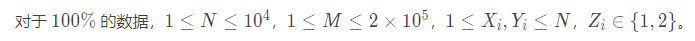

**并查集**是一种**树形**的数据结构

支持两种操作：

**合并：**将两个子集合并成一个集合

**查找：**确定某个元素处在哪个集合

`fa[x]`存节点`x`的父节点


例如：`fa[1] = 1，fa[2] =1,  fa[3] = 1, fa[4] = 3,  fa[5] = 3, fa[6] = 4`

**`fa[]`初始化：**

每个节点是一个集合，每个节点的父节点是它自己

`for(int i = 1; i <= n; i ++) fa[i] = i;`


**查找**

根节点是集合的代表，查找元素就是找到元素**所在的集合的根**

1. 如果父节点等于自己，则找到了根并返回
2. 如果还没有找到根，则继续递归查找

```C++
int find(x){
    if(fa[x] == x) return x;
    return find(fa[x]);
}
```


例如：`find(6)`

进入6 进入4  进入3

进入1 return1

进入3 return1

进入4 return1

进入6 return1


**带路径压缩的查找**

按上面的查找，时间比较慢，因此在**返回的路上**，顺带把**当前节点的父节点修改为根节点（返回值）**，这样下次再查找时只需查找一次就找到根了

```C++
int find(x){
    if(fa[x] == x) return x;
    return fa[x] = find(fa[x]);
}
```

例如：`find(6)`

进入6 进入4  进入3

进入1 return1 

进入3 return1 fa[3] = 1

进入4 return1 fa[4] = 1

进入6 return1 fa[6] = 1


**合并**

把**一个集合的根**指向**另一个集合的根**

在合并的时候实际上也执行了路径压缩

```C++
void unionset(int x, int y){
    fa[find(x)] = find(y);  //让x的根指向y的根
}
```

**按秩合并**

把**小集合的根**指向**大集合的根**

现实下，写朴素的合并因为有路径压缩的加持，时间复杂度够低了，不需要写按秩合并

```C++
vector<int>siz(N, 1);// 记录并初始化子树的根为1
void unionset(int x, int y){
    x = find(x), y = find(y);
    if(x == y) return; //在同一个集合中，无需合并
    if(siz[x] > siz[y]) swap(x, y); // x是小集合的根 y是大集合的根
    fa[x] = y;
    siz[y] += siz[x];
}
```


```C++
# include <iostream>
# include <cstring>
# include <algorithm>
using namespace std;
const int N = 1e4 + 10;
int fa[N];
int find(int x){
    if(x == fa[x]) return x;
    return fa[x] = find(fa[x]);
}
void unionset(int x, int y){
    fa[find(x)] = find(y);
}
int main(){
    int n, m, z, x, y; 
    cin >> n >> m;
    // 初始化
    for(int i = 1; i <= n; i ++) fa[i] = i;
    while(m --){
        cin >> z >> x >> y;
        if(z == 1) unionset(x, y);
        else{
            if(find(x) == find(y)) cout << "Y" << endl;
            else cout << "N" << endl;
        }
    }
    return 0;
}
```

### 线段树-$O(logn)$

**线段树**是基于分治思想的二叉树，用来维护区间信息（区间和、区间最值、区间GCD等），可以在`logn`的时间内执行**区间修改和区间查询**

线段树中每个**叶子节点**存储元素本身，**非叶子节点**存储**区间**内元素的统计值


1. 节点数组`tr[]`

   结构体包含三个变量：`l, r, sum`

   `l, r`存储区间的左右端点，`sum`存区间和

2. 递归建树

   父亲节点的编号为`p`

   左孩子的编号为`2 * p`，右孩子的编号为`2 * p + 1`

   

```C++
# define lc p << 1
# define rc p << 1 | 1
# define N  500005
int n, w[N]; // w是原数组
struct node{
    int l, r, sum;
}tr[N * 4];
// build(1, 1, 10)
void build(int p, int l, int r){
    tr[p] = {l, r, w[l]};  //从根节点开始的时候，这个w[l]是没有意义的，只有从叶子回溯更新的时候才有意义
    if( l == r) return; //是叶子返回
    int m = l + r >> 1; //不是叶子裂开
    bulid(lc, l, m);    //递归建左右儿子
    bulid(rc, m + 1, r);
    tr[p].sum = tr[lc].sum + tr[rc].sum;
}
```

**线段树为什么开`4n`的存储空间**

1. 如果$n = 2^m$，$m$为常数，则最底层有$n$个叶子节点，上面一共有$n - 1$个，一共有$2n-1$个
2. 但是如果出现分叉，按最坏情况考虑，$n$个节点下都分叉，还得加上$2n$，所以一共是$4n$


3. **单点修改**

   例如：对`x = 7`的位置加`5`

   从根节点进入，**递归**找到叶子节点`[x, x]`，把改节点的值增加`k`。然后从下网上更新其祖先节点的统计值

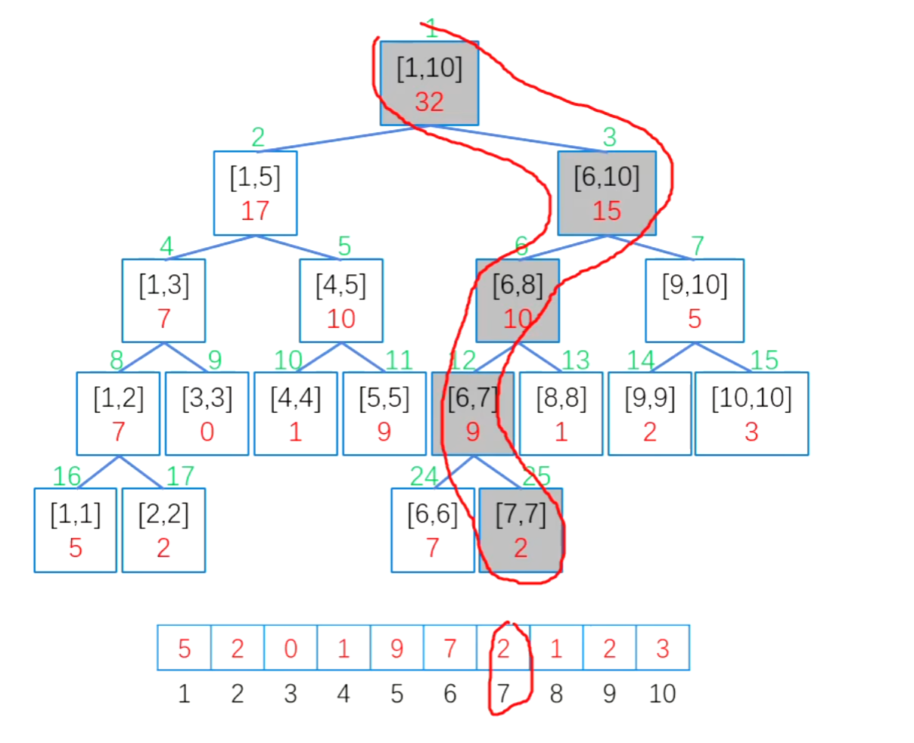

```C++
// 单点修改
void update(int p, int x, int k){
	if(tr[p].l == x && tr[p].r == x){ //叶子则修改
        tr[p].sum += k;
        return;
    }
    int m = tr[p].l + tr[p].r >> 1; // 非叶子则裂开
    if(x <= m) update(lc, x, k);
    if(x > m) update(rc, x, k);
    tr[p].sum = tr[lc].sum + tr[rc].sum; //回溯累加
}
```


4. **区间查询**

   **拆分与拼凑**思想。例如，查询区间`[4, 9]`可以拆分成`[4, 5], [6, 8], [9, 9]`，通过合并着三个区间的答案可以得到查询答案

   从根节点进入，**递归**执行下面过程

   - 若查询区间`[x, y]`**完全覆盖**当前节点区间，则立即回溯，并返回该节点的`sum`
   - 若左子节点与`[x, y]`有重叠，则递归访问左子树
   - 若右子节点与`[x, y]`有重叠，则递归访问右子树

   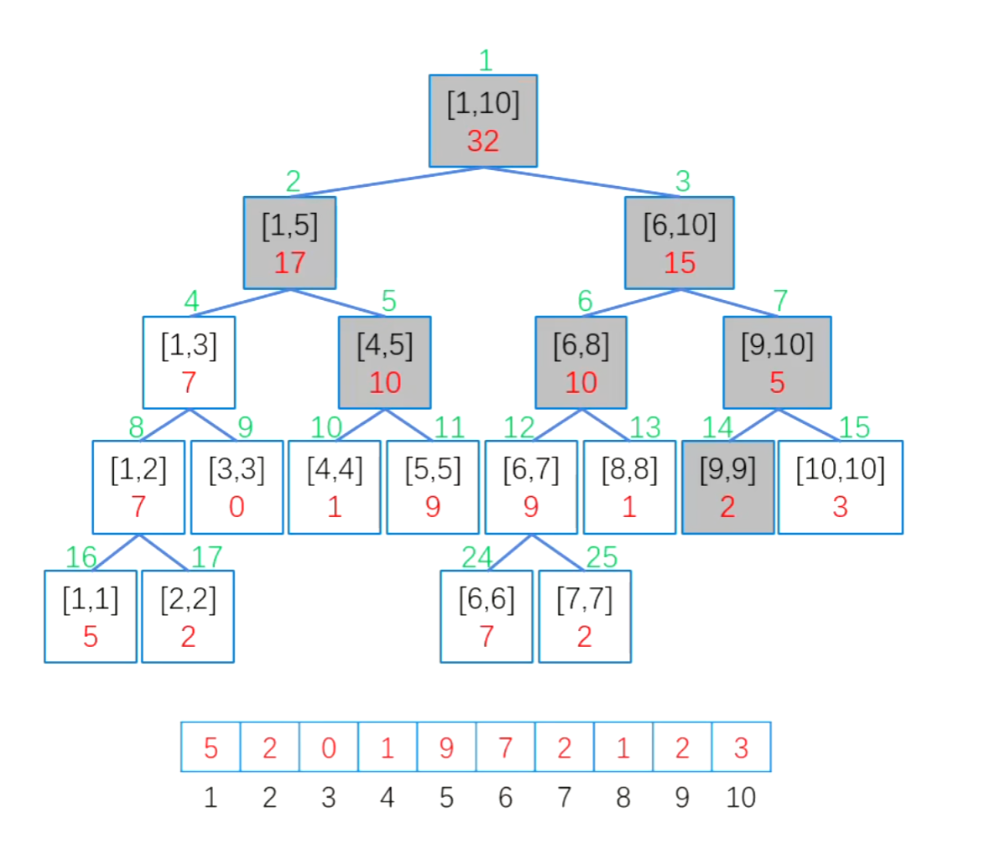

```C++
// 区间查询
int query(int p, int x, int y){
    if(x <= tr[p].l && tr[p].r >= y) // 覆盖则返回
        return tr[p].sum;
    int m = tr[p].l + tr[p].r >> 1; // 不覆盖则裂开
    int sum = 0; //局部变量
    if(x <= m) sum += query(lc, x, y);
    if(y > m) sum += query(rc, x, y);
    return sum;
}
```


5. **区间修改**

   例如：对区间`[4, 9]`内的每个数加上`5`，如果修改区间`[x, y]`所覆盖每个叶子节点，时间是`O(n)`的

   我们做**懒惰修改**，当`[x, y]`**完全覆盖**节点区间`[a, b]`时，先修改该区间的`sum`值，再打上一个**懒标记**，然后立即返回。等下次需要时，再下传懒标记，，这样可以把每次修改和查询的时间都控制到`O(logn)`

```C++
struct node{
    int l, r, sum, add;
}tr[4 * N];
void pushup(int p){ // 向上更新
    tr[p].sum = tr[lc].sum + tr[rc].sum;
} 
void pushdown(int p){ // 向下更新
    if(tr[p].add){ //如果当前节点有懒标记
        // 先修改左右儿子的sum
        tr[lc].sum += tr[p].add * (tr[lc].r - tr[lc].l + 1);
        tr[rc].sum += tr[p].add * (tr[rc].r - tr[rc].l + 1);
        // 懒标记下传
        tr[lc].add += tr[p].add;
        tr[rc].add += tr[p].add;
        // 父节点懒标记清空
        tr[p].add = 0;
    }
}
void update(int p, int x, int y, int k){ // 区间修改
    if(x <= tr[p].l && tr[p].r <= y){ // 覆盖则修改
        tr[p].sum += k * (tr[p].r - tr[p].l + 1);
        tr[p].add += k;
        return;
    }
    int m = tr[p].l + tr[p]. r >> 1; //不覆盖则裂开
    pushdown(p); // 下传懒标记
    if(x <= m) update(lc, x, y, k);
    if(y > m) update(rc, x, y, k);
    pushup(p);   // 回溯更新
}
```

**区间修改和区间查询的板子**

```C++
# define lc p << 1
# define rc p >> 1 | 1
# define N 100005
int n, w[N];
struct node{
    int l, r, sum, add;
}tr[4 * N];

void pushup(int p){ // 向上更新
    tr[p].sum = tr[lc].sum + tr[rc].sum;
}
void pushdowm(int p){ // 向下更新
    if(tr[p].add){
        // 修改左右儿子的sum
        tr[lc].sum += tr[p].add * (tr[lc].r - tr[lc].l + 1);
        tr[rc].sum += tr[p].add * (tr[rc].r - tr[rc].l + 1);
        // 下传懒标记
        tr[lc].add += tr[p].add;
        tr[rc].add += tr[p].add;
        // 父亲懒标记清空
        tr[p].add = 0;
    }
}
void bulid(int p, int l, int r){ // 建树
    tr[p] = {l, r, w[l]};
    if(l == r) return;   //是叶子返回
    int m = l + r >> 1;  //不是叶子裂开
    bulid(lc, l, m);
    bulid(rc, m + 1, r);
    pushup(p);
}
void update(int p, int x, int y, int k){ //区间修改
    if(x <= tr[p].l && tr[p].r <= y){ // 覆盖则修改
    	tr[p].sum += k * (tr[p].r - tr[p].l + 1);
        tr[p].add += k;
        return;
    }
    int m = tr[p].l + tr[p].r >> 1; //不覆盖则裂开
    pushdown(p);
    if(x <= m) update(lc, x, y, k);
    if(y > m) update(rc, x, y, k);
    pushup(p);
}
int query(int p, int x, int y){ // 区间查询
    if(x <= tr[p].l && tr[p].r <= y){ // 覆盖则直接返回
        return tr[p].sum;
    }
    int m = tr[p].l + tr[p].r >> 1; // 不覆盖则裂开
    pushdown(p); //每个节点上可能有懒标记
    int sum = 0;
    if(x <= m) sum += query(lc, x, y);
    if(y > m) sum += query(rc, x, y);
    return sum;
}
```


## 数学

### 快速幂-$O(logn)$

https://www.luogu.com.cn/problem/P1226


$a^n = a × a × ··· × a$暴力计算需要`O(n)`的时间

**快速幂**使用**二进制拆分和倍增**思想，仅需要`O(logn)`的时间

对`n`做二进制拆分，例如，$3^{13} = 3^{(1011)_2} = 3^8·3^4·3^1$

对`a`做平方倍增，例如，$3^1,3^2,3^4,3^8······$

`n`有`logn + 1`个二进制位，我们知道了$a^1,a^2,a^4,...,a^{2^{logn}}$后

只需要计算`logn + 1`次乘法即可

```C++
typedef long long LL;
LL quickpow(LL a, int n){
    LL res = 1;
    while(n){
        if(n & 1) res = res * a;  
        a = a * a;  //平方倍增
        n >>= 1;
    }
    return res;
}
```

**快速幂**可以应用在任何具有**结合律**的运算中，例如**取模运算、矩阵乘法**等

例如$(3^{13})\ \%\ p = (3^8\ \%\ p + 3^4\ \%\ p + 3^1\ \%\ p)\ \% \  p $

```C++
typedef long long LL;
LL quickpow(LL a, int n, int p){
    LL res = 1;
    while(n){
        if(n & 1) res = res * a % p;
        a = a * a % p;
        n >>= 1;
    }
    return res;
}
```

```C++
# include <iostream>
# include <cstring>
# include <algorithm>
using namespace std;
typedef long long LL;
LL a;
int b, p;
LL quickpow(LL a, int n, int p){
    LL res = 1;
    while(n){
        if(n & 1) res = res * a % p;
        a = a * a % p;
        n >>= 1;
    }
    return res;
}
int main(){
    cin >> a >> b >> p;
    cout << quickpow(a, b, p);
    return 0;
}
```


### 约数

#### 试除法判约数

https://www.acwing.com/activity/content/problem/content/938/

**n中最多只含有一个大于 $\sqrt n$ 的约数**

反证法：如果有两个大于 $\sqrt n$ 的质因子，则相乘会大于 $n$

 **$a$ 是 $n$ 的约数，那么 $\frac na$ 也是 $n$ 的约数**

```C++
const int N = 1e6 + 10;
int a[N]; //记录约数
int cnt;  //约数个数
void get_divisor(int x){
    for(int i = 1; i * i <= x; i ++){
        if(x % i == 0){
           	a[++ cnt] = i;
            if(i != x / i) a[++ cnt] = x / i;
        }
    }
}
```

#### 筛法求约数个数

https://www.acwing.com/problem/content/872/

**问题：**

给一个数$n, n≤1×10^6$，输出$[1,n]$每个数的约数个数

**约数个数定理**

若$n=\prod_{i=1}^s{p_i}^{\alpha_i} $，则$d(n)=\prod_{i=1}^{s}(\alpha_{i}+1)$

根据唯一分解定理，任何一个数等于质因子的连乘积，约数的个数就等于**质因子次数+1**的连乘积


#### 筛法求约数和

https://www.acwing.com/problem/content/873/

****

#### 最大公约数 欧几里得算法-$O(logn)$

**证明：$gcd(a,b) = gcd(b, a\%b)$**

设$a＞b, a\%b=a-kb, k = \left\lfloor\frac ab\right\rfloor $。例如 $7\%3=7-2*3$

1. 若$d$是$(a,b)$的公约数，则$d|a, d|b$，则$d|a-kb$，则$d|a\%b$，故$d$也是$(b,a\%b)$的最大公约数
2. 若$d$是$(b,a\%b)$的公约数，则$d|b, d|a-kb$，则$d|a-kb + kb = d|a$，故$d$也是$(a,b)$的最大公约数

所以$(a,b)$和$(b,a\%b)$的公约数是相同的，最大公约数相同

这里$a＞b，b＞a\%b$，如此递归下去，直到$a\%b = 0$，递归结束，此时的$b$就是最大公约数

**求$gcd(a,b)$会遇到两种情况**

1. $a＜b$，则$gcd(a,b) = gcd(b,a)$
2. $a＞b$，则$gcd(a,b) = gcd(b,a\%b)$

对$a$取模会让$a$至少折半，最多发生$logn$次，时间复杂度为$logn$

```C++
typedef long long LL;
LL gcd(LL a, LL b){
    if(b == 0) return a;
    return gcd(b, a % b);
}
```

#### 最小公倍数

$lcm(a,b) = \frac {ab}{gcd(a,b)}$


### 质数

#### 试除法判质数-$O( \sqrt n)$

https://www.luogu.com.cn/problem/P5736

暴力做法，枚举从小到大每个数看是否能整除，时间复杂度是`O(n)`

事实上，如果 $a$ 是 $n$ 的约数，那么 $\frac na$ 也是 $n$ 的约数，对于每一对 $(a, \frac na)$ ，只需检验其中小的那个数，所有较小的数就在这个区间 $[1,\sqrt n]$ 中，时间复杂度是 $O(\sqrt n)$

```C++
bool isprim(int x){
    if(x == 1) return false;
    for(int i = 2; i * i <= x; i ++) //如果i*i爆int 改为 i <= x / i or i <= sqrt(x)
        if(x % i == 0) return false;
    return true;
}
```


#### 埃氏筛---$O(loglogn)$

https://www.luogu.com.cn/problem/P3383

时间复杂度$O(nloglogn)$

从小到大**枚举每个数**

1. 如果当前数**没有被划掉**，必定是质数，记录该质数
2. **枚举当前质数的倍数**，必定是合数，划掉合数

```C++
typedef long long LL;
const int N = 100000010;
int vis[N];  //真为合数
int prim[N]; //记录质数
int cnt;     //质数个数
void Eratosthenes(int n){//埃氏筛法
    for(LL i = 2; i <= n; i ++){
        if(!vis[i]){ //如果当前不是合数
            prim[++ cnt] = i;
            // 划掉当前质数的倍数(会存在重复划掉合数的情况)
            for(LL j = i * i; j <= n; j += i)
                vis[j] = 1;
        }
    }
}
```

#### 线性筛--$O(n)$

https://www.luogu.com.cn/problem/P3383

时间复杂度$O(n)$

每个合数最多只划掉一次

从小到大**枚举每个数**

1. 如果当前数**没有被划掉**，必定是质数，记录该质数

2. **枚举已经记录的质数** (如果合数已越界则中断)

   1. 合数没有越界，划掉合数

   2. 条件  $i \% p==0$ ，保证合数**只被最小质因子**划掉

      若$i$是质数，则最多枚举到自身中断

      若$i$是合数，则最多枚举到自身的最小质因子中断

```C++
const int N = 100000010;
int vis[N];  //真为合数
int prim[N]; //记录质数
int cnt;     //质数个数
void get_prim(int n){
    for(int i = 2; i <= n; i ++){
        if(!vis[i]) prim[++ cnt] = i; //记录质数
        
        //枚举当前的质数    越界中断
        for(int j = 1; 1LL * i * prim[j] <= n; j ++){
            vis[i * prim[j]] = 1; // 划掉合数
            if(i % prim[j] == 0) break; // 整除中断
        }
    }
}
```

#### 分解质因数

https://www.luogu.com.cn/problem/P2043

**算术基本定理（唯一分解定理）**

每个正整数都能够唯一的表示成它的质因数的乘积
$$
n = p_{1}^{a1}p_{2}^{a2}...p_{s}^{as}, p_{1}<p_{2}< ... <p_{s}
$$
**n中最多只含有一个大于 $\sqrt n$ 的质因子**

反证法：如果有两个大于 $\sqrt n$ 的质因子，则相乘会大于 $n$

**分解质因数**

1. 在$[2 , \sqrt n]$范围内枚举
2. 遇到质因子就除净，并且记录质因子的个数
3. 最后如果$n > 1$，说明这就是那个大于$\sqrt n$的质因子

```C++
int n;
int a[10001]; //质因子i的个数
void decompose(int x){
    for(int i = 2; i * i <= x; i ++){
    	while(x % i == 0) a[i] ++, x /= i;
    }
    if(x > 1) a[x] ++;
}
```


### 欧拉函数

#### 试除法求欧拉函数

#### 筛法求欧拉函数

## 动态规划

### 方格DP

https://www.luogu.com.cn/problem/P1216


**记忆化搜索**（递归 `O(n^2)`）

1. **从上到下**的累加是**不可重复使用**的
2. 但**从下到上**的累加是**可以重复使用**的

```C++
int f[9][9]; //记录从下到上的最大累加和
memset(f, -1, sizeof f)
int dfs(int x, int y){
    //记忆化搜索
    if(f[x][y] != -1) return f[x][y];
    
    if(x == n - 1) //边界条件
        f[x][y] = a[x][y];
    else
        f[x][y] = a[x][y] + max(dfs(x + 1, y), dfs(x + 1, y + 1));
    return f[x][y]; 
}
```

```C++
# include <iostream>
# include <cstring>
# include <algorithm>
using namespace std;
const int N = 1005;
int n, a[N][N], f[N][N];
int dfs(int x, int y){
    // 记忆化搜索
    if(f[x][y] != -1) return f[x][y];
    if(x == n - 1)
        f[x][y] = a[x][y];
    else 
        f[x][y] = a[x][y] + max(dfs(x + 1, y), dfs(x + 1, y + 1));
    return f[x][y];
}
int main(){
    cin >> n;
    memset(f, - 1, sizeof f);
    for(int i = 0; i < n; i  ++){
        for (int j = 0; j <= i; j ++){
            scanf("%d", &a[i][j]);
        }
    }
    printf("%d\n", dfs(0, 0));
    return 0;
}
```

**顺序递推** `O(n^2)`

```C++
int b[9][9]; //记录从上到下的累加
// 复制数组起点为（1，1）
for(int i = 0; i < n; i ++){
    for(int j = 0; j <= i; j ++){
        b[i+1][j+1] = a[i][j];
    }
}
// 向下逐层累加
for(int i = 1; i <= n - 1; i ++){
    for(int j = 1; j <= i; j++){
        b[i][j] += max(b[i-1][j], b[i-1][j-1])
    }
}
// 最后一行找出最大值输出
int ans = 0;
for(int j = 1; j <= n; j++){
    ans = max(ans, b[n][j]);
}
cout << ans << endl;

```

输出路径

```C++
int b[9][9]; //记录从上到下的累加
int p[9][9]; //记录前驱节点 表示是从何处累加过来的
int path[9]; //记录倒序路径
// 复制数组起点为（1，1）
for(int i = 0; i < n; i ++){
    for(int j = 0; j <= i; j ++){
        b[i+1][j+1] = a[i][j];
    }
}
// 向下逐层累加
for(int i = 1; i <= n - 1; i ++){
    for(int j = 1; j <= i; j++){
        if(b[i - 1][j] > b[i - 1][j - 1]){ //从上方
            p[i][j] = 0;  // j 增量为 0
            b[i][j] += b[i - 1][j];
        }
        else{ //从左上方
            p[i][j] = -1; // j 增量为 -1
            b[i][j] += b[i - 1][j - 1];
        }
    }
}
// 最后一行找出最大值输出,及所在的下标
int idx = 0;
int ans =0;
for(int j = 1; j <= n; j++){
  	if (b[n][j] > ans){
        ans = b[n][j];
        idx =j;
    }
}
cout << tmp << endl;
// 倒序存储，顺序输出路径
int j = idx;
int k = 0;
for(int i = n; i >=1; i--){
    path[k ++] = a[i- 1][j - 1];
    j += p[i][j];
}
for(int i = 0; i < k - 1; i++)
    cout << path[i] << "->";
cout << path[k - 1] << endl;
```

```C++
# include <iostream>
# include <cstring>
# include <algorithm>
using namespace std;
const int N = 1005;
int n, a[N][N];

int main(){
    cin >> n;
    for(int i = 1; i <= n; i  ++){
        for (int j = 1; j <= i; j ++){
            scanf("%d", &a[i][j]);
        }
    }
    for(int i = 2; i <= n; i ++){
        for(int j = 1; j <= i; j++){
            a[i][j] += max(a[i - 1][j], a[i - 1][j - 1]);
        }
    }
    int ans = 0;
    for(int j = 1; j <= n; j ++ )
        ans = max(ans, a[n][j]);
    printf("%d\n", ans);
    return 0;
}
```

**逆序递推**`O(n^2)`

```C++
// 从下到上逐层累加
for(int i =  n - 2; i>=0; i --){
    for(int j = 0; j <= i; j++){
        a[i][j] += max(a[i + 1][j], a[i + 1][j + 1]);
    }
}
//输出最大
cout << a[0][0] << endl;

```

输出路径

```C++
int b[9][9]; //备份数组
int p[9][9]; //记录前驱节点 表示是从何处累加过来的
// 备份
for(int i = 0; i < n; i ++){
    for(int j = 0; j <= i; j++){
        b[i][j] = a[i][j];
    }
}
// 逆序递推
for(int i = n - 2; i >= 0; i --){
    for(int j = 0; j <= i; j ++){
        if (a[i + 1][j] > a[i + 1][j + 1]) a[i][j] += a[i + 1][j], p[i][j] = 0; //来自 j 增量是0
        else a[i][j] += a[i + 1][j + 1], p[i][j] = 1; //来自右下方 j 增量是1
    }
}
// 输出数塔最大值
cout << a[0][0] << endl;
// 输出数塔最大值路径
int j = 0;
for(int i = 0; i < n - 1; i ++){
    cout << b[i][j] << "->";
    j += p[i][j];
}
cout << b[n - 1][j] << endl;

```

```C++
# include <iostream>
# include <cstring>
# include <algorithm>
using namespace std;
const int N = 1005;
int n, a[N][N];

int main(){
    cin >> n;
    for(int i = 0; i < n; i  ++){
        for (int j = 0; j <= i; j ++){
            scanf("%d", &a[i][j]);
        }
    }
    for(int i = n -2; i >= 0; i --){
        for(int j = 0; j <= i; j++){
            a[i][j] += max(a[i + 1][j], a[i + 1][j + 1]);
        }
    }
    printf("%d\n", a[0][0]);
    return 0;
}
```

### 线性DP

#### 最长上升子序列

https://www.luogu.com.cn/problem/B3637


**状态变量：**`f[i]`记录以**`a[i]`结尾**的上升子序列的长度

**初始条件：**`f[i]=1`


**思路：**

1. `i`指针指向当前`a[i]`
2. `j`指针从左到右扫描，如果当前`a[j] < a[i]`，那么就**可能**用`f[j]`的值来更新`f[i]`
3. 事实上`f[i] = max(f[i], f[j] + 1) 1<=j<i` 

**思考：**

1. `f[i]`记录以`a[i]`为开头的上升子序列的长度可以吗？

   可以，只需要对`a[i]`从右侧往左侧扫描

2. `f[i]`记录前`i`个数的上升自序列的长度可以吗？

   不可以，因为这样没法利用`a[i]`的信息

**时间复杂度`O(n^2)`：**

`1 + 2 + 3 + ... + n-1= n (n - 1) / 2`

```C++
# include <iostream>
# include <cstring>
# include <algorithm>
using namespace std;
const int N = 5005;
int a[N], n;
int f[N];
int main(){
    cin >> n;
    for(int i = 1; i <= n; i ++) cin >> a[i], f[i] = 1;
    for(int i = 2; i <= n; i ++){
        for(int j = 1; j < i; j++){
            if(a[i] > a[j]) f[i] = max(f[i], f[j] + 1);
        }
    }
    int ans = 0;
    for(int i = 1; i <= n; i ++) ans = max(ans, f[i]);
    cout << ans;
    return 0;
}
```


#### 最长公共子序列

https://www.luogu.com.cn/problem/P1439


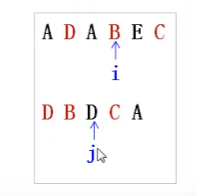

关于两个自变量`i,j`的函数，用一个二维数组来存储这个状态

**状态变量：**`f[i][j]`表示`a[1...i]和b[1...j]`也就是`a`的前`i`个字符和`b`的前`j`个字符最长公共子序列的长度

**状态转移：**


现在考察`a,b`**末尾元素**`a[i]和b[j]`是否在最长公共子序列中

1. 若`a[i] = b[j]`则`a[i]和b[j]`在最长公共子序列中，`f[i][j] = f[i - 1][j - 1] + 1 `
2. 若`a[i] ≠ b[j]`，且`a[i]`不在公共子序列中，则可以去掉`a[i]`，`f[i][j] = f[i - 1][j]`
3. 若`a[i] ≠ b[j]`，且`b[i]`不在公共子序列中，则可以去掉`b[i]`，`f[i][j] = f[i][j - 1]`


**时间复杂度 `O(n ^ 2)`**

```C++
# include <iostream>
# include <cstring>
# include <algorithm>
using namespace std;
const int N =5005;
int n;
int a[N], b[N];
int f[N][N];
int main(){
    cin >> n ;
    for(int i = 1; i <= n; i ++) cin >> a[i];
    for(int i = 1; i <= n; i ++) cin >> b[i];
    // 边界条件
    for(int i = 1; i <= n; i ++) f[i][0] = 0, f[0][i] = 0;
    
    for(int i = 1; i <= n; i ++){
        for(int j = 1; j<= n; j ++){
            if(a[i] == b[j]) f[i][j] = f[i - 1][j - 1] + 1;
            else f[i][j] = max(f[i - 1][j], f[i][j - 1]);
        }
    }
    cout << f[n][n];
    return 0;
}
```


**打印路径**


构造前驱数组`p[i][j]`

1. 当前数的更新来自左上角，`p[i][j] = 1`
2. 当前数的更新来自上方，    `p[i][j] = 2`
3. 当前数的更新来自左方，    `p[i][j] = 3`

只有当`p[i][j] = 1`的时候，才会出现公共子序列

```C++
# include <iostream>
# include <cstring>
# include <algorithm>
using namespace std;
const int N =5005;
int n;
int a[N], b[N], res[N];
int f[N][N],p[N][N];
int main(){
    cin >> n ;
    for(int i = 1; i <= n; i ++) cin >> a[i];
    for(int i = 1; i <= n; i ++) cin >> b[i];
    // 边界条件
    for(int i = 1; i <= n; i ++) f[i][0] = 0, f[0][i] = 0;
    
    for(int i = 1; i <= n; i ++){
        for(int j = 1; j<= n; j ++){
            if(a[i] == b[j]){
                f[i][j] = f[i - 1][j - 1] + 1;
                p[i][j] = 1;
            }
            else if(f[i - 1][j] > f[i][j - 1]){
                f[i][j] = f[i - 1][j];
                p[i][j] = 2;
            }
            else{
                f[i][j] = f[i][j - 1];
                p[i][j] = 3;
            }
        }
    }
    int k =f[n][n];
    cout << k << endl;
    int i =n, j = n;
    while(i > 0 && j > 0){
            if(p[i][j] == 1){
                i --;
                j --;
   				res[k--] = b[i];
            }
            else if(p[i][j] == 2){
                i --;
            }
            else j --;
    }

    for(int i = 1; i <= f[n][n]; i ++) cout << res[i] << " ";
    return 0;
}
```

#### 最长公共子串


**状态变量：**`f[i][j]`表示以`a[i],b[j]`结尾的公共子串的长度

**状态转移：**只有当两字符串中的字符**连续且相等**时，公共子串的长度才会增加，否则记为0


```C++
# include <iostream>
# include <cstring>
# include <algorithm>
using namespace std;
const int N = 5005;
char a[N],b[N];
int f[N][N];
int main(){
    //cin.getline(a, N);
    //cin.getline(b, N);
    cin >> a + 1 >> b + 1;
    int ans =0;
    for(int i = 1; i <= strlen(a + 1); i++){
        for(int j = 1; j <= strlen(b + 1); j++){
            if (a[i] == b[j]) f[i][j] = f[i - 1][j - 1] + 1;
            else f[i][j] = 0;
            ans = max(f[i][j], ans);
            //cout << f[i][j] << " ";
        }
        //cout << endl;
    }
    cout << ans;
    return 0;
}
```

#### 编辑距离

https://www.luogu.com.cn/problem/P2758


**字符串编辑距离**就是从一个字符串修改到另一个字符串时，编辑单个字符（修改、插入、删除）所需要的**最少次数**。

**状态变量：**`f[i][j]`表示从`a[1...i]到b[1...j]`的编辑距离，此时的两个字符串应该是**相等**的

1. 若`a[i] == b[j]` ，则  a[1 ...  i-1, **i**]，b[1 ... j-1,  **j**] ，即`f[i][j] = f[i - 1][j - 1] `

2. 若`a[i] ≠ b[j] `   需要考虑修改，插入，删除的编辑距离的最小值

   1. 修改操作：把`a[i]`改成`b[j]`， **也就是说a[1..i-1] b[1...j-1]已经编辑好了**

      a[1 ... i-1, **i**]

      b[1 ... j-1, **j**]

      `f[i][j] = f[i - 1][j - 1] + 1`

   2. 插入操作：在`a[i]`后面插入`b[j]`， **也就是说a[1..i] b[1...j-1]已经编辑好了**

      a[1 ... i-1, i]

      b[1 ... j-1, **j**]

      `f[i][j] = f[i][j - 1] + 1`

   3. 删除操作：删除`a[i]`， **也就是说a[1..i-1] b[1...j]已经编辑好了**

      a[1 ... i-1, **i**]

      b[1 ... j-1, j]

      `f[i][j] = f[i - 1][j] + 1`

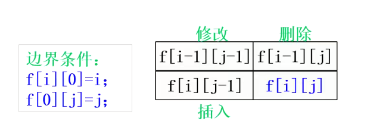

**初始化：**`f[i][0] =i, f[0][j] = j`，表示从当前字符串`i或j`到变成空串，编辑距离为`i或j`

```C++
# include <iostream>
# include <cstring>
# include <algorithm>
using namespace std;
const int N = 2005;
char a[N], b[N];
int f[N][N];
int main(){
    cin >> a + 1 >> b + 1;
    int n = strlen(a + 1), m = strlen(b + 1);
    // 初始化
    for(int i = 1; i <= n; i ++) f[i][0] = i;
    for(int j = 1; j <= m; j ++) f[0][j] = j;
    
    for(int i = 1; i <= n; i ++){
        for(int j = 1; j <= m; j++){
            if(a[i] == b[j]) f[i][j] = f[i - 1][j - 1];
            // 修改 插入 删除
            else f[i][j] = min(f[i - 1][j - 1],min(f[i][j - 1], f[i - 1][j])) + 1;
        }
    }
    cout << f[n][m];
    return 0;
}
```


**一维滚动数组优化**

我们发现，新值的更新**要么来自左上角，要么来自上方，要么来自左方**，我们只需要记录好**上一行左上角的数值**，就可以实现滚动数组优化了

```C++
# include <iostream>
# include <cstring>
# include <algorithm>
using namespace std;
const int N = 2005;
char a[N], b[N];
int f[N];
int main(){
    cin >> a + 1 >> b + 1;
    int n = strlen(a + 1), m = strlen(b + 1);
    // 初始化第一行
    for(int j = 1; j <= m; j ++) f[j] = j;
    int t1 = 0, t2 = 0;
    for(int i = 1; i <= n; i ++){
        // 记录上一行左上角的数
        t1 = f[0] ++; //t1等价于f[i - 1][0]
        for(int j =1; j <= m; j ++){
            t2 = f[j]; //记录更新前的f[j] t2等价于f[i-1][j]
            if(a[i] == b[j]) f[j] = t1;
            else f[j] = min(t1, min(f[j-1], f[j])) + 1; 
            t1 = t2; //t1等价于f[i-1][j-1]
        }
    }
    cout << f[m];
    return 0;
}
```

### 背包DP

#### 01背包-$O(nm)$

**每种物品只有一件**

**状态变量**：`f[i][j]`表示前`i`件物品放入背包容量为`j`的背包的最大价值

当前背包容量为`j`，我们要考虑第`i`件物品能否放入？是否放入

1. 如果当前背包容量`j < w[i]`，不能放入，则`f[i][j] = f[i - 1][j]`

2. 如果当前背包容量`j >= w[i]`，能放入，但是要比较代价

   1. 如果第`i`件物品不放入背包，则`f[i][j] = f[i - 1][j]`
   2. 如果第`i`件物品放入背包，则`f[i][j] = f[i - 1][j - w[i]] + c[i]`

   如果第`i`件物品放入背包，背包容量还剩`j - w[i]`，所以要取前`i - 1`件物品放入背包剩余容量为`j - w[i]`所获得的最大价值`f[i - 1][j - w[i]]`

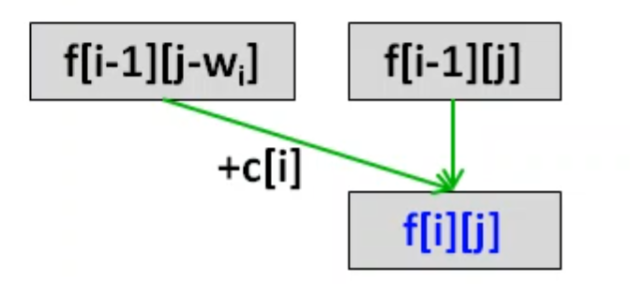

**状态转移方程：**

`f[i][j] = f[i - 1][j] j < w[i]`

`f[i][j] = max(f[i -1][j], f[i - 1][j - w[i]] + c[i]) j >= w[i]`

**边界条件：**`f[i][j] = 0, i or j = 0`

二维数组

```C++
# include <iostream>
# include <cstring>
# include <algorithm>
using namespace std;
const int N = 50 + 5, M = 200 + 5;
int w[N], c[N];
int n, m;
int f[N][M];
int main(){
    cin >> n >> m;
    for(int i = 1; i <= n; i ++) cin >> w[i] >> c[i];
    for(int i = 1; i <= n; i ++){
        for(int j = 1; j <= m; j++){
            if(j < w[i]) f[i][j] = f[i - 1][j];
            else f[i][j] = max(f[i - 1][j], f[i -1][j - w[i]] + c[i]);
        }
    }
    cout << f[n][m] << endl;
    return 0;
}
```

一维滚动数组优化

**让`j`值逆序循环，逆序更新`f[j]`的值**，因为`j`是逆序循环，`f[j]`会先于`f[j - w[i]]`更新，也就是说，用旧值`f[j - w[i]]`去更新新值`f[j]`，相当于用上一行的`f[j - w[i]]`去更新下一行的`f[j]`，所以正确


```C++
# include <iostream>
# include <cstring>
# include <algorithm>
using namespace std;
const int N = 50 + 5, M = 200 + 5;
int w[N], c[N];
int n, m;
int f[M];
int main(){
    cin >> n >> m;
    for(int i = 1; i <= n; i ++) cin >> w[i] >> c[i];
    for(int i = 1; i <= n; i ++){
        for(int j = m; j >= w[i]; j --){
            f[j] = max(f[j], f[j - w[i]] + c[i]);
        }
    }
    cout << f[m] << endl;
    return 0;
}
```

### 完全背包-$O(nm)$

**每种物品有无数多件**

01背包：第i件物品可以放入0个或1个

完全背包：第i件物品可以放入0个、1个、2个...

**状态变量**：`f[i][j]`表示前`i`件物品放入背包容量为`j`的背包的最大价值

当前背包容量为`j`，我们要考虑第`i`件物品能否放入？是否放入

1. 如果当前背包容量`j < w[i]`，不能放入，则`f[i][j] = f[i - 1][j]`

2. 如果当前背包容量`j >= w[i]`，能放入，但是要比较代价

   1. 如果第`i`件物品不放入背包，则`f[i][j] = f[i - 1][j]`
   2. 如果第`i`件物品放入背包，则`f[i][j] = f[i][j - w[i]] + c[i]`

   对于前`i`件物品，背包容量为`j - w[i]`时可能已经放入了第`i`件物品，容量为`j`时还可以再放入第`i`件物品，所以用`f[i][j - w[i]]`更新`f[i][j]`

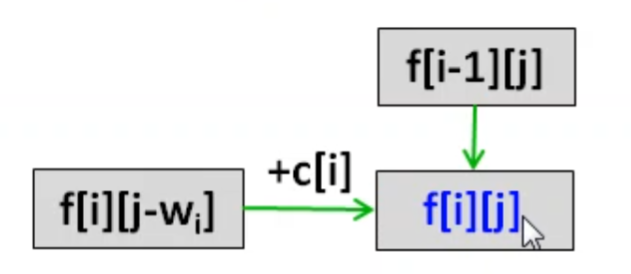


**状态转移方程：**

`f[i][j] = f[i - 1][j] j < w[i]`

`f[i][j] = max(f[i -1][j], f[i][j - w[i]] + c[i]) j >= w[i]`

**边界条件：**`f[i][j] = 0, i or j = 0`

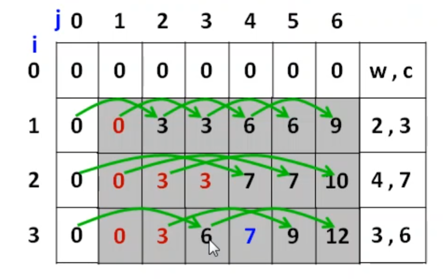

二维数组

```C++
# include <iostream>
# include <cstring>
# include <algorithm>
using namespace std;
const int N = 50 + 5, M = 200 + 5;
int w[N], c[N];
int n, m;
int f[N][M];
int main(){
    cin >> n >> m;
    for(int i = 1; i <= n; i ++) cin >> w[i] >> c[i];
    for(int i = 1; i <= n; i ++){
        for(int j = 1; j <= m; j++){
            if(j < w[i]) f[i][j] = f[i - 1][j];
            else f[i][j] = max(f[i - 1][j], f[i][j - w[i]] + c[i]);
        }
    }
    cout << f[n][m] << endl;
    return 0;
}
```

一维数组

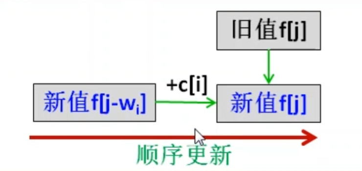

**让`j`值顺序循环，顺序更新`f[j]`的值**，因为`j`是顺序循环，`f[j - w[i]]`会先于`f[j]`更新，也就是说，用新值`f[j - w[i]]`去更新`f[j]`，相当于用当前行的`f[j - w[i]]`去更新当前行的`f[j]`，所以正确

```C++
# include <iostream>
# include <cstring>
# include <algorithm>
using namespace std;
const int N = 50 + 5, M = 200 + 5;
int w[N], c[N];
int n, m;
int f[M];
int main(){
    cin >> n >> m;
    for(int i = 1; i <= n; i ++) cin >> w[i] >> c[i];
    for(int i = 1; i <= n; i ++){
        for(int j = w[i]; j <= m; j ++){
            f[j] = max(f[j], f[j - w[i]] + c[i]);
        }
    }
    cout << f[m] << endl;
    return 0;
}
```


#### 多重背包

**每种物品有有限件**


## 字符串

### 最小表示法-$O(n)$

https://www.luogu.com.cn/problem/P1368

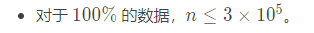

当字符串`S`中选定一个位置`i`满足`S[i ~ n] + S[1 ~ i - 1] = T`，则`T`是`S`的循环同构串

设`S = "bcad"`，其循环同构串有`“bcad cadb adbc dbca”`，当`i = 3 `时，得到字典序最小的循环同构串`adbc`

**最小表示法**就是找出字符串`S`的循环同构串中**字典序**最小的那一个

**思路**

对于循环串（或环），通常的技巧就是复制一倍，**破环成链**，然后扫描

用**三个指针变量**控制扫描，指针`i,j`控制匹配的起始位置，`k`控制匹配长度

`S = acacba`，复制一倍后变成`acacbaacacba`，当`i =1,j = 3,k =3 `时


因为`S[i + k] > S[j + k]`所以`S[i ~ i + k]`之内任何一个位置开始的循环同构串都不如`S[j ~ j + k]`开始的循环同构串，因此`i`跳转到`i + k + 1`继续比较

**算法流程**

1. 把字符串复制一倍
2. 初始化指针`i = 1, j = 2`匹配长度`k = 0`
3. 比较`s[i + k] 和 s[j + k]`是否相等
   1. `s[i + k] = s[j + k]`则`k ++`
   2. `s[i + k] > s[j + k]`则`i = i + k + 1`
   3. `s[i + k] < s[j + k]`则`j = j + k + 1`
   4. 若跳转以后两个指针相同，则`j ++`以确保比较的两个字符串始终不同
4. 重复上述过程直至比较结束
5. 答案为`min(i, j)`

**时间复杂度**

每次比较向后扫描`k`的长度，则`i和j`会向后移动`k`,而`i`和`j`合计一共最多向后移动`2n`的长度，所以时间复杂度为`O(n)`

```C++
int n;
char s[N];
int get_min(char * s){
    n = strlen(s + 1);
    for(int i = 1; i <= n; i ++) s[n + i] = s[i]; //复制一倍
    int i = 1, j = 2, k = 0;
    while(i <= n && j <= n){ //谁先到头循环结束
        for(k = 0; k < n && s[i + k] = s[j + k]; k ++); //匹配到不相等的字符
        if(s[i + k] > s[j + k]) i = i + k + 1;
        if(s[i + k] < s[j + k]) j = j + k + 1;
        if(i == j) j ++;
    }
    return min(i, j);
}
```

```C++
# include <iostream>
# include <cstring>
# include <algorithm>
using namespace std;
const int N = 2 * 3e5 + 10;
int n;
int s[N];
int get_min(){
    for(int i = 1; i <= n; i ++) s[n + i] = s[i]; //复制一倍
    int i = 1, j = 2, k = 0;
    while(i <= n && j <= n){ //谁先到头循环结束
        for(k = 0; k < n && s[i + k] == s[j + k]; k ++); //匹配到不相等的字符
        if(s[i + k] > s[j + k]) i = i + k + 1;
        else j = j + k + 1;
        if(i == j) j ++;
    }
    return min(i, j);
}
int main(){
    cin >> n;
    for(int i = 1; i <= n; i ++) cin >> s[i];
    int k = get_min();
    for(int i = 0; i < n; i ++) cout << s[i + k] << " ";
    return 0;
}
```

### 字符串哈希-$O(n)$

https://www.luogu.com.cn/problem/P3370

**字符串哈希**把不同的字符串映射成不同的**整数**

1. 把字符串映射成一个**p进制数字**

   对于一个长度为`n`的字符串`s`

   哈希函数：$h(s)=\sum_{i=1}^ns[i]\times p^{n-i}(\mathrm{mod~}M)$

   例如字符串`abc`，其哈希函数值为$ap^{2}+bp^{1}+c$

   即$97\times131^{2}+98\times131^{1}+99$

2. 如果两个字符串不一样，哈希函数值一样，这是**哈希碰撞**

3. 解决哈希碰撞的方法：

   巧妙设置`p`和`M`的值，保证`p`与`M`互质

   `p`通常取常数`131或13331`

   `M`通常取大整数$2^{64}$，把哈希函数值`h`定义为**ULL**,超过则自动溢出，等价于取模


**思路：**

1. 求一个字符串的哈希值相当于**求前缀和**

   求一个字符串的子串的哈希值相当于**求区间和**

2. **前缀和**
   $$
   h[i] = h[i - 1] × p + s[i], h[0] = 0;
   $$
   $A$						$A$              																    $h[1]=h[0]*p +65$

   $AB$					$A × p^1 +B$															   	$h[2] = h[1] × p + 66$

   $ABC$				$A × p^2 +B×p^1 + C$											 	$h[3] = h[2] × p + 67$

   $ABCD$         $A × p^3 +B×p^2 + C ×p^1 + D$						  	$h[4] = h[3] × p + 68$

   $ABCDE$		$A × p^4 +B×p^3 + C ×p^2 + D×p^1 + E$	  	$h[5] = h[4] × p + 69$

3. **区间和**
   $$
   h[l, r] = h[r] - h[l - 1] × p^{r-l+1}
   $$
   $DE=ABCDE-ABC×p^2=D×p^1+E$，即$h[4,5] = h[5] - h[3]×p^2$

4. 计算前缀和，时间复杂度：`O(n)`

   查询区间和，时间复杂度：`O(1)`

```C++
typedef unsigned long long ULL;
const int P = 131;
// p[i] = p ^ i 	h[i] = s[1 ~ i]的hash值
ULL p[N], h[N];
// 预处理hash函数的前缀和
void init(){
	p[0] = 1, h[0] = 0;
    for(int i = 1; i <= n; i ++){
        p[i] = p[i -1] * P;
        h[i] = h[i -1] * P + s[i];
    }
}
// 计算s[l ~ r]的hash值
ULL get(int l, int r){
    return h[r] - h[l -1] * p[r - l + 1];
}
// 判断两子串是否相同
bool  substr(int l1, int r1, int l2, int r2){
    return get(l1, r1) == get(l2, r2);
}
```


```C++
# include <iostream>
# include <cstring>
# include <algorithm>
using namespace std;
typedef unsigned long long ULL;
const int P = 131, M = 1500 + 10, N = 10000 + 10;
// p[i] = p ^ i 	h[i] = s[1 ~ i]的hash值
ULL p[M], h[M];
int n, ans[N];
// 预处理hash函数的前缀和
void init(char* s, int m){
	p[0] = 1, h[0] = 0;
    for(int i = 1; i <= m; i ++){
        p[i] = p[i -1] * P;
        h[i] = h[i -1] * P + s[i];
    }
}
// 计算s[l ~ r]的hash值
ULL get(char* s, int l, int r){
    return h[r] - h[l -1] * p[r - l + 1];
}

int main(){
    cin >> n;
    for(int i = 0; i < n; i ++){
        char s[M] = "";
        cin >> s + 1;
        int m = strlen(s + 1);
        init(s, m);
        ans[i] = get(s, 1, m);
    }
    sort(ans, ans + n);
    int cnt = 0;
    for(int i = 0; i < n ; i ++){
        if(ans[i] != ans[i + 1]) cnt ++;
    }
    cout << cnt;
    return 0;
}
```

### KMP-$O(n)$

https://www.luogu.com.cn/problem/P3375

给出一个模式串`P`和一个主串`S`，求模式串`P`在主串`S`中出现的位置。（字符串下标均从`1`开始）


**自解：**如果用暴力做法，枚举`i`指针的起始位置，每一次`j`指针从0开始挨个比较，直到不相等，然后`i`指针+1，`j`指针重新从0开始挨个比较，这样的时间复杂度是`O(nm)`的，如果用KMP算法，当挨个比较不相等时，`j`指针**没有立刻跳转到0**，而是跳转到**已经遍历的模式串中的最长公共前后缀的位置（例如next[8]=5）**,如果跳转之后，下一个字符还不匹配，那么就跳转到next[5] = 2，直至跳转到0，这时候才近似于暴力做法，所以关键就是如何找出来模式串的最长公共前后缀


1. 取**最长的**相等前后缀，可以保证不漏解
2. 通过模式串的前后缀**自我匹配**的长度，计算**next函数**

给`j`指针打一张表，失配时就跳到`next[j]`位置继续匹配


**next函数**

**next[i]**表示模式串`P[1,i]`中**相等前后缀**的**最长长度**，**此时next[i]的数值是公共前缀的下标**

P          a a b a a b a a a a

ne[1] = 0 a

ne[2] = 1 aa

ne[3] = 0 aab

ne[4] = 1 aaba

ne[5] = 2 aabaa

ne[6] = 3 aabaab

ne[7] = 4 aabaaba

ne[8] = 5 aabaabaa

ne[9] = 2 aabaabaaa

ne[10] = 2 aabaabaaaa


**双指针**

`i`扫描模式串，`j`扫描前缀

初始化，`ne[1] = 0,  i = 2, j = 0`

每轮`for`循环，`i`向右走一步

1. 若`P[i] != P[j + 1]`，让`j`跳回到能匹配的位置

   如果找不到能匹配的位置，`j`回跳到0

2. 若`P[i] == P[j + 1]`，让`j + 1`，**指向匹配前缀的末尾**

3. `next[i] = j`

```C++
ne[1] = 0;
for(int i = 2, j = 0; i <= n; i ++){
    // 出现失配的情况,j就跳转到ne[j],一直不匹配就跳转到0
    while(j && P[i] != P[j + 1]) j = ne[j];
    // j + 1和当前i能匹配上，就让j向后走方便下一轮循环继续和 i + 1匹配
    if(P[i] == P[j + 1]) j ++; 
    // 此时的j无论是前面失配反复跳转也好，j跳到0也好，还是j + 1和 i匹配成功也好
    // j指向的位置都是当前1~i字符串 能使得1~j字符串与其匹配的位置
    ne[i] = j;
}
```

**时间复杂度**

`j`指针所走的总步数就决定了总的执行次数。每轮`for`，`j`至多 + 1，往左跳的步数加起来也不会超过`n`步，否则`j`变为负数，故`j`的总步数不会超过`2n`


**模式串与主串的匹配**

**双指针**

`i`扫描主串，`j`扫描模式串

初始化，` i = 1, j = 0`

每轮`for`循环，`i`向右走一步

1. 若`S[i] != P[j + 1]`，让`j`跳回到能匹配的位置

   如果找不到能匹配的位置，`j`回跳到0

2. 若`S[i] == P[j + 1]`，让`j + 1`，**指向匹配前缀的末尾**

3. 若匹配成功，输出匹配位置

```C++
for(int i = 1, j = 0; i <= m; i ++){
    while(j && S[i] != P[j + 1]) j = ne[j];
    if(S[i] == P[j + 1]) j ++;
    if(j == n) cout << i - n + 1 << endl;
}
```


```C++
# include <iostream>
# include <cstring>
# include <algorithm>
using namespace std;
const int N = 1e6 + 10;
char S[N], P[N];
int n, m;
int ne[N];
int main(){
    // 输入主串和模式串
    cin >> S + 1 >> P + 1;
    n = strlen(P + 1);
    m = strlen(S + 1);
    
    //模式串自我匹配
    ne[1] = 0;
    for(int i = 2, j = 0; i <= n; i ++){
        while(j && P[i] != P[j + 1]) j = ne[j];
        if(P[i] == P[j + 1]) j ++;
        ne[i] = j;
    }
    
    //主串和模式串匹配
    for(int i = 1, j = 0; i <= m; i ++){
        while(j && S[i] != P[j + 1]) j = ne[j];
        if(S[i] == P[j + 1]) j ++;
        if(j == n) cout << i - n + 1 << endl;
    }
    // 输出模式串的最长公共前后缀的长度
    for(int i = 1; i <= n; i ++) cout << ne[i] << " ";
    return 0;
}
```

### Trie字典树-$O(n)$

**Trie**是一种能够以快速插入和查询字符串的**多叉树**结构

节点的编号各不相同，根节点的编号是0，其他节点用来标识路径，还可以用来标记单词的插入的次数。边表示字符

Trie维护字符串的集合，支持两种操作：

1. 向集合中**插入**一个字符串,  `void insert(char *s)`
2. 在集合中**查询**一个字符串，`int query(char *s)`


**建字典树**

儿子数组`ch[p][j]`存储从节点`p`沿着`j`这条边走到的子节点编号

​		边为26个小写字母`a~z`对应的映射值`0~25`

​		每个节点最多可以有26个分叉

​		例如：`ch[0][2] =1` 表示0号节点沿着字母c走到1号节点

计数数组`cnt[p]`存储以节点`p`结尾的单词的插入次数

节点编号`idx`用来给节点编号


1. 空Trie仅有一个根节点，编号为0

2. 从根开始插，枚举字符串的每个字符

   如果有儿子，则`p`指针走到儿子

   如果没有儿子，则先创建儿子，`p`指针再走到儿子

3. 在单词结束点记录插入次数

```C++
char s[N];
int char[N][26], cnt[N], idx;
void insert(char *s){
    int p = 0; //表示当前在的节点编号
    for(int i = 0; s[i]; i ++){
        int j = s[i] - 'a'; //字母映射
        if(!ch[p][j]) ch[p][j] = ++idx; //没有儿子就创建儿子
        p = ch[p][j];	// 走到儿子
    }
    cnt[p] ++; //插入次数
}
```


**查询**

1. 从根开始查，扫描字符串
2. 有字母`s[i]`则走下来，能走到词尾，返回插入次数
3. 无字母`s[i]`则返回0

```C++
int query(char *s){

	int p = 0; //表示当前节点所在的编号

    for(int i = 0; s[i]; i ++){

        int j = s[i] - 'a'; //字母映射

        if(!ch[p][j]) return 0;  //没有字母s[i]

        p = ch[p][j]; //走到儿子

    }

    return cnt[p];	//返回插入次数
}
```


# 技巧

### 万能头

```C++
#include <bits/stdc++.h>
```

### dev支持C++11标准

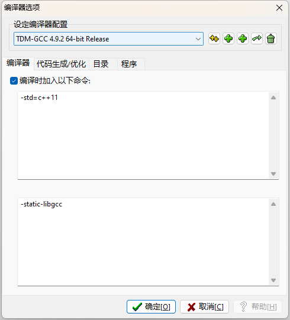

```
-stdc=c++11
```

### 快读

```C++
inline void  read(int &a){
    int s = 0, w = 1;
    char ch = getchar();
    while(ch < '0' || ch > '9'){
        if(ch ==  '-')
            w = -1;
        ch = getchar();
    }
    while(ch >= '0' && ch <= '9'){
        s = s * 10 + ch - '0';
        ch = getchar();
    }
    a = s * w;
}
```


### 关同步

```C++
# include <iostream>
# include <cstring>
# include <algorithm>
using namespace std;
int main(){
    ios::sync_with_stdio(0);
    cin.tie(0), cout.tie(0);
    cout << '\n'; //不用cout << endl;
    return 0;
}
```


### STL

#### 堆

注意：默认是大根堆！！！

大根堆：`priority_queue <类型> 变量名;`

小根堆：`priority_queue <类型,vecotr <类型>,greater <类型> > 变量名`

```C++

priority_queue<int, vector<int>, less<int> >s;   //less表示按照递减(从大到小)的顺序插入元素
priority_queue<int, vector<int>, greater<int> >s;//greater表示按照递增（从小到大）的顺序插入元素

//注意后面两个“>”不要写在一起，“>>”是右移运算符

```


**常用函数**

```C++

​    size(); 这个堆的长度

​    empty(); 返回这个堆是否为空

​    push();往堆里插入一个元素

​    top(); 返回堆顶元素

​    pop(); 弹出堆顶元素

​    注意：堆没有clear函数！！！
     注意：堆没有back()函数！！！


```


## cmp函数

**结构体sort排序**

- 按结构体某一个属性值，从小到大排序

```C++
struct node{
    int id, w;
}a[N];
bool cmp(node &x, node &y){
    return x.w < y.w;
}
sort(a, a + n);
```

- 按结构体某一个属性值，从大到小排序

```C++
struct node{
    int id, w;
}a[N];
bool cmp(node &x, node &y){
    return x.w > y.w;
}
sort(a, a + n);
```

