# Pytorch 

## 训练代码框架

### 训练代码框架1-AlexNet


```python
import os
import numpy as np
import torch
import torch.nn as nn
import torchvision
import torchvision.transforms as transforms
from torch.utils import data
import matplotlib.pyplot as plt
import torch.optim as optim

device = torch.device("cuda:0" if torch.cuda.is_available() else "cpu")


# ================================= 下载图片、预处理图片、数据加载器 =================================

transform = transforms.Compose([transforms.Resize((224, 224), interpolation=transforms.InterpolationMode.BICUBIC),
                                transforms.ToTensor(),
                                transforms.Normalize(mean=[0.4914, 0.4822, 0.4465], std=[0.247, 0.2435, 0.2616])
                                ])

train_set = torchvision.datasets.CIFAR10('../input/cifar10', train=True, download=True, transform=transform)
test_set = torchvision.datasets.CIFAR10('../input/cifar10', train=False, download=True, transform=transform)

train_loader = torch.utils.data.DataLoader(train_set, batch_size=256, shuffle=True)
test_loader = torch.utils.data.DataLoader(test_set, batch_size=256, shuffle=True)
classes = ('plane', 'car', 'bird', 'cat', 'deer', 'dog', 'frog', 'horse', 'ship', 'truck')

# ================================= 查看图片 =================================

# data_iter = iter(train_loader)
# sample_images, sample_labels = data_iter.next()
#
# plt.figure(figsize=(7, 7))
#
# for i in range(9):
#     plt.subplot(3, 3, i+1)
#     img = sample_images[i] / 2 + 0.5
#     plt.title(classes[sample_labels[i]])
#     plt.imshow(np.transpose(img, (1, 2, 0)))
# plt.show()


# ================================= 定义模型 =================================

class Alexnet(nn.Module):
    def __init__(self):
        super().__init__()
        self.net = nn.Sequential(nn.Conv2d(3, 96, kernel_size=11, stride=4, padding=1), nn.ReLU(),
                                 nn.MaxPool2d(kernel_size=3, stride=2),
                                 nn.Conv2d(96, 256, kernel_size=5, padding=2), nn.ReLU(),
                                 nn.MaxPool2d(kernel_size=3, stride=2),
                                 nn.Conv2d(256, 384, kernel_size=3, padding=1), nn.ReLU(),
                                 nn.Conv2d(384, 384, kernel_size=3, padding=1), nn.ReLU(),
                                 nn.Conv2d(384, 256, kernel_size=3, padding=1), nn.ReLU(),
                                 nn.MaxPool2d(kernel_size=3, stride=2),
                                 nn.Flatten(), nn.Linear(256 * 5 * 5, 4096), nn.ReLU(),
                                 nn.Dropout(0.5),
                                 nn.Linear(4096, 4096), nn.ReLU(),
                                 nn.Dropout(0.5),
                                 nn.Linear(4096, 10))

    def forward(self, X):
        return self.net(X)


# ================================= 训练模型 =================================
model = Alexnet().to(device)

epochs = 20
lr = 0.01
criterion = nn.CrossEntropyLoss()
optimizer = optim.SGD(model.parameters(), lr=lr, momentum=0.9, weight_decay=0.0005)

eval_losses = []
eval_acces = []

for epoch in range(epochs):

    if (epoch + 1) % 5 == 0:
        optimizer.param_groups[0]['lr'] *= 0.1

    model.train()
    for imgs, labels in train_loader:
        imgs, labels = imgs.to(device), labels.to(device)
        predict = model(imgs)
        loss = criterion(predict, labels)
        print('epoch {}   loss: {}'.format(epoch, loss))

        # back propagation
        optimizer.zero_grad()
        loss.backward()
        optimizer.step()

    eval_loss = 0
    eval_acc = 0
    model.eval()
    for imgs, labels in test_loader:
        imgs, labels = imgs.to(device), labels.to(device)
        predict = model(imgs)
        loss = criterion(predict, labels)

        # record loss
        eval_loss += loss.item()

        # record accurate rate
        result = torch.argmax(predict, axis=1)
        acc_num = (result == labels).sum().item()
        acc_rate = acc_num / imgs.shape[0]
        eval_acc += acc_rate

    eval_losses.append(eval_loss / len(test_loader))
    eval_acces.append(eval_acc / len(test_loader))

    print('epoch: {}'.format(epoch))
    print('loss： {}'.format(eval_loss / len(test_loader)))
    print('accurate rate: {}'.format(eval_acc / len(test_loader)))
    print('\n')

plt.title('evaluation loss')
plt.plot(np.arange(len(eval_losses)), eval_losses)
plt.show()

```

### 训练代码框架2-Resnet50


```python
import os
import random
import numpy as np
from PIL import Image

import torch
import torch.nn as nn
import torch.nn.functional as F
import torch.optim as optim
from torch.optim.lr_scheduler import StepLR

from torch.utils.data import Dataset
import torchvision.models as models
import torchvision.transforms as transforms

device = torch.device('cuda' if torch.cuda.is_available() else 'cpu')


def main():
    epochs = 30
    batch_size = 16
    save_steps = 10
    num_workers = 4
    lr = 0.001
    lr_step = 15

    # =============================== model ===============================

    resnet50 = nn.Sequential(models.resnet50(),
                             nn.ReLU(),
                             nn.Dropout(0.5),
                             nn.Linear(in_features=1000, out_features=5, bias=True))
    resnet50.to(device)

    # =============================== data ===============================

    data_root = "/kaggle/input/flowers/flower_photos"
    train_images_path, train_images_label, val_images_path, val_images_label = read_split_data(data_root)

    # =============================== Transform ===============================
    img_size = 224
    train_transform = transforms.Compose([transforms.RandomResizedCrop(img_size),
                                          transforms.RandomHorizontalFlip(),
                                          transforms.ToTensor(),
                                          transforms.Normalize([0.485, 0.456, 0.406], [0.229, 0.224, 0.225])])

    val_transform = transforms.Compose([transforms.Resize(int(img_size * 1.143)),
                                        transforms.CenterCrop(img_size),
                                        transforms.ToTensor(),
                                        transforms.Normalize([0.485, 0.456, 0.406], [0.229, 0.224, 0.225])])

    # =============================== DataSet ===============================

    train_dataset = MyDataSet(images_path=train_images_path,
                              images_class=train_images_label,
                              transform=train_transform)

    val_dataset = MyDataSet(images_path=val_images_path,
                            images_class=val_images_label,
                            transform=val_transform)

    # =============================== DataLoader ===============================

    train_loader = torch.utils.data.DataLoader(train_dataset,
                                               batch_size=batch_size,
                                               shuffle=True,
                                               pin_memory=True,
                                               num_workers=num_workers)

    val_loader = torch.utils.data.DataLoader(val_dataset,
                                             batch_size=batch_size,
                                             shuffle=False,
                                             pin_memory=True,
                                             num_workers=num_workers)

    print("len(train_loader) = {}".format(len(train_loader)))
    print("len(val_loader) = {}".format(len(val_loader)))

    # ====================== loss_function、optimizer、scheduler =========================
    criteria = nn.CrossEntropyLoss()
    optimizer = optim.SGD(resnet50.parameters(), lr=lr, momentum=0.9)
    scheduler = StepLR(optimizer, step_size=lr_step, gamma=0.1)
    train_and_evaluate(resnet50, train_loader, val_loader, criteria, optimizer, scheduler, epochs, save_steps)


# flower 数据集下载地址：https://storage.googleapis.com/download.tensorflow.org/example_images/flower_photos.tgz
def read_split_data(root, val_rate=0.2):
    assert os.path.exists(root), "dataset root: {} does not exist.".format(root)

    flower_class = [cla for cla in os.listdir(root) if os.path.isdir(os.path.join(root, cla))]
    flower_class.sort()
    class_indices = dict((k, v) for v, k in enumerate(flower_class))
    print(class_indices)

    train_images_path = []
    train_images_label = []
    val_images_path = []
    val_images_label = []
    every_class_num = []

    for cla in flower_class:
        cla_path = os.path.join(root, cla)
        images = [os.path.join(root, cla, i) for i in os.listdir(cla_path)]
        images.sort()
        image_class = class_indices[cla]

        every_class_num.append(len(images))
        val_path = random.sample(images, k=int(len(images) * val_rate))

        # 划分训练集 和 验证集
        for img_path in images:
            if img_path in val_path:
                val_images_path.append(img_path)
                val_images_label.append(image_class)
            else:
                train_images_path.append(img_path)
                train_images_label.append(image_class)

    print("{} images were found in the dataset.".format(sum(every_class_num)))
    print("{} images for training.".format(len(train_images_path)))
    print("{} images for validation.".format(len(val_images_path)))
    assert len(train_images_path) > 0, "number of training images must greater than 0."
    assert len(val_images_path) > 0, "number of validation images must greater than 0."

    return train_images_path, train_images_label, val_images_path, val_images_label


class MyDataSet(Dataset):

    def __init__(self, images_path, images_class, transform=None):
        self.images_path = images_path
        self.images_class = images_class
        self.transform = transform

    def __len__(self):
        return len(self.images_path)

    def __getitem__(self, item):
        img = Image.open(self.images_path[item])
        label = self.images_class[item]

        if self.transform is not None:
            img = self.transform(img)

        return torch.as_tensor(img), torch.as_tensor(label)


class RunningAverage():

    def __init__(self):
        self.steps = 0
        self.loss_sum = 0
        self.acc_sum = 0

    def update(self, loss, acc):
        self.loss_sum += loss
        self.acc_sum += acc
        self.steps += 1

    def __call__(self):
        return self.loss_sum / float(self.steps), self.acc_sum / float(self.steps)


def save_checkpoint(state):
    save_dir = "pretrained_tm_weights"
    if not os.path.exists(save_dir):
        os.mkdir(save_dir)

    filepath = os.path.join(save_dir, 'best.pth')
    torch.save(state, filepath)
    
    
def train_and_evaluate(model, train_dataloader, val_dataloader, criteria, optimizer, scheduler, epochs, save_steps):
    best_val_acc = 0.0
    for epoch in range(epochs):

        print("Epoch {}/{}".format(epoch + 1, epochs))

        # ---------- train ------------

        model.train()
        metric_avg = RunningAverage()

        for i, (train_batch, labels_batch) in enumerate(train_dataloader):

            train_batch, labels_batch = train_batch.to(device), labels_batch.to(device)
            output_batch = model(train_batch)
            loss = criteria(output_batch, labels_batch)

            optimizer.zero_grad()
            loss.backward()
            optimizer.step()

            if i % save_steps == 0:
                output_batch = output_batch.data.cpu().numpy()
                labels_batch = labels_batch.data.cpu().numpy()

                predict_labels = np.argmax(output_batch, axis=1)
                acc = np.sum(predict_labels == labels_batch) / float(labels_batch.size)

                metric_avg.update(loss.item(), acc)

        scheduler.step()
        train_loss, train_acc = metric_avg()
        print("- Train metrics: loss={:.2f}, acc={:.2f}".format(train_loss, train_acc))

        # ---------- validate ------------
        model.eval()
        metric_avg = RunningAverage()

        for val_batch, labels_batch in val_dataloader:
            val_batch, labels_batch = val_batch.to(device), labels_batch.to(device)

            output_batch = model(val_batch)
            loss = criteria(output_batch, labels_batch)

            output_batch = output_batch.data.cpu().numpy()
            labels_batch = labels_batch.data.cpu().numpy()

            predict_labels = np.argmax(output_batch, axis=1)
            acc = np.sum(predict_labels == labels_batch) / float(labels_batch.size)

            metric_avg.update(loss.item(), acc)

        val_loss, val_acc = metric_avg()
        print("- Validate metrics: loss={:.2f}, acc={:.2f}".format(val_loss, val_acc))

        # ---------- Save weights ------------

        is_best = val_acc >= best_val_acc
        if is_best:
            print("- Found new best accuracy")
            best_val_acc = val_acc

            save_checkpoint({'epoch': epoch + 1,
                             'state_dict': model.state_dict(),
                             'optim_dict': optimizer.state_dict()})


if __name__ == '__main__':
    main()
```


## 经典网络框架

### Backbone

#### Resnet

#### Swin transformer

[跳转](####Swin Transformer)

## torch小函数（持续更新）

### torch.max

`torch.max(tensor, dim=a)`

返回第`a`维度下，最大数值以及下标

```python
import torch
a = torch.tensor([[1, 2],[1, 2],[3, 2]])
print(torch.max(a, dim=1))
"""
torch.return_types.max(
values=tensor([2, 2, 3]),
indices=tensor([1, 1, 0]))
"""
```

返回第`a`维度下，下标

```python
import torch
a = torch.tensor([[1,2],[1,2],[3,2]])
print(torch.max(a, dim=1)[1])
"""
tensor([1, 1, 0])
"""
```

### tensor.size

`tensor.size(a)`

返回tensor第`a`维度的长度

```python
import torch
a = torch.tensor([[1,2],[1,2],[3,2]])
b = torch.tensor([1, 2, 1])

print(a.size(0)) # 3
print(a.size(1)) # 2
print(b.size(0)) # 3

```

### torch.flatten

`torch.flatten(x, start_dim=a)`

从第`a`维开始，打平张量`x`

```python
import torch
a = torch.tensor([[[1, 2, 3],[2, 3, 3]],[[2, 2, 3],[2, 3, 2]]])
print(a.shape) # [2, 2, 3]
a = torch.flatten(a, start_dim=1)
print(a)
"""
tensor([[1, 2, 3, 2, 3, 3],
        [2, 2, 3, 2, 3, 2]])
"""
print(a.shape) #[2,  6]
```


## 数据处理

### torchvison.transforms模块

**官方文档**

https://pytorch.org/vision/stable/transforms.html#others

推荐使用v2版本的api


**数据处理和数据增强的方法**，这些模块实际上都是一个**类**，在使用之间需要先**实例化一个对象**，然后调用这个类的方法，进行变换

#### 图像尺寸变换与裁剪

1. transforms.Resize

    https://pytorch.org/vision/stable/generated/torchvision.transforms.Resize.html?highlight=transforms+resize#torchvision.transforms.Resize

    ```python
    torchvison.transform.Resize(size,
                               interpolation=InterpoLationMode.BILINEAR,
                               max_size=None);
    ```

    

    - 作用：将图像按照指定的插值方式，resize到指定尺寸
    - 参数：
        - `size`：输出图像的尺寸。可以是元组（h, w）可以是单个整数，
            - 如果size是元组，输出大小将匹配h, w的大小
            - 如果size是整数，则图像将**较小的边resize到此数字**，并**保持宽高比**

        - `interpolation`：选用如下插值方法将图像resize到输出尺寸
            - `PIL.Image.NEAREST`最近邻插值
            - `PIL.Image.BILINEAR`双线性插值（默认）
            - `PIL.Image.BICUBIC`双三次插值

        - `max_size`：输出图像较长边的最大值。**仅当size为单个整数时才支持次功能**。如果图像的较长边在根据size缩放后大于max_size，则size将会被覆盖，使较长边等于max_size，此时短边会小于size

举例

PILImage对象size属性返回的是**w, h**，而resize的参数顺序是**h, w**。

   ```python
from PIL import Image
import torchvision.transforms as transforms
import matplotlib.pyplot as plt

original_img = Image.open('image.jpg')  # https://p.ipic.vip/7pvisy.jpg
print(original_img.size)   # (3280, 1818)

img_1 = transforms.Resize(1500, max_size=None)(original_img)
print(img_1.size)   # (2706, 1500)

img_2 = transforms.Resize((1500, 1500))(original_img)
print(img_2.size)   # (1500, 1500)

img_3 = transforms.Resize(1500, max_size=1600)(original_img)
print(img_3.size)   # (1600, 886)


plt.subplot(141)
plt.axis("off")
plt.imshow(original_img)

plt.subplot(142)
plt.axis("off")
plt.imshow(img_1)

plt.subplot(143)
plt.axis("off")
plt.imshow(img_2)

plt.subplot(144)
plt.axis("off")
plt.imshow(img_3)

plt.show()
   ```

   


2. transforms.CenterCrop

    https://pytorch.org/vision/stable/generated/torchvision.transforms.CenterCrop.html?highlight=transforms+centercrop#torchvision.transforms.CenterCrop

    ```python
    torchvision.transforms.CenterCrop(size)
    ```

    - 作用：从**图片中心**裁剪出尺寸为size的图片
    - 参数：
        - `size`：所需裁剪的图片尺寸，即输出图像的尺寸
    - 注意：
        - 若切正方形，`transforms.CenterCrop(100)`和`transforms.CenterCrop((100, 100))`两种写法，效果一样
        - 如果设置的输出尺寸大于原图像尺寸，则会在四周补padding，padding颜色为黑色，像素值为0

    举例

    ```python
    from PIL import Image
    import torchvision.transforms as transforms
    import matplotlib.pyplot as plt
    
    original_img = Image.open('image.jpg')  # https://p.ipic.vip/7pvisy.jpg
    print(original_img.size)   # (3280, 1818)
    
    img_1 = transforms.CenterCrop(1500)(original_img)
    img_2 = transforms.CenterCrop((1500, 1500))(original_img)
    img_3 = transforms.CenterCrop((3000, 3000))(original_img)
    
    plt.subplot(141)
    plt.axis("off")
    plt.imshow(original_img)
    
    plt.subplot(142)
    plt.axis("off")
    plt.imshow(img_1)
    
    plt.subplot(143)
    plt.axis("off")
    plt.imshow(img_2)
    
    plt.subplot(144)
    plt.axis("off")
    plt.imshow(img_3)
    
    plt.show()
    ```

    

3. transforms.RandomCrop

    https://pytorch.org/vision/stable/generated/torchvision.transforms.RandomCrop.html?highlight=transforms+randomcrop#torchvision.transforms.RandomCrop

    ```python
    torchvision.transforms.RandomCrop(size,
                                     padding=None,
                                     pad_if_need=False,
                                     fill=0,
                                     padding_mode='constant')
    ```

    - 作用：
        - 从图片中随机裁剪出尺寸为size的图片
        - 如果设置了参数`padding`，先添加padding，再从padding后的图像中随机裁剪出大小为size的图片
    - 参数：
        - `size`：所需要裁剪的图片尺寸的大小，即输出图像尺寸
        - `padding`：设置填充大小
            - 当`padding`的值形式为a时，上下左右均匀填充a个像素
            - 当`padding`的值形式为（a, b）时，左右填充a个像素，上下填充b个像素
            - 当`padding`的值形式为（a, b, c, d）时，左上右下分别填充a, b, c, d个像素
        - `pad_if_need`：当原图像的尺寸小于设置的输出图像尺寸（有参数size决定），是否填充，默认为False
        - `padding_mode`：若`pad_if_need`设置为True，此参数起作用，默认值为constant
            - `"constant"`：像素值由参数`fill`指定（默认为黑色，rgb像素值为（0，0，0））
            - `"edge"`：padding的像素值为图像边缘的像素值
            - `"reflect"`：镜像填充，最后一个像素不镜像([1,2,3,4] --> [**3,2**,1,**2,3**,4,**3,2**])，从2 3镜像
            - `"symmetric"`：镜像填充，最后一个像素也镜像([1,2,3,4] --> [**2,1,1,2**,3,4,4,3])，从1 2 ，3 4镜像
        - `fill`：指定像素的填充值，当padding_mode为constant起作用，默认填充为黑色（0，0，0）
    - 注意：
        - 同时指定参数`padding_mode`和参数`fill`时，若`padding_mode`的值不为`"constant"`,则参数`fill`不起作用
        - 若指定的输出图像尺寸size大于输入图像尺寸，并且指定参数`pad_if_need=False`则会报错

    举例

    ```python
    from PIL import Image
    import torchvision.transforms as transforms
    import matplotlib.pyplot as plt
    
    original_img = Image.open('image.jpg')  # https://p.ipic.vip/7pvisy.jpg
    print(original_img.size)   # (3280, 1818)
    
    img_1 = transforms.RandomCrop(1500, padding=500)(original_img)
    img_2 = transforms.RandomCrop(3000, pad_if_needed=True, fill=(255, 0, 0))(original_img)
    img_3 = transforms.RandomCrop(3000, pad_if_needed=True, padding_mode="symmetric")(original_img)
    
    plt.subplot(141)
    plt.axis("off")
    plt.imshow(original_img)
    
    plt.subplot(142)
    plt.axis("off")
    plt.imshow(img_1)
    
    plt.subplot(143)
    plt.axis("off")
    plt.imshow(img_2)
    
    plt.subplot(144)
    plt.axis("off")
    plt.imshow(img_3)
    
    plt.show()
    ```

    

4. transforms.RandomResizedCrop

    https://pytorch.org/vision/stable/generated/torchvision.transforms.RandomResizedCrop.html?highlight=transforms+randomresizedcrop#torchvision.transforms.RandomResizedCrop

    ```python
    torchvision.transforms.RandomResizedCrop(size, 
                                             scale=(0.08, 1.0), 
                                             ratio=(0.75, 1.3333333333333333), 
                                             interpolation=InterpolationMode.BILINEAR)
    ```

    - 作用：
        - Step1：将图像进行随机剪裁，裁剪出的图像需满足（先裁剪）：
            - 裁剪后图像的**面积**占原图像面积的比例在指定范围内
            - 裁剪后图像的**高宽比**在指定范围内
        - Step2：将Step1得到的图像通过指定的方式进行缩放（resize到所需要的尺寸）
    - 参数：
        - `size`：输出图像的尺寸
            - 如果size是单值，resize到(size*size)，如果是（100，200）则resize到对应尺寸
        - `scale`：随机缩放面积的比例，默认随机选取（0.08,1)之间的一个数
        - `ratio`：随机长宽比，默认随机选取（0.75, 1.3333）之间的一个数。超过这个比例范围会明显失真
        - `interpolation`：选用如下插值方法将图像resize到输出尺寸
            - `PIL.Image.NEAREST`最近邻插值
            - `PIL.Image.BILINEAR`双线性插值（默认）
            - `PIL.Image.BICUBIC`双三次插值

    举例

    ```python
    from PIL import Image
    import torchvision.transforms as transforms
    import matplotlib.pyplot as plt
    
    original_img = Image.open('image.jpg')  # https://p.ipic.vip/7pvisy.jpg
    print(original_img.size)   # (3280, 1818)
    
    img = transforms.RandomResizedCrop(1500)(original_img)
    
    plt.subplot(121)
    plt.imshow(original_img)
    
    plt.subplot(122)
    plt.imshow(img)
    
    plt.show()
    ```

    

#### 水平翻转与垂直翻转

1. 随机水平翻转

    https://pytorch.org/vision/stable/generated/torchvision.transforms.RandomHorizontalFlip.html?highlight=torchvision+transforms+randomhorizontalflip#torchvision.transforms.RandomHorizontalFlip

    ```python
    torchvision.transforms.RandomHorizontalFlip(p=0.5)
    ```

    - 参数：
        - `p`：概率值，默认为0.5。图像会按照指定的概率随机做**水平翻转**

    举例

    ```python
    from PIL import Image
    import torchvision.transforms as transforms
    import matplotlib.pyplot as plt
    
    original_image = Image.open("image.jpg")
    img = transforms.RandomHorizontalFlip(p=0.9)(original_image)
    
    plt.subplot(121)
    plt.imshow(original_image)
    plt.axis("off")
    
    plt.subplot(122)
    plt.imshow(img)
    plt.axis("off")
    
    plt.show()
    ```

    

2. 随机垂直翻转

    https://pytorch.org/vision/stable/generated/torchvision.transforms.RandomVerticalFlip.html?highlight=randomverticalflip#torchvision.transforms.RandomVerticalFlip

    ```python
    torchvision.transforms.RandomVerticalFlip(p=0.5)
    ```

    参数：

    - `p`：概率值，默认为0.5。图像会按照指定的概率随机做**垂直翻转**

    举例

    ```python
    from PIL import Image
    import torchvision.transforms as transforms
    import matplotlib.pyplot as plt
    
    original_image = Image.open("image.jpg")
    img = transforms.RandomVerticalFlip(p=0.9)(original_image)
    
    plt.subplot(121)
    plt.imshow(original_image)
    plt.axis("off")
    
    plt.subplot(122)
    plt.imshow(img)
    plt.axis("off")
    
    plt.show()
    ```

    

#### 图像颜色处理

https://pytorch.org/vision/stable/generated/torchvision.transforms.ColorJitter.html?highlight=colorjitter#torchvision.transforms.ColorJitter

```python
color_jitter = transforms.ColorJitter(brightness=0,
                                     contrast=0,
                                     saturation=0,
                                     hue=0)
```

参数：

- `brightness`：亮度调整系数。调整范围为[1 - brightness,  1 + brightness]，默认值为0
- `contrast`：对比度调整系数。调整范围为[1 - contrast, 1 + contrast]，默认值为0
- `satauration`：饱和度调整系数。调整范围为[1 - saturation ,  1 + saturation]
- `hue`：色调调整系数。调整范围为[- hue, hue]，默认值为0


#### transforms.ToTensor()

https://pytorch.org/vision/stable/generated/torchvision.transforms.ToTensor.html?highlight=torchvision+transforms+totensor#torchvision.transforms.ToTensor

```python
torchvision.transforms.ToTensor()
```

`torchvision.transforms.ToTensor`会做三件事：

1. 将数据格式从numpy.ndarray或PIL.Image转换为torch.tensor，数据类型为torch.FloatTensor
2. 把像素值从0~255变换到 0~1之间，处理方式，像素值除以255
3. 将shape由（H，W，C）变换为（C，H， W）


举例

```python
import numpy as np
import torchvision.transforms as transforms

original_img = np.array([[[123, 245, 32],
                          [64, 21, 235]],

                          [[23, 65, 235],
                           [25, 123, 121]]], dtype=np.uint8)
print("原图像:")
print(original_img.shape)  # H, W, C 
print(original_img.dtype)

print("*"*30)

img_tensor = transforms.ToTensor()(original_img)
print("ToTensor处理后:")
print(img_tensor)
print(img_tensor.shape)   # C, H, W
print(img_tensor.dtype)
```


#### transfoms.Normalize()

https://pytorch.org/vision/stable/generated/torchvision.transforms.Normalize.html?highlight=torchvision+transforms+normalize#torchvision.transforms.Normalize

```python
torchvision.transformees.Normalize(mean, std, inplace=False)
```

- 参数
    - `mean`：（list）每个通道的均值
    - `std`：（list）每个通道的标准差
    - `inpace`：是否在原张量上进行标准化操作
- 作用：按照每个通道，使用对应通道的均值(mean)和标准差（std）对图像进行归一化
- 公式：$x = \frac {x-mean}{std}$ $x$为像素值
- 注意：
    - `transforms.Normalize()`一般都紧跟在`transforms.Totensor()`之后使用
    - `transforms.ToTensor(), transforms.Normalize()`是数据处理的最后2步
    - 经过`transforms.Normalize()`处理后得到的数据，一般是可以直接输入到模型中使用的

举例

```python
import numpy as np
import torchvision.transforms as transforms

original_img = np.array([[[123, 245, 32],
                          [64, 21, 235]],

                          [[23, 65, 235],
                           [25, 123, 121]]], dtype=np.uint8)


img_tensor = transforms.ToTensor()(original_img)
print("ToTensor 处理后 : ")
print(img_tensor)

print("*"*30)

img_normalized = transforms.Normalize(mean=[0.485, 0.456, 0.406], std=[0.229, 0.224, 0.225])(img_tensor)
print("Normalize 处理后 : ")
print(img_normalized)
```


问：

​			 我们经常会看到代码中使用 `transforms.Normalize(mean=[0.485, 0.456, 0.406], std=[0.229, 0.224, 0.225])`， 那么 `mean=[0.485, 0.456, 0.406], std=[0.229, 0.224, 0.225])` 这组数据是怎么来的呢？

答：

​	 		是根据 lmageNet 数据集中的图像进行计算得到的。

 ImageNet 是一个超大型数据集，在其上计算得出的均值和标准差，满足绝大部分图像的像素值分布。所以，我们一般都会使用这组 均值和标准差。 如果你自己的数据集很特别，你想计算自己数据集的均值和方差，然后进行使用，也是可以的，就是比较耗时耗资源。


#### transforms.Compose()

https://pytorch.org/vision/stable/generated/torchvision.transforms.Compose.html?highlight=torchvision+transforms+compose#torchvision.transforms.Compose

**作用：**

`torchvision.transforms.Compose()`的作用是将多个图像转换操作组合在一起，他接受一个transforms**列表**作为参数，该列表包含要组合的转换操作，使用方式

```python
from torchvision.transforms import transforms
from PIL import Image

# 实例化一个对象
my_transform = transforms.Compose([transforms.RandomResizedCrop(224),
                                   transforms.RandomHorizontalFlip(),
                                   transforms.ToTensor(),
                                   transforms.Normalize(mean=[0.485, 0.456, 0.406],
                                                        std=[0.229, 0.224, 0.225])])
original_img = Image.open("./image.jpg")
img = my_transform(original_img)
```

上面的例子中，让图像依次经过RandomResizedCrop --> RandomHorizontalFlip -->ToTensor --> Normalize处理

**重点：**

我们在生成 `transdoems.Compose()`对象my_transforms之后，直接调用`my_transforms(origimal_img)`，即可处理图像，而一般类的使用，是需要用对象调用方法来实现功能的，比如obj.add(a, b)。而我们可以直接调用`my_transform`对象，不需要调用方法，直接将参数（数据）传给对象，就能实现图像处理功能，是因为在transforms.Compose的内部使用了`__call__`方法

**内部实现：**

```python
class Compose(object):
    def __init__(self, transforms):
        self.transforms = transforms

    def __call__(self, img):
        for t in self.transforms:
            img = t(img)
        return img
```


**拓展延伸**

1. 为什么我们能直接调用 模型对象，并传入参数： `model(input)` ，就直接实现 forward 方法中的功能呢 ？为什么不需要调用 forward 方法呢 ？

    在`nn.Module` 类中，实现了__call__方法，然后，在 __call__ 方法中调用的 forward方法

    ```Python
    def __call__(self, *input, **kwargs):
        return self.forward(*input, **kwargs)
    ```

​			所以，我们在生使用 `model(input)` 的时候，调用的是 `nn.Module` 类中的 __call__(input) 方法，然后在 __call__(input) 方法中，又调用的我们**自己写的 forward 方法**


2. `torch.nn.Sequential()` 和 `torchvision.transforms.Compose()`的内部实现 以及使用方式是很类似的，都是将输入的**一连串操作一个一个的迭代出来**，并且**按照顺序进行使用**。

    ```python
    class Sequential(Module):
        def __init__(self, *args):
            super(Sequential, self).__init__()
            if len(args) == 1 and isinstance(args[0], OrderedDict):
                for key, module in args[0].items():
                    self.add_module(key, module)
            else:
                for idx, module in enumerate(args):
                    self.add_module(str(idx), module)
        # 一个个迭代模型，然后按顺序输出出来
        def forward(self, input):
            for module in self:
                input = module(input)
            return input
    ```

### 重写transforms模块

重写 transforms 的目的，接受多个参数，并**对图像 和 标注做同步处理**

为什么要重写，因为在检测任务中，我们对图像平移翻转裁剪，对应的bbx位置也发生了变化，所以需要同时对bbx也进行transform，但是pytorch没有提供对标签transform的api所以需要我们自己重写

- 分类任务

    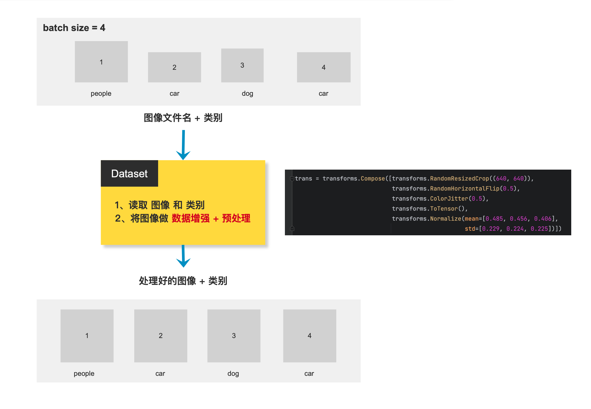

- 目标检测任务

    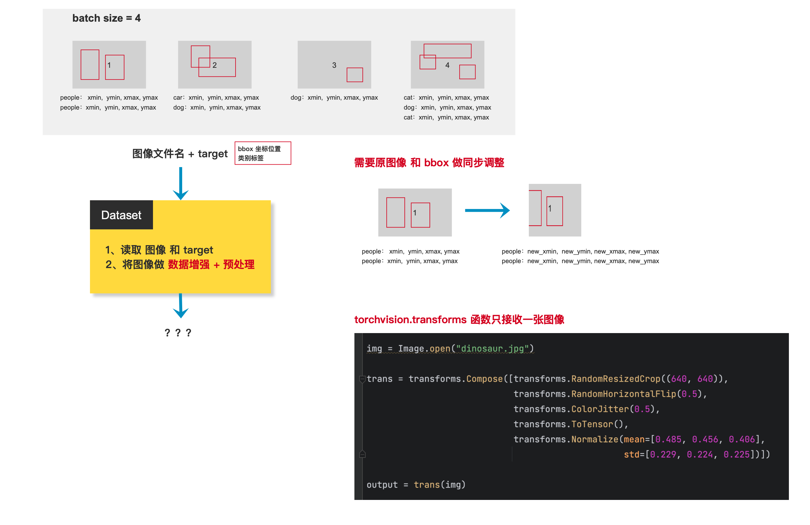

## 数据读取

### Dataset&Dataloader

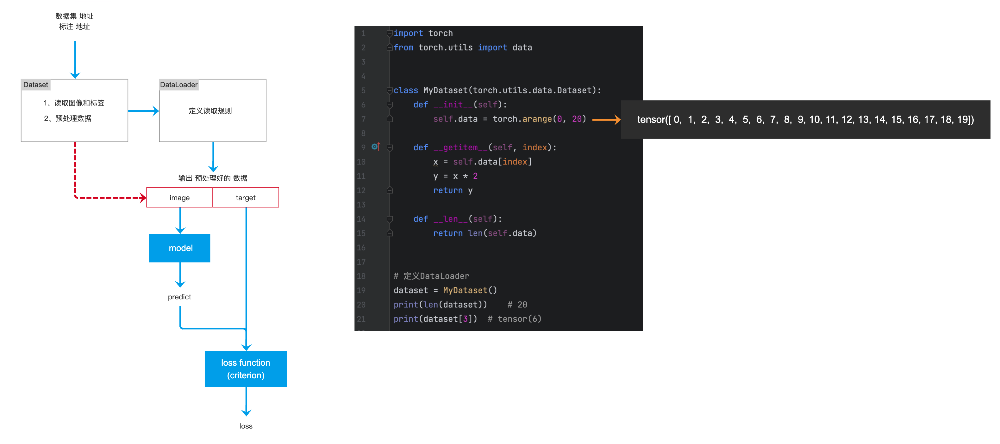

在Datasets类中定义三个方法：

1. 初始化方法：定义属性，例如图像的地址或标注的地址
2. getitem方法：根据索引取图像，进行处理，返回y
3. len方法：数据集的长度

目的：Dataset对 image和target做预处理，需要满足**图像可以直接输入到模型、标签需要和图像保持一致性（标签也需要resize...之类)**


Dataloader执行过程：

1. 从datasets中迭代出batch_size个索引
2. 从迭代出的索引，调用getitem方法，并返回处理后的数据y


### Dataloader

#### 采样方式Sampler

所有Sanmpler都是继承`torch.utils.data.sampler.Sampler`这个抽象类

1. 顺序采样SequentialSampler

    作用：接收一个Dataset对象，输出数据包中样本量的**顺序索引**

    - 内部代码

        ```python
        class SequentialSampler(Sampler):
            def __init__(self, data_source):
                self.data_source = data_source
            def __iter__(self):
                return iter(range(len(self.data_source)))
            def __len__(self):
                return len(self.data_source)
        ```

        `__init__`：接收参数Dataset对象

        `__iter__`：返回一个可迭代对象（返回的是索引值），因为SequentialSampler是顺序采样，所以返回的索引是顺序数值序列

        `__len__`：返回Dataset中数据的个数

    - 使用举例

        ```python
        import torch.utils.data.sampler as sampler
        
        data = list([17, 22, 3, 41, 8])
        seq_sampler = sampler.SequentialSampler(data_source=data)
        
        for index in seq_sampler:
            print("index: {}, data: {}".format(index, data[index]))
        ```

2. 随机采样RandomSampler

    作用：接收一个Dataset对象，输出数据包中样本量的随机索引（可指定是否重复）

    - 内部代码

        ```python
        class RandomSampler(Sampler):
            def __init__(self, data_source, replacement=False, num_samples=None):
                self.data_source = data_source
                self.replacement = replacement
                self._num_samples = num_samples
                
            def num_samples(self):
                if self._num_samples is None:
                    return len(self.data_source)
                return self._num_samples
            
            def __len__(self):
                return self.num_samples
                       
            def __iter__(self):
                n = len(self.data_source)
                if self.replacement:
                    # 生成的随机数是可能重复的
                    return iter(torch.randint(high=n, size=(self.num_samples,), dtype=torch.int64).tolist())
                # 生成的随机数是不重复的
                return iter(torch.randperm(n).tolist())
        ```

        `__init__`：

        ​	`data_source(Dataset)`：采样的Dataset对象

           `replacement(bool)`：如果为True，则抽取的样本是有放回的。默认为False

           `num_samples(int)`：抽取样本的数量，默认是len(dataset)，当replacement为true时，应该被实例化

        `__iter__`：返回一个可迭代对象（返回的是索引），**因为RandmSampler是随机采样，所以返回的索引是随机的数值序列（当replacement=False时，生成的排列是无重复的）**

        `__len__`：返回dataset中的样本量

    - 使用举例

        ```python
        import torch.utils.data.sampler as sampler
        
        data = list([17, 22, 3, 41, 8])
        seq_sampler = sampler.SequentialSampler(data_source=data)
        
        for index in seq_sampler:
            print("index: {}, data: {}".format(index, data[index]))
        ```

3. 批采样BatchSampler

    作用：包装另一个采样器以生成一个小批量索引

    - 内部代码

        ```python
        class BatchSampler(Sampler):
            def __init__(self, sampler, batch_size, drop_last):、
                self.sampler = sampler
                self.batch_size = batch_size
                self.drop_last = drop_last
                
            def __iter__(self):
                batch = []
                for idx in self.sampler:
                    batch.append(idx)
                    # 如果采样个数和batch_size相等则本次采样完成
                    if len(batch) == self.batch_size:
                        yield batch
                        batch = []
                # for 结束后在不需要剔除不足batch_size的采样个数时返回当前batch        
                if len(batch) > 0 and not self.drop_last:
                    yield batch
                    
            def __len__(self):
                # 在不进行剔除时，数据的长度就是采样器索引的长度
                if self.drop_last:
                    return len(self.sampler) // self.batch_size
                else:
                    return (len(self.sampler) + self.batch_size - 1) // self.batch_size
        ```

        参数：

        `sampler`：其他采样器的实例

        `batch_size`：批量大小

        `drop_last`：为True时，如果最后一个batch得到的数据小于batch_size，则丢弃最后一个batch数据

    - 使用举例

        ```python
        import torch.utils.data.sampler as sampler
        data = list([17, 22, 3, 41, 8])
        
        seq_sampler = sampler.SequentialSampler(data_source=data)
        batch_sampler = sampler.BatchSampler(seq_sampler, 2, False )
        
        for index in batch_sampler:
            print(index)
        # [0, 1]
        # [2, 3]
        # [4]
        ```

        


### Dataloader参数

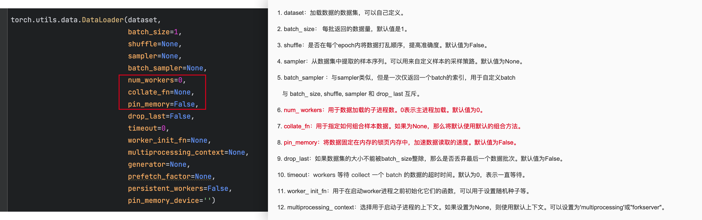

1. pin_memory

    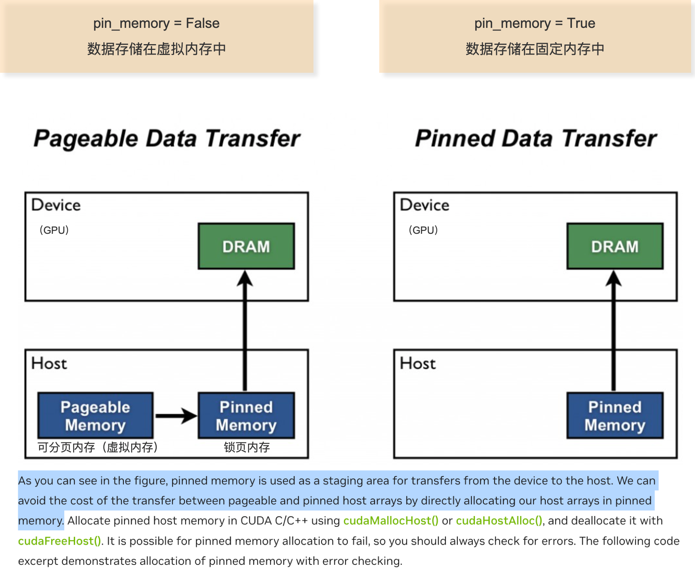

    **Pinned memory (锁页内存)** ：指将一部分内存**锁定在物理内存**中，防止这部分内存被交换到磁盘上或被其他程序使用，可以提高访问速度和可靠性。避免了数据从主机内存到 GPU 显存的复制过程中的页面交换问题。这种固定在物理内存中的内存称为 Pinned memory。

    **Pageable memory (可分页内存)** ： 是一种将物理内存划分成固定的页面，并在需要时将页面交换到磁盘上以释放内存空间的技术。

    - 其中内存被划分为固定大小的块，称为页（page）
    - 在使用 Pageable memory 传输数据时，数据存储在 虚拟内存 中，然后通过页面文件的方式管理数据的加载和卸载。

    **虚拟内存**：将计算机可用的 **物理内存** 和 **磁盘空间** 组合使用，以提供更大的可用内存空间。它使用一个虚拟地址空间来代替物理地址空间，使得每个进程都认为自己有独立的内存。当进程需要访问一个虚拟地址时，操作系统会将它映射到物理地址空间中的一个位置，这个过程称为地址转换。如果物理内存不足，**操作系统会将物理内存中一些不常用的数据暂存到磁盘上**。

2. collate_fn

    - 分类任务

        

    - 目标检测任务

        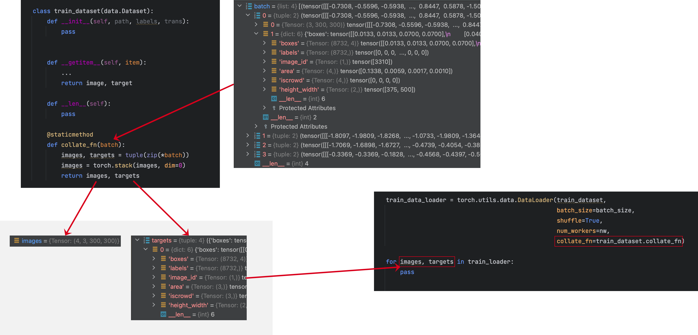

3. num_works

    **开几个进程执行这件事情，每一个work执行一个batch**

    当 num_workers 参数设置得太高时，可能会导致系统资源不足。

    为避免这种情况，通常建议**将 num_workers 参数设置为等于或小于 CPU 核心数**，以有效平衡数据加载效率和系统资源占用率。

    ```python
    batch_size = 16
    nw = min([os.cpu_count(), batch_size if batch_size > 1 else 0, 8])   # number of workers
    train_dataloader = torch.utils.data.DataLoader(train_dataset,
                                                   batch_size=batch_size,
                                                   num_workers=nw,
                                                   shuffle=True,
                                                   pin_memory=True,
                                                   collate_fn=train_dataset.collate_fn)
    ```


### torch.datasets模块

https://pytorch.org/vision/stable/datasets.html#image-detection-or-segmentation


#### 常用数据集下载

**下载mnist数据集**

 MNIST  全称：mixed national institute of standards and technology database

https://pytorch.org/vision/stable/generated/torchvision.datasets.MNIST.html?highlight=torchvision+datasets+mnist#torchvision.datasets.MNIST

```python
train_dataset = torchvision.datasets.MNIST(root,    
                                           					train=True,               
                                           					transform=transform,    
                                           					download=True)
```

参数：

- `root`：指定数据集下在哪里
- `train`：如果是true，下载训练集train.pt，如果是false，下载测试集test.pt，默认是true
- `transform`：一系列作用在PIL图片上的转换操作，返回一个数据处理后的版本，可以使用之前学过的ttransform模块
- `download`：是否下载到root指定的位置，如果已经下载，将不再下载

 使用举例 ：

- 因为是单通道，所以 `transforms.Normalize` 的均值和标准差 仅指定了一个值
- 记得把数据集的下载地址换掉，换成你想要它下载到的位置

```python
import torch
import torchvision
from torchvision.transforms import transforms
# import matplotlib.pyplot as plt

batch_size = 5

my_transform = transforms.Compose([transforms.ToTensor(),
                                   transforms.Normalize(mean=[0.5],   # mean=[0.485, 0.456, 0.406]
                                                        std=[0.5])])  # std=[0.229, 0.224, 0.225]
                                                 
train_dataset = torchvision.datasets.MNIST(root="./",    
                                                  train=True,               
                                                  transform=my_transform,    
                                                  download=True)

val_dataset = torchvision.datasets.MNIST(root="./",    
                                         train=False,               
                                         transform=my_transform,    
                                         download=True) 

train_loader = torch.utils.data.DataLoader(train_dataset,
                                           batch_size=batch_size,
                                           shuffle=True)

print(len(train_dataset))  # 60000
print(len(train_loader))   # 12000

iterator = iter(train_loader)  
image, label = next(iterator)
print(image.shape)   # [5, 1, 28, 28] [batch_size, channel, h, w]
print(label)         # [4, 6, 1, 7, 1]

# for i in range(batch_size):
#     plt.subplot(1, batch_size, i+1)
#     plt.title(label[i].item())
#     plt.axis("off")
#     plt.imshow(image[i].permute(1, 2, 0))

# plt.show()
```


## 获取模型

### 模型下载

1. 下载**不带预训练参数**的模型（以resnet50）

    ```python
    from torchvision import models
    
    net = models.resnet50(weights=None)
    # 等价写法
    net = models.resnet50()
    ```

    支持下载的模型https://pytorch.org/vision/stable/models.html

    .png)

2. 下载**带预训练参数**的模型

    ```python
    from torchvision import models
    
    # 加载V1版本权重参数
    model_v1 = models.resnet50(weights=models.ResNet50_Weights.IMAGENET1K_V1)
    # 等价写法
    model_v1 = models.resnet50(weights="IMAGENET1K_V1")
    
    
    # 加载V2版本权重参数
    model_v2 = models.resnet50(weights=models.ResNet50_Weights.IMAGENET1K_V2)
    # 等价写法
    model_v2 = models.resnet50(weights="IMAGENET1K_V2")
    
    
    # 加载默认版本权重参数 （一般默认使用最新版本的参数文件）
    model_v2 = models.resnet50(weights=models.ResNet50_Weights.DEFAULT)
    # 等价写法
    model_v2 = models.resnet50(weights="DEFAULT")
    ```

    参数

    - `weight`：用于指定需要下载的权重版本
    - `progress`：如果为True，会在屏幕上显示下载的模型进度条，默认为true

    可选择的版本https://pytorch.org/vision/stable/models.html


### 新老版本写法差异

[点击跳转](###下载预训练模型torchvision.models)

## 网络搭建

### nn.Sequential、nn.ModuleList、nn.ModuleDict 

1. 简介

    - nn.Sequential、nn.ModuleList、nn.ModuleDict 类都继承自 Module 类

    - nn.Sequential、nn.ModuleList、nn.ModuleDict 语法，类似如下：

        ```python
        net = nn.Sequential(nn.Linear(32, 64), nn.ReLU())
        
        net = nn.ModuleList([nn.Linear(32, 6)4, nn.ReLU()])
        
        net = nn.ModuleDict({'linear': nn.Linear(32, 64), 'act': nn.ReLU()})
        ```

2. 区别

    - `nn.ModuleList` 仅仅是一个储存各种模块的列表，这些模块之间**没有联系也没有顺序**（所以不用保证相邻层的输入输出维度匹配），而且**没有实现 forward 功能**需要自己实现
    - 和`nn.ModuleList` 一样， `nn.ModuleDict` 实例仅仅是存放了一些模块的字典，并**没有定义 forward 函数**需要自己定义
    - 而 `nn.Sequential` 内的模块**需要按照顺序排列**，要保证**相邻层的输入输出大小相匹配**；`nn.sequential` 内部 forward 功能已经实现，直接调用的，不需要再写 forward

    ```python
    import torch
    import torch.nn as nn
    
    net1 = nn.Sequential(nn.Linear(32, 64), nn.ReLU())
    net2 = nn.ModuleList([nn.Linear(32, 64), nn.ReLU()])
    net3 = nn.ModuleDict({'linear': nn.Linear(32, 64), 'act': nn.ReLU()})
    
    # print(net1)
    # print(net2)
    # print(net3)
    
    x = torch.randn(8, 3, 32)
    print(net1(x).shape)
    # print(net2(x).shape)  # 会报错，提示缺少forward
    # print(net3(x).shape)   # 会报错，提示缺少forward
    ```

    为 nn.ModuleList 写 forward 函数

    ```python
    import torch
    import torch.nn as nn
    
    
    class My_Model(nn.Module):
        def __init__(self):
            super(My_Model, self).__init__()
            self.layers = nn.ModuleList([nn.Linear(32, 64),nn.ReLU()])
    
        def forward(self, x):
            for layer in self.layers:
                x = layer(x)
            return x
    
    net = My_Model()
    
    x = torch.randn(8, 3, 32)
    out = net(x)
    print(out.shape)
    ```

    为 nn.ModuleDict 写 forward 函数

    ```python
    import torch
    import torch.nn as nn
    
    
    class My_Model(nn.Module):
        def __init__(self):
            super(My_Model, self).__init__()
            self.layers = nn.ModuleDict({'linear': nn.Linear(32, 64), 'act': nn.ReLU()})
    
        def forward(self, x): 
            # 取出每一层进行迭代
            for layer in self.layers.values():
                x = layer(x)
            return x
    
    net = My_Model()
    x = torch.randn(8, 3, 32)
    out = net(x)
    print(out.shape)
    ```

    将 nn.ModuleList 转换成 nn.Sequential

    ```python
    import torch
    import torch.nn as nn
    
    module_list = nn.ModuleList([nn.Linear(32, 64), nn.ReLU()])
    net = nn.Sequential(*module_list)
    x = torch.randn(8, 3, 32)
    print(net(x).shape)
    ```

    将 nn.ModuleDict 转换成 nn.Sequential

    ```python
    import torch
    import torch.nn as nn
    
    module_dict = nn.ModuleDict({'linear': nn.Linear(32, 64), 'act': nn.ReLU()})
    net = nn.Sequential(*module_dict.values())
    x = torch.randn(8, 3, 32)
    print(net(x).shape)
    ```

    

3. nn.ModuleDict和nn.ModuleList的区别

    - ModuleDict 可以给每个层**定义名字**，ModuleList 不会

    - ModuleList 可以**通过索引**读取，并且**使用 append 添加元素**

        ```python
        import torch.nn as nn
        
        net = nn.ModuleList([nn.Linear(32, 64), nn.ReLU()])
        net.append(nn.Linear(64, 10))
        print(net)
        ```

    - ModuleDict 可以通过 key 读取，并且可以像 字典一样添加元素

        ```python
        import torch.nn as nn
        
        net = nn.ModuleDict({'linear1': nn.Linear(32, 64), 'act': nn.ReLU()})
        net['linear2'] = nn.Linear(64, 128)
        print(net)
        ```

4. nn.ModuleDict和nn.ModuleList与Python list dict的区别

    加入到 ModuleList 、ModuleDict 里面的所有模块的参数会**被自动添加到整个网络中**。

    ```python
    import torch.nn as nn
    
    net = nn.ModuleDict({'linear': nn.Linear(32, 64), 'act': nn.ReLU()})
    
    for name, param in net.named_parameters():
        print(name, param.size()) 
    ```

    

    ```python
    import torch.nn as nn
    
    net = nn.ModuleList([nn.Linear(32, 64), nn.ReLU()])
    
    for name, param in net.named_parameters():
        print(name, param.size())
    ```

​		

### register_buffer、register_parameter

1. register_parameter

    register_parameter() 是 torch.nn.Module 类中的一个方法

    - 作用

        - 用于定义**可学习**的参数
        - 定义的参数可以保存到网络对象的参数中，可以用`net.parameters()` 或 `net.named_parameters()` 查看
        - 定义的参数可用`net.state_dict()` 转换到字典中，进而 保存到网络文件 / 网络参数文件中

    - 函数说明

        ```python
        register_parameter(name,param)
        ```

        - `name`：参数名称

        - `param`：参数张量，必须是`torch.nn.Parameter()` 对象 或 None ，否则报错如下

    - 使用举例

        ```python
        import torch
        import torch.nn as nn
        
        
        class MyModule(nn.Module):
            def __init__(self):
                super(MyModule, self).__init__()
                self.conv1 = nn.Conv2d(in_channels=3, out_channels=6, kernel_size=3, stride=1, padding=1, bias=False)
                self.conv2 = nn.Conv2d(in_channels=6, out_channels=9, kernel_size=3, stride=1, padding=1, bias=False)
        
                self.register_parameter('weight', torch.nn.Parameter(torch.ones(10, 10)))
                self.register_parameter('bias', torch.nn.Parameter(torch.zeros(10)))
        
        
            def forward(self, x):
                x = self.conv1(x)
                x = self.conv2(x)
                x = x * self.weight + self.bias
                return x
        
        
        net = MyModule()
        
        for name, param in net.named_parameters():
            print(name, param.shape)
        
        print('\n', '*'*40, '\n')
        
        for key, val in net.state_dict().items():
            print(key, val.shape) 
        ```

        

2. register_buffer

    register_buffer()是 torch.nn.Module() 类中的一个方法

    - 作用

        - 用于定义**不可学习**的参数
        - 定义的参数**不会被保存到网络对象的参数**中，使用 `net.parameters()` 或 `net.named_parameters()` 查看不到
        - 定义的参数可用 `net.state_dict()` 转换到字典中，进而 保存到网络文件 / 网络参数文件中

        `register_buffer()` 用于在网络实例中 注册缓冲区，存储在缓冲区中的数据，**类似于参数**（但不是参数），它与参数的区别为

        - 参数：可以被优化器更新 （requires_grad=False / True）
        - buffer 中的数据 ： **不会被优化器更新**

    - 函数说明

        ```python
        register_buffer(name，tensor)
        ```

        - `name`：参数名称
        - `tensor`：张量

    - 使用举例

        ```python
        import torch
        import torch.nn as nn
        
        
        class MyModule(nn.Module):
            def __init__(self):
                super(MyModule, self).__init__()
                self.conv1 = nn.Conv2d(in_channels=3, out_channels=6, kernel_size=3, stride=1, padding=1, bias=False)
                self.conv2 = nn.Conv2d(in_channels=6, out_channels=9, kernel_size=3, stride=1, padding=1, bias=False)
        
                self.register_buffer('weight', torch.ones(10, 10))
                self.register_buffer('bias', torch.zeros(10))
        
        
            def forward(self, x):
                x = self.conv1(x)
                x = self.conv2(x)
                x = x * self.weight + self.bias
                return x
        
        
        net = MyModule()
        
        for name, param in net.named_parameters():
            print(name, param.shape)
        
        print('\n', '*'*40, '\n')
        
        for key, val in net.state_dict().items():
            print(key, val.shape)
        ```


### BatchNormlization

batchnormlization实际上就是在一个batch中对每一个channel进行归一化操作

然后按照类似于动量法来更新最后的归一化后的值（可学习的参数）

1. 作用

    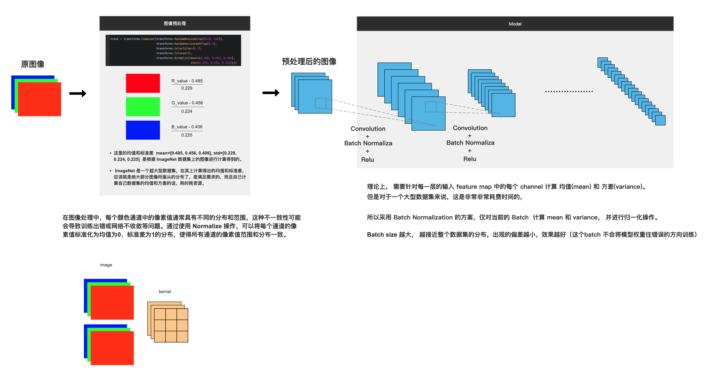

2. 计算方式

    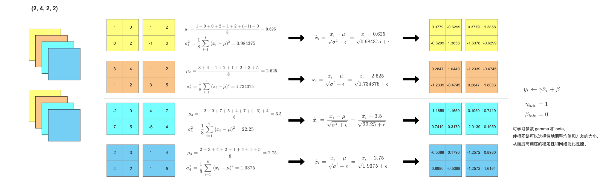

3. 查看BN层中参数的数量

    BN层中有 **weight** 和 **bias** 两个参数（也就是上面计算方式 中的 gamma 和 beta）

    如下代码中，BN层输入的 channel数为 16，每个 channel 有 2个可学习参数，一共有32个可学习参数

    

4. 验证阶段&测试阶段的 Batch Normalization


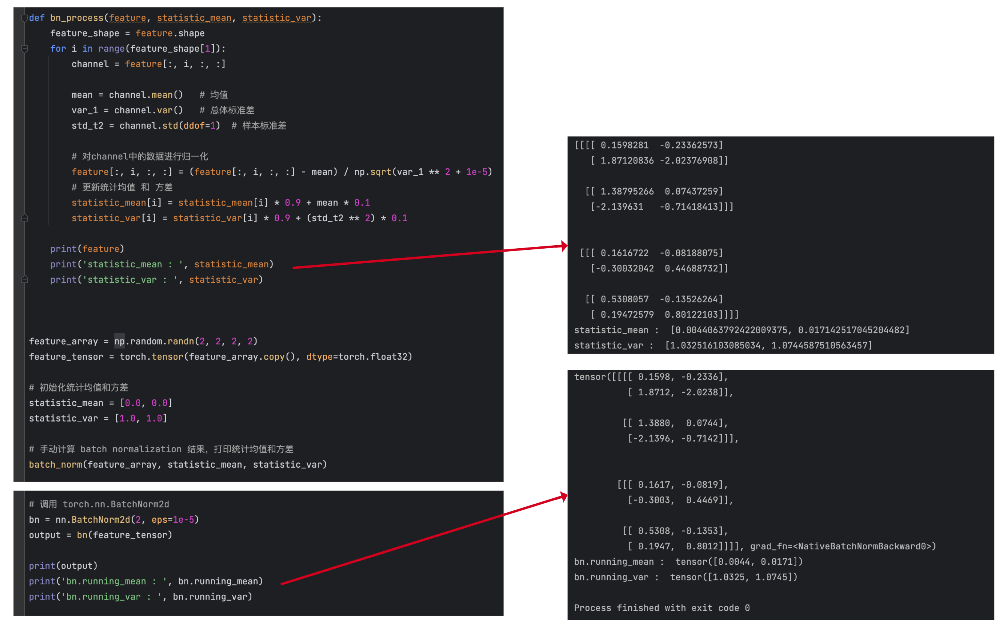

```python
import numpy as np
import torch.nn as nn
import torch


def batch_norm(feature, statistic_mean, statistic_var):
    feature_shape = feature.shape
    # 针对每一个channel
    for i in range(feature_shape[1]):
        channel = feature[:, i, :, :]
        mean = channel.mean()   # 均值
        std_1 = channel.std()   # 总体标准差
        std_t2 = channel.std(ddof=1)  # 样本标准差
        # 对channel中的数据进行归一化
        feature[:, i, :, :] = (channel - mean) / np.sqrt(std_1 ** 2 + 1e-5)
        # 更新统计均值 和 方差(动量法)
        statistic_mean[i] = statistic_mean[i] * 0.9 + mean * 0.1
        statistic_var[i] = statistic_var[i] * 0.9 + (std_t2 ** 2) * 0.1

    print(feature)
    print('statistic_mean : ', statistic_mean)
    print('statistic_var : ', statistic_var)


# [bs, ch, h, w]
feature_array = np.random.randn(2, 2, 2, 2)
feature_tensor = torch.tensor(feature_array.copy(), dtype=torch.float32)

# 初始化统计均值和方差
statistic_mean = [0.0, 0.0]
statistic_var = [1.0, 1.0]

# 手动计算 batch normalization 结果，打印统计均值和方差
batch_norm(feature_array, statistic_mean, statistic_var)

# 调用 torch.nn.BatchNorm2d
bn = nn.BatchNorm2d(2, eps=1e-5)
output = bn(feature_tensor)

print(output)
print('bn.running_mean : ', bn.running_mean)
print('bn.running_var : ', bn.running_var)

```

5. BN层使用节点

    

    这种顺序之所以能够效果良好，是因为批量归一化能够使得输入分布均匀，而 ReLU 又能够将分布中的负值清除，从而达到更好的效果。

6. BN层对卷积层的影响


### BatchNorm LayerNorm GroupNorm

BatchNorm、LayerNorm 和 GroupNorm 都是深度学习中常用的归一化方式。

它们通过将输入归一化到均值为 0 和方差为 1 的分布中，来**防止梯度消失和爆炸**，并**提高模型的泛化能力**。

**LayerNorm**

**Transformer block** 中会使用到 LayerNorm ， 一般输入尺寸形为 ：（batch_size, token_num, dim），会**在最后一个维度做 归一化**： nn.LayerNorm(dim)


对比手动计算的 LN层输出结果 和 调用 `nn.LayerNorm()` 的输出结果

```python
import torch
import torch.nn as nn
import numpy as np

feature_array = np.array([[[[1, 0],  [0, 2]],
                           [[3, 4],  [1, 2]],
                           [[2, 3],  [4, 2]]],

                          [[[1, 2],  [-1, 0]],
                            [[1, 2], [3, 5]],
                            [[1, 4], [1, 5]]]], dtype=np.float32)


feature_array = feature_array.reshape((2, 3, -1)).transpose(0, 2, 1) # [2, 4, 3]
feature_tensor = torch.tensor(feature_array.copy(), dtype=torch.float32)

ln_out = nn.LayerNorm(normalized_shape=3)(feature_tensor)
print(ln_out)

b, token_num, dim = feature_array.shape
feature_array = feature_array.reshape((-1, dim))
for i in range(b*token_num):
    mean = feature_array[i, :].mean()
    var = feature_array[i, :].var()
    print(mean)
    print(var)

    feature_array[i, :] = (feature_array[i, :] - mean) / np.sqrt(var + 1e-5)
print(feature_array.reshape(b, token_num, dim))
```

**Group Norm**


batch size 过大或过小都不适合使用 BN，而是使用 GN。

（1）当 batch size 过大时，BN 会将所有数据归一化到近乎相同的均值和方差。这可能会导致模型在训练时变得非常不稳定，并且很难收敛。

（2）当 batch size 过小时，BN 可能无法有效地学习数据的统计信息


比如，Deformable DETR 中，就用到了 GroupNorm


```python
import torch
import torch.nn as nn
import numpy as np

feature_array = np.array([[[[1, 0],  [0, 2]],
                           [[3, 4],  [1, 2]],
                           [[-2, 9], [7, 5]],
                           [[2, 3],  [4, 2]]],

                          [[[1, 2],  [-1, 0]],
                            [[1, 2], [3, 5]],
                            [[4, 7], [-6, 4]],
                            [[1, 4], [1, 5]]]], dtype=np.float32)

feature_tensor = torch.tensor(feature_array.copy(), dtype=torch.float32)
gn_out = nn.GroupNorm(num_groups=2, num_channels=4)(feature_tensor)
print(gn_out)

feature_array = feature_array.reshape((2, 2, 2, 2, 2)).reshape((4, 2, 2, 2))

for i in range(feature_array.shape[0]):
    channel = feature_array[i, :, :, :]
    mean = feature_array[i, :, :, :].mean()
    var = feature_array[i, :, :, :].var()
    print(mean)
    print(var)

    feature_array[i, :, :, :] = (feature_array[i, :, :, :] - mean) / np.sqrt(var + 1e-5)
feature_array = feature_array.reshape((2, 2, 2, 2, 2)).reshape((2, 4, 2, 2))
print(feature_array)
```

## 迁移学习

迁移学习的优势：

1. 能够快速训练出一个理想的结果
2. 当数据集较小时也能训练出理想的效果

**但是使用别人预训练模型的参数时、要注意别人的数据预处理方式**

为什么迁移学习有用？

在迁移学习中，模型初期已经训练好了一部分参数，这部分参数是浅层的特征，可以被重复利用


**常见的迁移学习方式**

1. 载入权重后训练所有的参数
2. 载入权重后只训练最后几层参数
3. 载入权重后在原网络基础上再添加一层全连接层、仅训练最后一个全连接层

```python
import os
import torch
import torch.nn as nn
from model import resnet34


def main():
    device = torch.device("cuda:0" if torch.cuda.is_available() else "cpu")

    # load pretrain weights
    # download url: https://download.pytorch.org/models/resnet34-333f7ec4.pth
    model_weight_path = "./resnet34-pre.pth"
    assert os.path.exists(model_weight_path), "file {} does not exist.".format(model_weight_path)

    # option1
    # 第一种方式，先加载原来的模型 并导入模型权重
    # 再修改fc层为自己需要的类别数
    net = resnet34()
    net.load_state_dict(torch.load(model_weight_path, map_location=device))
    # change fc layer structure
    in_channel = net.fc.in_features
    net.fc = nn.Linear(in_channel, 5)

    # option2
    # 第二种方式，在模型中修改好我的最后的fc层对应的类别数
    # 将权重放在一个字典中，进行剔除操作
    # 找到fc层
    net = resnet34(num_classes=5)
    pre_weights = torch.load(model_weight_path, map_location=device)
    del_key = []
    for key, _ in pre_weights.items():
        if "fc" in key:
            del_key.append(key)
    # 如果fc层在删除列表中，则删除这一层的权重
    for key in del_key:
        del pre_weights[key]
    
    missing_keys, unexpected_keys = net.load_state_dict(pre_weights, strict=False)
    print("[missing_keys]:", *missing_keys, sep="\n")
    print("[unexpected_keys]:", *unexpected_keys, sep="\n")
    
    
    # option3
    net = resnet34(num_classes=5)
    pre_weights = torch.load(model_weight_path, map_location=device)
    # delete classifier weights
    # 载入除最后一层权重之外的所有权重
    # 只有当神经网络模型中的参数 k 的元素数量（.numel()）与预训练模型中的参数 v 的元素数量相同时，才将这个键值对		包含在 pre_dict 中。
    pre_dict = {k: v for k, v in pre_weights.items() if net.state_dict()[k].numel() == v.numel()}
    # 通过 net.load_state_dict(pre_dict, strict=False) 将 pre_dict 中的权重加载到神经网络模型 net 中
    # missing_keys 是一个列表，包含在加载过程中，模型中存在但是在 pre_weights 中不存在的键。
    # unexpected_keys 是一个列表，包含在加载过程中，pre_weights 中存在但是在模型中不存在的键。
    missing_keys, unexpected_keys = net.load_state_dict(pre_dict, strict=False)
    


if __name__ == '__main__':
    main()

```


### 查看网络的层

#### torchsummary.summary

1. 函数介绍

    作用：通过指定**输入尺寸**，来查看网络中每一层的输出尺寸和每一层的参数数量，**只需要指定input_size**即可，**不需要实际的输入数据**

    ```python
    torchsummary.summary(model, input_size=(3, 224, 224))
    ```

    参数：

    - `model` ：要查看的网络

    - `input_size` ：指定网络输入尺寸，可以指定四个维度:（B, C, H, W），也可以只指定三个维度:（C, H, W）

        如果仅指定三个维度的尺寸（不指定batch_size），那么每一层的输出尺寸 `output shape` 都显示为 -1

2. 使用举例

    ```python
    from torchsummary import summary
    import torchvision.models as models
    
    model = models.alexnet(weights=models.AlexNet_Weights.DEFAULT)
    print(summary(model, (3, 224, 224)))
    ```

    输出

    ```
    ----------------------------------------------------------------
            Layer (type)               Output Shape         Param #
    ================================================================
                Conv2d-1           [-1, 64, 55, 55]          23,296
                  ReLU-2           [-1, 64, 55, 55]               0
             MaxPool2d-3           [-1, 64, 27, 27]               0
                Conv2d-4          [-1, 192, 27, 27]         307,392
                  ReLU-5          [-1, 192, 27, 27]               0
             MaxPool2d-6          [-1, 192, 13, 13]               0
                Conv2d-7          [-1, 384, 13, 13]         663,936
                  ReLU-8          [-1, 384, 13, 13]               0
                Conv2d-9          [-1, 256, 13, 13]         884,992
                 ReLU-10          [-1, 256, 13, 13]               0
               Conv2d-11          [-1, 256, 13, 13]         590,080
                 ReLU-12          [-1, 256, 13, 13]               0
            MaxPool2d-13            [-1, 256, 6, 6]               0
    AdaptiveAvgPool2d-14            [-1, 256, 6, 6]               0
              Dropout-15                 [-1, 9216]               0
               Linear-16                 [-1, 4096]      37,752,832
                 ReLU-17                 [-1, 4096]               0
              Dropout-18                 [-1, 4096]               0
               Linear-19                 [-1, 4096]      16,781,312
                 ReLU-20                 [-1, 4096]               0
               Linear-21                 [-1, 1000]       4,097,000
    ================================================================
    Total params: 61,100,840
    Trainable params: 61,100,840
    Non-trainable params: 0
    ----------------------------------------------------------------
    Input size (MB): 0.57
    Forward/backward pass size (MB): 8.38
    Params size (MB): 233.08
    Estimated Total Size (MB): 242.03
    ----------------------------------------------------------------
    None
    ```

    

#### netron

1. **在线版**

    浏览器访问：https://netron.app/ 点击 “Open Model” 按钮，选择要可视化的模型文件即可

2. **离线版**

    终端进行安装： `pip install netron`

    安装完成后，在脚本中 调用包 `import netron`

    运行程序 `netron.start("model.onnx")`， 会自动打开浏览器进行可视化 （最后有例子）

**3. 支持的网络模型**


我习惯用 pytorch，但是 netron 对 pytorch 的 `.pt` 和 `.pth` 文件不是很友好，所以，我都是先转换为 onnx 格式，再进行可视化，下面举例。

另外，netron 可以直接可视化 yolo （DarkNet 框架）的 .cfg文件，非常方便

4. 举例

    一般情况下，netron 只展示最初的输入尺寸 和 最后的输出尺寸，中间层的尺寸都是不展示的（如下）。

    

    可以通过 `onnx.save(onnx.shape_inference.infer_shapes(onnx.load("model.onnx")), "model.onnx")` 进行处理，

    这样中间的每一层的输入输出就都会推理出 并可视化出来了。

    ```python
    import torch
    import torch.nn as nn
    import netron
    import onnx
    from onnx import shape_inference
    
    
    class My_Net(nn.Module):
        def __init__(self):
            super(My_Net, self).__init__()
            self.layer1 = nn.Sequential(
                nn.Conv2d(3, 16, kernel_size=3, stride=1, padding=1, bias=False),
                nn.BatchNorm2d(16),
                nn.LeakyReLU(),
            )
    
            self.layer2 = nn.Sequential(
                nn.Conv2d(16, 32, kernel_size=1, bias=False),
                nn.BatchNorm2d(32),
                nn.LeakyReLU(),
            )
    
        def forward(self, x):
            x = self.layer1(x)
            x = self.layer2(x)
            return x
    
    
    net = My_Net()
    # 输入图像
    img = torch.rand((1, 3, 224, 224))
    # 转为onnx格式
    torch.onnx.export(model=net, args=img, f='model.onnx', input_names=['image'], output_names=['feature_map'])
    # 保存中间层输出
    onnx.save(onnx.shape_inference.infer_shapes(onnx.load("model.onnx")), "model.onnx")
    # 网络要是搭建不对会报错
    netron.start("model.onnx")
    ```

    

#### TensorBoardX

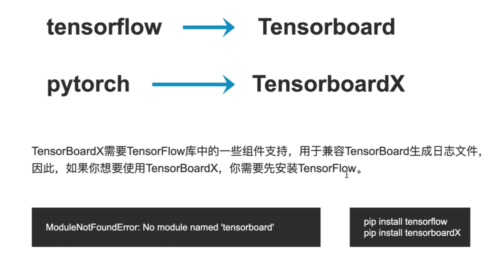

使用 `TensorBoardX` 查看网络结构，分为三个步骤：

 1）实例化一个 `SummaryWriter` 对象

​			实例化 `SummaryWriter` 对象的时候，有三种指定参数的方式

```python
from tensorboardX import SummaryWriter

# 提供一个路径，将使用该路径来保存日志
writer1 = SummaryWriter(log_dir='./runs')

# 无参数，默认使用 runs/日期时间 路径来保存日志，比如：'runs/Aug20-17-20-33'
writer2 = SummaryWriter()

# 提供一个 comment 参数，将使用 runs/日期时间-comment 路径来保存日志，比如： 'runs/Aug20-17-20-33-resnet'
writer3 = SummaryWriter(comment='_resnet')
```

 2）让 `SummaryWriter ` 对象调用 `add_graph` 方法来获取模型结构

参数

- `model` : 待可视化的网络模型
- `input_to_model` : 要输入网络的数据（一个tensor）

```python
add_graph(model, input_to_model=None, verbose=False, **kwargs)
```

 3）打开浏览器查看 模型的可视化起结构

在终端 cd 到 logs目录所在的同级目录，输入如下命令

```bash
tensorboard --logdir ./logs --port 6006
```

注意：./logs 是日志路径，**路径不要加双引号**

在浏览器窗口输入地址：http://localhost:6006/ ， 查看模型网络结构

### 查看网络的参数

#### net.parameters()

`net.parameters()` 用于查看网络中的参数

```python
import torch

# 搭建网络
class MyModel(torch.nn.Module):
    def __init__(self):
        super().__init__()
        self.layer1 = torch.nn.Sequential(
            torch.nn.Linear(3, 4),
            torch.nn.Linear(4, 3),
        )
        self.layer2 = torch.nn.Linear(3, 6)

        self.layer3 = torch.nn.Sequential(
            torch.nn.Linear(6, 7),
            torch.nn.Linear(7, 5),
        )

    def forward(self, x):
        x = self.layer1(x)
        x = self.layer2(x)
        x = self.layer3(x)
        return x
      
# 构造网络对象
net = MyModel()

for param in net.parameters():
    print(param.shape)
```

输出

```python
torch.Size([4, 3])
torch.Size([4])
torch.Size([3, 4])
torch.Size([3])
torch.Size([6, 3])
torch.Size([6])
torch.Size([7, 6])
torch.Size([7])
torch.Size([5, 7])
torch.Size([5])
```

#### net.named_parameters()

`net.parameters()` 用于查看网络中的参数名和 参数

```python
import torch

# 搭建网络
class MyModel(torch.nn.Module):
    def __init__(self):
        super().__init__()
        self.layer1 = torch.nn.Sequential(
            torch.nn.Linear(3, 4),
            torch.nn.Linear(4, 3),
        )
        self.layer2 = torch.nn.Linear(3, 6)

        self.layer3 = torch.nn.Sequential(
            torch.nn.Linear(6, 7),
            torch.nn.Linear(7, 5),
        )

    def forward(self, x):
        x = self.layer1(x)
        x = self.layer2(x)
        x = self.layer3(x)
        return x
      
# 构造网络对象
net = MyModel()

for name, param in net.named_parameters():
    print(name, param.shape)
```

输出

```python
layer1.0.weight torch.Size([4, 3])
layer1.0.bias torch.Size([4])
layer1.1.weight torch.Size([3, 4])
layer1.1.bias torch.Size([3])
layer2.weight torch.Size([6, 3])
layer2.bias torch.Size([6])
layer3.0.weight torch.Size([7, 6])
layer3.0.bias torch.Size([7])
layer3.1.weight torch.Size([5, 7])
layer3.1.bias torch.Size([5])
```


#### net.state_dict()

`net.state_dict()` 会将网路中的 参数名 和参数 转换为 字典的格式

（我们经常用它 将参数转换为字典的格式，然后再保存起来）

```python
import torch

# 搭建网络
class MyModel(torch.nn.Module):
    def __init__(self):
        super().__init__()
        self.layer1 = torch.nn.Sequential(
            torch.nn.Linear(3, 4),
            torch.nn.Linear(4, 3),
        )
        self.layer2 = torch.nn.Linear(3, 6)

        self.layer3 = torch.nn.Sequential(
            torch.nn.Linear(6, 7),
            torch.nn.Linear(7, 5),
        )

    def forward(self, x):
        x = self.layer1(x)
        x = self.layer2(x)
        x = self.layer3(x)
        return x
      
# 构造网络对象
net = MyModel()

for key, value in net.state_dict().items():
    print(key, value.shape)
```

输出

```python
layer1.0.weight torch.Size([4, 3])
layer1.0.bias torch.Size([4])
layer1.1.weight torch.Size([3, 4])
layer1.1.bias torch.Size([3])
layer2.weight torch.Size([6, 3])
layer2.bias torch.Size([6])
layer3.0.weight torch.Size([7, 6])
layer3.0.bias torch.Size([7])
layer3.1.weight torch.Size([5, 7])
layer3.1.bias torch.Size([5])
```


### 增删改网络的层

#### 删除网络的层

1. 删除整个classifier层

    `del alexnet.classifier`

    ```python
    import torch.nn as nn
    import torchvision.models as models
    
    alexnet = models.alexnet(weights=models.AlexNet_Weights.DEFAULT)
    
    del alexnet.classifier
    print(alexnet)
    ```

    输出

    ```
    AlexNet(
      (features): Sequential(
        (0): Conv2d(3, 64, kernel_size=(11, 11), stride=(4, 4), padding=(2, 2))
        (1): ReLU(inplace=True)
        (2): MaxPool2d(kernel_size=3, stride=2, padding=0, dilation=1, ceil_mode=False)
        (3): Conv2d(64, 192, kernel_size=(5, 5), stride=(1, 1), padding=(2, 2))
        (4): ReLU(inplace=True)
        (5): MaxPool2d(kernel_size=3, stride=2, padding=0, dilation=1, ceil_mode=False)
        (6): Conv2d(192, 384, kernel_size=(3, 3), stride=(1, 1), padding=(1, 1))
        (7): ReLU(inplace=True)
        (8): Conv2d(384, 256, kernel_size=(3, 3), stride=(1, 1), padding=(1, 1))
        (9): ReLU(inplace=True)
        (10): Conv2d(256, 256, kernel_size=(3, 3), stride=(1, 1), padding=(1, 1))
        (11): ReLU(inplace=True)
        (12): MaxPool2d(kernel_size=3, stride=2, padding=0, dilation=1, ceil_mode=False)
      )
      (avgpool): AdaptiveAvgPool2d(output_size=(6, 6))
    )
    ```

    

2. 删除整个classifier第6层

    del alexnet.classifier[6]`

    ```python
    import torch.nn as nn
    import torchvision.models as models
    
    alexnet = models.alexnet(weights=models.AlexNet_Weights.DEFAULT)
    
    del alexnet.classifier[6]
    print(alexnet)
    ```

    输出

    ```python
    AlexNet(
      (features): Sequential(
        (0): Conv2d(3, 64, kernel_size=(11, 11), stride=(4, 4), padding=(2, 2))
        (1): ReLU(inplace=True)
        (2): MaxPool2d(kernel_size=3, stride=2, padding=0, dilation=1, ceil_mode=False)
        (3): Conv2d(64, 192, kernel_size=(5, 5), stride=(1, 1), padding=(2, 2))
        (4): ReLU(inplace=True)
        (5): MaxPool2d(kernel_size=3, stride=2, padding=0, dilation=1, ceil_mode=False)
        (6): Conv2d(192, 384, kernel_size=(3, 3), stride=(1, 1), padding=(1, 1))
        (7): ReLU(inplace=True)
        (8): Conv2d(384, 256, kernel_size=(3, 3), stride=(1, 1), padding=(1, 1))
        (9): ReLU(inplace=True)
        (10): Conv2d(256, 256, kernel_size=(3, 3), stride=(1, 1), padding=(1, 1))
        (11): ReLU(inplace=True)
        (12): MaxPool2d(kernel_size=3, stride=2, padding=0, dilation=1, ceil_mode=False)
      )
      (avgpool): AdaptiveAvgPool2d(output_size=(6, 6))
      (classifier): Sequential(
        (0): Dropout(p=0.5, inplace=False)
        (1): Linear(in_features=9216, out_features=4096, bias=True)
        (2): ReLU(inplace=True)
        (3): Dropout(p=0.5, inplace=False)
        (4): Linear(in_features=4096, out_features=4096, bias=True)
        (5): ReLU(inplace=True)
      )
    )
    ```

    

3. 删除classifier层的最后两层

    `alexnet.classifier = alexnet.classifier[:-2]`

    ```python
    import torch.nn as nn
    import torchvision.models as models
    
    alexnet = models.alexnet(weights=models.AlexNet_Weights.DEFAULT)
    # 切片
    alexnet.classifier = alexnet.classifier[:-2]
    print(alexnet)
    ```

#### 修改网络的层

1. 修改classifier层第6层

    将 classifier 层中的第6层由 `Linear(in_features=4096, out_features=1000, bias=True)` 修改为 `Linear(in_features=4096, out_features=1024, bias=True)`

    ```python
    import torch.nn as nn
    import torchvision.models as models
    
    alexnet = models.alexnet(weights=models.AlexNet_Weights.DEFAULT)
    
    alexnet.classifier[6] = nn.Linear(in_features=4096, out_features=1024)
    print(alexnet)
    ```

#### 增加网络的层

1. 添加单层

    ```
    import torch.nn as nn
    import torchvision.models as models
    
    alexnet = models.alexnet(weights=models.AlexNet_Weights.DEFAULT)
    
    alexnet.classifier.add_module('7', nn.ReLU(inplace=True))
    alexnet.classifier.add_module('8', nn.Linear(in_features=1000, out_features=20))
    print(alexnet)
    ```

2. 一次添加多层

    通过 `nn.Sequential` 构造网络片段，一次性往网络中添加多个层

    ```
    import torch.nn as nn
    import torchvision.models as models
    
    alexnet = models.alexnet(weights=models.AlexNet_Weights.DEFAULT)
    
    block = nn.Sequential(nn.ReLU(inplace=True),
                          nn.Linear(in_features=1000, out_features=20))
    alexnet.add_module('block', block)
    print(alexnet)
    ```

    


### 模型/参数保存与加载

1. 加载模型 + 参数

    `'resnet50.pth'` 为模型+预训练参数文件（.pth 文件中既有模型又有参数）

    ```python
    import torch
    import torchvision.models as models
    
    # 加载模型+参数
    net = torch.load("resnet50.pth")
    ```

2. 只加载参数

    `'resnet50_weight.pth'` 为预训练参数文件（.pth 文件中只有参数）

    ```python
    import torch
    import torchvision.models as models
    
    
    # 加载不带参数的 resnet50 网络
    resnet50 = models.resnet50(weights=None)  
    
    # 往 resnet50 网络中加载参数
    resnet50.load_state_dict(torch.load('resnet50_weight.pth'))  # 使用参数 map_location=device 指定下载到cpu还是gpu
    ```

3. 保存模型 + 参数

    ```python
    import torch
    import torchvision.models as models
    
    #  下载 resnet50 的网络和参数
    resnet50 = models.resnet50(weights=models.ResNet50_Weights.DEFAULT)
    
    # 保存模型 + 参数 到 resnet50.pth 文件中
    torch.save(resnet50, 'resnet50.pth')
    ```

4. 只保存参数

    ```python
    import torch
    import torchvision.models as models
    
    # 下载 resnet50 的网络和参数
    resnet50 = models.resnet50(weights=models.ResNet50_Weights.DEFAULT)
    
    # 仅保存模型的参数 到 resnet50_weight.pth 文件中
    torch.save(resnet50.state_dict(), 'resnet50_weight.pth')
    ```

    说明：`resnet50.state_dict()` 是将resnet50网络中的参数 读取出来，并转换为字典

### 下载预训练模型torchvision.models

`Pytorch` 提供了许多任务的 模型 和 预训练好的参数，可直接通过 `torchvision.models()` 进行下载。

比如像分类任务，pytorch 就提供了如下模型以及预训练好的参数，更多请查看官网：https://pytorch.org/vision/stable/models.html


1. 使用方法

    调用方式类似如下，如果需要**加载带预训练参数的网络**，类似 `ResNet50_Weights.IMAGENET1K_V1` 的参数名称，可从官网进行查看（如上，右图左列）

    ```python
    from torchvision import models
    
    # 加载resnet50网络（不带参数）
    models.resnet50(weights=None)
    models.resnet50()
    
    # 加载带预训练参数的resnet50网络
    models.resnet50(weights=models.ResNet50_Weights.IMAGENET1K_V1)
    models.resnet50(weights="IMAGENET1K_V1")
    ```

    权重参数 `weights=model.ResNet50_Weights.IMAGENET1K_V1` 中， `IMAGENET1K_V1` 表示的是 ResNet-50 在 ImageNet 数据集上进行预训练的第一个版本的权重参数文件。是一个版本标识符。

    如果你**不知道哪个权重文件的版本是最新的**，没关系，直接**选择默认DEFAULT**即可。

    官方会随着 torchvision 的升级而让 DEFAULT 权重文件版本保持在最，如下所示：

    ```python
    from torchvision import models
    
    model_new = models.resnet50(weights=models.ResNet50_Weights.DEFAULT)
    ```

    

2. 旧版本报错

    如果PyTorch 和 torchvision 更新到了较新的版本，却使用如下旧版本的写法，则会报错

    ```python
    from torchvision import models
    
    # 加载resnet50网络（不带参数）
    models.resnet50(pretrained=False)  # 旧版本写法，已弃用
    
    # 加载带预训练参数的resnet50网络
    models.resnet50(pretrained=True)  # 旧版本写法，已弃用
    ```

    

3. why新版写法

    使用新版本写法 `weights=预训练模型参数版本` ，相当于我们掌握了预训练权重参数文件的选择权

    ```python
    from torchvision import models
    
    # 加载精度为76.130%的旧权重参数文件V1
    model_v1 = models.resnet50(weights=models.ResNet50_Weights.IMAGENET1K_V1)
    # 等价写法
    model_v1 = models.resnet50(weights="IMAGENET1K_V1")
    
    # 加载精度为80.858%的新权重参数文件V2
    model_v2 = models.resnet50(weights=models.ResNet50_Weights.IMAGENET1K_V2)
    # 等价写法
    model_v1 = models.resnet50(weights="IMAGENET1K_V2")
    ```

    

### 参数冻结

将resnet50前段参数加载到yolov1的backbone


```python
from torchvision import models
import torch
from torchsummary import summary
from resnet import resnet50


# ------------------------------------------------------------
#  任务一 ：
#  1、将模型A 作为backbone，修改为 模型B
#  2、模型A的预训练参数 加载到 模型B上
# ------------------------------------------------------------

resnet_modified = resnet50()
new_weights_dict = resnet_modified.state_dict()

resnet = models.resnet50(weights=models.ResNet50_Weights.DEFAULT)
weights_dict = resnet.state_dict()

for k in weights_dict.keys():
    if k in new_weights_dict.keys() and not k.startswith('fc'):
        new_weights_dict[k] = weights_dict[k]
resnet_modified.load_state_dict(new_weights_dict)
# resnet_modified.load_state_dict(new_weights_dict, strict=False)


# --------------------------------------------------
#  任务二：
#  冻结与训练好的参数
# --------------------------------------------------
params = []
train_layer = ['layer5', 'conv_end', 'bn_end']
for name, param in resnet_modified.named_parameters():
    if any(name.startswith(prefix) for prefix in train_layer):
        print(name)
        params.append(param)
    else:
        param.requires_grad = False

optimizer = torch.optim.SGD(params, lr=0.001, momentum=0.9, weight_decay=5e-4)


```

**迁移学习中模型参数加载的方式**

```

```


## Transformer

### 注意力机制

**Attention 机制听起来高大上，其关键就是学出一个权重分布，然后作用在特征上**。

#### Self Attention

1. qkv的理解

    相似度 = query * key

    总分 = 相似度 * value

2. 计算过程

    

    self attention中的self，表示query key value 都来自自己，每个token都能提取出自己的query key value

    

    **计算公式：**
    $$
    \mathrm{Attention}(Q,K,V)=\mathrm{softmax}(\frac{QK^T}{\sqrt{d_k}})V
    $$
    为什么要除以dk？QK的数值可能会比较大，交叉熵比较小，不方便计算

    

    

    **self attention得到的b1、b2、b3、b4**可以看作是每个token的feature

    **这里的W1 W2 W3权重是共享的，因此可以进行并行计算**

    

    

    

3. 代码实现

    _1.jpg)

    ```python
    import torch.nn as nn
    import torch
    # import matplotlib.pyplot as plt
    
    
    class Self_Attention(nn.Module):
        def __init__(self, dim, dk, dv):
            super(Self_Attention, self).__init__()
            self.scale = dk ** -0.5
            self.q = nn.Linear(dim, dk)
            self.k = nn.Linear(dim, dk)
            self.v = nn.Linear(dim, dv)
    
    
        def forward(self, x):
            q = self.q(x) # [1, 4, 2]
            print(q)
            k = self.k(x) # [1, 4, 2]
            print(k)
            v = self.v(x) # [1, 4, 3]
            print(v)
    
    		# 计算相似度
            attn = (q @ k.transpose(-2, -1)) * self.scale #[1, 4, 4]
            print(attn)
            #print(attn.shape)
            attn = attn.softmax(dim=-1)
            print(attn)
    		
            # 计算最终得分向量
            x = attn @ v
            #print(x.shape)
            print(x)
            return x
    
    
    att = Self_Attention(dim=2, dk=2, dv=3)
    x = torch.rand((1, 4, 2))
    output = att(x)
    
    ```

    

4. 位置编码

    self  attention没有位置信息，交换token，输出的feature是一样的，因此加入位置编码

    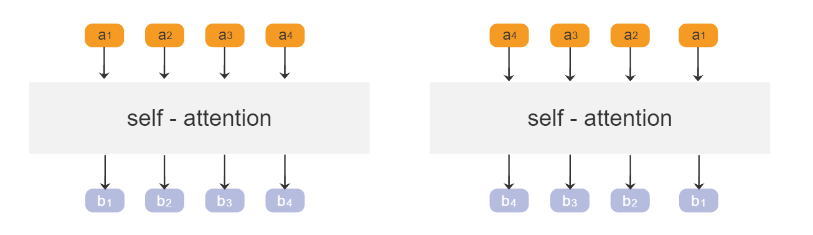

    - 通过公式生成位置编码
        $$
        \begin{aligned}PE_{(pos,2i)}&=sin(pos/10000^{2i/d_{\mathrm{model}}})\\\\PE_{(pos,2i+1)}&=cos(pos/10000^{2i/d_{\mathrm{model}}})\end{aligned}
        $$
        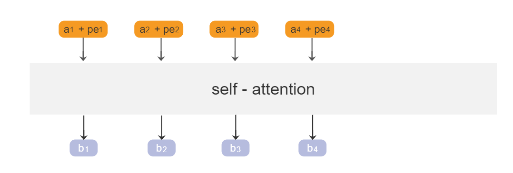

        直接对token的feature 加上 pe1，这个a1 和 pe1维度是一样的，数值进行相加

        位置编码的生成，第几个token第几个位置，对应不同的编码

        

    - 生成可学习的位置编码

#### Multi-Head Attention


实际计算中，先计算出dmodel长度的qkv，然后对其拆分成h份，每一份是dmodel / h 的长度

在每个head中,进行qkv计算，得到每个token的feature

最后将每个token在多个head中的feature concat起来


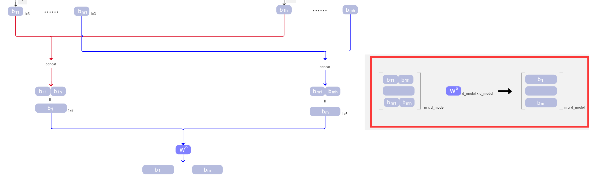

最后连一个全连接层，将直接concat起来的feature再平滑一下

**代码实现**

```python
from math import sqrt
import torch
import torch.nn as nn


class MultiHeadSelfAttention(nn.Module):

    def __init__(self, dim_in, d_model, num_heads=3):
        super(MultiHeadSelfAttention, self).__init__()

        self.dim_in = dim_in
        self.d_model = d_model
        self.num_heads = num_heads

        # 维度必须能被num_head 整除
        assert d_model % num_heads == 0, "d_model must be multiple of num_heads"

        # 定义线性变换矩阵
        self.linear_q = nn.Linear(dim_in, d_model)
        self.linear_k = nn.Linear(dim_in, d_model)
        self.linear_v = nn.Linear(dim_in, d_model)
        self.scale = 1 / sqrt(d_model // num_heads)

        # 最后的线性层
        self.fc = nn.Linear(d_model, d_model)

    def forward(self, x):
        # x: tensor of shape (batch, n, dim_in)
        batch, n, dim_in = x.shape
        assert dim_in == self.dim_in

        nh = self.num_heads
        dk = self.d_model // nh  # dim_k of each head

        q = self.linear_q(x).reshape(batch, n, nh, dk).transpose(1, 2)  # (batch, nh, n, dk)
        k = self.linear_k(x).reshape(batch, n, nh, dk).transpose(1, 2)  # (batch, nh, n, dk)
        v = self.linear_v(x).reshape(batch, n, nh, dk).transpose(1, 2)  # (batch, nh, n, dk)

        dist = torch.matmul(q, k.transpose(2, 3)) * self.scale  # batch, nh, n, n
        dist = torch.softmax(dist, dim=-1)  # batch, nh, n, n

        att = torch.matmul(dist, v)  # batch, nh, n, dv
        att = att.transpose(1, 2).reshape(batch, n, self.d_model)  # batch, n, dim_v

        # 最后通过一个线性层进行变换
        output = self.fc(att)

        return output


x = torch.rand((1, 4, 2))
multi_head_att = MultiHeadSelfAttention(x.shape[2], 6, 3)  # (6, 3)
output = multi_head_att(x)

```


#### Cross Attention

### Vision Transformer（ViT）

将图像转换成一系列的token，将图像分割开，每一个作为一个token，显然比较吃计算

因此选择将图像分割成小的patchs，将每一个patchs enbedding成一个token


1. patch embeding

    


2. class embedding and positional embedding

    **位置编码和class编码**都是可学习的编码

    

    

### Swin Transformer

### DETR 目标检测

### Deformable DETR


## 损失函数

核心思想：对于损失函数，我们认为，损失函数越接近于0，预测的越精确

因此我们定义损失函数的值域时，要保证：

精确程度      精确       不精确

Loss                0             比较大

### 交叉熵损失

假设类别预测的结果为如下表：


交叉熵损失函数公式：$loss(x,class)=-log(\frac{e^{x[class]}}{\sum_je^{xj}})=-x_{[class]}+log(\sum_je^{x_j})$

1. softmax函数    $softmax(x_i)=\frac{e^{x_i}}{\sum_je^{x_j}}$

    - 经过$e^{x}$运算，将$x$转换为非负数，因为概率为非负
    - softmax函数得出的结果是样本被预测到每个类别的概率，所有类别的概率相加和为1

    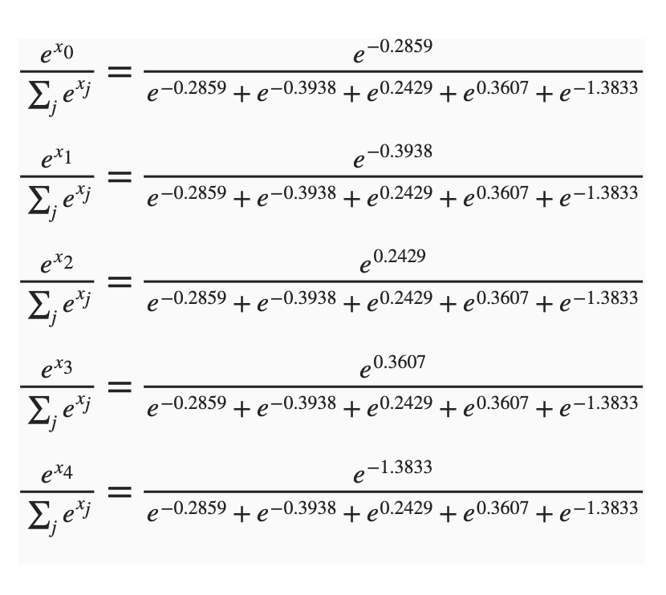

2. 取出真实分类的那个概率，我们希望它的值是100%

    class = 2   $\frac{e^{x_{[class]}}}{\sum_je^{x_j}}=0.1538$

3. 作为损失函数，后面需要求导比较麻烦，所以最好想办法转换为加减形式，最理想的办法是取对数

    $log\frac{e^{x_{[class]}}}{\sum_je^{x_j}}=loge^{x_{[class]}}-log\sum_je^{x_j}=x_{[class]}-log\sum_je^{x_j}$

    由于对数单调递增，求$\frac{e^{x_{[class]}}}{\sum_je^{x_j}}$最大值的问题，变为求$\log\frac{e^{x[class]}}{\sum_je^{x_j}}$最大值的问题。$\frac{e^{x_{[class]}}}{\sum_je^{x_j}}$取值范围是（0，1），最大值是1，取对数之后$\log\frac{e^{x[class]}}{\sum_je^{x_j}}$取值范围是$\begin{bmatrix}-\infty,0\end{bmatrix}$，最大值是0

4. 作为损失函数的意义是：当**预测结果越接近真实值**，**损失函数的值越接近0**

    所以我们把$\log\frac{e^{x[class]}}{\sum_je^{x_j}}$取反

    $loss(x,class)=-log(\frac{e^{x[class]}}{\sum_je^{xj}})=-x_{[class]}+log(\sum_je^{x_j})$

    **实际上交叉熵损失就是真实类别下对应的softmax概率的-log**
    $$
    loss(x,class) = -log(P_{class})\\
    P_{class} =\frac{e^{x[class]}}{\sum_je^{xj}}
    $$

    

### 目标检测的损失

目标检测任务的损失函数由Classification和Bounding Box Regression Loss两部分构成

近几年目标检测bbx loss演进路线是

Smooth L1 Loss $\rarr$ IoU Loss $\rarr$ GIoU Loss $\rarr$ CIoU Loss

#### L1 Loss、L2 Loss


x表示模型的预测值，y表示真实值，z = x - y表示预测值和真实值之间的差异

L1 Loss
$$
L_{L1}\left(x,y\right)=\left|x-y\right|=\left|z\right|
$$
L2 Loss
$$
L_{L2}\left(x,y\right)=0.5(x-y)^2=0.5z^2
$$
L1、L2损失函数对z的导数分别为：
$$
\frac{\partial L_{L1}\left(x,y\right)}{\partial z}=\begin{cases}1,&\mathrm{~if~}z\geq0\\-1,&\mathrm{~otherwise}&\end{cases}
$$

- L1 损失函数对z的导数为常数，在训练后期，z很小时，如果learning rate不变，损失函数会在稳定值附近波动，很难收敛到更高的精度

$$
\frac{\partial L_{L2}\left(x,y\right)}{\partial z}=z
$$

- L2 损失函数对z的导数为z，在训练初期，z值很大，使得导数也很大，在训练初期不稳定


基于以上，我们想平衡一下，二者，出现了Smooth L1 Loss


#### Smooth L1 Loss


Smooth L1 Loss最初是在Fast R-CNN论文中提出
$$
L_{smoothL1}\left(x,y\right)=\begin{cases}0.5(x-y)^2=0.5z^2,&\mathrm{~if~}|x-y|<1\\|x-y|-0.5=|z|-0.5,&\mathrm{~otherwise}&\end{cases}
$$
梯度：
$$
\frac{\partial L_{smoothL1}\left(x,y\right)}{\partial z}=\begin{cases}z,&\mathrm{~if~}|x-y|<1\\\pm1,&\mathrm{~otherwise}&\end{cases}
$$


- 当训练初期，z比较大的时候，取下面的，导数为正负1，可用保证较快的收敛
- 当训练后期，z比较小的时候，取上面的，导数为z，可以保证微调

**用于计算bbx坐标的误差**

实际目标检测回归任务中的损失loss为：
$$
L_{loc(t,v)}=\sum_{i\in(x,y,w,h)}smooth_{L1}\left(t_i-v_i\right)
$$
分别求 x y w h的loss，然后相加

缺点：

上面三种Loss用于计算bbx的loss，独立求出x y w h的loss，然后进行相加得到bbx的loss，这种做法假设x y w h是相互独立的，实际上，x y w h是有相关性的

这就引出了IoU Loss

#### IoU Loss


以上情况，L1 Loss 和 L2 Loss分别相同，但是 IoU不相同，明显有的预测的不太好，但是 L1 Loss L2 Loss没法克服这种情况，除此之外，我们在训练的时候用Smooth Loss 在评估的时候却用的 IoU指标，所以，为了避免**模型学习优化和模型评估**目标不一致，我们最好也用IoU来计算损失，并且IoU Loss是将**x y w h这四个值构成的bbx**看作一个整体来进行损失计算的


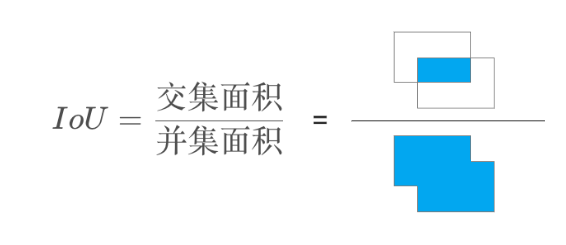

IoU的取值范围为（0， 1），并且当IoU为1时，我们认为是精确的，IoU为0时，是不精确的，因此
$$
\textit{IoU loss}=-ln^{IoU}
$$
IoU Loss取值变为了（0，+∞），并且IoU=1,loss=0

**考虑极端情况**

当预测框和目标框不相交时，$IoU(A,B)=0$，不能反映A B的远近程度，此时的损失函数不可导，IoU loss无法优化两个框不相交的情况，当然也无法评估出不相交情况下，预测框和真实框相差多远，预测效果到什么程度
$$
Loss=-ln^{IoU},\quad\frac{\partial loss}{\partial IoU}=(-ln^{IoU})^{\prime}=-\frac1{IoU}
$$


#### GIoU Loss


外接矩形框C：能正好把A和B都框起来的一个**最小的外接矩形**
$$
GIoU=IoU-\frac{|C-(A\cup B)|}{|C|}
$$
其中ABC分别表示面积

**考虑两种极端情况**

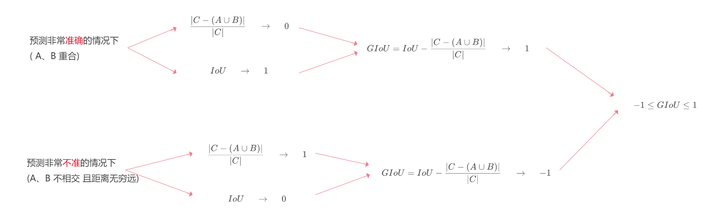
$$
GIoU~Loss=1-GIoU=1-IoU+\frac{|C-(A\cup B)|}{|C|}
$$
预测准的情况下，GIoU Loss = 0

预测不准的情况下，GIoU Loss = 2


**GIoU的缺点**


这种情况下，GIoU相同，模型没法区分两个框的位置关系时怎么样的，从而没法快速收敛


#### DIoU Loss

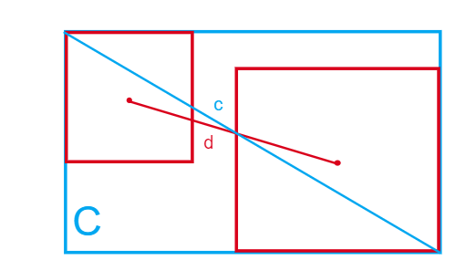
$$
DIoU=IoU-\frac{d^2}{c^2}
$$
d：预测框与真实框中心点的欧式距离

c：外界矩形对角线的长度


$$
DIoULoss=1-DIoU=1-IoU+\frac{d^2}{c^2}
$$
**考虑两种极端情况**

1. 当预测非常准的时候，IoU=1，DIoU = 1 Loss = 0
2. 当预测非常不准的时候，IoU  = 0，DIoU = -1， Loss = 2

**通过最小化 DIoU 损失函数，可以直接拉进预测框 和 真实框之间的距离，加快收敛速度**


#### CIoU Loss

CIoU在DIou的基础上，多考虑了**bbx的长宽比**
$$
CIoU=DIoU-\alpha v=\textit{Io}U-\frac{d^2}{c^2}-\alpha v
$$

- $\alpha$是用来做trade-off的参数：$\alpha=\frac v{(1-IoU)+v}$
    - 当IoU越大，$\alpha$越大，则表示优先考虑高宽比
    - 当IoU越小，$\alpha$越小，则表示优先考虑距离比
- $v$是用来衡量长宽比一致性的参数：$v=\frac4{\pi^2}(arctan\frac{w^{gt}}{h^{gt}}-arctan\frac wh)^2$
    - 当长宽比一致时，v = 0
    - 当长宽比差别比较大时，v = 1

$$
CIoU~Loss=1-CIoU=~1-IoU+\frac{d^2}{c^2}+\alpha v
$$


## 优化器与学习率

### 优化器


超参数：根据经验确定的变量

#### 梯度下降法

传统权重更新算法为最常见、最简单的一种参数更新策略。

**（1）基本思想 ：**先设定一个学习率 $\eta$，参数沿梯度的**反方向移动**。假设需要更新的参数为$w$，梯度为$g$，则其更新策略可表示为：$w\leftarrow w-\eta*g$

**（2）梯度下降法有三种不同的形式：**

- BGD（Batch Gradient Descent）：批量梯度下降，每次参数更新使用 **所有样本**
- SGD（Stochastic Gradient Descent）：随机梯度下降，每次参数更新只使用 **1个样本**
- MBGD（Mini-Batch Gradient Descent）：小批量梯度下降，每次参数更新使用 **小部分数据样本**（mini_batch）

这三个优化算法在训练的时候虽然所采用的的数据量不同，但是他们在进行参数优化的时候，采用的方法是相同的：

 step 1 ：$g=\frac{\partial loss}{\partial w}$

 step 2 ：求梯度的**平均值**

 step 3 ： 更新权重 ：$w\leftarrow w-\eta*g$

**（3）优缺点**

优点：

- 算法简洁，当学习率取值恰当时，可以收敛到 全局最优点(凸函数) 或 局部最优点(非凸函数)。

缺点：

- 对超参数学习率比较敏感：过小导致收敛速度过慢，过大又越过极值点

- 学习率除了敏感，有时还会因其在迭代过程中保持不变，很容易造成算法被**卡在鞍点**的位置。

- **在较平坦的区域**，由于梯度接近于0，优化算法会因误判，在还未到达极值点时，就提前结束迭代，陷入局部极小值。

    

    在训练的时候一般都是使用小批量梯度下降算法，即选择部分数据进行训练，这里把这三种算法统称为传统梯度下降法 。而更优的优化算法从**梯度方面** 和 **学习率方面**对参数更新方式进行优化

##### 一维梯度下降法

我们以 目标函数（损失函数）$f(x)=x^2$ 为例来看一看梯度下降是如何工作的（这里 $x$为参数）

迭代方法为：
$$
x\leftarrow x-\eta*g=x-\eta*\frac{\partial loss}{\partial x}
$$
虽然我们知道最小化$f(x)=x^2$ 的解为 $x=0$，这里依然使用如下代码来观察$x$ 是如何迭代的

这里$x$为模型参数，使用 $x=10$ 作为初始值，并设 学习率$\eta = 0.5$，使用梯度下降法 对$x$迭代10次

```python
import numpy as np
import matplotlib.pyplot as plt

x = 10
lr = 0.2
result = [x]

for i in range(10):
    x -= lr * 2 * x
    result.append(x)
    
f_line = np.arange(-10, 10, 0.1)
plt.plot(f_line, [x * x for x in f_line])
plt.plot(result, [x * x for x in result], '-o')
plt.title('learning rate = {}'.format(lr))
plt.xlabel('x')
plt.ylabel('f(x)')
plt.show()
```


不同的学习率

- 如果使用的学习率太小，将导致$x$的更新非常缓慢，需要更多的迭代。
- 相反，当使用过大的学习率，$x$的迭代不能保证降低$f(x)=x^2$的值，例如，当学习率为$\eta = 1.1$，$x$超出了最优解$x=0$，并逐渐发散


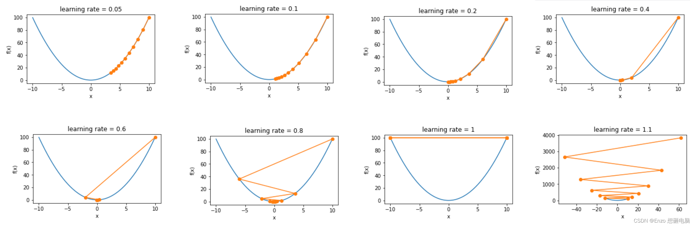

##### 多维梯度下降法

在对一元梯度下降有了了解之后，下面看看多元梯度下降，即考虑 $X=[x_1,x_2,\cdots x_d]^T$ 的情况。

多元损失函数，它的梯度也是多元的，是一个由d个偏导数组成的向量:
$$
\nabla f(X)=[\frac{\partial f_x}{\partial x_1},\frac{\partial f_x}{\partial x_2},\cdots,\frac{\partial f_x}{\partial x_d}]^T
$$
然后选择合适的学率进行梯度下降：
$$
x_i\leftarrow x_i-\eta*\nabla f(X)
$$
下面通过代码可视化它的参数更新过程。构造一个目标函数$f(X)=x_1^2+2x_2^2$，并有二维向量作$X=[x_1,x_2]$为输入，标量作为输出。

损失函数的梯度为 $\nabla f(x)=[2x_1,4x_2]^T$ 。使用梯度下降法，观察从$x_1,x_2$初始位置[-5, -2] 的更新轨迹。

```python
import numpy as np
import matplotlib.pyplot as plt


def loss_func(x1, x2):  # 定义目标函数
    return x1 ** 2 + 2 * x2 ** 2


x1, x2 = -5, -2
eta = 0.4
num_epochs = 20
result = [(x1, x2)]

for epoch in range(num_epochs):
    gd1 = 2 * x1
    gd2 = 4 * x2

    x1 -= eta * gd1
    x2 -= eta * gd2

    result.append((x1, x2))

# print('x1:', result1)
# print('\n x2:', result2)

plt.figure(figsize=(8, 4))
plt.plot(*zip(*result), '-o', color='#ff7f0e')
x1, x2 = np.meshgrid(np.arange(-5.5, 1.0, 0.1), np.arange(-3.0, 1.0, 0.1))
plt.contour(x1, x2, loss_func(x1, x2), colors='#1f77b4')
plt.title('learning rate = {}'.format(eta))
plt.xlabel('x1')
plt.ylabel('x2')
plt.show()
```

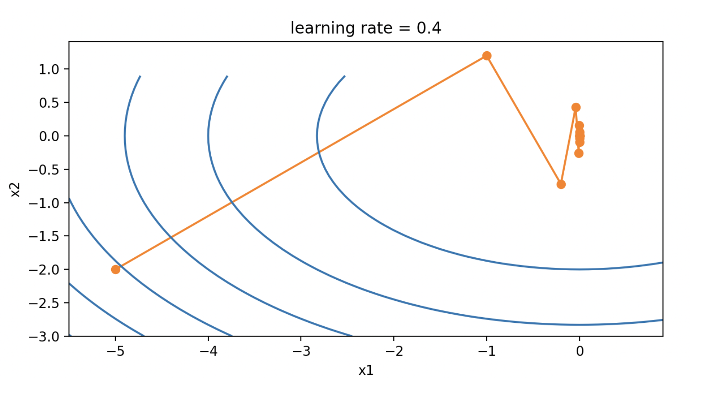


#### 带动量的梯度下降法


思想：让参数的更新具有**惯性**， 每一步更新 都是由前面梯度的累积$v$ 和当前点梯度 $g$组合而成

公式 ：

累计梯度更新：$v\leftarrow\alpha v+(1-\alpha)g$，其中，$\alpha$为动量参数，$v$为累计梯度，$g$为当前梯度，$\eta$为学习率

权重（x1 , x2）更新：$w\leftarrow w-\eta*v$

优点：

1. 加快收敛能帮助参数在 正确的方向上加速前进

2. 他可以帮助跳出局部最小值

    

    

    

    

**实验一 ：**

损失函数： $f(x)=0.1x_1^2+2x_2^2$，$x_1,x_2$初始值分别为-5， -2， 学习率设为 0.4，我们使用 **不带动量**的传统梯度下降法 ，观察其下降过程

预期分析 ： 因为 $x_1,x_2$的系数分别是 0.1 和 2， 这就使得$x_1,x_2$ 的梯度值相差一个量级，如果使用相同的学习率，$x_2$的更新幅度会比$x_1$ 的更大些。

```python
import numpy as np
import matplotlib.pyplot as plt

def loss_func(x1, x2): #定义目标函数
    return 0.1 * x1 ** 2 + 2 * x2 ** 2

x1, x2 = -5, -2
eta = 0.4
num_epochs = 20
result = [(x1, x2)]

for epoch in range(num_epochs):
    gd1 = 0.2 * x1
    gd2 = 4 * x2
    
    x1 -= eta * gd1
    x2 -= eta * gd2
    
    result.append((x1, x2))

plt.plot(*zip(*result), '-o', color='#ff7f0e')
x1, x2 = np.meshgrid(np.arange(-5.5, 1.0, 0.1), np.arange(-3.0, 1.0, 0.1))
plt.contour(x1, x2, loss_func(x1, x2), colors='#1f77b4')
plt.title('learning rate = {}'.format(eta))
plt.xlabel('x1')
plt.ylabel('x2')
plt.show()
```


结果分析：与预想一致，使用相同的学习率，$x_2$的更新幅度会较$x_1$的更大些，变化快得多，而 $x_1$ 收敛速度太慢

**实验二 ：**

依然使用**不带动量**的梯度下降算法，将学习率设置为 0.6。

更新过程如下图：


这时，我们会陷入一个两难的选择：

- 如果选择较小的学习率。$x_1$收敛缓慢
- 如果选择较大的学习率，$x_1$方向会收敛很快，但在 $x_2$方向不会收敛

**实验三：**

我们使用**带动量的** 梯度下降法，将**历史的梯度**考虑在内： 动量参数设为 0.5，将学习率设置为 0.4

累计梯度更新：$v\leftarrow\alpha v+(1-\alpha)g$，其中，$\alpha$为动量参数，$v$为累计梯度，$g$为当前梯度，$\eta$为学习率

权重更新(x1, x2)：$w\leftarrow w-\eta*v$

```python
import numpy as np
import matplotlib.pyplot as plt


def loss_func(x1, x2): #定义目标函数
    return 0.1 * x1 ** 2 + 2 * x2 ** 2


x1, x2 = -5, -2
v1, v2 = 0, 0
eta, alpha = 0.4, 0.5
num_epochs = 20
result = [(x1, x2)]

for epoch in range(num_epochs):
    # 累计梯度更新（考虑历史梯度）
    v1 = alpha * v1 + (1 - alpha) * (0.2 * x1)
    v2 = alpha * v2 + (1 - alpha) * (4 * x2)
    
    x1 -= eta * v1
    x2 -= eta * v2
    
    result.append((x1, x2))

plt.plot(*zip(*result), '-o', color='#ff7f0e')
x1, x2 = np.meshgrid(np.arange(-5.5, 1.0, 0.1), np.arange(-3.0, 1.0, 0.1))
plt.contour(x1, x2, loss_func(x1, x2), colors='#1f77b4')
plt.xlabel('x1')
plt.ylabel('x2')
plt.show()
```


即使我们将学习率设置为0.6， $x_2$的梯度也不会发散了


#### Adagrad

Adagrad优化算法 被称为**自适应学习率**优化算法，

之前我们讲的随机梯度下降法，对所有的参数，都是使用相同的、固定的学习率进行优化的，但是**不同的参数的梯度差异可能很大**，使用相同的学习率，效果不会很好

举例：

假设损失函数是$f(x)=x_1^2+10x_2^2$， $x_1,x_2$的初值分别为$x_1=40, x_2=20$

(通过观察，我们即可知道，$x_1=0,x2=0$ 就是两个参数的极值点 )

$\to\frac{\partial loss}{\partial x_1}=80,\frac{\partial loss}{\partial x_2}=400$    $x_1$将要移动的幅度 小于$x_2$将移动的幅度

而$x_1$距离离极值点 $x_1=0$ 是较远的，所以，我们使用梯度下降法，效果并不会好

**Adagrad 思想：对于不同参数，设置不同的学习率**

方法：**对于每个参数**，初始化一个 **累计平方梯度** $r=0$，然后每次将该参数的梯度平方求和累加到这个变量 $r$上：
$$
r\leftarrow r+g^2
$$
然后，在更新这个参数的时候，学习率就变为：
$$
\frac \eta{\sqrt{r+\delta}}
$$

**权重更新**：
$$
w\leftarrow w-\frac\eta{\sqrt{r+\delta}}*g
$$
其中$g$为梯度，$r$为累计平方梯度(初始为0)；$\eta$为学习率，$\delta$为小参数，避免分母为0，一般取$10^{-10}$

这样，不同的参数由于梯度不同，他们对应的$r$大小也就不同，所以学习率也就不同，这也就实现了自适应的学习率。

**总结**： Adagrad 的核心想法就是，如果一个参数的梯度一直都非常大，那么其对应的学习率就变小一点，防止震荡，而一个参数的梯度一直都非常小，那么这个参数的学习率就变大一点，使得其能够更快地更新，这就是Adagrad算法加快深层神经网络的训练速度的核心。(简而言之，就是让梯度小的参数学习率大一点，梯度大的参数学习率小一点，这样更新更平稳)


#### RMSProp

RMSProp：Root Mean Square Propagation 均方根传播

RMSProp 是在 adagrad 的基础上，进一步在学习率的方向上优化

累计平方梯度：$r\leftarrow\lambda r+(1-\lambda)g^2$

参数更新：$w\leftarrow w-\frac\eta{\sqrt{r+\delta}}*g$

其中$g$为梯度，$r$为累计平方梯度(初始为0)；$\lambda$ 为衰减系数，$\eta$为学习率，$\delta$为小参数，避免分母为0，一般取$10^{-10}$

#### Adam

在Grandient Descent 的基础上，做了如下几个方面的改进：

1. 梯度方面增加了momentum，使用累积梯度：$v\leftarrow\alpha v+(1-\alpha)g$

2. 同 RMSProp 优化算法一样, 对学习率进行优化，使用累积平方梯度：$r\leftarrow\lambda r+(1-\lambda)g^2$

3. 偏差纠正：$\hat{v}=\frac v{1-\alpha^t},\quad\hat{r}=\frac r{1-\lambda^t}$

4. 再如上3点改进的基础上，权重更新：
    $$
    w\leftarrow w-\frac\eta{\sqrt{\hat{r}+\delta}}*\hat{v}
    $$

**为啥要偏差纠正？**

第1次更新时，$v_1\leftarrow\alpha v_0+(1-\alpha)g_1$，$v_0$初始值为0，且$\alpha$初始值一般会设置为接近1，因此$t$较小时，$v$的值时偏向于0的

```python
def adam(learning_rate, beta1, beta2, epsilon, var, grad, m, v, t):
    m = beta1 * m + (1 - beta1) * grad
    v = beta2 * v + (1 - beta2) * grad * grad
    m_hat = m / (1 - beta1 ** t)
    v_hat = v / (1 - beta2 ** t)
    var = var - learning_rate * m_hat / (np.sqrt(v_hat) + epsilon)
    return var, m, v
```


### 学习率与warm up策略

#### 学习率

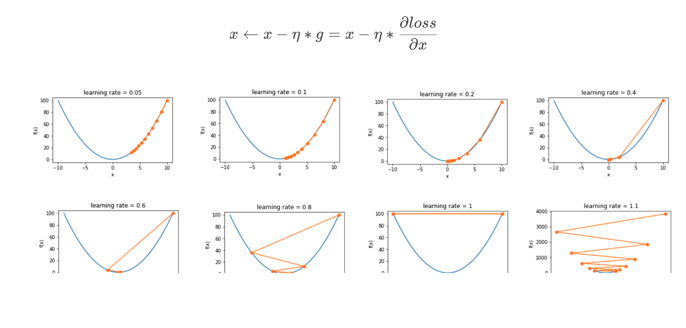

#### warm up策略

在训练初期，让学习率高一点，能尽快找到比较不错的解

在训练后期，学习率调小一点，能收敛到局部最优解


李沐的paper中提到，开始时学习率大，训练不稳定

开始时学习率线性增长，然后再降低一点


### 自定义学习率调度器

```python
torch.optim.lr_scheduler.LambdaLR(optimizer, lr_lambda=lr_lambda)
```

参数：

- optimizer：优化器对象，表示需要调整学习率的优化器。
- Ir_lambda：一个**函数**，接受一个整数参数 epoch，并返回一个浮点数值，表示当前 epoch 下的学习率变化系数。

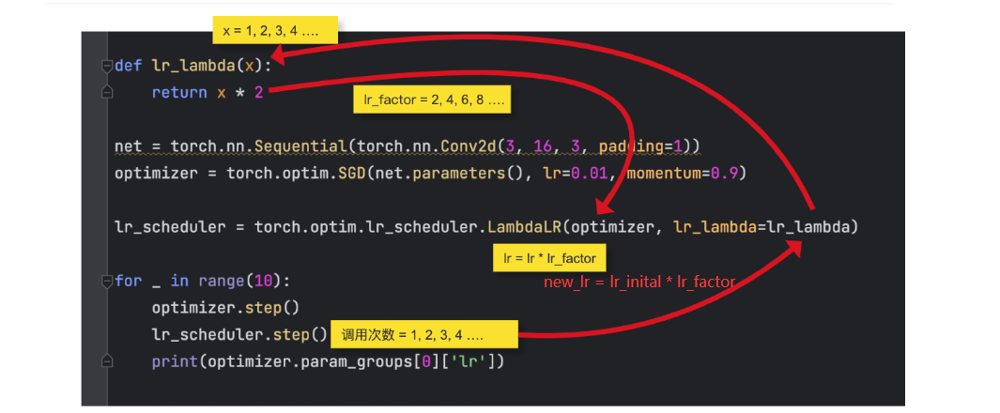


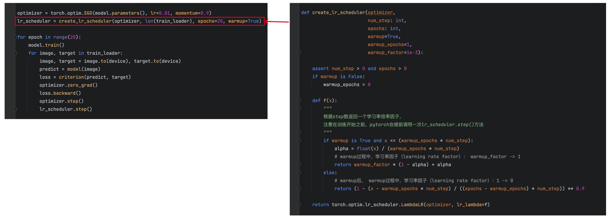

### 不通层设置不同的学习率

**在迁移学习的时候，可能需要用到如下训练技巧**

1. 将预训练好的部分参数冻结，只训练新加的那一部分网络参数
2. 然后收敛的差不多的时候，再将预训练部分的参数解冻，同时训练所有的网络进行微调

或者是

1. 将 预训练好的 backbone 的 参数学习率设置为较小值
2. backbone 之外的部分 (新增的部分，一般为分类头、检测头，等)，设置为较大的学习率


**学习率设置的方式**

在定义优化器的时候，用 list **将参数设置为不同的组**，每个组( list 中的每个元素 )用字典表示，在字典中指明 参数组、该组的学习率

```python
optimizer = optim.SGD([
    {'params': params_group_1, 'lr': 0.001},   # 参数组 学习率
    {'params': params_group_2, 'lr': 0.0005}]) 
```


```python
optimizer = optim.SGD([
    {'params': base_params},   # 未指定学习率的，使用默认学习率 0.001
    {'params': net.linear3.parameters(), 'lr': 0.0005}],
    lr=0.001, momentum=0.9)
```


params_group_1 和 params_group_2 可以是任何实现了 __iter__() 方法的对象，例如 list、tuple

举例

```python
from collections import OrderedDict
import torch.nn as nn
import torch.optim as optim

net = nn.Sequential(OrderedDict([
    ("linear1", nn.Linear(10, 20)),
    ("linear2", nn.Linear(20, 30)),
    ("linear3", nn.Linear(30, 40))]))


linear3_params = list(map(id, net.linear3.parameters()))
base_params = filter(lambda p: id(p) not in linear3_params, net.parameters())

optimizer = optim.SGD([
    {'params': base_params},   # 未指定学习率的，使用默认学习率 0.001
    {'params': net.linear3.parameters(), 'lr': 0.0005}],
    lr=0.001, momentum=0.9)


# print(optimizer)
print(optimizer.param_groups[0]['lr'])
print(optimizer.param_groups[1]['lr']) 
```

### 问题

1. 叶子节点和中间节点的梯度

    Pytorch 使用的是动态图计算，在计算过程中，会生成大量的中间结果，**这些中间结果只在计算过程中使用，计算结束后就会被释放。**

    叶子节点 ： 如下 w1 和 w2 就是叶子节点， y1 和 y2 不是

    **只有叶子节点同时`requires_grad=True`的张量，才能通过`.grad`访问累计梯度**

    

    Pytorch 默认只会记录并暂时保存叶子节点的梯度(`当使用 optimizer.zero_grad() 时`，梯度会清零)，其他中间节点的梯度只会在求叶子节点梯度的过程中使用到（链式求导过程中），并不会被保存起来

    ```python
    import torch
    
    x1 = torch.tensor(2.)
    w1 = torch.tensor(3., requires_grad=True)
    b1 = torch.tensor(2., requires_grad=True)
    
    x2 = torch.tensor(7.)
    w2 = torch.tensor(3., requires_grad=True)
    # 这里的x1 x2 是固定的量
    
    y1 = x1 * w1 + b1
    y2 = x2 * w2
    z = y1 + y2
    
    print('y1 value is ', y1)
    print('y2 value is ', y2)
    print('z value is ', z)
    print('*'*30)
    
    z.backward()  # 反向传播计算叶子节点的梯度
    print('w1\'s grad is ', w1.grad)
    print('b1\'s grad is ', b1.grad)
    print('w2\'s grad is ', w2.grad)
    print('y1\'s grad is ', y1.grad)
    print('y2\'s grad is ', y2.grad)
    ```

    梯度的优化迭代

    ```python
    import torch
    
    x1 = torch.tensor(2.)
    w1 = torch.tensor(3., requires_grad=True)
    b1 = torch.tensor(2., requires_grad=True)
    
    x2 = torch.tensor(7.)
    w2 = torch.tensor(3., requires_grad=True)
    
    
    y1 = x1 * w1 + b1
    y2 = x2 * w2
    z = y1 + y2
    
    print('y1 value is ', y1)
    print('y2 value is ', y2)
    print('z value is ', z)
    print('*'*30)
    
    z.backward()  # 反向传播计算叶子节点的梯度
    print('w1\'s grad is ', w1.grad)
    print('b1\'s grad is ', b1.grad)
    print('w2\'s grad is ', w2.grad)
    print('*'*30)
    
    # 根据梯度更新参数（梯度下降法）
    # 根据对w1的导数在w=w1处的梯度，更新w1的数值
    lr = 1e-3
    w1.data -= lr * w1.grad.data
    b1.data -= lr * b1.grad.data
    w2.data -= lr * w2.grad.data
    
    print('new w1 is ', w1)
    print('new b1 is ', b1)
    print('new w2 is ', w2)
    ```

    

2. 一个batch的数据如何进行反向传播

    假设 `batch_size =4`，`loss = nn.CrossEntropyLoss()((predicted_label, label))`

    ```
    nn.CrossEntropyLoss() 默认参数 reduction="mean"
    所以，通过 loss = nn.CrossEntropyLoss()((predicted_label, label)) 计算得到的损失值是 batch 中所有样本损失值的平均值
    ```

     执行 `loss.backward()`  

    - 使用该 loss 分别计算 batch 中第1个、第2个、第3个、第4 个样本的（每个参数的）梯度 g1、g2、g3、g4（这里的梯度是多个参数的梯度向量）
    - 计算每个参数的梯度平均值 ：  g =（g1 + g2 + g3 + g4）/ 4

    执行 `optim.step()`   

    - 使用梯度平均值更新参数 ：  $$w \leftarrow w - lr * g$$
    - 所以，一个 batch_size 只会做一次反向传播，参数更新时使用的是样本平均梯度。

## 

## 数据集

### PASCAL VOC 2007&2012


坐标格式（xmin，ymin，xmax，ymax）其中 (xmin, ymin) 是左上角的坐标，（ymin, ymax）是右下角的坐标


1. 简介

    PASCAL 全称：Pattern Analysis, Statical Modeling and Computational Learning

    PASCAL VOC（The PASCAL Visual Object Classes ）是一个经典的计算机视觉数据集，由牛津大学、马里兰大学和微软剑桥研究院的研究人员创建的。 该数据集于2005年首次发布，从那时起就被用于训练和评估目标检测算法。

    PASCAL VOC 从 2005年开始举办挑战赛，每年的内容都有所不同，主要包括：

    - 图像分类（Classification ）
    - 目标检测（Detection）
    - 目标分割（Segmentation）
    - 人体布局（Human Layout）
    - 动作识别（Action Classification）

    我们知道在 ImageNet挑战赛上涌现了一大批优秀的分类模型，而PASCAL挑战赛上则是涌现了一大批优秀的目标检测和分割模型，这项挑战赛已于2012年停止举办了，但是研究者仍然可以在其服务器上提交预测结果以评估模型的性能。

    虽然近期的目标检测或分割模型更倾向于使用MS COCO数据集，但是这丝毫不影响 PASCAL VOC数据集的重要性，毕竟PASCAL对于目标检测或分割类型来说属于先驱者的地位。对于现在的研究者来说比较重要的两个年份的数据集是 PASCAL VOC 2007 与 PASCAL VOC 2012，这两个数据集频频在现在的一些检测或分割类的论文当中出现。

2. 地址汇总

    官网地址：http://host.robots.ox.ac.uk/pascal/VOC/

    官方文档 ： http://host.robots.ox.ac.uk/pascal/VOC/pubs/everingham10.pdf

    |              | Pascal VOC 2007                                              | Pascal VOC 2012                                              |
    | ------------ | ------------------------------------------------------------ | ------------------------------------------------------------ |
    | 主页地址     | http://host.robots.ox.ac.uk/pascal/VOC/voc2007/              | http://host.robots.ox.ac.uk/pascal/VOC/voc2012/              |
    | 数据集下载   | [training/validation data](http://host.robots.ox.ac.uk/pascal/VOC/voc2007/VOCtrainval_06-Nov-2007.tar) (450MB tar file) | [training/validation data](http://host.robots.ox.ac.uk/pascal/VOC/voc2012/VOCtrainval_11-May-2012.tar) (2GB tar file) |
    | 数据统计信息 | http://host.robots.ox.ac.uk/pascal/VOC/voc2007/dbstats.html  | http://host.robots.ox.ac.uk/pascal/VOC/voc2012/dbstats.html  |
    | 标注标准     | http://host.robots.ox.ac.uk/pascal/VOC/voc2007/guidelines.html | http://host.robots.ox.ac.uk/pascal/VOC/voc2012/guidelines.html |

​			Pascal VOC 2007

​					训练集和验证集 下载地址 ： [training/validation data](http://host.robots.ox.ac.uk/pascal/VOC/voc2007/VOCtrainval_06-Nov-2007.tar) (450MB tar file)

​					测试集（图像 + 标注）下载地址： [annotated test data](http://host.robots.ox.ac.uk/pascal/VOC/voc2007/VOCtest_06-Nov-2007.tar) (430MB tar file)

​					测试集（仅标注文件）下载地址： [annotation only](http://host.robots.ox.ac.uk/pascal/VOC/voc2007/VOCtestnoimgs_06-Nov-2007.tar) (12MB tar file, no images)

​		  Pascal VOC 2012

​					训练集和验证集 下载地址： [training/validation data](http://host.robots.ox.ac.uk/pascal/VOC/voc2012/VOCtrainval_11-May-2012.tar) (2GB tar file)

​					测试集标注未公开

3. 数据集发展与20个类别

    | 年份 | 数据统计                                                     | 发展                                                         | 备注                                                         |
    | ---- | ------------------------------------------------------------ | ------------------------------------------------------------ | ------------------------------------------------------------ |
    | 2005 | 只有4类别：自行车，汽车，摩托车，人。 训练/验证/测试：1578张图像，包含2209个注释的对象。 | 两项比赛:分类和检测                                          | 这些图片大部分来自现有的公共数据集，不像后来使用的flickr图片那么具有挑战性。 这个数据集已经过时了。 |
    | 2006 | 10类别：自行车、公共汽车、汽车、猫、牛、狗、马、摩托车、人、羊。 训练/验证/测试：包含2618张图像， 4754个注释对象 | 图片来自flickr 和 微软剑桥研究院(MSRC)数据集                 | MSRC的图片比flickr的更简单，因为这些照片通常集中在感兴趣的对象上。 这个数据集已经过时了。 |
    | 2007 | 20类：见下面类别说明 训练/验证/测试：包含9,963张图像，其中包含 24,640个标注对象 | 1、类别数量从10个增加到20个 2、引入了 分割任务 3、引入了 人体布局任务 4、注释中添加了 “截断标志” 5、分类挑战的评价指标改为平均精度(Average Precision)，以前是ROC-AUC | 这一年设立了20个类别，之后类别就再也没有变动 2007年之前（包括2007年）的 test数据集 都是公布的，之后的test数据集就都没有公布 |
    | 2008 | 20类 数据被分割(像往常一样)分割为大约：50% 训练/验证 + 50% 测试 训练/val数据有4,340张图像，其中包含10,363个标注对象。 | 1、遮挡标志被添加到注释中 2、测试数据标注不再公开 3、分割和人物布局数据集包括来自相应VOC2007集的图像 |                                                              |
    | 2009 | 20类 训练/验证：包括7,054张图像，其中包含17,218个ROI标注对象 和 3,211个分割 | 1、从当前开始，所有任务的数据都由前几年的图像和新图像组成。在之前几年，每年都会发布一个全新的数据集用于分类/检测任务。 2、数据扩增使得图像数量每年增长，并且意味着测试结果可以与前几年的进行比较。 3、分割任务 从一个尝试比赛转变成为一个标准的挑战 | 增加的图像 没有标注“困难标记（difficult flags）” (遗漏)。 测试数据标注未公开 |
    | 2010 | 20类 训练/验证：包括10,103个图像，其中包含23,374个ROI标注对象 和 4,203个分割 | 1、引入了 动作识别任务 2、引入了基于 ImageNet的大规模分类的关联挑战 3、Amazon Mechanical Turk 被用于标注的早期阶段 | AP计算方法改变。现在使用所有数据点而不是TREC采样。 测试数据标注未公开 |
    | 2011 | 20类 训练/验证：包括11,530张图像，其中包含27,450个ROI标注对象 和 5,034个分割 | 动作分类扩展到 10个类别 + “其他”。                           | 布局标注 现在不是“完整的”：只有人被注释，并且有些人可能没有被注释。 |
    | 2012 | 20类 训练/验证：包括11,530张图像，其中包含27,450个ROI标注对象 和 6,929个分割 | 1、分割数据集的大小 大幅增加。 2、动作识别数据集 中人体被 增加使用 参考点标注 | 用于 分类、检测 和 人体布局数据集 与 VOC2011相同             |

对于 **分类 和 检测** 来说，下图所示为数据集的发展历程，相同颜色的代表相同的数据集：

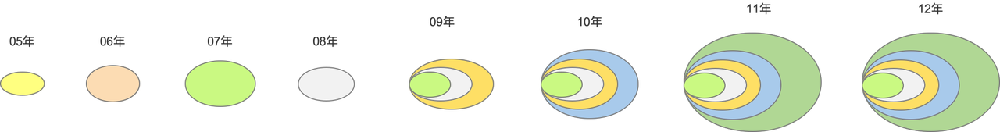

- 05年、06年、07年、08年数据集，为**互斥的，独立的、完全不相同**的数据集
- 09年开始，所有数据集由前几年的部分图像 和 新图像组成

 		 09年的数据集 = 07年部分图像 + 08年部分图像 + 09年新图像

- 10、11 年的数据集，均是在前一年的数据集上进行扩充
- 12 年的数据集 和 11年的数据集一样

虽然 Pascal VOC 2012 和 2007 版本的数据集存在一些共享的部分，但是它们的图像和标注文件在细节上还是有所不同的，因此在使用数据集时需要注意版本和文件的正确匹配。

4. 20个类

    

    ```python
        "aeroplane": 1,
        "bicycle": 2,
        "bird": 3,
        "boat": 4,
        "bottle": 5,
        "bus": 6,
        "car": 7,
        "cat": 8,
        "chair": 9,
        "cow": 10,
        "diningtable": 11,
        "dog": 12,
        "horse": 13,
        "motorbike": 14,
        "person": 15,
        "pottedplant": 16,
        "sheep": 17,
        "sofa": 18,
        "train": 19,
        "tvmonitor": 20
       
    ```

5. 数据集使用

    目前广大研究者们普遍使用的是 **VOC2007和VOC2012**数据集。

    论文中针对 VOC2007和VOC2012 的具体用法有以下几种：

    - 只用VOC2007的trainval 训练，使用VOC2007的test测试
    - 只用VOC2012的trainval 训练，使用VOC2012的test测试，这种用法很少使用，因为大家都会结合VOC2007使用
    - 使用 VOC2007 的 train+val 和 VOC2012的 train+val 训练，然后使用 VOC2007的test测试，**这个用法是论文中经常看到的 07+12** ，研究者可以自己测试在VOC2007上的结果，因为VOC2007的test是公开的。
    - 使用 VOC2007 的 train+val+test 和 VOC2012的 train+val训练，然后使用 VOC2012的test测试，这个用法是论文中经常看到的 07++12 ，这种方法**需提交到VOC官方服务器上评估结果，因为VOC2012 test没有公布。**
    - 先在 MS COCO 的 trainval 上预训练，再使用 VOC2007 的 train+val、 VOC2012的 train+val 微调训练，然后使用 VOC2007的test测试，这个用法是论文中经常看到的 07+12+COCO 。
    - 先在 MS COCO 的 trainval 上预训练，再使用 VOC2007 的 train+val+test 、 VOC2012的 train+val 微调训练，然后使用 VOC2012的test测试 ，这个用法是论文中经常看到的 07++12+COCO，这种方法需提交到VOC官方服务器上评估结果，因为VOC2012 test没有公布。

6. 数据集结构

    - PASCAL VOC 2007

        ```python
        .
        └── VOCdevkit
            └── VOC2007
                ├── Annotations                 标注文件（图像分类、目标检测、人体布局)
                │   ├── 000005.xml
                │   ├── 000007.xml
                │   ├── 000009.xml
                │   └── ... (共 5011个标注文件)
                ├── ImageSets               划分 数据集分割信息 （训练集、验证集、训练集+验证集）
                │   ├── Layout                  用于人体布局图像信息
                │   │   ├── train.txt
                │   │   ├── trainval.txt
                │   │   └── val.txt
                │   ├── Main                    用于图像分类和目标检测图像信息
                │   │   ├── train.txt          
                │   │   ├── trainval.txt       
                │   │   ├── val.txt            
                │   │   └── ... (共63个文件)
                │   └── Segmentation            用于语义分割和实例分割图像信息
                │       ├── train.txt
                │       ├── trainval.txt
                │       └── val.txt
                ├── JPEGImages                  所有原图像
                │   ├── 000005.jpg
                │   ├── 000007.jpg
                │   ├── 000009.jpg
                │   └── ... (共5011张图像)
                ├── SegmentationClass           语义分割标注图像
                │   ├── 000032.png
                │   ├── 000033.png
                │   ├── 000039.png
                │   └── ... (共422张图像)
                └── SegmentationObject          实例分割标注图像
                    ├── 000032.png
                    ├── 000033.png
                    ├── 000039.png
                    └── ... (共422张图像)
        ```

        

    - PASCAL  VOC 2012

        ```
        .
        └── VOCdevkit
            └── VOC2012
                ├── Annotations                  标注文件（图像分类、目标检测、人体布局)
                │   ├── 2007_000027.xml
                │   ├── 2007_000032.xml
                │   ├── 2007_000033.xml
                │   ├── 2007_000039.xml
                │   └── ...(共17125张图像)
                ├── ImageSets                     数据集分割信息 （训练集、验证集、训练集+验证集）
                │   ├── Action                      用于动作识别
                │   │   ├── train.txt                2296张图像
                │   │   ├── trainval.txt             4588张图像
                │   │   ├── val.txt                  2292张图像
                │   │   └── ...
                │   ├── Layout                      用于人体布局
                │   │   ├── train.txt                4425张图像
                │   │   ├── trainval.txt             850张图像
                │   │   └── val.txt                  425张图像
                │   ├── Main                        用于图像分类和目标检测  
                │   │   ├── train.txt                5717张图像 
                │   │   ├── train_val.txt            11540张图像
                │   │   └── trainval.txt             5823张图像 
                │   └── Segmentation                用于语义分割和实例分割 
                │       ├── train.txt                 1464张图像
                │       ├── trainval.txt              2913张图像
                │       └── val.txt                   1449张图像
                ├── JPEGImages                     所有原图像
                │   ├── 2007_000027.jpg
                │   ├── 2007_000032.jpg
                │   ├── 2007_000033.jpg
                │   ├── 2007_000039.jpg
                │   └── ...(共17125张图像)
                ├── SegmentationClass              语义分割标注图像
                │   ├── 2007_000032.png
                │   ├── 2007_000033.png 
                │   ├── 2007_000039.png
                │   ├── 2007_000042.png
                │   └── ...（共2913张图像）
                └── SegmentationObject             实例分割标注图像
                    ├── 2007_000032.png
                    ├── 2007_000033.png
                    ├── 2007_000039.png
                    ├── 2007_000042.png
                    └── ...（共2913张图像）
        ```

    - 2007和2012区别

        **Pascal VOC 2012 的数据集 因为是在前几年的数据集上进行扩增，所以文件名中包含年份，而 Pascal VOC 2007 的文件名中不包含**

        - Pascal VOC 2007 的标注文件名 和 图像文件名 类似为： 000005.xml、 000005.jpg
        - Pascal VOC 2012 的标注文件名 和 图像文件名 类似为： 2007_000027.xml、 2007_000039.png

        **Pascal VOC 2012 的 ImageSets 中包括 Action 文件：用于动作识别任务的数据集划分，而 Pascal VOC 2007 的 ImageSets 文件中不包含， 因为 动作识别任务（Action Classification） 是2010年才有的。**

        **.xml 的标注文件内容 有所不同**，比如： 12版本中有的图像标注 是有 动作信息

7. 标注文件结构

    - 目标检测 Annoation

        ```xml
        <annotation>
                <folder>VOC2007</folder>
                <filename>000001.jpg</filename>
                <source>
                        <database>The VOC2007 Database</database>
                        <annotation>PASCAL VOC2007</annotation>
                        <image>flickr</image>
                        <flickrid>341012865</flickrid>
                </source>
                <owner>
                        <flickrid>Fried Camels</flickrid>
                        <name>Jinky the Fruit Bat</name>
                </owner>
                <size>
                        <width>353</width>
                        <height>500</height>
                        <depth>3</depth>
                </size>
                <segmented>0</segmented>
                <object>
                        <name>dog</name>
                        <pose>Left</pose>
                        <truncated>1</truncated>
                        <difficult>0</difficult>
                        <bndbox>
                                <xmin>48</xmin>
                                <ymin>240</ymin>
                                <xmax>195</xmax>
                                <ymax>371</ymax>
                        </bndbox>
                </object>
                <object>
                        <name>person</name>
                        <pose>Left</pose>
                        <truncated>1</truncated>
                        <difficult>0</difficult>
                        <bndbox>
                                <xmin>8</xmin>
                                <ymin>12</ymin>
                                <xmax>352</xmax>
                                <ymax>498</ymax>
                        </bndbox>
                </object>
        </annotation>
        ```

        - `annotation`：标注文件的根节点，包含了整个标注信息
        - `folder`：图像所在的文件夹名称
        - `filename`：图像的文件名
        - `source`：图像来源
        - `owner`：图像拥有者
        - `size`：图像的尺寸信息，包括宽度、高度、深度。
        - `segmented`：是否被分割标注过： 值为 0，未被过分割；值为 1，被分割标注。
        - `object`：图像中的一个物体，其中的 信息包括：
            - `name`：物体的类别名称， 20个类别
            - `bndbox`：物体的边界框信息，包括左上角和右下角的坐标
                - `xmin`：边界框左上角的 x 坐标
                - `ymin`：边界框左上角的 y 坐标
                - `xmax`：边界框右下角的 x 坐标
                - `ymax`：边界框右下角的 y 坐标
            - `difficult`：标记物体是否难以识别的标志，0 表示容易识别，1 表示难以识别
            - `truncated`：标记物体是否被截断：0 表示未被截断，1 表示被截断（比如在图片之外，或者被遮挡超过15%）
        - `pose`：标记物体的姿态，例如正面、侧面等

    - 语义分割标注图像Segmentation Class

        - 背景部分的 标注像素值 为 0
        - 边界部分的标注像素值为 255
        - 难以分割的区域，例如有重叠物体或遮挡的区域，标注像素值为255
        - 被分割出的object 内部， 标注像素值为其类别索引。 比如，被分割的飞机部分的像素值为飞机类别索引值 1

        

    - 实例分割标注图像Segmentation Object

        - 背景部分的 标注像素值 为 0
        - 边界部分的标注像素值为 255
        - 难以分割的区域，例如有重叠物体或遮挡的区域，标注像素值为255
        - **被分割出的 object 内部，使用 物体实例的 ID 来标识它。物体实例的 ID ：为该物体在 `.xml` 标注文件中的 index 。比如，在 `.xml` 标注文件中，排位第2个的 object，ID = 2，在标注图像中，该 object 的像素值，就为2**

        

8. 数据集解析--目标检测任务

    将数据集转换为**yolo格式**

    ```python
    import xml.etree.ElementTree as ET
    import os
    
    
    # voc的20个类别
    classes = ['aeroplane', 'bicycle', 'bird', 'boat', 'bottle', 'bus', 'car', 'cat', 'chair', 'cow', 'diningtable',
               'dog', 'horse', 'motorbike', 'person', 'pottedplant', 'sheep', 'sofa', 'train', 'tvmonitor']
    
    
    def convert(size, bbox):
        x = (bbox[0] + bbox[1]) / 2.0
        y = (bbox[2] + bbox[3]) / 2.0
        w = bbox[1] - bbox[0]
        h = bbox[3] - bbox[2]
        x = x / size[0]
        w = w / size[0]
        y = y / size[1]
        h = h / size[1]
        return (x, y, w, h)
    
    
    def convert_annotation(xml_file, save_file):
    
        # 保存yolo格式 的label 的 .txt 文件地址
        save_file = open(save_file, 'w')
    
        tree = ET.parse(xml_file)
        size = tree.find('size')
        w = int(size.find('width').text)
        h = int(size.find('height').text)
    
        for obj in tree.findall('object'):
            difficult = obj.find('difficult').text
            cls = obj.find('name').text
            if cls not in classes or int(difficult) == 1:
                continue
            cls_id = classes.index(cls) + 1   # 类别索引从1开始，类别0是背景
            bbox = obj.find('bndbox')
            b = (float(bbox.find('xmin').text),
                 float(bbox.find('xmax').text),
                 float(bbox.find('ymin').text),
                 float(bbox.find('ymax').text))
            bb = convert((w, h), b)
            save_file.write(str(cls_id) + " " + " ".join([str(a) for a in bb]) + '\n')
        save_file.close()
    
    
    if __name__ == "__main__":
        # 数据集根目录地址
        data_root = "/Users/enzo/Documents/GitHub/dataset/VOCdevkit/VOC2007"
    
        # 标注文件地址
        annotation = os.path.join(data_root, 'Annotations')
    
        # yolo格式的文件保存地址
        save_root = './labels'
        if not os.path.exists(save_root):
            os.makedirs(save_root)
    
        for train_val in ["train", "val"]:
            if not os.path.exists(os.path.join(save_root, train_val)):
                os.makedirs(os.path.join(save_root, train_val))
    
            # 数据集划分的 .txt 文件地址
            txt_file = os.path.join(data_root, 'ImageSets/Main', train_val+'.txt')
    
            with open(txt_file, 'r') as f:
                lines = f.readlines()
            file_names = [line.strip() for line in lines if len(line.strip())>0]
    
            for file_name in file_names:
                xml_file = os.path.join(annotation, file_name+'.xml')
                save_file = os.path.join(save_root, train_val, file_name+'.txt')
                convert_annotation(xml_file, save_file)
    ```

    生成的文件结构

    

    .txt 文件内容， 以 `labels/val/000005.txt` 举例：

    每行的5个值表示 ：【 label，center_x ，center_y，height，width】

    都是归一化之后的值，bbx的高宽 / 整个图像的高宽

    

​			


说明：.xml 文件中有 5个 object， 其中2个difficult=1， 没有被转存出来

### MS COCO


坐标格式（x，y，w，h），其中 x ,y 是左上角的坐标


1. 简介

    MS COCO ：Microsoft Common Objects in Context

     是一个由微软公司创建的用于**图像识别**和**物体检测**的大型数据集。

    官网地址：https://cocodataset.org/

    论文地址: https://arxiv.org/pdf/1405.0312.pdf

2. 数据集说明

    - 数据集特征

        ** stuff 指的是 天空，街道， 草地等这种没有明显边界的目标

        

    - coco 2014 和 coco2017区别

        - 2017版数据集 是对 2014版数据集 的扩展和更新

        - 2017版 和 2014版 使用完全相同的图像，不一样的是：

            - 2017版 **训练集/验证集 的划分是 118K/5K**
            - 2014版 是 83K/41K

        - 2017版中用于 检测类任务 / 关键点检测 的注释 和 2014版 是一样的，

            但是增加了 40K 张训练图像 （118k 训练集中的子集） 和 所有验证集 的stuff 标注 （后面有介绍 stuff categories）

            2017年的测试集只有两个部分(开发集/挑战集)，而2014版的测试集有四个部分(开发集/标准集/储备集/挑战集)。

            2017版 发布12万张来自COCO的无标记图像，这些图像遵循与标记图像相同的类分布 ，可用于半监督学习。

    - 80个类

        

3. 数据集下载

    官网下载地址：https://cocodataset.org/#download

    或者，直接点击如下链接直接下载 ：

    - 2017 - 训练数据集 ： [2017 Train images [118K/18GB\]](http://images.cocodataset.org/zips/train2017.zip)
    - 2017 - 验证数据集： [2017 Val images [5K/1GB\]](http://images.cocodataset.org/zips/val2017.zip)
    - 2017 - 标注文件 ： [2017 Train/Val annotations [241MB\]](http://images.cocodataset.org/annotations/annotations_trainval2017.zip)

4. 数据集解析

    - 目标检测任务

        数据结构

        ```python
        .
        ├── annotations
        │   ├── captions_train2017.json          图像描述的 训练集标注文件
        │   ├── captions_val2017.json            图像描述的 验证集标注文件
        │   ├── instances_train2017.json         对应目标检测、分割任务的 训练集标注文件
        │   ├── instances_val2017.json           目标检测、分割任务的 验证集标注文件
        │   ├── person_keypoints_train2017.json  人体关键点检测的 训练集标注文件
        │   └── person_keypoints_val2017.json    人体关键点检测的 验证集标注文件
        ├── train2017
        │   ├── 000000000009.jpg
        │   ├── 000000000025.jpg
        │   ├── 000000000030.jpg
        │   ├── 000000000034.jpg
        │   ├── 000000000036.jpg
        │   └── ... (共118287张图像)
        └── val2017
            ├── 000000000139.jpg
            ├── 000000000285.jpg
            ├── 000000000632.jpg
            ├── 000000000724.jpg
            ├── 000000000776.jpg
            └── ... (共5000张图像)
        ```

        **instances_train2017.json 文件的数据结构如下 （ instances_val2017.json 文件结构也是一样 ）**

        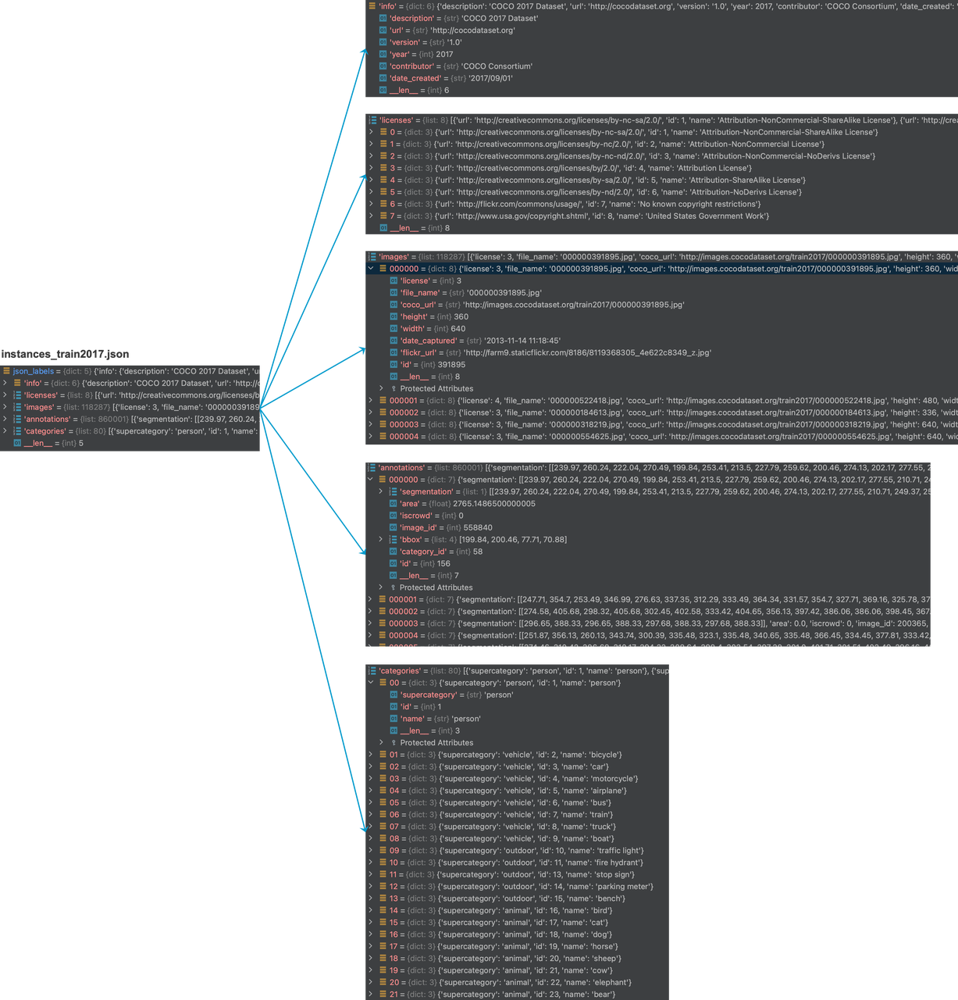

5. 80个类别

    | supercategory | id   | name           |
    | ------------- | ---- | -------------- |
    | person        | 1    | person         |
    | vehicle       | 2    | bicycle        |
    | vehicle       | 3    | car            |
    | vehicle       | 4    | motorcycle     |
    | vehicle       | 5    | airplane       |
    | vehicle       | 6    | bus            |
    | vehicle       | 7    | train          |
    | vehicle       | 8    | truck          |
    | vehicle       | 9    | boat           |
    | outdoor       | 10   | traffic light  |
    | outdoor       | 11   | fire hydrant   |
    | outdoor       | 13   | stop sign      |
    | outdoor       | 14   | parking meter  |
    | outdoor       | 15   | bench          |
    | animal        | 16   | bird           |
    | animal        | 17   | cat            |
    | animal        | 18   | dog            |
    | animal        | 19   | horse          |
    | animal        | 20   | sheep          |
    | animal        | 21   | cow            |
    | animal        | 22   | elephant       |
    | animal        | 23   | bear           |
    | animal        | 24   | zebra          |
    | animal        | 25   | giraffe        |
    | accessory     | 27   | backpack       |
    | accessory     | 28   | umbrella       |
    | accessory     | 31   | handbag        |
    | accessory     | 32   | tie            |
    | accessory     | 33   | suitcase       |
    | sports        | 34   | frisbee        |
    | sports        | 35   | skis           |
    | sports        | 36   | snowboard      |
    | sports        | 37   | sports ball    |
    | sports        | 38   | kite           |
    | sports        | 39   | baseball bat   |
    | sports        | 40   | baseball glove |
    | sports        | 41   | skateboard     |
    | sports        | 42   | surfboard      |
    | sports        | 43   | tennis racket  |
    | kitchen       | 44   | bottle         |
    | kitchen       | 46   | wine glass     |
    | kitchen       | 47   | cup            |
    | kitchen       | 48   | fork           |
    | kitchen       | 49   | knife          |
    | kitchen       | 50   | spoon          |
    | kitchen       | 51   | bowl           |
    | food          | 52   | banana         |
    | food          | 53   | apple          |
    | food          | 54   | sandwich       |
    | food          | 55   | orange         |
    | food          | 56   | broccoli       |
    | food          | 57   | carrot         |
    | food          | 58   | hot dog        |
    | food          | 59   | pizza          |
    | food          | 60   | donut          |
    | food          | 61   | cake           |
    | furniture     | 62   | chair          |
    | furniture     | 63   | couch          |
    | furniture     | 64   | potted plant   |
    | furniture     | 65   | bed            |
    | furniture     | 67   | dining table   |
    | furniture     | 70   | toilet         |
    | electronic    | 72   | tv             |
    | electronic    | 73   | laptop         |
    | electronic    | 74   | mouse          |
    | electronic    | 75   | remote         |
    | electronic    | 76   | keyboard       |
    | electronic    | 77   | cell phone     |
    | appliance     | 78   | microwave      |
    | appliance     | 79   | oven           |
    | appliance     | 80   | toaster        |
    | appliance     | 81   | sink           |
    | appliance     | 82   | refrigerator   |
    | indoor        | 84   | book           |
    | indoor        | 85   | clock          |
    | indoor        | 86   | vase           |
    | indoor        | 87   | scissors       |
    | indoor        | 88   | teddy bear     |
    | indoor        | 89   | hair drier     |
    | indoor        | 90   | toothbrush     |

### Yolo数据集格式


坐标格式（cx，cy，w，h）其中 cx，cy 是中心点的坐标


1. 格式介绍

    - YOLO数据集格式: 使用 .txt 的文本文件 来存储目标检测任务中使用的图像标注信息

    - 每张图像的 bbox标注 存储在一个 .txt 文件中

    - .txt 文件中的每一行，为图像中的一个bounding box 信息

        ```
        <object-class> <x> <y> <width> <height>
        ```

    - `object-class` ：对象类别

    - `x` ：bounding box 的中心点 x坐标。是**归一化**后的值（由图像的宽度归一化），取值范围为[0, 1]

    - `y` ：bounding box 的中心点y坐标，是**归一化**后的值（由图像的高度归一化），取值范围为[0, 1]

    - `width`：bounding box 的宽度，是**归一化**后的值（由图像的宽度归一化）。取值范围为[0,1]。

    - `height`：bounding box 的高度，是**归一化**后的值（由图像的高度归一化）。取值范围为[0,1]。

2. 举例

    一张图像中有 1匹马 和 3个人

    

    其标注文件

    ```python
    13 0.339 0.6693333333333333 0.402 0.42133333333333334
    15 0.379 0.5666666666666667 0.158 0.38133333333333336
    15 0.612 0.7093333333333334 0.084 0.3466666666666667
    15 0.555 0.7026666666666667 0.078 0.34933333333333333
    ```

    类别信息

    ```python
    {
        "aeroplane": 1,
        "bicycle": 2,
        "bird": 3,
        "boat": 4,
        "bottle": 5,
        "bus": 6,
        "car": 7,
        "cat": 8,
        "chair": 9,
        "cow": 10,
        "diningtable": 11,
        "dog": 12,
        "horse": 13,
        "motorbike": 14,
        "person": 15,
        "pottedplant": 16,
        "sheep": 17,
        "sofa": 18,
        "train": 19,
        "tvmonitor": 20
    }
    ```

3. x、y、width、height的归一化

    以上面的例子中的 horse 来说：

    - 图像的尺寸是： （image_width， image_height）=（500， 375）
    - horse 的 左上角坐标为：（xmin，ymin）=（69，172）
    - horse 的 右下角坐标为：（xmax，ymax）=（270，330）

    计算 x_center、y_center、bbox_width、bbox_height

    - 中心点x坐标为：`x_center` =（xmin + xmax) / 2 = 169.5
    - 中心点y坐标为：`y_center` =（ymin + ymax) / 2 = 251.0
    - bbox 的宽度：`bbox_width` = xmax - xmin = 201.0
    - bbox 的高度：`bbox_height` = ymax - ymin = 158.0

    归一化：

    - `x` = x_center / image_width = 0.339
    - `y` = y_center / image_height = 0.6693333333333333
    - `w` = bbox_width / image_width = 0.402
    - `h` = bbox_height / image_height = 0.42133333333333334

## 基础算法

### 插值算法

上采样中会用到

#### 最近邻插值

简介：将每个目标像素找到距离它最近的原图像像素点，然后将该像素的值字节赋值给目标像素


优点： 实现简单，计算速度快

缺点：插值结果缺乏连续性，可能会产生锯齿状的边缘，对于图像质量的影响较大。

因此，当处理精度要求较高的图像时，通常会采用更加精细的插值算法，如双线性插值、双三次插值等。


计算前后的缩放因子

```python
import numpy as np
from PIL import Image


def nearest_neighbor_interpolation(image, scale_factor):
    """
    最邻近插值算法
    :param input_array: 输入图像数组
    :param output_shape: 输出图像的 shape
    :return: 输出图像数组
    """
    # 输入图像、输出图像的宽高
    height, width = image.shape[:2]
    out_height, out_width = int(height * scale_factor), int(width * scale_factor)

    # 创建输出图像
    output_image = np.zeros((out_height, out_width, 3), dtype=np.uint8)

    # 遍历输出图像的每个像素，分别计算其在输入图像中最近的像素坐标，并将其像素值赋值给当前像素
    for out_y in range(out_height):
        for out_x in range(out_width):
            # 计算当前像素在输入图像中的坐标
            input_x = round(out_x / scale_factor)
            input_y = round(out_y / scale_factor)
            # 判断计算出来的输入像素坐标是否越界，如果越界则赋值为边界像素
            input_x = min(input_x, width - 1)
            input_y = min(input_y, height - 1)
            # 将输入像素的像素值赋值给输出像素
            output_image[out_y, out_x] = image[input_y, input_x]
    return output_image


# 读取原始图像
input_image = Image.open('original_image.jpg')
image_array = np.array(input_image)

# 输出缩放后的图像
output_array = nearest_neighbor_interpolation(image_array, 1.5)
output_image = Image.fromarray(output_array)

input_image.show()
output_image.show()
```


#### 双线性插值

#### 双三次插值

### IOU

交并比IoU是 计算两个检测框之间重叠程度的一种方式

在目标检测任务中，IoU也用于衡量**模型预测的边界框**与**真实世界的边界框**之间的匹配程度


当出现以下两种特殊情况


第一种不影响计算交并比，第二种计算出来的h和w为负数，这时候要进行简单的判断，让交集为0

```python
import torch

def box_iou(boxes1, boxes2):
    # bbox1 和 bbox2 的面积
    # (x1, y1, x2, y2)
    area1 = (boxes1[2] - boxes1[0]) * (boxes1[3] - boxes1[1])
    area2 = (boxes2[2] - boxes2[0]) * (boxes2[3] - boxes2[1])

    # 交集的左上角点 和 右下角点的坐标
    lt = torch.max(boxes1[:2], boxes2[:2]) #(20, 20)
    rb = torch.min(boxes1[2:], boxes2[2:]) #(30, 30)

    # 交集的面积
    wh = (rb - lt).clamp(min=0) #最小是0不能出现负数
    inter = wh[0] * wh[1]

    # 并集的面积
    union = area1 + area2 - inter

    # 交并比
    iou = inter / union
    return iou


boxes1 = torch.tensor([10, 10, 30, 30])
boxes2 = torch.tensor([20, 20, 40, 40])
iou1 = box_iou(boxes1, boxes2)
print(iou1)
```


### NMS

非极大值抑制

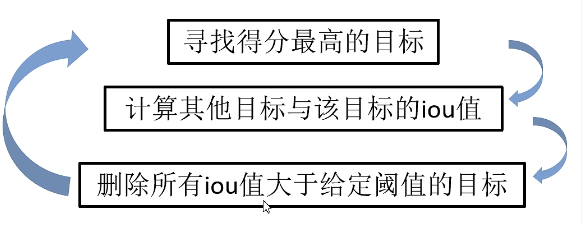

1. NMS是一种常用的目标检测算法中的后处理方法
2. 作用：删除冗余的候选框，从而提高目标检测的精度


- 将候选框根据置信度进行排序，保留置信度最大的检测框

    

- 分别计算保留框与所有候选框的IoU，丢弃IoU值大于阈值（0.5）的检测框

    

- 再根据置信度进行排序，保留置信度最大的候选框，重复上述步骤，直到没有候选框

- 实际的多类别目标检测任务中，是针对每一个类单独进行的NMS，最终得到筛选完成的候选框

    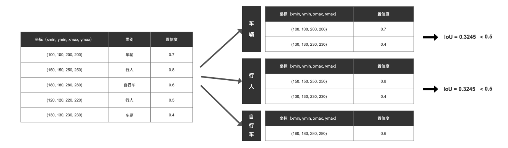

## 必备技能

### 命令行参数解析 argparse

1. 简介

    argparse 模块是 Python 标准库中提供的一个 **命令行解析模块** ，它可以让使用者以类似 Unix/Linux 命令参数的方式输入参数（**在终端以命令行的方式指定参数**），argparse 会自动将命令行指定的参数解析为 Python 变量，从而让使用者更加快捷的处理参数。

    ```python
    import argparse
    
    parser = argparse.ArgumentParser(description="description")
    
    parser.add_argument('-gf', '--girlfriend', choices=['jingjing', 'lihuan'])
    parser.add_argument('food')
    parser.add_argument('--house', type=int, default=0)
    
    args = parser.parse_args()
    print('args :',args)
    print('girlfriend :', args.girlfriend)
    print('food :', args.food)
    print('house :', args.house)
    ```

    

2. 使用步骤

    1. 导入argparse模块，并创建解释器

        ```python
        import argparse
        
        # 创建解释器
        parser = argparse.ArgumentParser(description="可写可不写，此处会在命令行参数出现错误的时候，随着错误信息打印出来。")
        ```

    2. 添加所需参数

        ```python
        parser.add_argument('-gf', '--girlfriend', choices=['jingjing', 'lihuan'])
        # --girlfriend 代表完整的参数名称，可以尽量做到让人见名知意，需要注意的是如果想通过解析后的参数取出该值，必须使用带--的名称
        # -gf 代表参数名缩写，在命令行输入 -gf 和 --girlfriend 的效果是一样的，用简称的作用是简化参数输入
        # choices 代表输入参数的值只能是这个choices里面的内容，其他内容则会报错
        
        parser.add_argument('food')
        # 该种方式则要求必须输入该参数； 输入该参数不需要指定参数名称，指定反而会报错，解释器会自动将输入的参数赋值给food
        
        parser.add_argument('--house', type=int, default=0)
        # type  代表输入参数的类型，从命令行输入的参数，默认是字符串类型
        # default 如果不指定该参数的值，则会使用该默认值
        
        parser.add_argument('--modelname', '-m', type=str, required=True, choices=['model_A', 'model_B'])
        # required 参数用于指定参数是否必需。如果设置为 True，则在命令行中必须提供该参数，否则将引发异常。
        ```

    3. 解析参数

        ```python
        # 进行参数解析
        args = parser.parse_args() 
        print('args :', args)
        print('gf :', args.girlfriend)
        print('food :', args.food)
        print('house :', args.house)
        ```

    4. 结果

        

3. 其他参数说明

    1. action

        向 `add_argument` 方法中传入参数 `action=‘store_true’/‘store_false’` ，解析出来就是 **bool**型 参数 True/False，具体规则为:

        - store_true：如果未指定该参数，默认状态下其值为False；若指定该参数，将该参数置为 True
        - store_false：如果未指定该参数，默认状态下其值为True；若指定该参数，将该参数置为 False

        ```python
        import argparse
        
        parser = argparse.ArgumentParser(description="description")
        
        parser.add_argument('--pa', '-a', action='store_true')  # 指定为true
        parser.add_argument('--pb', '-b', action="store_false") # 指定为false
        args = parser.parse_args() 
        print(args)
        ```

        若 该参数 同时指定了 **action** 和 **default**，在**未指定该参数的情况下**，以 default 值为准；在**指定该参数的情况**下，以 action 的值为准。

    

    上面的操作，我们是通过 命令行 给 python 程序传递参数，一般适合于我们在 GPU 等 linux 操作系统中训练模型使用。 但是**在平时我们调试算法的时候就会很不方便，没有办法利用 IDE 进行debug**，所以接下来介绍如何在 Pycharm 中传递参数给 argparse，方便 pycharm 进行运行这类python程序。

    1、如下图，点击 Edit configurations

    

    2、在Parameters中添加需要的参数（只写参数），多个参数之间用空格隔开

    

    3、最后直接运行，可以看到，把我们设置在Parameters里面设置的参数，会在Run的时候自动补全

    

### linux命令

[见我的另一个文档](D:\Note\linux常用文件管理命令.md)

### requirements.txt 导出 / 搭建

1. 生成requirement.txt文件到当前工作目录下

    ```bash
    pip freeze > ./requirements.txt
    ```

2. 安装requiremen.txt的包

    ```bash
    pip install -r ./requirements.txt
    ```

### 进度条tqdm

1. tqdm基础使用

    ```python
    import time
    from tqdm import tqdm
    
    for i in tqdm(range(100)):
        time.sleep(0.01)
    ```

    - `tqdm(range(i))`的简约写法 ：`trange(i)`

    ```python
    from tqdm import trange
    for t in trange(100):
        time.sleep(0.01)
    ```

2. 手动更新进度条(update方法)

    ```python
    pbar = tqdm(total=200)
    
    for i in range (20):
        time.sleep(1)
        pbar.update(10)
    
    pbar.close()
    ```

    

3. 实际应用

    ```python
    for i, (train_data, train_label) in tqdm(enumerate(train_dataloader), total=len(train_dataloader)):
            train_data, train_label = train_data.to(device), train_label.to(device)
    ```

    

### \_\_call\_\_ 方法

_call__ 是 Python 中的一个魔法方法，也称为类方法。

它的作用是**将类的实例变成可调用对象**，类似于**像函数一样被调用**。


举例

```python
class MyClass:
    def __call__(self, x, y):
        return x + y


obj = MyClass()
print(obj(1, 2))
```

其他类

```python
class MyClass:
    def add(self, x, y):
        return x + y


obj = MyClass()
print(obj.add(1, 2))
```

所以，不用像普通对象调用方法，不用写成 ：`obj.__call__(1, 2)` ， 

而是像直接使用函数一样，直接使用 `obj(1, 2)` 即可

### 文件路径处理

#### pathlib

https://peps.python.org/pep-0428/

pathlib模块是Python标准库的一部分。它在Python 3.4版本中首次引入，提供了一种面向对象的文件系统路径表示方式。

1. 获取路径、拼接路径

    ```python
    from pathlib import Path
    
    # 获取home路径
    print(Path.home())  # /Users/enzo
    
    # 获取当前工作路径(必须在终端中cd到当前脚本所在的目录才有效)
    print(Path.cwd())  # /Users/enzo/Documents
    
    # 拼接路径
    file_path = Path.cwd() / "test.py"
    print(file_path)   # /Users/enzo/Documents/test.py
    ```

2. 常用属性

    ```python
    from pathlib import Path
    
    # 生成路径对象
    path = Path("/users/enzo/Documents/test.py")
    print(path)  # /users/enzo/Documents/test.py
    print(path.name)  # test.py 名称
    print(path.stem)  # test    前缀
    print(path.suffix)  # .py   后缀
    print(path.anchor)  # /
    print(path.parent)  # /users/enzo/Documents 父亲
    print(path.parent.parent)  # /users/enzo    父亲的父亲
    ```

3. 检查文件是否存在

    ```python
    from pathlib import Path
    
    filename = Path("/users/enzo/Documents/test.py")
    print(filename.exists())
    ```

4. 创建文件

    ```python
    from pathlib import Path
    
    filename = Path("/users/enzo/Documents/demo.py")
    if not filename.exists():
        filename.touch()
    ```

5. 创建目录（**创建的目录是从当前所在的终端路径开始的**）

    ```python
    import pathlib
    
    # 创建目录
    pathlib.Path("my_dir").mkdir()
    
    # 创建父目录
    pathlib.Path("my_dir/sub_dir").mkdir(parents=True)
    
    # 即使目录已存在，也继续创建
    pathlib.Path("my_dir").mkdir(exist_ok=True)
    ```

    参数：

    - `path`：要创建的目录路径，可以是字符串或者path对象
    - `parents`：是否创建父目录，默认为false，如果为true，会在创建所有目标目录之前创建父目录
    - `exist_ok`：如果目录存在，是否继续创建，默认为false，如果为true，即使目录存在也不会抛出异常


