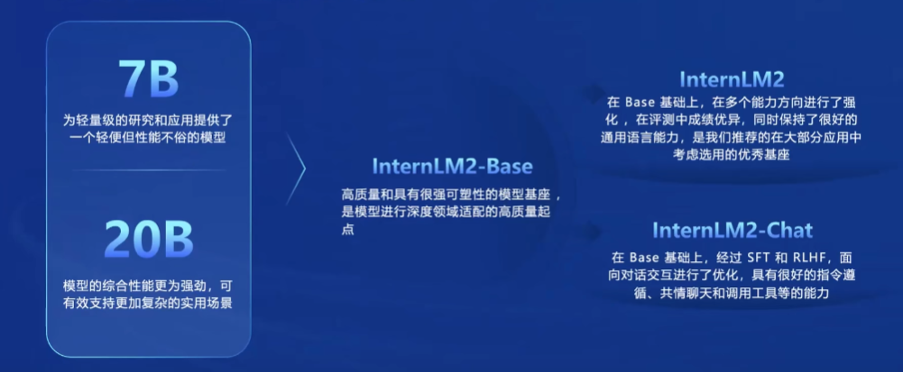

# 书生·浦语大模型

## 书生·浦语大模型全链路开源开放体系

1. 专用模型到**通用大模型**

    一个模型对应**多种任务、多种模态**

### InternLM

## "茴香豆":零代码搭建你的 RAG 智能助理

## XTuner 微调 LLM:1.8B、多模态、Agent

## LMDeploy 量化部署 LLM 实践

## Lagent & AgentLego 智能体应用搭建

## OpenCompass 大模型评测实战

## 大模型微调数据构造

## 平台工具类补充课程