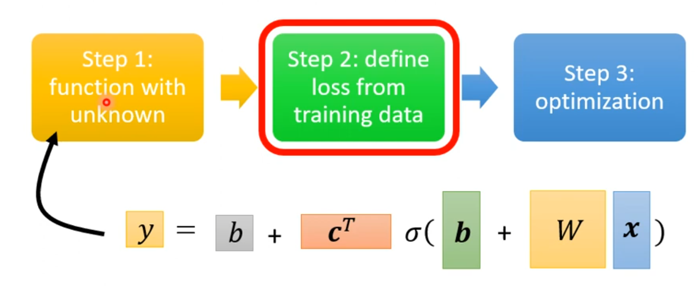
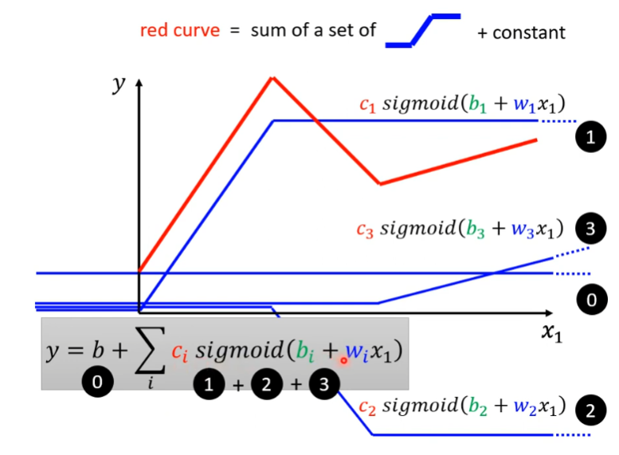
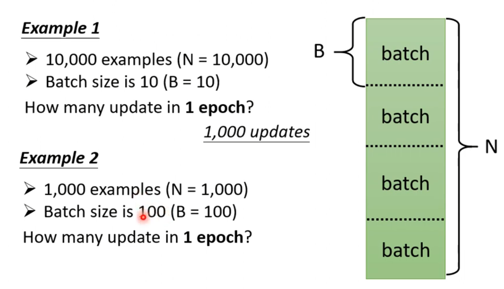

# 机器学习

## 机器学习和深度学习的基本概念

机器学习：寻找一个函数

1. feature weight bias

2. loss（weight，bias）

3.  optimization（learning rate  ）
    $$
    w^1\leftarrow w^0-\eta\frac{\partial L}{\partial w}|_{w=w^0}
    $$
    

深度学习：

不同的sigmod函数相加，逼近了真实的曲线

一个batch更新一次参数

