# 理论知识

## 相机几何

将**三维世界中的坐标点**（单位为米）映射到**二维图像平面**（单位为像素）的过程

### 针孔相机模型


相似三角形


现实世界空间点$P$，经过小孔$O$投影之后，落在物理成像平面$O'-x'-y'$上，成像点为$P'$

设$P$点坐标为
$$
P=[X, Y, Z]^T
$$
$P'$点坐标为
$$
P' =[X',Y',Z']^T
$$
物理成像平面到小孔的距离为$f$（焦距）

根据三角形相似关系
$$
\frac{Z}{f}=-\frac{X}{X'}=-\frac{Y}{Y'}
$$
负号表示成的像是倒立的，**我们可以等价的包图像平面对称到相机的前方**，把公式中的负号去掉


式子更加简洁
$$
\frac{Z}{f}=\frac{X}{X'}=\frac{Y}{Y'}
$$
把$X',Y'$放入等式的左侧，整理得到
$$
X'=f\frac{X}{Z}\\
Y'=f\frac{Y}{Z}
$$
上述式子的单位都是统一的，都是米，$X',f,Z$等单位都是米，但是最终我们获得的是一个个像素，为了**描述传感器将感受到的光线转换为图像像素的过程**，我们设在物理成像平面上固定着一个**像素平面**，$o-u-v$，像素坐标是$[u,v]^T$

**像素坐标系：**通常的定义方式，原点$o'$位于图像的左上角，$u$轴向右与$x$轴平行，$v$轴向下与$y$轴平行，像素坐标系和成像平面之间，相差了**一个缩放+一个原点的平移**


设像素坐标在$u$轴上缩放了$\alpha$倍，在$v$轴上缩放了$\beta$倍，同时原点平移了$[c_x,c_y]^T$,则**$P'$的坐标**与**像素坐标**$[u,v]$

之间的关系为
$$
u = \alpha X' + c_x\\
v = \beta Y' + c_y
$$
代入，把$\alpha x=f_x, \beta y = f_y$得到
$$
u = f_x \frac {X}{Z} + c_x\\
v = f_y \frac {Y}{Z} + c_y
$$
其中，$f$的单位为米，$\alpha,\beta$的单位为像素/米， 所以$f_x, f_y,c_x,c_y$的单位为像素，该式子写成矩阵更加简介，不过**左侧需要转换为齐次坐标，右侧是非齐次坐标**
$$
\begin{pmatrix}u\\v\\1\end{pmatrix}=\dfrac{1}{Z}\begin{pmatrix}f_x&0&c_x\\0&f_y&c_y\\0&0&1\end{pmatrix}\begin{pmatrix}X\\Y\\Z\end{pmatrix}\stackrel{\text{def}}{=}\frac{1}{Z}\boldsymbol{K}\boldsymbol{P}
$$
习惯性把$Z$移到左侧
$$
Z\begin{pmatrix}u\\v\\1\end{pmatrix}=\begin{pmatrix}f_x&0&c_x\\0&f_y&c_y\\0&0&1\end{pmatrix}\begin{pmatrix}X\\Y\\Z\end{pmatrix}\stackrel{\text{def}}{=}\boldsymbol{K}\boldsymbol{P}
$$
该式中，我们把中间的量的组成的矩阵称为**相机的内参数矩阵K**

在式子


$$
\begin{pmatrix}u\\v\\1\end{pmatrix}=\dfrac{1}{Z}\begin{pmatrix}f_x&0&c_x\\0&f_y&c_y\\0&0&1\end{pmatrix}\begin{pmatrix}X\\Y\\Z\end{pmatrix}\stackrel{\text{def}}{=}\frac{1}{Z}\boldsymbol{K}\boldsymbol{P}
$$
$XYZ$使用的是$P$在相机坐标系下的坐标，但是实际上相机在运动，所以**$$P$$的相机坐标应该是它的世界坐标（记为$$P_w$$）根据相机的当前位姿变换到相机坐标系下的结果**

相机的位姿由它的旋转矩阵$$R$$和平移向量$$t$$来描述，则有
$$
ZP_{uv}=Z\begin{pmatrix}u\\v\\1\end{pmatrix}=KP=K(RP_w+t)=KTP_w
$$
注意后一个式子隐含了一次**齐次坐标到非齐次坐标的转换**，描述了$P$的世界坐标到像素坐标的投影关系。相机位姿$R,t$又称为**相机的外参数**

我们可以把一个世界坐标点先转换到相机坐标系，再除掉它最后一维的数值（即该点距离相机平面成像的深度），**相当于把最后一维进行归一化处理**，得到点$P$在相机归一化平面下的投影
$$
(RP_w + t) = [X, Y, Z]^T \rarr [\frac{X}{Z}, \frac{Y}{Z},1]^T
$$


归一化坐标可以看成**相机前方$z=1$米处的点**，这个平面称为归一化平面，归一化平面左乘内参得到像素坐标，**所以我们可以把像素坐标$[u,v]^T$看成对归一化平面上的点的量化测量结果**

从这个模型中我们可以看出，如果对相机坐标同时乘以任意非零常数，**归一化坐标都是一样的**，也就是说**点的深度信息在投影过程中丢失了**，所以单目视觉无法获得像素点的深度值


### 畸变模型

为了获得更好的成像效果，在相机的前方加入了透镜，透镜的加入会对成像过程中光线的传播产生新的影响：

1. 透镜自身形状对光线传播的影响
2. 机械组装过程中，透镜和成像平面不可能完全重合

由透镜形状引起的畸变通常称为**径向畸变**包括**桶形畸变、枕形畸变**

机械组装中不能使透镜和成像平面严格平行，所以会引入**切向畸变**


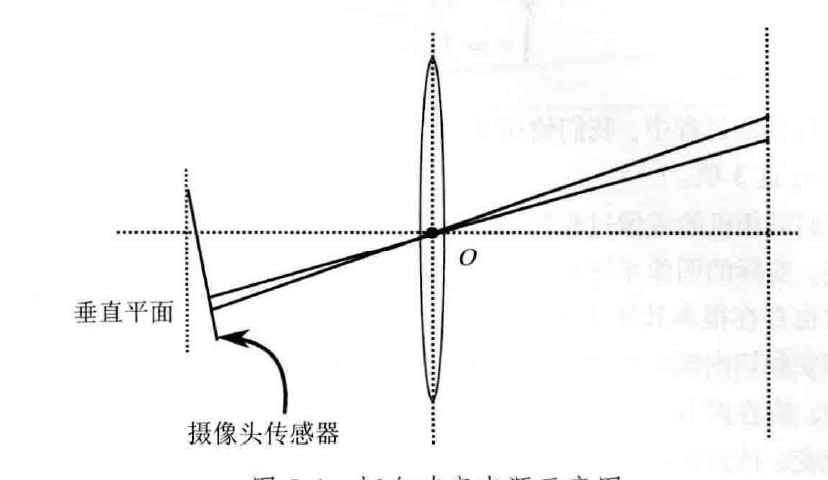

考虑**归一化平面**上的任意一点$p$，它的坐标为$[x,y]^T$，也可以写成极坐标形式$[r,\theta]^T$，径向畸变可以看成坐标点沿着长度方向发生了变化（**也就是其距离原点的长度发生了变化**）。切向畸变可以看成坐标点沿着切线方向发生了变化（**也就是水平夹角发生了变化**）通常假设这些畸变呈现多项式关系即
$$
x_{distorted}=x(1+k_1r^2+k_2r^4+k_3r^6)\\
y_{distorted}=y(1+k_1r^2+k_2r^4+k_3r^6)
$$
其中$x_{distorted},y_{distorted}$是畸变后点的归一化坐标。另外对于**切向畸变**，可以使用另外两个参数$p_1,p_2$进行纠正
$$
x_{distorted}=x+2p_1xy+p_2(r^2+2x^2)\\
y_{distorted}=y+p_1(r^2+2y^2)+2p_2xy
$$
联合上述式子，对于相机坐标系中任意一点$P$，我们可以通过五个畸变系数，找到这个点在像素平面上的正确位置

1. 将三维空间点投影到归一化图像平面，设它的归一化坐标为$[x,y]^T$

2. 对归一化平面上的点计算径向畸变和切向畸变
    $$
    x_{distorted}=x(1+k_1r^2+k_2r^4+k_3r^6)+2p_1xy+p_2(r^2+2x^2)\\
    y_{distorted}=y(1+k_1r^2+k_2r^4+k_3r^6)+p_1(r^2+2y^2)+2p_2xy
    $$

3. 将畸变后的点通过内参数矩阵投影到像素平面，得到该点在像素上的正确位置
    $$
    u=f_xx_{disorted}+c_x\\
    v=f_yy_{disorted}+c_y
    $$

在上述纠正畸变的过程中，我们使用了五个畸变项，在实际应用中，可以灵活选择纠正模型，比如只选择$k_1,p_1,p_2$这三项

## 基础知识

### 感受野

在卷积神经网络中，决定某一层输出结果中一个元素所对应的输入层的区域大小，被称为感受野，**通俗的解释是，输出feature map上的一个单元对应输入层上的区域大小**

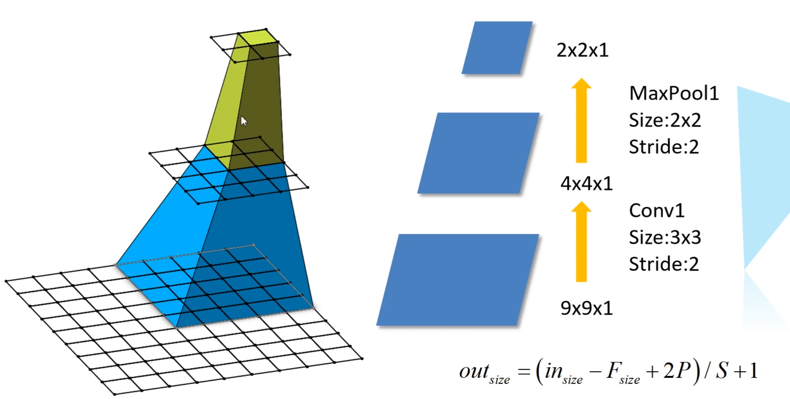

**感受野计算公式（从后向前推算）**
$$
F(i) = (F(i + 1) - 1) × Stride + KernalSize
$$

$$
FeatureMap: F = 1\\
Pool1:F = (1 - 1) × 2 + 2 = 2\\
Conv1:F = (2 - 1) × 2 + 3 = 5
$$

也就是说明，一个像素对应着5×5的大小的区域

### 分组卷积

**分组卷积**好处是节省参数

传统的卷积需要的参数：假设kernal_size = k,  in_channel=Cin, out_channel = n
$$
参数 = k × k × C_{in} × n
$$
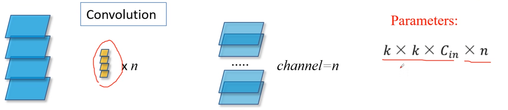

分组卷积就是将输入的特征图，拆分成g个组，针对每一个组，进行卷积

假设kernal_size = k, in_channel = Cin out_channel = n, 分成g个组

单独看每个组，

输入的特征图channel = Cin / g  这一组卷积核的参数为 $k × k × \frac {C_{in}}{g} × \frac{n}{g}$,一共有g个组
$$
参数 =k × k × \frac {C_{in}}{g} × \frac{n}{g} × g
$$


当为feature的每一个channel分配一个组，且卷积核的channel = 1，就是[DW卷积](###DepthWise卷积)

### DepthWise卷积


普通卷积的计算量
$$
(D_k × D_k × M × N) × D_F × D_F
$$
DW  + PW 卷积的计算量
$$
(D_k × D_k × M) × D_F × D_F + (1 × 1 × M × N) ×  D_F × D_F
$$

### 通道注意力

#### SEnet

**Squeeze-and-Excitation Networks**

学习通道之间的相关性，自适应重新校准通道的特征响应


1. Squeeze：全局平均池化 C×H×W -> C×1×1
2. Excitation：两层全连接 + sigmod 限制在[0,1]
3. 特征重标定：Excitation得到的结果作为权重乘到特征图上的每个位置

#### CBAM

**Convolutional Block Attention Module**


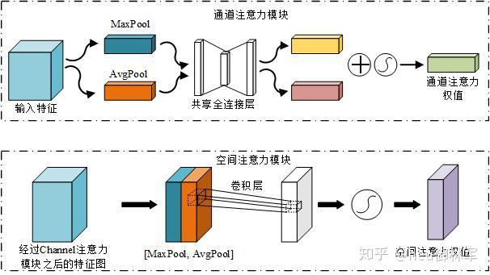

通道注意力&空间注意力

1. 经过最大池化和平均池化，通过共享全连接层，分别得到对应的特征，add起来
2. 通过最大池化和平均池化，通过卷积层，卷积得到空间特征图分布权重
3. 最后经过通道权重和空间权重，得到最终的特征图

#### SRM

**A Style-based Recalibration Module for Convolutional Neural Networks**

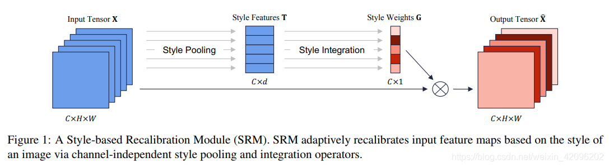

1. 原始特征经过最大池化和平均池化得到C×D的权重
2. 经过全连接层得到C×1的权重
3. 然后再进行权重相乘求转换后的特征图

## 图像分类


### 图像处理

#### 全连接层

**全连接层前向计算**

全连接神经网络是指**任意两个相邻层之间的神经元全部互相连接**


$X_1=\begin{bmatrix}\text{x}_1\\\text{x}_2\\\end{bmatrix}$是输入的特征向量（一般是卷积层最后的输出，展平后的一维向量），从第一层到第二层，神经元个数从2到3，也就是说从2个特征通过矩阵变换到了三个特征，矩阵$W_{12}X_1 = X_2$

$\mathrm{W}_{12}=\begin{bmatrix}w_{11}^{(1)}&\mathrm{w}_{21}^{(1)}\\\mathrm{W}_{12}^{(1)}&\mathrm{W}_{22}^{(1)}\\\mathrm{W}_{13}^{(1)}&\mathrm{W}_{23}^{(1)}\end{bmatrix}$，可以看到，每一行是一组权重，表示一个特征向量的加权之和，一共有3组这样的加权之和，所以转化成了3个特征，$\begin{bmatrix}w_{11}^{(1)}&\mathrm{w}_{21}^{(1)}\\\mathrm{W}_{12}^{(1)}&\mathrm{W}_{22}^{(1)}\\\mathrm{W}_{13}^{(1)}&\mathrm{W}_{23}^{(1)}\end{bmatrix}\begin{bmatrix}\text{x}_1\\\text{x}_2\\\end{bmatrix}=\begin{bmatrix}\text{a}_1\\\text{a}_2\\\text{a}_3\\\end{bmatrix}$，$\begin{bmatrix}\text{a}_1\\\text{a}_2\\\text{a}_3\\\end{bmatrix}$经过加上bias或者是激活函数，得到同样尺寸的向量，这里我偷个懒，不写新的符号了，还是$\begin{bmatrix}\text{a}_1\\\text{a}_2\\\text{a}_3\\\end{bmatrix}$，然后此时是3个特征，要变为2个特征，所以$\mathrm{W}_{23}=\begin{bmatrix}\mathrm{w}_{11}^{(2)}&\mathrm{w}_{21}^{(2)}&\mathrm{w}_{31}^{(2)}\\\mathrm{w}_{12}^{(2)}&\mathrm{w}_{22}^{(2)}&\mathrm{w}_{32}^{(2)}\\\end{bmatrix}$，可以看到每一行是一组权重，一共是2行，表示一个特征向量的加权和，一共有2组这样的加权和，所以转化为了2个特征，$\begin{bmatrix}\mathrm{w}_{11}^{(2)}&\mathrm{w}_{21}^{(2)}&\mathrm{w}_{31}^{(2)}\\\mathrm{w}_{12}^{(2)}&\mathrm{w}_{22}^{(2)}&\mathrm{w}_{32}^{(2)}\\\end{bmatrix}\begin{bmatrix}\text{a}_1\\\text{a}_2\\\text{a}_3\\\end{bmatrix}=\begin{bmatrix}\text{y}_1\\\text{y}_2\\\end{bmatrix}$，经过激活函数或者是bias，得到最终的输出特征，经过softmax得到最终的概率分布，敲定最终的输出结果，[参考](###交叉熵损失)

#### 卷积层

1. 卷积核的channel = 输入特征图的channel
2. 输出特征图的channel = 卷积核的个数
3. 卷积层**bias**，就是在卷积相乘之后的结果加上一个偏置
4. 卷积层之后加上**激活函数**，就是在卷积之后的结果带入激活函数中，得到输出值


卷积：

1. 输入特征图的尺寸： $W_1 × H_1 × C_1$
2. 输出特征图的尺寸：$W_2 × H_2 × C_2$
3. 卷积核尺寸：$F × F × C_1$ ，一共有$K$个卷积核
4. 步长：$S$
5. 填充：$P$

$$
W_2 = \frac {W_1 + 2P - F}{S} + 1 \\
H_2 = \frac {H_1 + 2P - F}{S} + 1 \\
C_2 = K
$$


#### 池化层

1. 没有训练参数
2. 只改变特征图的W和H，不改变channel，因为池化是在每个channel上进行的
3. 一般设置size和stride相同

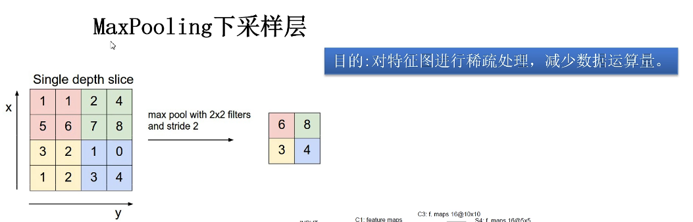

池化：

1. 输入特征图的尺寸： $W_1 × H_1 × C_1$
2. 输出特征图的尺寸：$W_2 × H_2 × C_2$
3. 池化核尺寸：$F × F$ ，池化一般是在每个channel上进行的
4. 步长：$S$
5. 填充：$P$

$$
W_2 = \frac {W_1 + 2P - F}{S} + 1 \\
H_2 = \frac {H_1 + 2P - F}{S} + 1 \\
C_2 = C_1
$$


### Lenet


1. 创建模型类

    ```python
    import torch.nn as nn
    import torch.nn.functional as F
    
    
    class LeNet(nn.Module):
        def __init__(self):
            super(LeNet, self).__init__()
            self.conv1 = nn.Conv2d(3, 16, 5) # in_channels = 3 out_channels = 16 kernal_size = 5
            self.pool1 = nn.MaxPool2d(2, 2)  # kernal_size = 2 stride = 2
            self.conv2 = nn.Conv2d(16, 32, 5)
            self.pool2 = nn.MaxPool2d(2, 2)
            self.fc1 = nn.Linear(32*5*5, 120)
            self.fc2 = nn.Linear(120, 84)
            self.fc3 = nn.Linear(84, 10)
    
        def forward(self, x):            # input(3, 32, 32) 
            x = F.relu(self.conv1(x))    # output(16, 28, 28)
            x = self.pool1(x)            # output(16, 14, 14)
            x = F.relu(self.conv2(x))    # output(32, 10, 10)
            x = self.pool2(x)            # output(32, 5, 5)
            x = x.view(-1, 32*5*5)       # output(32*5*5)  (第0维为-1，占位符这里是batch_size)
            x = F.relu(self.fc1(x))      # output(120)
            x = F.relu(self.fc2(x))      # output(84)
            x = self.fc3(x)              # output(10)
            return x
    
    
    # 测试
    import torch
    # [N, C, H, W]
    input1 = torch.rand([2, 3, 32, 32]) # 生成一个该尺寸的tensor
    # print(input1)
    model = LeNet()
    # print(model)
    output = model(input1)
    print(output)
    """
    tensor([[ 0.0324,  0.0964,  0.1025, -0.0259, -0.1406,  0.0447, -0.0958, -0.0039,
             -0.0606, -0.0549],
            [ 0.0319,  0.0999,  0.1022, -0.0245, -0.1447,  0.0388, -0.0978, -0.0013,
             -0.0618, -0.0487]], grad_fn=<AddmmBackward0>)
    """
    
    ```

2. train.py

    ```python
    import torch
    import torchvision
    import torch.nn as nn
    from model import LeNet
    import torch.optim as optim
    import torchvision.transforms as transforms
    
    
    def main():
        transform = transforms.Compose(
            [transforms.ToTensor(),
             transforms.Normalize((0.5, 0.5, 0.5), (0.5, 0.5, 0.5))])
    
        # 50000张训练图片
        # 第一次使用时要将download设置为True才会自动去下载数据集
        # 下载到当前工作区上一级的datasets目录
        train_set = torchvision.datasets.CIFAR10(root='../datasets', train=True,
                                                 download=True, transform=transform)
        train_loader = torch.utils.data.DataLoader(train_set, batch_size=36,
                                                   shuffle=True, num_workers=0)
    
        # 10000张验证图片
        # 第一次使用时要将download设置为True才会自动去下载数据集
        val_set = torchvision.datasets.CIFAR10(root='../datasets', train=False,
                                               download=True, transform=transform)
        val_loader = torch.utils.data.DataLoader(val_set, batch_size=10000,
                                                 shuffle=False, num_workers=0)
        val_data_iter = iter(val_loader)
        val_image, val_label = next(val_data_iter)
        # print(val_image.shape)
        # print(val_label)
        # 元组类型，括号圈起来的不能改变
        # classes = ('plane', 'car', 'bird', 'cat',
        #            'deer', 'dog', 'frog', 'horse', 'ship', 'truck')
    
        net = LeNet()
    
        loss_function = nn.CrossEntropyLoss()
        optimizer = optim.Adam(net.parameters(), lr=0.001)
    
        # 将训练集迭代5轮
        for epoch in range(5):  # loop over the dataset multiple times
    
            running_loss = 0.0
            for step, data in enumerate(train_loader, start=0):
                # get the inputs; data is a list of [inputs, labels]
                inputs, labels = data
    
                # zero the parameter gradients
                # 清除历史梯度
                optimizer.zero_grad()
                # forward + backward + optimize
                outputs = net(inputs)
                loss = loss_function(outputs, labels)
                loss.backward()   # 反向传播
                optimizer.step()  # 参数更新
    
                # print statistics
                running_loss += loss.item()
                if step % 500 == 499:    # print every 500 mini-batches执行一次验证
                    with torch.no_grad():# 不计算损失梯度，因为是验证环节
                        outputs = net(val_image)  # [batch, 10]
                        predict_y = torch.max(outputs, dim=1)[1] # [batch] 值为最大概率的下标
                        # 到.sum计算的是tensor .item转化为数值 
                        # val_label.size(0)是获取label第0维的长度
                        accuracy = torch.eq(predict_y, val_label).sum().item() / val_label.size(0)
    
                        print('[%d, %5d] train_loss: %.3f  test_accuracy: %.3f' %
                              (epoch + 1, step + 1, running_loss / 500, accuracy))
                        running_loss = 0.0
    
        print('Finished Training')
        
        # 保存权重参数
        save_path = './Lenet.pth'
        torch.save(net.state_dict(), save_path)
    
    
    if __name__ == '__main__':
        main()
    
    ```

    

3. predict.py

    

### AlexNet

1. 首次使用GPU训练

2. 用ReLu函数代替传统的Sigmod和Tanh激活函数

3. 使用LRN局部响应归一化（LRN作用不大，舍弃）

4. 全连接层使用随机失活DropOut，减少过拟合现象

    

    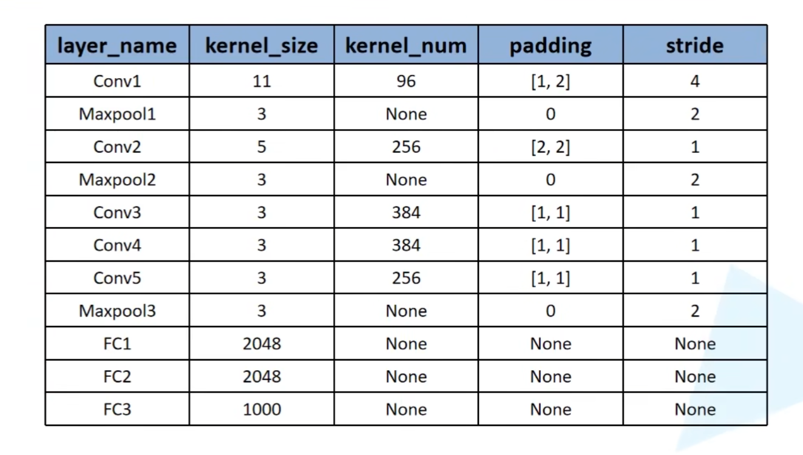

**网络结构**


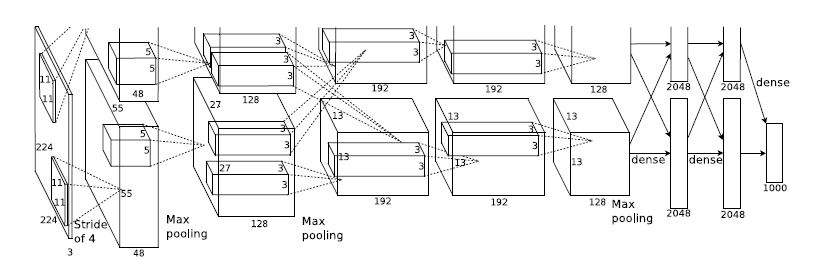


1. 网络搭建

    ```python
    import torch.nn as nn
    import torch
    
    
    class AlexNet(nn.Module):
        # 默认1000分类 不初始化权重
        def __init__(self, num_classes=1000, init_weights=False):
            super(AlexNet, self).__init__()
            # nn.Sequential
            # 卷积池化层
            self.features = nn.Sequential(                              # input[3, 224, 224]
                nn.Conv2d(3, 48, kernel_size=11, stride=4, padding=2),  # output[48, 55, 55]
                nn.ReLU(inplace=True),# 增加计算量，降低内存使用 inpace方法
                nn.MaxPool2d(kernel_size=3, stride=2),                  # output[48, 27, 27]
                nn.Conv2d(48, 128, kernel_size=5, padding=2),           # output[128, 27, 27]
                nn.ReLU(inplace=True),
                nn.MaxPool2d(kernel_size=3, stride=2),                  # output[128, 13, 13]
                nn.Conv2d(128, 192, kernel_size=3, padding=1),          # output[192, 13, 13]
                nn.ReLU(inplace=True),
                nn.Conv2d(192, 192, kernel_size=3, padding=1),          # output[192, 13, 13]
                nn.ReLU(inplace=True),
                nn.Conv2d(192, 128, kernel_size=3, padding=1),          # output[128, 13, 13]
                nn.ReLU(inplace=True),
                nn.MaxPool2d(kernel_size=3, stride=2),                  # output[128, 6, 6]
            )
            # 全连接层
            self.classifier = nn.Sequential(
                nn.Dropout(p=0.5), # 随机失活
                nn.Linear(128 * 6 * 6, 2048),
                nn.ReLU(inplace=True),
                nn.Dropout(p=0.5),
                nn.Linear(2048, 2048),
                nn.ReLU(inplace=True),
                nn.Linear(2048, num_classes),
            )
            if init_weights:
                self._initialize_weights()
    
        def forward(self, x):
            x = self.features(x)
            # 从第一维度开始打平
            x = torch.flatten(x, start_dim=1)
            x = self.classifier(x)
            return x
    
        def _initialize_weights(self):
            # 遍历实例的module
            for m in self.modules():
                if isinstance(m, nn.Conv2d):
                    nn.init.kaiming_normal_(m.weight, mode='fan_out', nonlinearity='relu')
                    if m.bias is not None:
                        nn.init.constant_(m.bias, 0)
                elif isinstance(m, nn.Linear):
                    nn.init.normal_(m.weight, 0, 0.01)
                    nn.init.constant_(m.bias, 0)
    
    ```

    

2. train.py

    ```python
    import os
    import sys
    import json
    
    import torch
    import torch.nn as nn
    from torchvision import transforms, datasets, utils
    import matplotlib.pyplot as plt
    import numpy as np
    import torch.optim as optim
    from tqdm import tqdm
    
    from model import AlexNet
    
    
    def main():
        device = torch.device("cuda:0" if torch.cuda.is_available() else "cpu")
        print("using {} device.".format(device))
    
        data_transform = {
            "train": transforms.Compose([transforms.RandomResizedCrop(224),
                                         transforms.RandomHorizontalFlip(),
                                         transforms.ToTensor(),
                                         transforms.Normalize((0.5, 0.5, 0.5), (0.5, 0.5, 0.5))]),
            "val": transforms.Compose([transforms.Resize((224, 224)),  # cannot 224, must (224, 224)
                                       transforms.ToTensor(),
                                       transforms.Normalize((0.5, 0.5, 0.5), (0.5, 0.5, 0.5))])}
    
        data_root = os.path.abspath(os.path.join(os.getcwd(), "../.."))  # get data root path 先获取当前路径，返回到上上层
        image_path = os.path.join(data_root, "data_set", "flower_data")  # flower data set path 得到数据集的路径
        assert os.path.exists(image_path), "{} path does not exist.".format(image_path)
        train_dataset = datasets.ImageFolder(root=os.path.join(image_path, "train"),
                                             transform=data_transform["train"])
        train_num = len(train_dataset)
    
        # 处理类别，生成索引和类别对应的json文件
        # {'daisy':0, 'dandelion':1, 'roses':2, 'sunflower':3, 'tulips':4}
        flower_list = train_dataset.class_to_idx
        cla_dict = dict((val, key) for key, val in flower_list.items()) # 键值对互换位置
        # write dict into json file
        json_str = json.dumps(cla_dict, indent=4)
        with open('class_indices.json', 'w') as json_file:
            json_file.write(json_str)
    
        batch_size = 32
        nw = min([os.cpu_count(), batch_size if batch_size > 1 else 0, 8])  # number of workers
        print('Using {} dataloader workers every process'.format(nw))
    
        train_loader = torch.utils.data.DataLoader(train_dataset,
                                                   batch_size=batch_size, shuffle=True,
                                                   num_workers=nw)
    
        validate_dataset = datasets.ImageFolder(root=os.path.join(image_path, "val"),
                                                transform=data_transform["val"])
        val_num = len(validate_dataset)
        validate_loader = torch.utils.data.DataLoader(validate_dataset,
                                                      batch_size=4, shuffle=True,
                                                      num_workers=nw)
    
        print("using {} images for training, {} images for validation.".format(train_num,
                                                                               val_num))
        # 展示图片
        # test_data_iter = iter(validate_loader)
        # test_image, test_label = test_data_iter.next()
        
        # def imshow(img):
        #     img = img / 2 + 0.5  # unnormalize
        #     npimg = img.numpy()
        #     plt.imshow(np.transpose(npimg, (1, 2, 0)))
        #     plt.show()
        
        # print(' '.join('%5s' % cla_dict[test_label[j].item()] for j in range(4)))
        # imshow(utils.make_grid(test_image))
    
        # 实例化一个网络
        net = AlexNet(num_classes=5, init_weights=True)
    
        net.to(device)
        loss_function = nn.CrossEntropyLoss()
        # Adam优化器
        optimizer = optim.Adam(net.parameters(), lr=0.0002)
    
        epochs = 20
        save_path = './AlexNet.pth'
        best_acc = 0.0
        train_steps = len(train_loader)
        for epoch in range(epochs):
            # train
            net.train() # 这样配合net.train 可以保证只在训练阶段DropOut 和 Batch Normalization
            running_loss = 0.0 
            train_bar = tqdm(train_loader, file=sys.stdout)
            for step, data in enumerate(train_bar):
                images, labels = data
                optimizer.zero_grad()
                # forward + backward + optimize
                outputs = net(images.to(device))
                loss = loss_function(outputs, labels.to(device))
                loss.backward()
                optimizer.step()
    
                # print statistics
                # 累加各个batch的损失
                running_loss += loss.item()
    
                # 输出每个batch的损失
                train_bar.desc = "train epoch[{}/{}] loss:{:.3f}".format(epoch + 1,
                                                                         epochs,
                                                                         loss)
    
            # validate
            net.eval()
            acc = 0.0  # accumulate accurate number / epoch 每个epoch的准确率
            # 每个epoch遍历一整个验证集
            with torch.no_grad():
                val_bar = tqdm(validate_loader, file=sys.stdout)
                for val_data in val_bar:
                    val_images, val_labels = val_data
                    outputs = net(val_images.to(device))
                    predict_y = torch.max(outputs, dim=1)[1]
                    acc += torch.eq(predict_y, val_labels.to(device)).sum().item()
    
            val_accurate = acc / val_num
            # running loss  / train_steps(训练集batch的数量)
            print('[epoch %d] train_loss: %.3f  val_accuracy: %.3f' %
                  (epoch + 1, running_loss / train_steps, val_accurate))
    
            if val_accurate > best_acc:
                best_acc = val_accurate
                torch.save(net.state_dict(), save_path)
    
        print('Finished Training')
    
    
    if __name__ == '__main__':
        main()
    
    ```

    

### VGG

1. 通过堆叠多个3*3的卷积核代替大尺度卷积核来**减少所需要的参数**

    

    [感受野](###感受野)

    参数 = 卷积核长 * 卷积核宽  * 卷积核channel * 卷积核个数

    7*7参数 = 7 * 7 * C * C = 49C^2

    3个 3*3参数 = 3 * 3 *C *C +  3 * 3 *C *C +  3 * 3 *C *C = 27C^2

    

**网络结构**

conv的size = 3 stride = 1 padding = 1  （长宽不变）

maxpool的size = 2 stride = 2  （长宽变为一半）

  


1. 网络搭建

    ```python
    import torch.nn as nn
    import torch
    
    # official pretrain weights
    model_urls = {
        'vgg11': 'https://download.pytorch.org/models/vgg11-bbd30ac9.pth',
        'vgg13': 'https://download.pytorch.org/models/vgg13-c768596a.pth',
        'vgg16': 'https://download.pytorch.org/models/vgg16-397923af.pth',
        'vgg19': 'https://download.pytorch.org/models/vgg19-dcbb9e9d.pth'
    }
    
    
    class VGG(nn.Module):
        # 传入的feature是借助cfg生成的特征提取features的sequential
        def __init__(self, features, num_classes=1000, init_weights=False):
            super(VGG, self).__init__()
            self.features = features
            self.classifier = nn.Sequential(
                nn.Linear(512*7*7, 4096),
                nn.ReLU(True),
                nn.Dropout(p=0.5),
                nn.Linear(4096, 4096),
                nn.ReLU(True),
                nn.Dropout(p=0.5),
                nn.Linear(4096, num_classes)
            )
            if init_weights:
                self._initialize_weights()
        # x是输入的图像数据
        def forward(self, x):
            # N x 3 x 224 x 224
            x = self.features(x)
            # N x 512 x 7 x 7
            x = torch.flatten(x, start_dim=1)
            # N x 512*7*7
            x = self.classifier(x)
            return x
    
        def _initialize_weights(self):
            for m in self.modules():
                if isinstance(m, nn.Conv2d):
                    # nn.init.kaiming_normal_(m.weight, mode='fan_out', nonlinearity='relu')
                    nn.init.xavier_uniform_(m.weight)
                    if m.bias is not None:
                        nn.init.constant_(m.bias, 0)# 偏置默认初始化为0
                elif isinstance(m, nn.Linear):
                    nn.init.xavier_uniform_(m.weight)
                    # nn.init.normal_(m.weight, 0, 0.01)
                    nn.init.constant_(m.bias, 0)
    
    
    # 传入配置列表构建网络
    def make_features(cfg: list):
        layers = []
        # 初始化第一层的输入
        in_channels = 3
        for v in cfg:
            if v == "M":
                # 创建最大池化下采样层（因为池化核都一样大小）
                layers += [nn.MaxPool2d(kernel_size=2, stride=2)]
            else:
                # 创建卷积层
                # 输出通道对应当前卷积核的个数（卷积核的长宽和padding都一样）
                conv2d = nn.Conv2d(in_channels, v, kernel_size=3, padding=1)
                layers += [conv2d, nn.ReLU(True)]
                # 输出变为下一层
                in_channels = v
        # 返回nn.sequentioal 非关键字参数传入
        return nn.Sequential(*layers)
    
    # 配置文件
    # 数值是卷积层卷积核个数
    # ‘M’是最大池化层
    cfgs = {
        'vgg11': [64, 'M', 128, 'M', 256, 256, 'M', 512, 512, 'M', 512, 512, 'M'],
        'vgg13': [64, 64, 'M', 128, 128, 'M', 256, 256, 'M', 512, 512, 'M', 512, 512, 'M'],
        'vgg16': [64, 64, 'M', 128, 128, 'M', 256, 256, 256, 'M', 512, 512, 512, 'M', 512, 512, 512, 'M'],
        'vgg19': [64, 64, 'M', 128, 128, 'M', 256, 256, 256, 256, 'M', 512, 512, 512, 512, 'M', 512, 512, 512, 512, 'M'],
    }
    
    # 实例化vgg
    def vgg(model_name="vgg16", **kwargs):
        assert model_name in cfgs, "Warning: model number {} not in cfgs dict!".format(model_name)
        cfg = cfgs[model_name]
    
        model = VGG(make_features(cfg), **kwargs) # **kwargs可变长度的字典变量，因为输入有多个，可以传参一部分
        return model
    
    
    # vgg_model = vgg(model_name="vgg16")
    ```

    

2. train.py

    ```python
    import os
    import sys
    import json
    
    import torch
    import torch.nn as nn
    from torchvision import transforms, datasets
    import torch.optim as optim
    from tqdm import tqdm
    
    from model import vgg
    
    
    def main():
        device = torch.device("cuda:0" if torch.cuda.is_available() else "cpu")
        print("using {} device.".format(device))
    
        data_transform = {
            "train": transforms.Compose([transforms.RandomResizedCrop(224),
                                         transforms.RandomHorizontalFlip(),
                                         transforms.ToTensor(),
                                         transforms.Normalize((0.5, 0.5, 0.5), (0.5, 0.5, 0.5))]),
            "val": transforms.Compose([transforms.Resize((224, 224)),
                                       transforms.ToTensor(),
                                       transforms.Normalize((0.5, 0.5, 0.5), (0.5, 0.5, 0.5))])}
    
        data_root = os.path.abspath(os.path.join(os.getcwd(), "../.."))  # get data root path
        image_path = os.path.join(data_root, "data_set", "flower_data")  # flower data set path
        assert os.path.exists(image_path), "{} path does not exist.".format(image_path)
        train_dataset = datasets.ImageFolder(root=os.path.join(image_path, "train"),
                                             transform=data_transform["train"])
        train_num = len(train_dataset)
    
        # {'daisy':0, 'dandelion':1, 'roses':2, 'sunflower':3, 'tulips':4}
        flower_list = train_dataset.class_to_idx
        cla_dict = dict((val, key) for key, val in flower_list.items())
        # write dict into json file
        json_str = json.dumps(cla_dict, indent=4)
        with open('class_indices.json', 'w') as json_file:
            json_file.write(json_str)
    
        batch_size = 32
        nw = min([os.cpu_count(), batch_size if batch_size > 1 else 0, 8])  # number of workers
        print('Using {} dataloader workers every process'.format(nw))
    
        train_loader = torch.utils.data.DataLoader(train_dataset,
                                                   batch_size=batch_size, shuffle=True,
                                                   num_workers=nw)
    
        validate_dataset = datasets.ImageFolder(root=os.path.join(image_path, "val"),
                                                transform=data_transform["val"])
        val_num = len(validate_dataset)
        validate_loader = torch.utils.data.DataLoader(validate_dataset,
                                                      batch_size=batch_size, shuffle=False,
                                                      num_workers=nw)
        print("using {} images for training, {} images for validation.".format(train_num,
                                                                               val_num))
    
        # test_data_iter = iter(validate_loader)
        # test_image, test_label = test_data_iter.next()
    
        # 构建模型
        model_name = "vgg16"
        net = vgg(model_name=model_name, num_classes=5, init_weights=True)
    
        net.to(device)
        loss_function = nn.CrossEntropyLoss()
        optimizer = optim.Adam(net.parameters(), lr=0.0001)
    
        epochs = 30
        best_acc = 0.0
        save_path = './{}Net.pth'.format(model_name)
        train_steps = len(train_loader)
        for epoch in range(epochs):
            # train
            net.train()
            running_loss = 0.0
            train_bar = tqdm(train_loader, file=sys.stdout)
            for step, data in enumerate(train_bar):
                images, labels = data
                optimizer.zero_grad()
                outputs = net(images.to(device))
                loss = loss_function(outputs, labels.to(device))
                loss.backward()
                optimizer.step()
    
                # print statistics
                running_loss += loss.item()
    
                train_bar.desc = "train epoch[{}/{}] loss:{:.3f}".format(epoch + 1,
                                                                         epochs,
                                                                         loss)
    
            # validate
            net.eval()
            acc = 0.0  # accumulate accurate number / epoch
            with torch.no_grad():
                val_bar = tqdm(validate_loader, file=sys.stdout)
                for val_data in val_bar:
                    val_images, val_labels = val_data
                    outputs = net(val_images.to(device))
                    predict_y = torch.max(outputs, dim=1)[1]
                    acc += torch.eq(predict_y, val_labels.to(device)).sum().item()
    
            val_accurate = acc / val_num
            print('[epoch %d] train_loss: %.3f  val_accuracy: %.3f' %
                  (epoch + 1, running_loss / train_steps, val_accurate))
    
            if val_accurate > best_acc:
                best_acc = val_accurate
                torch.save(net.state_dict(), save_path)
    
        print('Finished Training')
    
    
    if __name__ == '__main__':
        main()
    
    ```

### GoogleNet

1. 引入Inception结构，融合不同尺度的特征信息
2. 使用1×1的卷积核进行降维以及映射处理
3. 添加两个辅助分类器帮助训练
4. 丢弃全连接层，使用平均池化层，大大减少模型的参数


**网络结构**


**Inception结构**

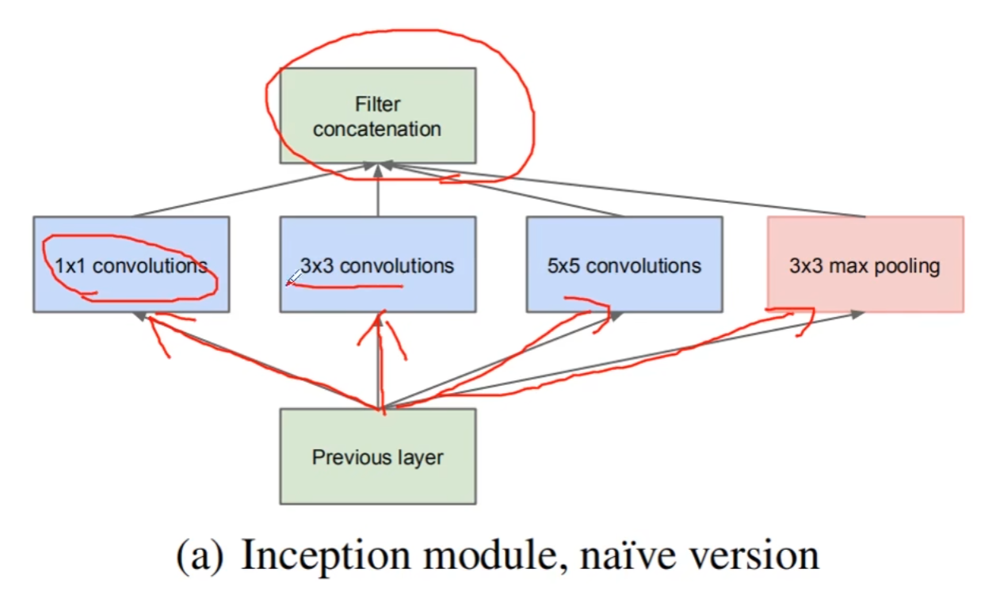

串行改成并行，从上一层过来，经过不同的卷积核，然后按照channel进行拼接，**高度和宽度必须一致**


使用1*1的卷积核**进行降维**，channel维度降维，参数量减少了


**辅助分类器**

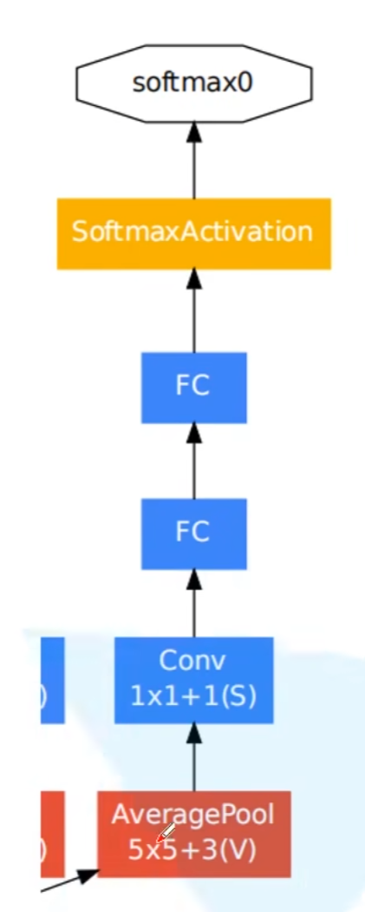

平均池化核是 5*5 stride是3，在inception（4a）和inception（4d）处进行辅助分类


1. 模型搭建

    ```python
    import torch.nn as nn
    import torch
    import torch.nn.functional as F
    
    # 主网络
    class GoogLeNet(nn.Module):
        # 类别个数、是否使用辅助分类器，是否初始化权重
        def __init__(self, num_classes=1000, aux_logits=True, init_weights=False):
            super(GoogLeNet, self).__init__()
            self.aux_logits = aux_logits
    
            self.conv1 = BasicConv2d(3, 64, kernel_size=7, stride=2, padding=3)
            self.maxpool1 = nn.MaxPool2d(3, stride=2, ceil_mode=True) #最大池化下采样，计算出小数，就向上取整
    
            self.conv2 = BasicConv2d(64, 64, kernel_size=1)
            self.conv3 = BasicConv2d(64, 192, kernel_size=3, padding=1)
            self.maxpool2 = nn.MaxPool2d(3, stride=2, ceil_mode=True)
    
            self.inception3a = Inception(192, 64, 96, 128, 16, 32, 32)
            self.inception3b = Inception(256, 128, 128, 192, 32, 96, 64)
            self.maxpool3 = nn.MaxPool2d(3, stride=2, ceil_mode=True)
    
            self.inception4a = Inception(480, 192, 96, 208, 16, 48, 64)
            self.inception4b = Inception(512, 160, 112, 224, 24, 64, 64)
            self.inception4c = Inception(512, 128, 128, 256, 24, 64, 64)
            self.inception4d = Inception(512, 112, 144, 288, 32, 64, 64)
            self.inception4e = Inception(528, 256, 160, 320, 32, 128, 128)
            self.maxpool4 = nn.MaxPool2d(3, stride=2, ceil_mode=True)
    
            self.inception5a = Inception(832, 256, 160, 320, 32, 128, 128)
            self.inception5b = Inception(832, 384, 192, 384, 48, 128, 128)
    
            # 最后创建辅助分类器
            if self.aux_logits:
                self.aux1 = InceptionAux(512, num_classes)
                self.aux2 = InceptionAux(528, num_classes)
    
            # 平均池化下采样层
            self.avgpool = nn.AdaptiveAvgPool2d((1, 1))
            self.dropout = nn.Dropout(0.4)
            self.fc = nn.Linear(1024, num_classes)
    
            # 是否初始化权重
            if init_weights:
                self._initialize_weights()
    
        def forward(self, x):
            # N x 3 x 224 x 224
            x = self.conv1(x)
            # N x 64 x 112 x 112
            x = self.maxpool1(x)
            # N x 64 x 56 x 56
            x = self.conv2(x)
            # N x 64 x 56 x 56
            x = self.conv3(x)
            # N x 192 x 56 x 56
            x = self.maxpool2(x)
    
            # N x 192 x 28 x 28
            x = self.inception3a(x)
            # N x 256 x 28 x 28
            x = self.inception3b(x)
            # N x 480 x 28 x 28
            x = self.maxpool3(x)
            # N x 480 x 14 x 14
            x = self.inception4a(x)
            # N x 512 x 14 x 14
            if self.training and self.aux_logits:    # eval model lose this layer
                aux1 = self.aux1(x)
    
            x = self.inception4b(x)
            # N x 512 x 14 x 14
            x = self.inception4c(x)
            # N x 512 x 14 x 14
            x = self.inception4d(x)
            # N x 528 x 14 x 14
            if self.training and self.aux_logits:    # eval model lose this layer
                aux2 = self.aux2(x)
    
            x = self.inception4e(x)
            # N x 832 x 14 x 14
            x = self.maxpool4(x)
            # N x 832 x 7 x 7
            x = self.inception5a(x)
            # N x 832 x 7 x 7
            x = self.inception5b(x)
            # N x 1024 x 7 x 7
    
            x = self.avgpool(x)
            # N x 1024 x 1 x 1
            x = torch.flatten(x, 1)
            # N x 1024
            x = self.dropout(x)
            x = self.fc(x)
            # N x 1000 (num_classes)
            if self.training and self.aux_logits:   # eval model lose this layer
                return x, aux2, aux1   # 返回辅助分类器和主分支结果
            return x                   # 返回主分支结果
    
        def _initialize_weights(self):
            for m in self.modules():
                if isinstance(m, nn.Conv2d):
                    nn.init.kaiming_normal_(m.weight, mode='fan_out', nonlinearity='relu')
                    if m.bias is not None:
                        nn.init.constant_(m.bias, 0)
                elif isinstance(m, nn.Linear):
                    nn.init.normal_(m.weight, 0, 0.01)
                    nn.init.constant_(m.bias, 0)
    
    # 小模块 inception结构
    class Inception(nn.Module):
        def __init__(self, in_channels, ch1x1, ch3x3red, ch3x3, ch5x5red, ch5x5, pool_proj):
            super(Inception, self).__init__()
    
            # 分支1
            self.branch1 = BasicConv2d(in_channels, ch1x1, kernel_size=1)
    
            # 分支2
            self.branch2 = nn.Sequential(
                BasicConv2d(in_channels, ch3x3red, kernel_size=1),
                BasicConv2d(ch3x3red, ch3x3, kernel_size=3, padding=1)   # 保证输出大小等于输入大小
            )
            # 分支3
            self.branch3 = nn.Sequential(
                BasicConv2d(in_channels, ch5x5red, kernel_size=1),
                # 在官方的实现中，其实是3x3的kernel并不是5x5，这里我也懒得改了，具体可以参考下面的issue
                # Please see https://github.com/pytorch/vision/issues/906 for details.
                BasicConv2d(ch5x5red, ch5x5, kernel_size=5, padding=2)   # 保证输出大小等于输入大小
            )
            # 分支4
            self.branch4 = nn.Sequential(
                nn.MaxPool2d(kernel_size=3, stride=1, padding=1),
                BasicConv2d(in_channels, pool_proj, kernel_size=1)
            )
    
        def forward(self, x):
            branch1 = self.branch1(x)
            branch2 = self.branch2(x)
            branch3 = self.branch3(x)
            branch4 = self.branch4(x)
    
            outputs = [branch1, branch2, branch3, branch4]
            # 合并的维度，在深度channel维度上进行合并
            return torch.cat(outputs, 1)
    
    # 辅助分类器
    class InceptionAux(nn.Module):
        def __init__(self, in_channels, num_classes):
            super(InceptionAux, self).__init__()
            self.averagePool = nn.AvgPool2d(kernel_size=5, stride=3)
            self.conv = BasicConv2d(in_channels, 128, kernel_size=1)  # output[batch, 128, 4, 4]
    
            self.fc1 = nn.Linear(2048, 1024)
            self.fc2 = nn.Linear(1024, num_classes)
    
        def forward(self, x):
            # aux1: N x 512 x 14 x 14, aux2: N x 528 x 14 x 14
            x = self.averagePool(x)
            # aux1: N x 512 x 4 x 4, aux2: N x 528 x 4 x 4
            # 1 * 1的卷积核降维，哪怕深度不一样，也可以进行降维到同样的深度
            x = self.conv(x)
            # N x 128 x 4 x 4
            x = torch.flatten(x, 1)
            # 原论文是70%概率随机失活
            x = F.dropout(x, 0.5, training=self.training)
            # N x 2048
            x = F.relu(self.fc1(x), inplace=True)
            x = F.dropout(x, 0.5, training=self.training)
            # N x 1024
            x = self.fc2(x)
            # N x num_classes
            return x
    
    # 小模块 卷积 + relu
    class BasicConv2d(nn.Module):
        def __init__(self, in_channels, out_channels, **kwargs):
            super(BasicConv2d, self).__init__()
            self.conv = nn.Conv2d(in_channels, out_channels, **kwargs)
            self.relu = nn.ReLU(inplace=True)
    
        def forward(self, x):
            x = self.conv(x)
            x = self.relu(x)
            return x
    
    ```

2. train.py

    ```python
    import os
    import sys
    import json
    
    import torch
    import torch.nn as nn
    from torchvision import transforms, datasets
    import torch.optim as optim
    from tqdm import tqdm
    
    from model import GoogLeNet
    
    
    def main():
        device = torch.device("cuda:0" if torch.cuda.is_available() else "cpu")
        print("using {} device.".format(device))
    
        data_transform = {
            "train": transforms.Compose([transforms.RandomResizedCrop(224),
                                         transforms.RandomHorizontalFlip(),
                                         transforms.ToTensor(),
                                         transforms.Normalize((0.5, 0.5, 0.5), (0.5, 0.5, 0.5))]),
            "val": transforms.Compose([transforms.Resize((224, 224)),
                                       transforms.ToTensor(),
                                       transforms.Normalize((0.5, 0.5, 0.5), (0.5, 0.5, 0.5))])}
    
        data_root = os.path.abspath(os.path.join(os.getcwd(), "../.."))  # get data root path
        image_path = os.path.join(data_root, "data_set", "flower_data")  # flower data set path
        assert os.path.exists(image_path), "{} path does not exist.".format(image_path)
        train_dataset = datasets.ImageFolder(root=os.path.join(image_path, "train"),
                                             transform=data_transform["train"])
        train_num = len(train_dataset)
    
        # {'daisy':0, 'dandelion':1, 'roses':2, 'sunflower':3, 'tulips':4}
        flower_list = train_dataset.class_to_idx
        cla_dict = dict((val, key) for key, val in flower_list.items())
        # write dict into json file
        json_str = json.dumps(cla_dict, indent=4)
        with open('class_indices.json', 'w') as json_file:
            json_file.write(json_str)
    
        batch_size = 32
        nw = min([os.cpu_count(), batch_size if batch_size > 1 else 0, 8])  # number of workers
        print('Using {} dataloader workers every process'.format(nw))
    
        train_loader = torch.utils.data.DataLoader(train_dataset,
                                                   batch_size=batch_size, shuffle=True,
                                                   num_workers=nw)
    
        validate_dataset = datasets.ImageFolder(root=os.path.join(image_path, "val"),
                                                transform=data_transform["val"])
        val_num = len(validate_dataset)
        validate_loader = torch.utils.data.DataLoader(validate_dataset,
                                                      batch_size=batch_size, shuffle=False,
                                                      num_workers=nw)
    
        print("using {} images for training, {} images for validation.".format(train_num,
                                                                               val_num))
    
        # test_data_iter = iter(validate_loader)
        # test_image, test_label = test_data_iter.next()
    
        # 定义网络
        net = GoogLeNet(num_classes=5, aux_logits=True, init_weights=True)
        # 如果要使用官方的预训练权重，注意是将权重载入官方的模型，不是我们自己实现的模型
        # 官方的模型中使用了bn层以及改了一些参数，不能混用
        # import torchvision
        # net = torchvision.models.googlenet(num_classes=5)
        # model_dict = net.state_dict()
        # # 预训练权重下载地址: https://download.pytorch.org/models/googlenet-1378be20.pth
        # pretrain_model = torch.load("googlenet.pth")
        # del_list = ["aux1.fc2.weight", "aux1.fc2.bias",
        #             "aux2.fc2.weight", "aux2.fc2.bias",
        #             "fc.weight", "fc.bias"]
        # pretrain_dict = {k: v for k, v in pretrain_model.items() if k not in del_list}
        # model_dict.update(pretrain_dict)
        # net.load_state_dict(model_dict)
        net.to(device)
        loss_function = nn.CrossEntropyLoss()
        optimizer = optim.Adam(net.parameters(), lr=0.0003)
    
        epochs = 30
        best_acc = 0.0
        save_path = './googleNet.pth'
        train_steps = len(train_loader)
        for epoch in range(epochs):
            # train
            net.train()
            running_loss = 0.0
            train_bar = tqdm(train_loader, file=sys.stdout)
            for step, data in enumerate(train_bar):
                images, labels = data
                optimizer.zero_grad()
                logits, aux_logits2, aux_logits1 = net(images.to(device))
                # 三个损失函数
                loss0 = loss_function(logits, labels.to(device))
                loss1 = loss_function(aux_logits1, labels.to(device))
                loss2 = loss_function(aux_logits2, labels.to(device))
                # 加权损失
                loss = loss0 + loss1 * 0.3 + loss2 * 0.3
                loss.backward()
                optimizer.step()
    
                # print statistics
                running_loss += loss.item()
    
                train_bar.desc = "train epoch[{}/{}] loss:{:.3f}".format(epoch + 1,
                                                                         epochs,
                                                                         loss)
    
            # validate
            net.eval()
            acc = 0.0  # accumulate accurate number / epoch
            with torch.no_grad():
                val_bar = tqdm(validate_loader, file=sys.stdout)
                for val_data in val_bar:
                    val_images, val_labels = val_data
                    # 只有一个输出、不需要管辅助分类器
                    outputs = net(val_images.to(device))  # eval model only have last output layer
                    predict_y = torch.max(outputs, dim=1)[1]
                    acc += torch.eq(predict_y, val_labels.to(device)).sum().item()
    
            val_accurate = acc / val_num
            print('[epoch %d] train_loss: %.3f  val_accuracy: %.3f' %
                  (epoch + 1, running_loss / train_steps, val_accurate))
    
            if val_accurate > best_acc:
                best_acc = val_accurate
                torch.save(net.state_dict(), save_path)
    
        print('Finished Training')
    
    
    if __name__ == '__main__':
        main()
    
    ```

    

### ResNet


1. 超级深的网络结构（突破1000层）

2. 提出residual模块

3. 使用Batch Normalization加速训练（丢弃DropOut方法）

    

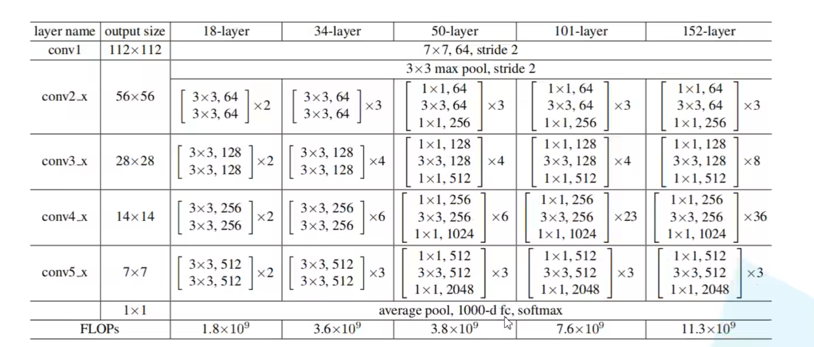


**Residual模块**


**主分支和侧分支shortcut的高 宽 channel必须相同**，也就是shape完全相同，**相加是两个矩阵在相同维度上数值相加，而不是concat**


**18 34 的残差结构**

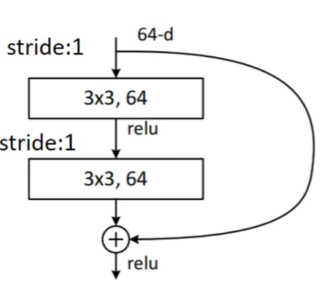

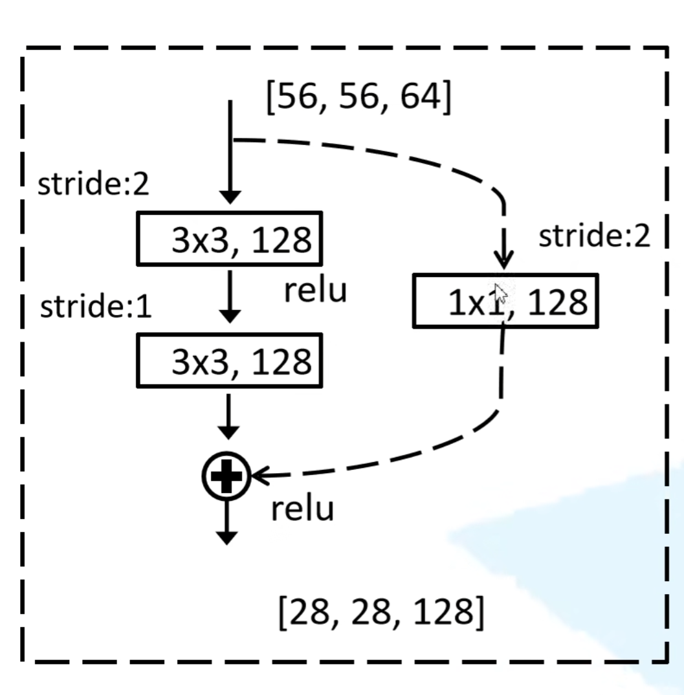

**深层的 残差结构**

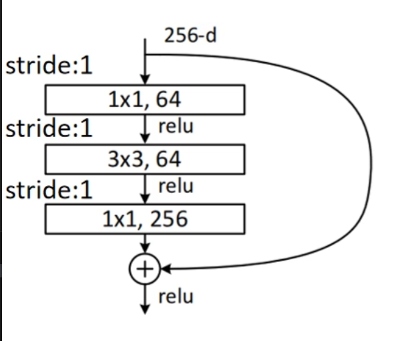


**虚线表示的residual模块实际上就是保证残差连接的shape具有一致性**，optionB方法，将输入部分的高宽和深度与主线的高宽和深度一直，事实上，只有不同的残差模块之间才会有这样的虚线连接形式，相同的残差模块之间不会用虚线连接shortcut，因为不需要，shape相同


**Batch Normalization**

[转到本篇](###BatchNormlization)[博文](https://blog.csdn.net/qq_37541097/article/details/104434557?ops_request_misc=%257B%2522request%255Fid%2522%253A%2522170236993316800227428091%2522%252C%2522scm%2522%253A%252220140713.130102334.pc%255Fblog.%2522%257D&request_id=170236993316800227428091&biz_id=0&utm_medium=distribute.pc_search_result.none-task-blog-2~blog~first_rank_ecpm_v1~rank_v31_ecpm-1-104434557-null-null.nonecase&utm_term=Batch&spm=1018.2226.3001.4450)

BN就是在训练过程中，针对每一个Batch在所有Feature Map的相同的channel上进行归一化操作


使用BN时需要**注意**的点：

1. 训练时要将traning参数设置为True，在验证时将trainning参数设置为False。在pytorch中可通过创建模型的model.train()和model.eval()方法控制
2. batch size尽可能设置大点，设置小后表现可能很糟糕，设置的越大求的均值和方差越接近整个训练集的均值和方差。
3. 建议将bn层放在卷积层（Conv）和激活层（例如Relu）之间，且卷积层不要使用偏置bias，因为没有用。


1. 模型搭建

    ```python
    import torch.nn as nn
    import torch
    
    
    # 18层34层残差结构
    # 既要有虚线连接的残差结构
    # 也要有实线连接的残差结构
    class BasicBlock(nn.Module):
        # expansion是一个标志，层次比较resnet有的残差结构卷积核的个数不相同，这里定义了一个倍数，在这里用不到
        expansion = 1
        # 两种残差结构 conv1和downsample stride不同，要传入一个stride
        # dowmsample是虚线shortcut和实线shortcut
        def __init__(self, in_channel, out_channel, stride=1, downsample=None, **kwargs):
            super(BasicBlock, self).__init__()
            # padding为1可以同时满足stride=1和stride=2的卷积，偏置不取
            self.conv1 = nn.Conv2d(in_channels=in_channel, out_channels=out_channel,
                                   kernel_size=3, stride=stride, padding=1, bias=False)
            # bn只是在每个channel上归一化，没改变channel
            self.bn1 = nn.BatchNorm2d(out_channel)
            self.relu = nn.ReLU()
            # 这个stride不是传入的stride，都是1
            self.conv2 = nn.Conv2d(in_channels=out_channel, out_channels=out_channel,
                                   kernel_size=3, stride=1, padding=1, bias=False)
            self.bn2 = nn.BatchNorm2d(out_channel)
            # shortcut
            self.downsample = downsample
    
        def forward(self, x):
            # 保存x
            identity = x
            if self.downsample is not None:
                # shortcut输出
                identity = self.downsample(x)
    
            out = self.conv1(x)
            out = self.bn1(out)
            out = self.relu(out)
    
            out = self.conv2(out)
            out = self.bn2(out)
    
            # 残差连接相加
            out += identity
            out = self.relu(out)
    
            return out
    # 50 101 152
    # 多层的残差结构
    # 卷积核的个数4倍的关系
    class Bottleneck(nn.Module):
        """
        注意：原论文中，在虚线残差结构的主分支上，第一个1x1卷积层的步距是2，第二个3x3卷积层步距是1。
        但在pytorch官方实现过程中是第一个1x1卷积层的步距是1，第二个3x3卷积层步距是2，
        这么做的好处是能够在top1上提升大概0.5%的准确率。
        可参考Resnet v1.5 https://ngc.nvidia.com/catalog/model-scripts/nvidia:resnet_50_v1_5_for_pytorch
        """
        # 卷积核变为4倍的数量
        expansion = 4
        # 传入的stride默认是1
        # 传入的out_channel是卷积核对应的第一层和第二层卷积核的个数，并不是第三层的卷积核个数
        def __init__(self, in_channel, out_channel, stride=1, downsample=None):
            super(Bottleneck, self).__init__()
    
            self.conv1 = nn.Conv2d(in_channels=in_channel, out_channels=out_channel,
                                   kernel_size=1, stride=1, bias=False)  # squeeze channels
            self.bn1 = nn.BatchNorm2d(out_channel)
            # -----------------------------------------
            # 注意这里stride = stride是传入的
            self.conv2 = nn.Conv2d(in_channels=out_channel, out_channels=out_channel,
                                   kernel_size=3, stride=stride, bias=False, padding=1)
            self.bn2 = nn.BatchNorm2d(out_channel)
            # -----------------------------------------
            self.conv3 = nn.Conv2d(in_channels=out_channel, out_channels=out_channel*self.expansion,
                                   kernel_size=1, stride=1, bias=False)  # unsqueeze channels
            self.bn3 = nn.BatchNorm2d(out_channel*self.expansion)
            self.relu = nn.ReLU(inplace=True)
            self.downsample = downsample
    
        def forward(self, x):
            identity = x
            if self.downsample is not None:
                identity = self.downsample(x)
    
            out = self.conv1(x)
            out = self.bn1(out)
            out = self.relu(out)
    
            out = self.conv2(out)
            out = self.bn2(out)
            out = self.relu(out)
    
            out = self.conv3(out)
            out = self.bn3(out)
    
            out += identity
            out = self.relu(out)
    
            return out
    
    
    class ResNet(nn.Module):
    
        def __init__(self,
                     block,             # 传入的残差结构名字Basicblock 或者是 Bottleneck
                     blocks_num,        # 使用的残差结构的数目，传入的是列表参数
                     num_classes=1000,
                     include_top=True):
            super(ResNet, self).__init__()
            self.include_top = include_top
            self.in_channel = 64
            # 第一层
            self.conv1 = nn.Conv2d(3, self.in_channel, kernel_size=7, stride=2,
                                   padding=3, bias=False)
            self.bn1 = nn.BatchNorm2d(self.in_channel)
            self.relu = nn.ReLU(inplace=True)
            self.maxpool = nn.MaxPool2d(kernel_size=3, stride=2, padding=1)
            self.layer1 = self._make_layer(block, 64, blocks_num[0])
            self.layer2 = self._make_layer(block, 128, blocks_num[1], stride=2)
            self.layer3 = self._make_layer(block, 256, blocks_num[2], stride=2)
            self.layer4 = self._make_layer(block, 512, blocks_num[3], stride=2)
            if self.include_top:
                self.avgpool = nn.AdaptiveAvgPool2d((1, 1))  # output size = (1, 1)
                self.fc = nn.Linear(512 * block.expansion, num_classes)
    
            for m in self.modules():
                if isinstance(m, nn.Conv2d):
                    nn.init.kaiming_normal_(m.weight, mode='fan_out', nonlinearity='relu')
    
        def _make_layer(self, block, channel, block_num, stride=1):
            downsample = None
            if stride != 1 or self.in_channel != channel * block.expansion:
                downsample = nn.Sequential(
                    nn.Conv2d(self.in_channel, channel * block.expansion, kernel_size=1, stride=stride, bias=False),
                    nn.BatchNorm2d(channel * block.expansion))
    
            layers = []
            layers.append(block(self.in_channel,
                                channel,
                                downsample=downsample,
                                stride=stride))
            self.in_channel = channel * block.expansion
    
            for _ in range(1, block_num):
                layers.append(block(self.in_channel, channel))
    
            return nn.Sequential(*layers)
    
        def forward(self, x):
            x = self.conv1(x)
            x = self.bn1(x)
            x = self.relu(x)
            x = self.maxpool(x)
    
            x = self.layer1(x)
            x = self.layer2(x)
            x = self.layer3(x)
            x = self.layer4(x)
    
            if self.include_top:
                x = self.avgpool(x)
                x = torch.flatten(x, 1)
                x = self.fc(x)
    
            return x
    
    
    def resnet34(num_classes=1000, include_top=True):
        # https://download.pytorch.org/models/resnet34-333f7ec4.pth
        return ResNet(BasicBlock, [3, 4, 6, 3], num_classes=num_classes, include_top=include_top)
    
    
    
    def resnet101(num_classes=1000, include_top=True):
        # https://download.pytorch.org/models/resnet101-5d3b4d8f.pth
        return ResNet(Bottleneck, [3, 4, 23, 3], num_classes=num_classes, include_top=include_top)
    
    
    
    ```

2. train.py

    ```python
    import os
    import sys
    import json
    
    import torch
    import torch.nn as nn
    import torch.optim as optim
    from torchvision import transforms, datasets
    from tqdm import tqdm
    
    from restnet_my import resnet34   #改成我自己写的
    
    
    def main():
        device = torch.device("cuda:0" if torch.cuda.is_available() else "cpu")
        print("using {} device.".format(device))
        
        # 参数normal变了
        data_transform = {
            "train": transforms.Compose([transforms.RandomResizedCrop(224),
                                         transforms.RandomHorizontalFlip(),
                                         transforms.ToTensor(),
                                         transforms.Normalize([0.485, 0.456, 0.406], [0.229, 0.224, 0.225])]),
            "val": transforms.Compose([transforms.Resize(256),
                                       transforms.CenterCrop(224),
                                       transforms.ToTensor(),
                                       transforms.Normalize([0.485, 0.456, 0.406], [0.229, 0.224, 0.225])])}
    
        data_root = os.path.abspath(os.path.join(os.getcwd(), "../.."))  # get data root path
        image_path = os.path.join(data_root, "data_set", "flower_data")  # flower data set path
        assert os.path.exists(image_path), "{} path does not exist.".format(image_path)
        train_dataset = datasets.ImageFolder(root=os.path.join(image_path, "train"),
                                             transform=data_transform["train"])
        train_num = len(train_dataset)
    
        # {'daisy':0, 'dandelion':1, 'roses':2, 'sunflower':3, 'tulips':4}
        flower_list = train_dataset.class_to_idx
        cla_dict = dict((val, key) for key, val in flower_list.items())
        # write dict into json file
        json_str = json.dumps(cla_dict, indent=4)
        with open('class_indices.json', 'w') as json_file:
            json_file.write(json_str)
    
        batch_size = 16
        nw = min([os.cpu_count(), batch_size if batch_size > 1 else 0, 8])  # number of workers
        print('Using {} dataloader workers every process'.format(nw))
    
        train_loader = torch.utils.data.DataLoader(train_dataset,
                                                   batch_size=batch_size, shuffle=True,
                                                   num_workers=nw)
    
        validate_dataset = datasets.ImageFolder(root=os.path.join(image_path, "val"),
                                                transform=data_transform["val"])
        val_num = len(validate_dataset)
        validate_loader = torch.utils.data.DataLoader(validate_dataset,
                                                      batch_size=batch_size, shuffle=False,
                                                      num_workers=nw)
    
        print("using {} images for training, {} images for validation.".format(train_num,
                                                                               val_num))
        
        net = resnet34()
        # load pretrain weights
        # download url: https://download.pytorch.org/models/resnet34-333f7ec4.pth
        model_weight_path = "./resnet34-pre.pth"
        assert os.path.exists(model_weight_path), "file {} does not exist.".format(model_weight_path)
        net.load_state_dict(torch.load(model_weight_path, map_location='cpu'))
        # for param in net.parameters():
        #     param.requires_grad = False
    
        # change fc layer structure
        # 加载参数，然后修改最后一层进行迁移学习
        in_channel = net.fc.in_features
        net.fc = nn.Linear(in_channel, 5)
        net.to(device)
    
        # define loss function
        loss_function = nn.CrossEntropyLoss()
    
        # construct an optimizer
        params = [p for p in net.parameters() if p.requires_grad]
        optimizer = optim.Adam(params, lr=0.0001)
    
        epochs = 3
        best_acc = 0.0
        save_path = './resNet34.pth'
        train_steps = len(train_loader)
        for epoch in range(epochs):
            # train
            net.train()
            running_loss = 0.0
            train_bar = tqdm(train_loader, file=sys.stdout)
            for step, data in enumerate(train_bar):
                images, labels = data
                optimizer.zero_grad()
                logits = net(images.to(device))
                loss = loss_function(logits, labels.to(device))
                loss.backward()
                optimizer.step()
    
                # print statistics
                running_loss += loss.item()
    
                train_bar.desc = "train epoch[{}/{}] loss:{:.3f}".format(epoch + 1,
                                                                         epochs,
                                                                         loss)
    
            # validate
            net.eval()
            acc = 0.0  # accumulate accurate number / epoch
            with torch.no_grad():
                val_bar = tqdm(validate_loader, file=sys.stdout)
                for val_data in val_bar:
                    val_images, val_labels = val_data
                    outputs = net(val_images.to(device))
                    # loss = loss_function(outputs, test_labels)
                    predict_y = torch.max(outputs, dim=1)[1]
                    acc += torch.eq(predict_y, val_labels.to(device)).sum().item()
    
                    val_bar.desc = "valid epoch[{}/{}]".format(epoch + 1,
                                                               epochs)
    
            val_accurate = acc / val_num
            print('[epoch %d] train_loss: %.3f  val_accuracy: %.3f' %
                  (epoch + 1, running_loss / train_steps, val_accurate))
    
            if val_accurate > best_acc:
                best_acc = val_accurate
                torch.save(net.state_dict(), save_path)
    
        print('Finished Training')
    
    
    if __name__ == '__main__':
        main()
    
    ```


### ResNeXt

更新了block

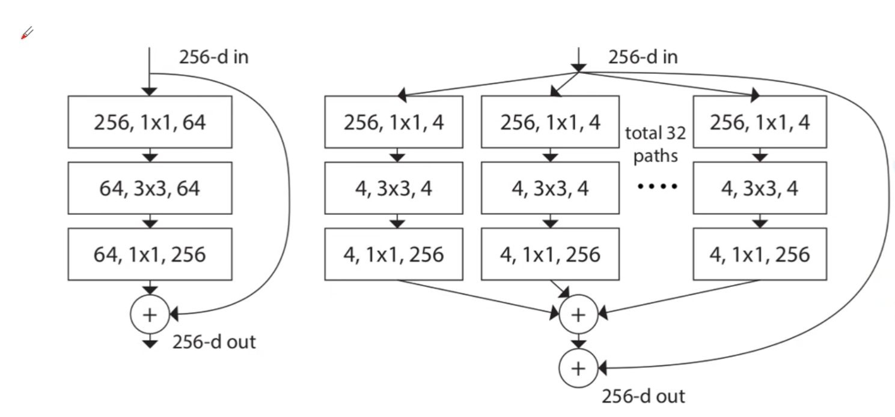

[分组卷积](###分组卷积)

下面这三种情况是等价的


1. 模型搭建

    ```python
    import torch.nn as nn
    import torch
    
    # ResNeXt网络  组卷积
    # 18层34层残差结构
    # 既要有虚线连接的残差结构
    # 也要有实线连接的残差结构
    class BasicBlock(nn.Module):
        # expansion是一个标志，层次比较resnet有的残差结构卷积核的个数不相同，这里定义了一个倍数，在这里用不到
        expansion = 1
        # 两种残差结构 conv1和downsample stride不同，要传入一个stride
        # dowmsample是虚线shortcut和实线shortcut
        def __init__(self, in_channel, out_channel, stride=1, downsample=None, **kwargs):
            super(BasicBlock, self).__init__()
            # padding为1可以同时满足stride=1和stride=2的卷积，偏置不取
            self.conv1 = nn.Conv2d(in_channels=in_channel, out_channels=out_channel,
                                   kernel_size=3, stride=stride, padding=1, bias=False)
            # bn只是在每个channel上归一化，没改变channel
            self.bn1 = nn.BatchNorm2d(out_channel)
            self.relu = nn.ReLU()
            # 这个stride不是传入的stride，都是1
            self.conv2 = nn.Conv2d(in_channels=out_channel, out_channels=out_channel,
                                   kernel_size=3, stride=1, padding=1, bias=False)
            self.bn2 = nn.BatchNorm2d(out_channel)
            # shortcut
            self.downsample = downsample
    
        def forward(self, x):
            # 保存x
            identity = x
            if self.downsample is not None:
                # shortcut输出
                identity = self.downsample(x)
    
            out = self.conv1(x)
            out = self.bn1(out)
            out = self.relu(out)
    
            out = self.conv2(out)
            out = self.bn2(out)
    
            # 残差连接相加
            out += identity
            out = self.relu(out)
    
            return out
    
    # 多层的残差结构
    # 卷积核的个数4倍的关系
    class Bottleneck(nn.Module):
        """
        注意：原论文中，在虚线残差结构的主分支上，第一个1x1卷积层的步距是2，第二个3x3卷积层步距是1。
        但在pytorch官方实现过程中是第一个1x1卷积层的步距是1，第二个3x3卷积层步距是2，
        这么做的好处是能够在top1上提升大概0.5%的准确率。
        可参考Resnet v1.5 https://ngc.nvidia.com/catalog/model-scripts/nvidia:resnet_50_v1_5_for_pytorch
        """
        # 卷积核变为4倍的数量
        expansion = 4
        # 传入的stride默认是1
        # 
        def __init__(self, in_channel, out_channel, stride=1, downsample=None,
                     groups=1, width_per_group=64): 
            super(Bottleneck, self).__init__()
            # 假设输入的特征图channel = 128  
            # in_channel = 128  groups = 32 width_per_group = 4
            # 计算得出width = 128
    
            # 如果groups = 1, width_per_group = 64, 即是普通的卷积，这时候width=128，即每一个残差模块，第一层的卷积核个数
            width = int(out_channel * (width_per_group / 64.)) * groups
    
            self.conv1 = nn.Conv2d(in_channels=in_channel, out_channels=width,
                                   kernel_size=1, stride=1, bias=False)  # squeeze channels
            self.bn1 = nn.BatchNorm2d(width)
            # -----------------------------------------
            self.conv2 = nn.Conv2d(in_channels=width, out_channels=width, groups=groups,
                                   kernel_size=3, stride=stride, bias=False, padding=1)
            self.bn2 = nn.BatchNorm2d(width)
            # -----------------------------------------
            # 注意第三个卷积层变成了outchannel * expansion
            self.conv3 = nn.Conv2d(in_channels=width, out_channels=out_channel*self.expansion,
                                   kernel_size=1, stride=1, bias=False)  # unsqueeze channels
            self.bn3 = nn.BatchNorm2d(out_channel*self.expansion)
            self.relu = nn.ReLU(inplace=True)
            self.downsample = downsample
    
        def forward(self, x):
            identity = x
            if self.downsample is not None:
                identity = self.downsample(x)
    
            out = self.conv1(x)
            out = self.bn1(out)
            out = self.relu(out)
    
            out = self.conv2(out)
            out = self.bn2(out)
            out = self.relu(out)
    
            out = self.conv3(out)
            out = self.bn3(out)
    
            out += identity
            out = self.relu(out)
    
            return out
    
    
    class ResNet(nn.Module):
    
        def __init__(self,
                     block,
                     blocks_num,
                     num_classes=1000,
                     include_top=True,
                     groups=1,
                     width_per_group=64):
            super(ResNet, self).__init__()
            self.include_top = include_top
            self.in_channel = 64
    
            self.groups = groups
            self.width_per_group = width_per_group
    
            self.conv1 = nn.Conv2d(3, self.in_channel, kernel_size=7, stride=2,
                                   padding=3, bias=False)
            self.bn1 = nn.BatchNorm2d(self.in_channel)
            self.relu = nn.ReLU(inplace=True)
            self.maxpool = nn.MaxPool2d(kernel_size=3, stride=2, padding=1)
            self.layer1 = self._make_layer(block, 64, blocks_num[0])
            self.layer2 = self._make_layer(block, 128, blocks_num[1], stride=2)
            self.layer3 = self._make_layer(block, 256, blocks_num[2], stride=2)
            self.layer4 = self._make_layer(block, 512, blocks_num[3], stride=2)
            if self.include_top:
                self.avgpool = nn.AdaptiveAvgPool2d((1, 1))  # output size = (1, 1)
                self.fc = nn.Linear(512 * block.expansion, num_classes)
    
            for m in self.modules():
                if isinstance(m, nn.Conv2d):
                    nn.init.kaiming_normal_(m.weight, mode='fan_out', nonlinearity='relu')
    
        def _make_layer(self, block, channel, block_num, stride=1):
            downsample = None
            if stride != 1 or self.in_channel != channel * block.expansion:
                downsample = nn.Sequential(
                    nn.Conv2d(self.in_channel, channel * block.expansion, kernel_size=1, stride=stride, bias=False),
                    nn.BatchNorm2d(channel * block.expansion))
    
            layers = []
            layers.append(block(self.in_channel,
                                channel,
                                downsample=downsample,
                                stride=stride,
                                groups=self.groups,
                                width_per_group=self.width_per_group))
            self.in_channel = channel * block.expansion
    
            for _ in range(1, block_num):
                layers.append(block(self.in_channel,
                                    channel,
                                    groups=self.groups,
                                    width_per_group=self.width_per_group))
    
            return nn.Sequential(*layers)
    
        def forward(self, x):
            x = self.conv1(x)
            x = self.bn1(x)
            x = self.relu(x)
            x = self.maxpool(x)
    
            x = self.layer1(x)
            x = self.layer2(x)
            x = self.layer3(x)
            x = self.layer4(x)
    
            if self.include_top:
                x = self.avgpool(x)
                x = torch.flatten(x, 1)
                x = self.fc(x)
    
            return x
    
    
    def resnet34(num_classes=1000, include_top=True):
        # https://download.pytorch.org/models/resnet34-333f7ec4.pth
        return ResNet(BasicBlock, [3, 4, 6, 3], num_classes=num_classes, include_top=include_top)
    
    
    def resnet50(num_classes=1000, include_top=True):
        # https://download.pytorch.org/models/resnet50-19c8e357.pth
        return ResNet(Bottleneck, [3, 4, 6, 3], num_classes=num_classes, include_top=include_top)
    
    
    def resnet101(num_classes=1000, include_top=True):
        # https://download.pytorch.org/models/resnet101-5d3b4d8f.pth
        return ResNet(Bottleneck, [3, 4, 23, 3], num_classes=num_classes, include_top=include_top)
    
    
    def resnext50_32x4d(num_classes=1000, include_top=True):
        # https://download.pytorch.org/models/resnext50_32x4d-7cdf4587.pth
        groups = 32
        width_per_group = 4
        return ResNet(Bottleneck, [3, 4, 6, 3],
                      num_classes=num_classes,
                      include_top=include_top,
                      groups=groups,
                      width_per_group=width_per_group)
    
    
    def resnext101_32x8d(num_classes=1000, include_top=True):
        # https://download.pytorch.org/models/resnext101_32x8d-8ba56ff5.pth
        groups = 32
        width_per_group = 8
        return ResNet(Bottleneck, [3, 4, 23, 3],
                      num_classes=num_classes,
                      include_top=include_top,
                      groups=groups,
                      width_per_group=width_per_group)
    
    ```

    

### MobileNetv1、v2

1. 提出DepthWise Convolution（大大减少运算量和参数量）
2. 增加超参数$\alpha卷积核个数比值 、\beta图片的输入分辨率$


**DW卷积**

DW卷积实际上是分组卷积的特殊情况，用单通道的卷积核取卷积一个feature map的一个通道，最终输入通道数和输出通道数相同  [跳转](###DepthWise卷积)


**DW与PW的堆叠代替传统的卷积核**


**Mobile v2**

1. Inverted Residual（倒残差结构）
2. Linear Bottleneck


**倒残差结构**

升维再降维、ReLU6激活函数

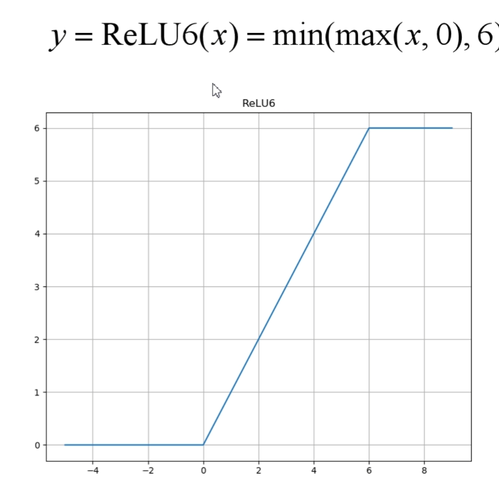


当**stride = 1且输入的特征矩阵与输出的特征矩阵shape相同时，才会有shortcut连接**

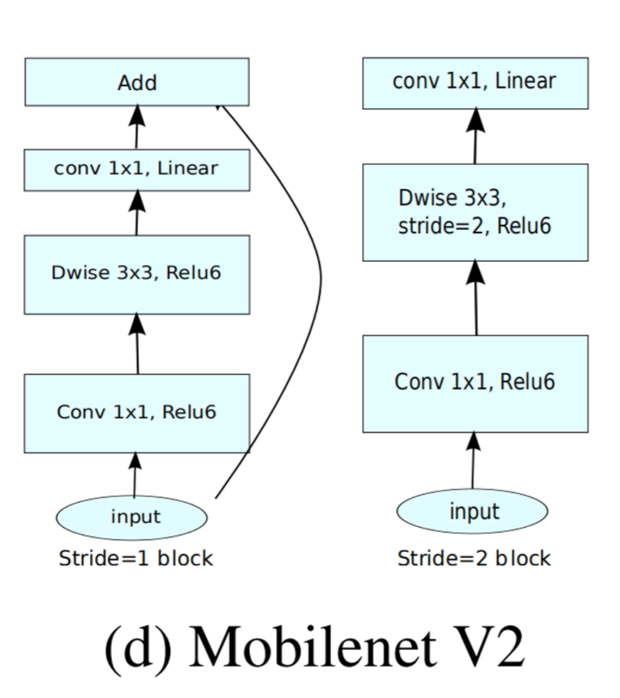


t是扩展因子，表示特征图的channel经过第一个卷积层扩展多少倍

c是输出特征矩阵的channel数

n是bottleneck的重复次数

s是步距，**仅为当前bottleneck第一层的dw卷积的stride，其余的stride都是1**

k是分类的类别个数


1. 模型搭建

    ```python
    from torch import nn
    import torch
    
    # 将卷积核个数设置为round_nearest的整数倍 
    def _make_divisible(ch, divisor=8, min_ch=None):
        """
        This function is taken from the original tf repo.
        It ensures that all layers have a channel number that is divisible by 8
        It can be seen here:
        https://github.com/tensorflow/models/blob/master/research/slim/nets/mobilenet/mobilenet.py
        """
        if min_ch is None:
            min_ch = divisor
        # 将输入通道数，ch调整为离8最近的整数倍（类似于四舍五入）
        new_ch = max(min_ch, int(ch + divisor / 2) // divisor * divisor)
        # Make sure that round down does not go down by more than 10%.
        if new_ch < 0.9 * ch:
            new_ch += divisor
        return new_ch
    
    
    class ConvBNReLU(nn.Sequential):
        def __init__(self, in_channel, out_channel, kernel_size=3, stride=1, groups=1):
            padding = (kernel_size - 1) // 2
            super(ConvBNReLU, self).__init__(
                nn.Conv2d(in_channel, out_channel, kernel_size, stride, padding, groups=groups, bias=False),
                nn.BatchNorm2d(out_channel),
                nn.ReLU6(inplace=True)
            )
    
    # 倒残差结构
    class InvertedResidual(nn.Module):
        # expand_ratio 扩展因子t
        def __init__(self, in_channel, out_channel, stride, expand_ratio):
            super(InvertedResidual, self).__init__()
            # 第一层卷积核的个数 tk
            hidden_channel = in_channel * expand_ratio
            # 是否有捷径分支,满足条件use_short = true
            self.use_shortcut = stride == 1 and in_channel == out_channel
    
            layers = []
            if expand_ratio != 1: # 如果等于1，就不需要1×1的扩展卷积层了
                # 1x1 pointwise conv
                layers.append(ConvBNReLU(in_channel, hidden_channel, kernel_size=1))
            # extend能一次性批量传入一堆层
            layers.extend([
                # 3x3 depthwise conv
                # dw卷积
                ConvBNReLU(hidden_channel, hidden_channel, stride=stride, groups=hidden_channel),
                # 1x1 pointwise conv(linear)
                nn.Conv2d(hidden_channel, out_channel, kernel_size=1, bias=False),
                nn.BatchNorm2d(out_channel),
            ])
    
            self.conv = nn.Sequential(*layers)
    
        def forward(self, x):
            if self.use_shortcut:
                return x + self.conv(x)
            else:
                return self.conv(x)
    
    
    class MobileNetV2(nn.Module):
        def __init__(self, num_classes=1000, alpha=1.0, round_nearest=8):
            super(MobileNetV2, self).__init__()
            block = InvertedResidual
            # 超参数alpha
            input_channel = _make_divisible(32 * alpha, round_nearest)
            last_channel = _make_divisible(1280 * alpha, round_nearest)
    
            inverted_residual_setting = [
                # t, c, n, s
                [1, 16, 1, 1],
                [6, 24, 2, 2],
                [6, 32, 3, 2],
                [6, 64, 4, 2],
                [6, 96, 3, 1],
                [6, 160, 3, 2],
                [6, 320, 1, 1],
            ]
    
            features = []
            # conv1 layer
            features.append(ConvBNReLU(3, input_channel, stride=2))
            # building inverted residual residual blockes
            for t, c, n, s in inverted_residual_setting:
                output_channel = _make_divisible(c * alpha, round_nearest)
                for i in range(n):
                    stride = s if i == 0 else 1
                    features.append(block(input_channel, output_channel, stride, expand_ratio=t))
                    input_channel = output_channel
            # building last several layers
            features.append(ConvBNReLU(input_channel, last_channel, 1))
            # combine feature layers
            self.features = nn.Sequential(*features)
    
            # building classifier
            self.avgpool = nn.AdaptiveAvgPool2d((1, 1))
            self.classifier = nn.Sequential(
                nn.Dropout(0.2),
                nn.Linear(last_channel, num_classes)
            )
    
            # weight initialization
            for m in self.modules():
                if isinstance(m, nn.Conv2d):
                    nn.init.kaiming_normal_(m.weight, mode='fan_out')
                    if m.bias is not None:
                        nn.init.zeros_(m.bias)
                elif isinstance(m, nn.BatchNorm2d):
                    nn.init.ones_(m.weight)
                    nn.init.zeros_(m.bias)
                elif isinstance(m, nn.Linear):
                    nn.init.normal_(m.weight, 0, 0.01)
                    nn.init.zeros_(m.bias)
    
        def forward(self, x):
            x = self.features(x)
            x = self.avgpool(x)
            x = torch.flatten(x, 1)
            x = self.classifier(x)
            return x
    
    ```

2. train.py

    ```python
    import os
    import sys
    import json
    
    import torch
    import torch.nn as nn
    import torch.optim as optim
    from torchvision import transforms, datasets
    from tqdm import tqdm
    
    from model_v2 import MobileNetV2
    
    
    def main():
        device = torch.device("cuda:0" if torch.cuda.is_available() else "cpu")
        print("using {} device.".format(device))
    
        batch_size = 16
        epochs = 5
    
        data_transform = {
            "train": transforms.Compose([transforms.RandomResizedCrop(224),
                                         transforms.RandomHorizontalFlip(),
                                         transforms.ToTensor(),
                                         transforms.Normalize([0.485, 0.456, 0.406], [0.229, 0.224, 0.225])]),
            "val": transforms.Compose([transforms.Resize(256),
                                       transforms.CenterCrop(224),
                                       transforms.ToTensor(),
                                       transforms.Normalize([0.485, 0.456, 0.406], [0.229, 0.224, 0.225])])}
    
        data_root = os.path.abspath(os.path.join(os.getcwd(), "../.."))  # get data root path
        image_path = os.path.join(data_root, "data_set", "flower_data")  # flower data set path
        assert os.path.exists(image_path), "{} path does not exist.".format(image_path)
        train_dataset = datasets.ImageFolder(root=os.path.join(image_path, "train"),
                                             transform=data_transform["train"])
        train_num = len(train_dataset)
    
        # {'daisy':0, 'dandelion':1, 'roses':2, 'sunflower':3, 'tulips':4}
        flower_list = train_dataset.class_to_idx
        cla_dict = dict((val, key) for key, val in flower_list.items())
        # write dict into json file
        json_str = json.dumps(cla_dict, indent=4)
        with open('class_indices.json', 'w') as json_file:
            json_file.write(json_str)
    
        nw = min([os.cpu_count(), batch_size if batch_size > 1 else 0, 8])  # number of workers
        print('Using {} dataloader workers every process'.format(nw))
    
        train_loader = torch.utils.data.DataLoader(train_dataset,
                                                   batch_size=batch_size, shuffle=True,
                                                   num_workers=nw)
    
        validate_dataset = datasets.ImageFolder(root=os.path.join(image_path, "val"),
                                                transform=data_transform["val"])
        val_num = len(validate_dataset)
        validate_loader = torch.utils.data.DataLoader(validate_dataset,
                                                      batch_size=batch_size, shuffle=False,
                                                      num_workers=nw)
    
        print("using {} images for training, {} images for validation.".format(train_num,
                                                                               val_num))
    
        # create model
        net = MobileNetV2(num_classes=5)
    
        # load pretrain weights
        # download url: https://download.pytorch.org/models/mobilenet_v2-b0353104.pth
        model_weight_path = "./mobilenet_v2.pth"
        assert os.path.exists(model_weight_path), "file {} dose not exist.".format(model_weight_path)
        pre_weights = torch.load(model_weight_path, map_location='cpu')
    
        # delete classifier weights
        # 载入除最后一层权重之外的所有权重
        # 只有当神经网络模型中的参数 k 的元素数量（.numel()）与预训练模型中的参数 v 的元素数量相同时，才将这个键值对包含在 pre_dict 中。
        pre_dict = {k: v for k, v in pre_weights.items() if net.state_dict()[k].numel() == v.numel()}
        # 通过 net.load_state_dict(pre_dict, strict=False) 将 pre_dict 中的权重加载到神经网络模型 net 中
        # missing_keys 是一个列表，包含在加载过程中，模型中存在但是在 pre_weights 中不存在的键。
        # unexpected_keys 是一个列表，包含在加载过程中，pre_weights 中存在但是在模型中不存在的键。
        missing_keys, unexpected_keys = net.load_state_dict(pre_dict, strict=False)
    
        # freeze features weights
        for param in net.features.parameters():
            param.requires_grad = False
    
        net.to(device)
    
        # define loss function
        loss_function = nn.CrossEntropyLoss()
    
        # construct an optimizer
        params = [p for p in net.parameters() if p.requires_grad]
        optimizer = optim.Adam(params, lr=0.0001)
    
        best_acc = 0.0
        save_path = './MobileNetV2.pth'
        train_steps = len(train_loader)
        for epoch in range(epochs):
            # train
            net.train()
            running_loss = 0.0
            train_bar = tqdm(train_loader, file=sys.stdout)
            for step, data in enumerate(train_bar):
                images, labels = data
                optimizer.zero_grad()
                logits = net(images.to(device))
                loss = loss_function(logits, labels.to(device))
                loss.backward()
                optimizer.step()
    
                # print statistics
                running_loss += loss.item()
    
                train_bar.desc = "train epoch[{}/{}] loss:{:.3f}".format(epoch + 1,
                                                                         epochs,
                                                                         loss)
    
            # validate
            net.eval()
            acc = 0.0  # accumulate accurate number / epoch
            with torch.no_grad():
                val_bar = tqdm(validate_loader, file=sys.stdout)
                for val_data in val_bar:
                    val_images, val_labels = val_data
                    outputs = net(val_images.to(device))
                    # loss = loss_function(outputs, test_labels)
                    predict_y = torch.max(outputs, dim=1)[1]
                    acc += torch.eq(predict_y, val_labels.to(device)).sum().item()
    
                    val_bar.desc = "valid epoch[{}/{}]".format(epoch + 1,
                                                               epochs)
            val_accurate = acc / val_num
            print('[epoch %d] train_loss: %.3f  val_accuracy: %.3f' %
                  (epoch + 1, running_loss / train_steps, val_accurate))
    
            if val_accurate > best_acc:
                best_acc = val_accurate
                torch.save(net.state_dict(), save_path)
    
        print('Finished Training')
    
    
    if __name__ == '__main__':
        main()
    
    ```

    

### MobileNetv3

1. 加入SE模块（注意力机制）
2. 更新了激活函数


**SE模块**

对不同的特征图施加一个注意力（权重），让关键的特征图权重更大一些，不太关键的权重小一些

 

**重新设计耗时层的结构**

1. 减少第一个卷积层卷积核的个数

2. 精简了最后一层的结构

    

**重新设计激活函数**


**网络结构**

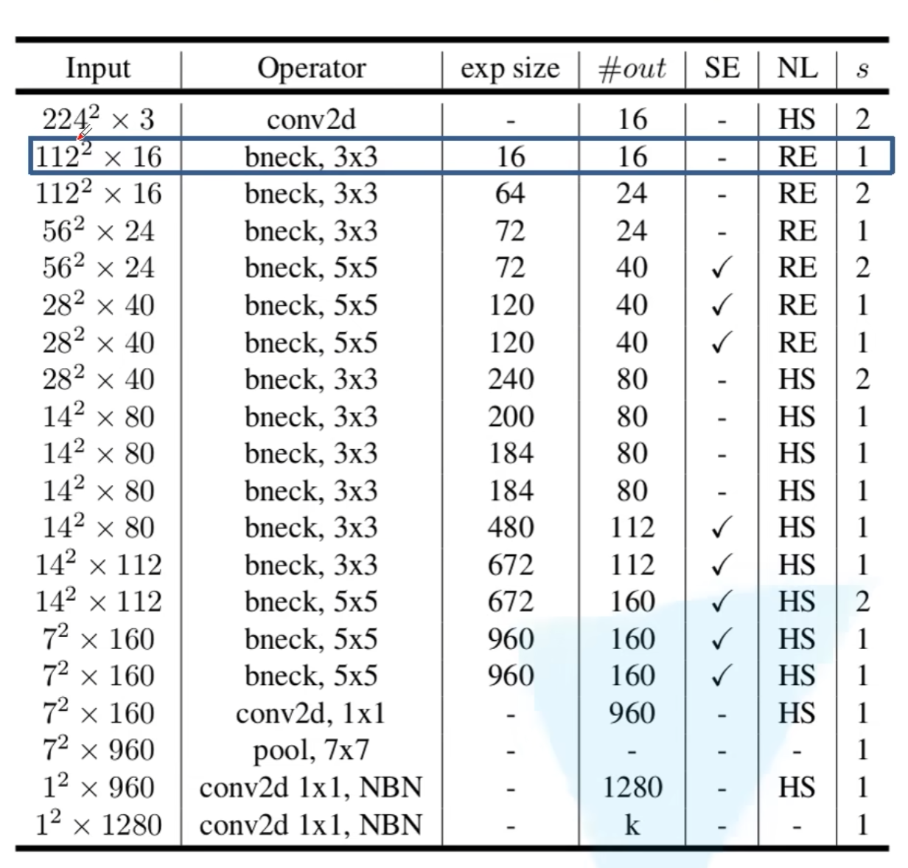

## 目标检测

### 基础知识

**分类网络必须掌握**

类别：

1. one stage：SSD Yolo
    1. 基于anchors直接进行分类以及边界框调整
2. two stage ： Faster RCNN
    1. 通过专门的模块去生成候选框（RPN）
    2. 基于之前生成的候选框，进一步进行分类和边界框进行调整

### R-CNN 


深度学习应用于目标检测的开山之作（2014）

步骤：

1. 一张图像生成1K~2K个候选区域（使用Selective Search方法）
2. 对于每个候选区域使用深度网络提取特征
3. 特征送入每一类的SVM分类器，判别是否属于该类别
4. 使用回归器精细修正候选框的位置


**候选区域的生成**


利用Selective Search算法通过图像分割的方法得到一些原始区域、然后使用一些合并策略将这些区域合并，得到一个层次化的结构，而这些结构就包含着可能需要的物体

**对于每个候选区域，使用深度网络提特征**

将**2000**候选区域缩放到227*227，丢入AlexNet网络获取4096维特征，得到**2000 * 4096**维矩阵


**特征送入每一类的SVM分类器（二分类），判定类别**

将2000 * 4096维特征与20个SVM（20个类）组成的权值矩阵 4096 * 20相乘，获得2000 * 20 维矩阵表示每个建议框是某个目标类别的得分。分别对上述2000*20维每一列即每一类进行[**非极大值抑制**](###NMS)去除重叠的建议框，得到该列即该类中得分最高的建议框


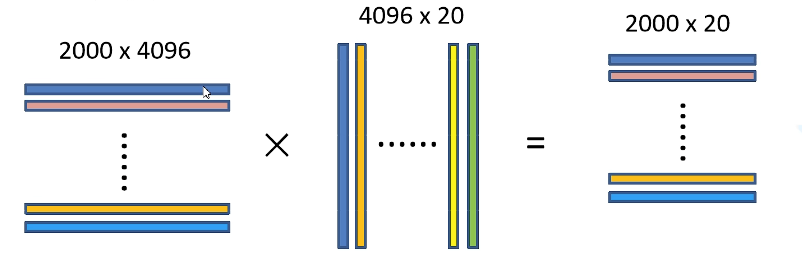

**使用回归器去修正候选框的位置**

对NMS处理后剩余的建议框进行进一步筛选，接着分别用20个回归器对上述20个类别中剩余的建议框进行回归操作，最终得到每个类别修正后的得分最高的bbx

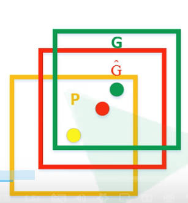

黄色框是提议框、绿色窗口为GT框，红色窗口为回归之和的预测框


**问题**

1. 测试速度慢
2. 训练速度慢且繁琐
3. 训练所需的空间大

### Fast R-CNN 


**步骤：**

1. 一张图像生成1K~2K个候选区域（使用Selective Search方法）
2. 将**整幅图像**输入到网络得到对应的**特征图**，将SS算法生成的候选框**投影到特征图**得到相应的**特征矩阵**
3. 将每个特征通过ROI Pooling层缩放到7*7大小的**特征图**，接着将特征图展平经过一系列的全连接层得到预测结果（Reegion of Interest）


**一次性计算整张图像特征**

训练过程只采样SS算法选出的部分候选框

**不限制输入图像的尺寸**

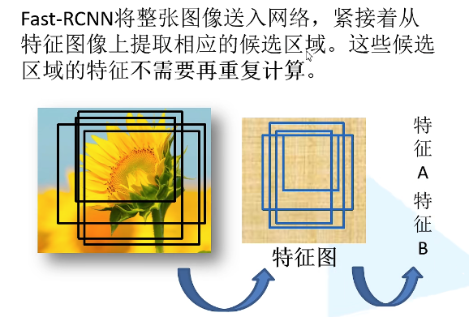

**ROI Pooling**

无论输入图像尺寸多大，**都按7*7拆分**，然后进行下采样，最大池化操作

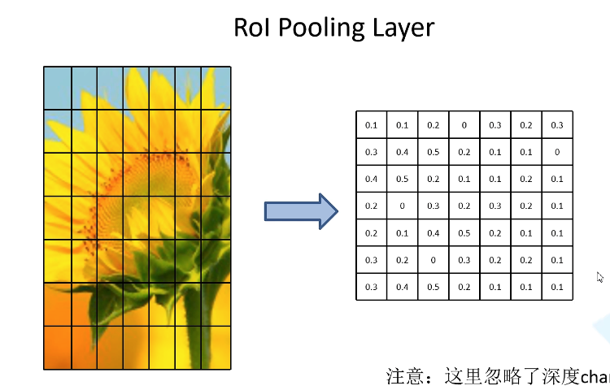

**分类器**

输出N + 1个类别的概率,(N为检测目标的种类 1为背景)共N + 1个节点（经过softmax处理）

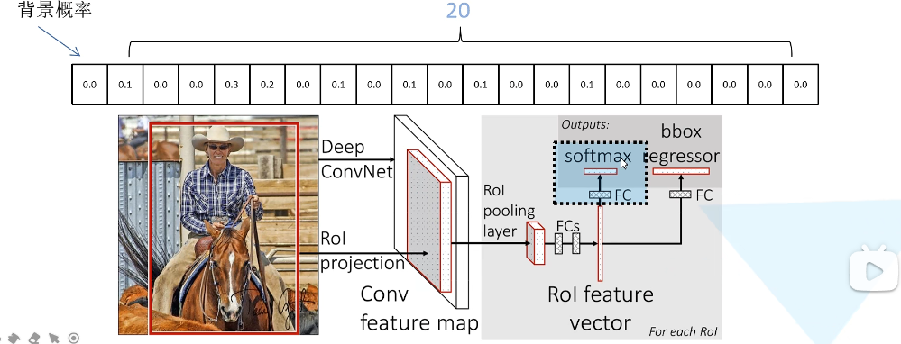

**边界框回归器**

输出对应N+1个类别的候选边界框的回归参数($d_x,d_y,d_w,d_h$)，共（N+1）× 4个节点


如何调整？将预测的候选边界框回归到最终的预测框

$P_x P_yP_wP_h$是初始的anchor参数

$\hat{G}_{x}\hat{G}_{y}\hat{G}_{w}\hat{G}_{h}$是为微调之后的anchor参数

$G_xG_yG_wG_h$是gt anchor参数
$$
\begin{aligned}
&\hat{G}_{x} =P_{w}d_{x}(P)+P_{x}  \\
&\hat{G}_{y} =P_{h}d_{y}(P)+P_{y}  \\
&\hat{G}_{w}=P_{w}\exp(d_{w}(P)) \\
&\hat{G}_{h}=P_{h}\exp(d_{h}(P))
\end{aligned}
$$
$P_x,P_y,P_w,P_h$分别是候选框中心的$x,y$坐标，以及宽和高

$\hat{G}_x,\hat{G}_y,\hat{G}_w,\hat{G}_h$分别是最终预测的目标边界框的中心的$x，y$坐标以及宽和高

**损失函数**


u = 0时，取0，即预测背景没有边界框损失

u >=1时，取1，即预测其他类别，是有边界框损失的

`p`：分类器预测的softmax概率分布

`u`：对应目标的真实类别标签

`t^u`：对应边界框回归器预测的对应类别`u`的的回归参数$(t_x^u,t_y^u,t_w^u,t_h^u)$

`v`：对应真实目标边界框的回归参数$v_x,v_y,v_w,v_h$
$$
v_x = \frac{G_x - P_x}{P_x}\ \ \ \
v_y = \frac{G_y- P_y}{P_y}\\
v_w = ln\frac{G_w}{P_w}\ \ \ \ 
v_h = ln\frac{G_h}{P_h}
$$


分类损失是[交叉熵损失](###交叉熵损失)

**实际上交叉熵损失就是真实类别下对应的softmax概率的-log**
$$
loss(x,class) = -log(P_{class})\\
P_{class} =\frac{e^{x[class]}}{\sum_je^{xj}}
$$
边界框回归损失是[smoothL1损失](####Smooth L1 Loss)

**实际上就是把预测的回归参数和真实的回归参数相减，仍到smoothL1函数中，再相加**
$$
\begin{aligned}L_{loc}(t^u,v)&=\sum_{i\in\{x,y,w,h\}}smooth_{L_1}(t_i^u-v_i)\\smooth_{L_1}(x)&=\begin{cases}0.5x^2&\mathrm{if~|x|<1}\\|x|-0.5&\mathrm{otherwise}&\end{cases}\end{aligned}
$$


### Faster R-CNN

RPN  + Fast R-CNN 打通了原来SS网络+特征提取，变为了端对端的实现


**步骤：**

1. 将图像输入网络中得到相应的**特征图**
2. 使用RPN结构生成候选框，将RPN生成的候选框投影到特征图上获得相应的**特征矩阵**
3. 将每个特征矩阵通过ROI Pooling 缩放到7*7大小的特征图，接着将特征图展平，通过一系列全连接层得到预测结果


**RPN网络**

对于特征图上每个3*3的滑动窗口，计算出**滑动窗口中心点**，对应**原始图像的中心点**，并计算出**k个anchor boxes**


**实际上就是用特征图的窗口中心点的坐标*特征图和图长宽的缩放比就得到了原图的窗口的中心点坐标**

一个滑动窗口，按照经验，在Faster R-CNN会在对应原图位置生成3×3=9种anchor

三种尺度（面积）：{$128^2,256^2,512^2$}

三种比例：{$1:1,1:2,2:1$}

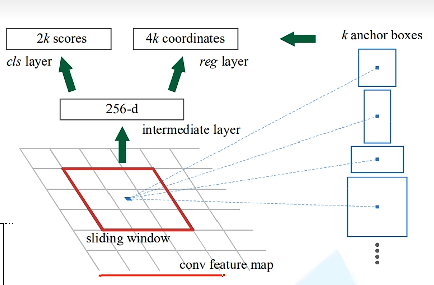

256-d取决于所使用的bacbone最后一层的输出特征图的channel数，ZF网络就是256d，VGG16网络就是512d，在feature上，用一个3*3的卷积核，stride=1，padding=1，channel=256，卷积核个数为256，**得到一个与输入特征图同尺寸的特征矩阵**

在这个特征矩阵上，用**2k**个1*1的卷积核，stride = 1，padding=0，channel = 256，**每一个格子得到2k个得分**

在这个特征矩阵上，用**4k**个1*1的卷积核，stride = 1，padding=0，channel = 256，**每一个格子得到4k个坐标回归参数**

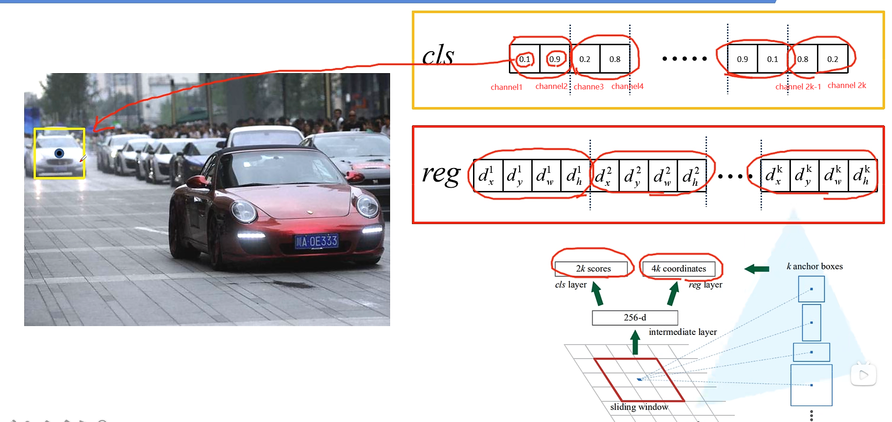

**每一个点预测2k个得分，4k个回归参数**

cls：`[背景的概率][前景的概率]`

reg：`[dx][dy][dw][dh]`


对于一张`1000*600*3`的图像，大约有 `60*4*9（20k）`个anchor，忽略跨越边界的anchor，剩下约 `6k`个anchor。对于RPN生成的候选框之间存在大量的重叠，基于候选框的cls得分，采用非极大值抑制，IoU设置为0.7，这样每张图片只剩下`2k`个候选框


**训练数据的采样**

采样的正样本和负样本的比例为1：1，如果正样本不够，拿负样本来补齐

**正样本**：anchor与gt IoU超过0.7，如果找不到（都小于0.7），那么找与gt相交的IoU最大的那个anchor也是正样本

**负样本**：anchor与所有gt的IoU小于0.3的anchor


**RPN损失函数**


$P_i$表示第$i$个anchor预测的真实标签的概率

$P_i^*$当为正样本时为1，当为负样本时为0 类似于艾弗森括号的作用

$t_i$表示第$i$个anchor的边界框回归参数

$t_i^*$表示第$i$个anchor对于的gt box边界框回归参数

$N_{cls}$表示一个mini-batch中所有样本数量为256

$N_{reg}$表示anchor的位置个数(不是anchor的数量)约为2400，实际上就是提取的特征图的长宽乘积


**对于分类的交叉熵损失**

有两种观点

1. 多分类的交叉熵损失

    

    可以看到每一个anchor，一定有一个类别标签，一共有9个anchor也就有9个类别，1表示前景，0表示背景
    $$
    L_{cls} = -log(p_i)
    $$

    $$
    = -log(0.9) - log(0.2) - ... - log(0.1) - log(0.2)
    $$

2. **二分类的交叉熵损失**

    这时候，实际上预测的不是2k个score二是k个score，因为对于每个anchor我通过sigmod得到一个数，趋近于0是背景，趋近于1是前景

    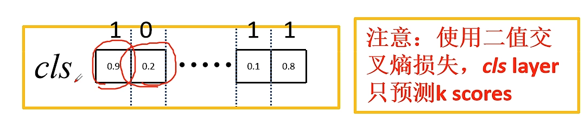
    $$
    L_{cls}=-[p_i^*\log(p_i)+(1-p_i^*)\log(1-p_i)]
    $$

    $$
    = -log(0.9) -log(1 - 0.2) - log(0.1) - log(0.8)
    $$

$P_i$表示第$i$个anchor预测的真实标签的概率

$P_i^*$当为正样本时为1，当为负样本时为0 类似于艾弗森括号的作用

**边界框回归损失**

$P_i^*$当为正样本时为1，当为负样本时为0 类似于艾弗森括号的作用

$t_i$表示第$i$个anchor的边界框回归参数

$t_i^*$表示第$i$个anchor对于的gt box边界框回归参数

**$t_i$是直接预测出来的，$t_i^*$是直接计算出来的**
$$
\begin{aligned}t_x&=(x-x_a)/w_a,t_y=(y-y_a)/h_a,\\t_w&=\log(w/w_a),t_w=\log(h/h_a),\end{aligned}
$$
$x、y、w、h$是最后校准完成后的边界框参数，$x_a、y_a、w_a、h_a$是**初次得到的9个anchor边界框参数**（但是网络实际上是预测的回归参数）
$$
\begin{aligned}t_x^*&=(x^*-x_a)/w_a,t_y^*=(y^*-y_a)/h_a\\t_w^*&=\log(w^*/w_a),t_h^*=\log(h^*/h_a)\end{aligned}
$$
$x^*、y^*、w^*、h^*$是gt边界框参数
$$
t_i = [t_x,t_y,t_w,t_h]\ t_i^*=[t_x^*,t_y^*,t_w^*,t_h^*]\\
$$

$$
\begin{aligned}L_{reg}(t_i,t_i^*)&=\sum_{i}smooth_{L_1}(t_i-t_i^*)\\

smooth_{L_1}(x)&=\begin{cases}0.5x^2&\mathrm{if~|x|<1}\\|x|-0.5&\mathrm{otherwise}&\end{cases}\end{aligned}
$$


**联合训练方法**

**同时训练RPN网络和Fast R-CNN**

### FPN

特征金字塔


几种常见的结构：

1. 特征图像金字塔结构
2. 传统的前向传播到最后一个特征图进行检测，在FasterR-CNN中用到
3. 取不同尺度的特征图进行预测，在SSD中用到
4. FPN，不同特征图进行特征融合

**特征融合**


主干网络均是2x下采样，对每一层特征图，先经过一个1×1的卷积核调整到相同的channel256，保证相加时的shape保持一致，另外可以通过2x上采样[最近邻插值](###最近邻插值)，保持高宽一致，这样高层次的特征图和低层次的特征图可以直接相加


**注意：P6只用于RPN，不在Fast-RCNN中使用，针对不同的预测特征层，RPN和Fast-RCNN的权重共享**


P2~P6选取不同的anchor，不同的特征层上共用同一个RPN网络，因此共享了RPN网络的参数

**通过RPN得到的一系列Proposal如何分配到预测特征层上**

 

 `k`：计算得到的预测特征层号2 3 4 5

`k0`：4

`wh`：proposal，在原图像上的宽和高

### RetinaNet


### SSD


一个anchor需要预测c类+4个回归偏移量，一共有k个anchor，所以需要（c+4）*k个卷积核

输入的map 是mn，所以有 c+4 kmn个输出

### yolov1

### yolov2

### yolov3

### yolov5

### DETR

Detection Transformer

 **训练阶段**


超参数生成100个bbx，利用匈牙利算法找出与gtbox等数量的预测框，利用找出来的框进行损失计算

**测试阶段**

预测出100个框，筛选出置信度最大的框  >0.7

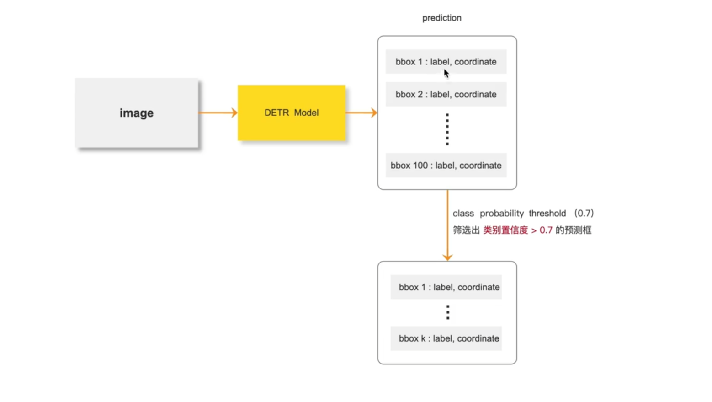

训练框架

object query是动态更新的，并行计算100个object query，**框架比较简单**，端到端实现


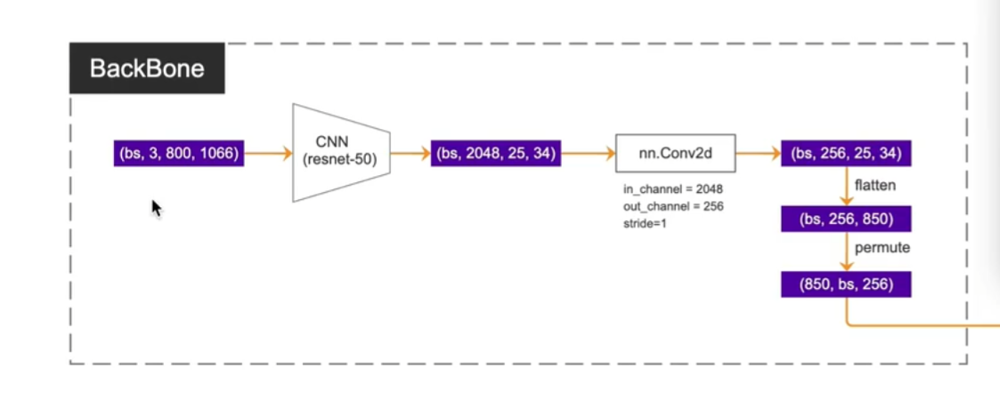

850是transformer的token的个数，意思上是在原来一个像素点对应位置所有channel作为数值（每个位置），token


并且传入一个positinal encodeing ，维度与token的维度是一致的，因为直接相加


 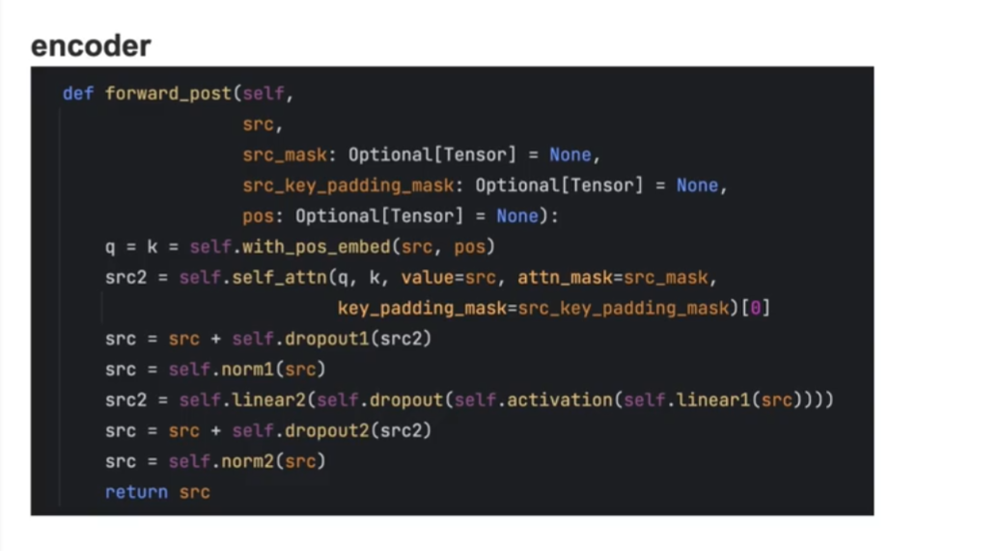

- `src`:输入的image feature
- `pos`:postional embeding

1. image feature 和 postional embeding进行add操作，然后生成 Q和K
2. 经过self-attention生成src2
3. src2经过dropout和src进行相加，送入norm
4. 送入norm后再送入FNN层
5. 再经过dropout和上一层src相加
6. 最后norm输出src


- tgt是queries （100， 256）
- memory是encoder提取的特征，（850，bs，256）
- pos：（850，bs，256）
- query pos：（100， 256）就是object queries

1. quries和object queries相加得到Q和K，V就等于queries
2. qkv进行selfattention操作得到tgt2
3. tgt2经过drop out再与tgt进行相加，在norm得到tgt
4. object queries + tgt 生成Q （100， 256）
5. memory+pos embeding 生成 K（850, bs, 256）
6. memory是V(850, bs, 256)
7. 进行multi head attention
8. 最后输出tgt
9. train（6， bs， 100， 256） 六个decoder计算结果
10. val（bs， 100， 256）


输出92个类别和91 + 1

bbx中心坐标以及高宽坐标，100个queries


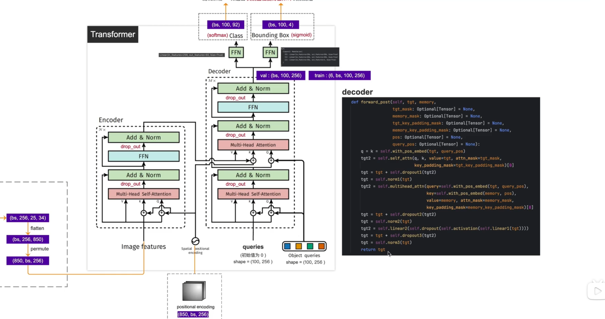

**损失函数**

1. 从100个预测框中，找出和真实标注框所匹配的预测框（匈牙利算法）

    空白处数值无限大，构建一个这样的矩阵

    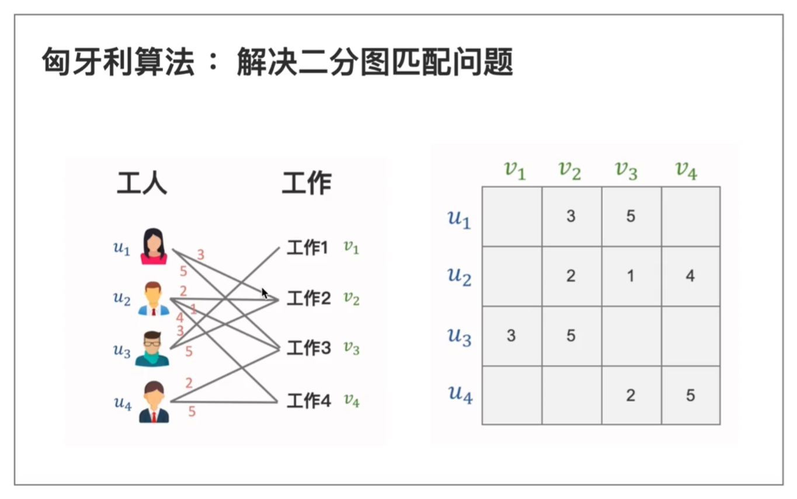

2. 调用函数得到最佳匹配

    100行2列，从100个中筛选出两个

    第1列和14匹配，第0列和33行匹配，最优的匹配结果

    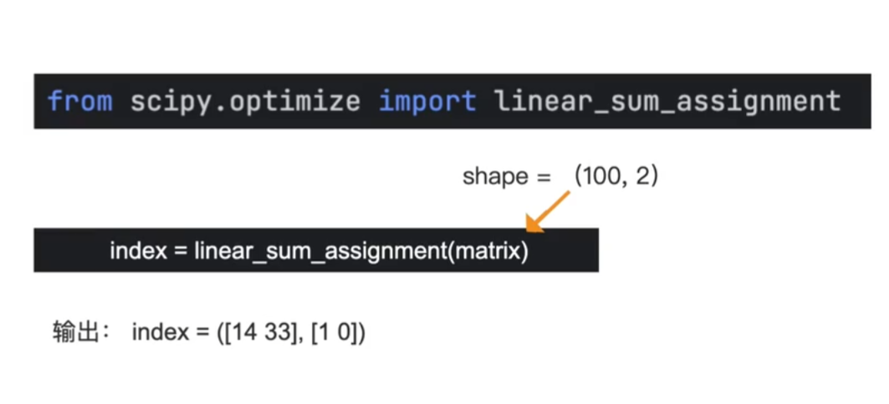

    代价矩阵的计算 

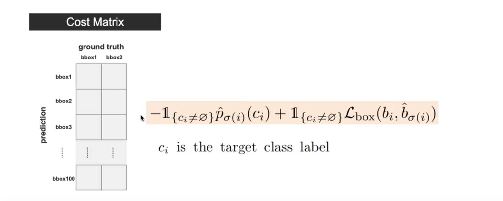

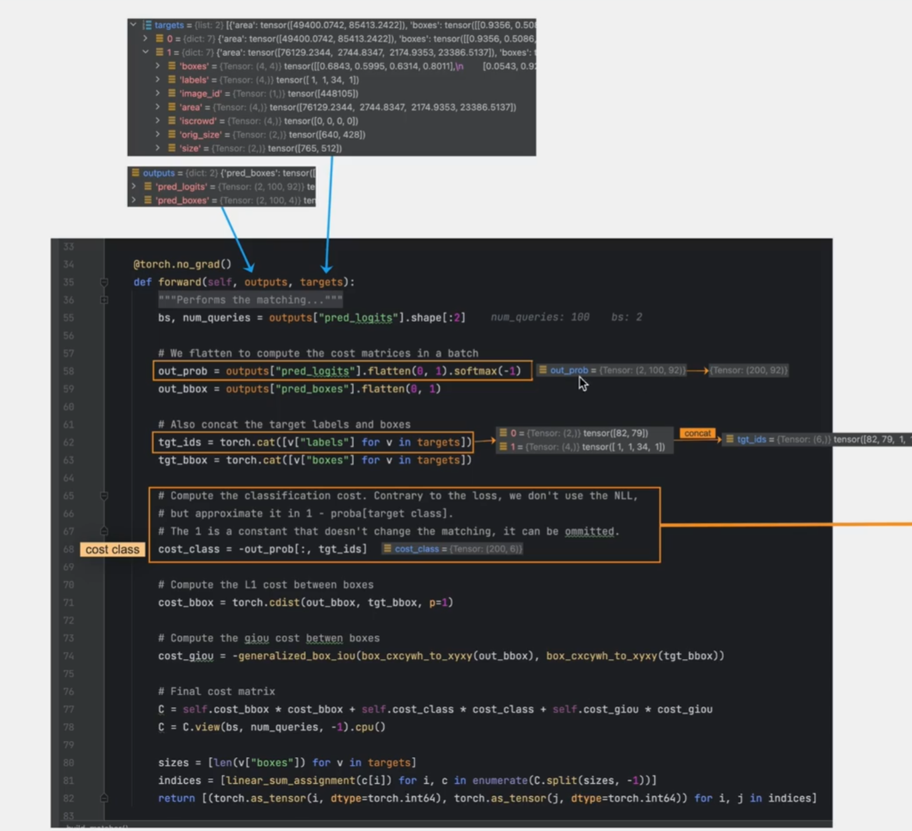

类别输出：[2, 100,  92] bs 100个框 92个类别


取出tgt_ids，第一个targets 82 79

第二个，targets 1 1 34 1

然后，**从200 * 92**的矩阵中取出有意义的部分，即target1含有 82 79 target2含有1 1 34 1

用匈牙利算法进行求解


bbx cost


### 评价指标 


`TP(True Positive)`：**IoU > 0.5**的检测框数量（同一Ground Truth只计算一次）

`FP(False Positive)`: **IoU <= 0.5**的检测框的数量（或者是检测到同一个GT的多余的检测框的数量）

`FN(False Negative)`：没有检测到GT的数量（**漏检**的GT的数目）


`Precision`：
$$
查准率=\frac{TP}{TP+FP}
$$
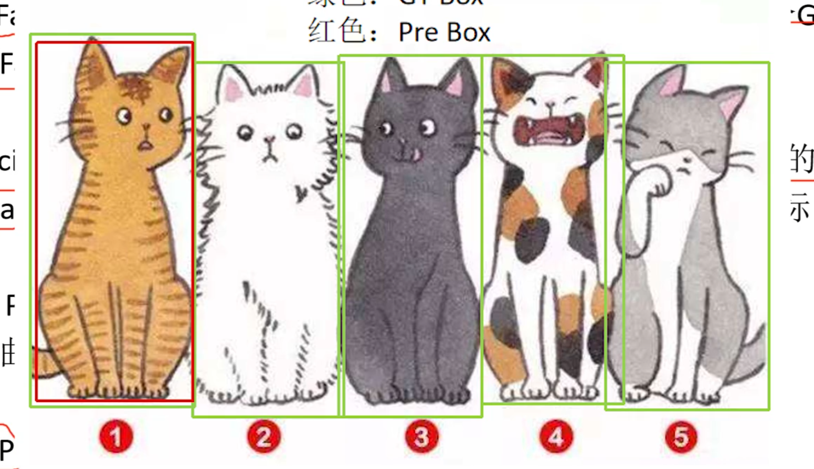

此时查准率为1，但是效果并不好，因为有漏检

`Recall`：
$$
查全率 = \frac{TP}{TP + FN}
$$


此时查全率为1，但是效果并不好，因为查的不准


`AP`：P-R曲线下面积

`P-R曲线`：Precision-Recall曲线

`mAP`：**针对每个类别**求AP，多个类别AP求平均值，即为mAP

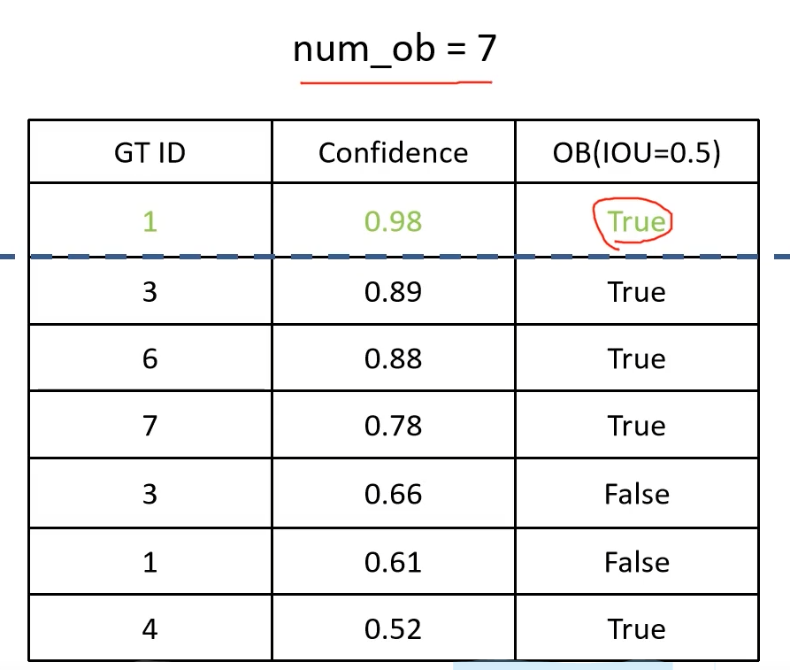

Confidence阈值不断调低，计算P和R，目标边界框都是经过非极大值抑制处理过后的边界框

TP = 1 FP = 0 FN = 6 P = 1.0 R = 0.14

TP = 2 FP = 0 FN = 5 P = 1.0 R = 0.28

TP = 3 FP = 0 FN = 4 P = 1.0 R = 0.42

TP = 4 FP = 0 FN = 3 P = 1.0 R = 0.57

**TP = 4 FP = 1 FN = 3**  P =0.80 R = 0.57

 TP  = 4 FP = 2 FN = 3 P = 0.66 R = 0.57

TP  = 5 FP = 2 FN = 2 P = 0.71 R = 0.71


ReCall相同时，只保留最大的Precision 

$(0.14-0)\times1.0+(0.28-0.14)\times1.0+(0.42-0.28)\times10+(0.57-0.42)\times1.0+(0.71-0.57)\times0.71=0.6694$

**(当前recall -  上一个recall) × （包含当前行以下的所有Precision的最大值）**


COCO AP：当IOU取0.5 0.55 ~ 0.95 时的mAP，再取均值

AP Across Scales：不同尺寸的mAP

AR ：max值是每张图片最大的预测目标框

AR Across Scales：不同尺寸的mAR

