# JestonNanoKit初始化系统

[参考](https://blog.csdn.net/weixin_67031452/article/details/136349335)

## 格式化SD卡

1. win+r cmd

2. 输入diskpart

    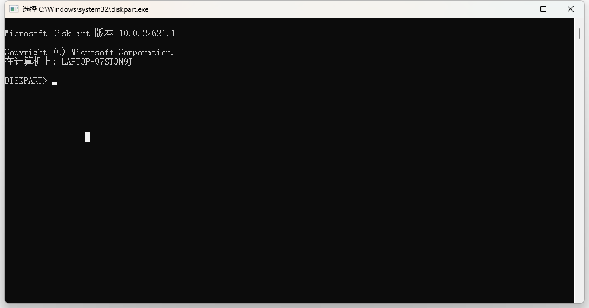

3. 输入list disk

    列出当前的磁盘1是我插入的SD卡

    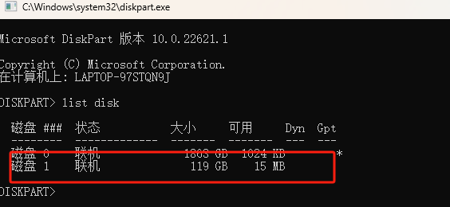

4. 清空磁盘

    输入 select disk1

    输入 clean 清空

    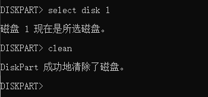

    清空完毕

    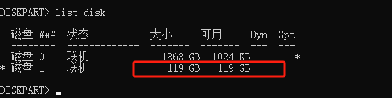

    这样就能完成SD卡的格式化。完成格式化以后的磁盘是没有分区的，这样的磁盘是不能正常使用的，我们要将这个磁盘重新分区，我们在电脑上左下角右击Windows标志，点击**磁盘管理**

5. 点击磁盘管理

    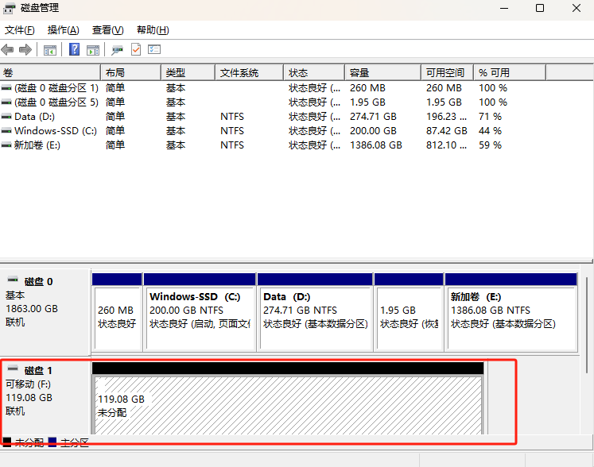

6. 右键黑色进度条，选择新建简单卷

    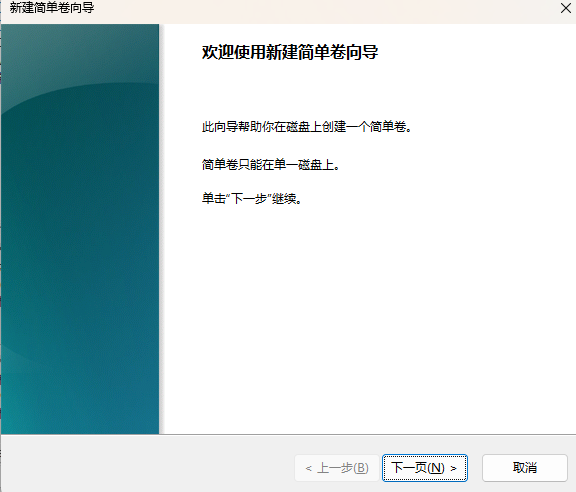

7. 无脑点击下一步即可

    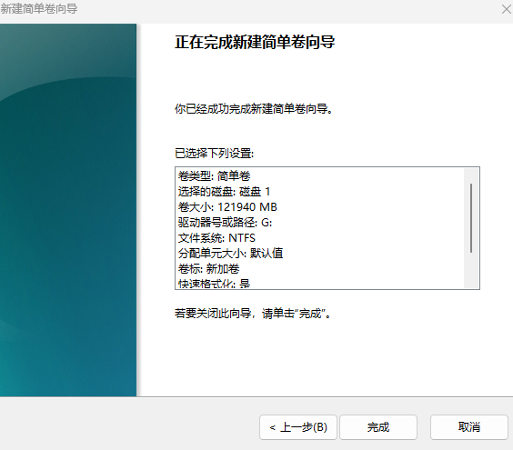

8. 格式化完成

    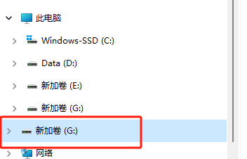

## 烧录系统

 jetson nano使用的是乌班图系统，需要将系统的映像文件烧录进SD卡，这里的要求是32G以上的卡就可以，但使用经验来看，很多相对复杂的项目32G是有点不够用的，有条件的同学建议选用64G的，烧录系统整体分为两步，（1）下载镜像文件；（2）烧录镜像文件。

1. 下载镜像文件

    [镜像文件下载官网](https://developer.nvidia.com/embedded/downloads#?tx=$product,jetson_nano)

    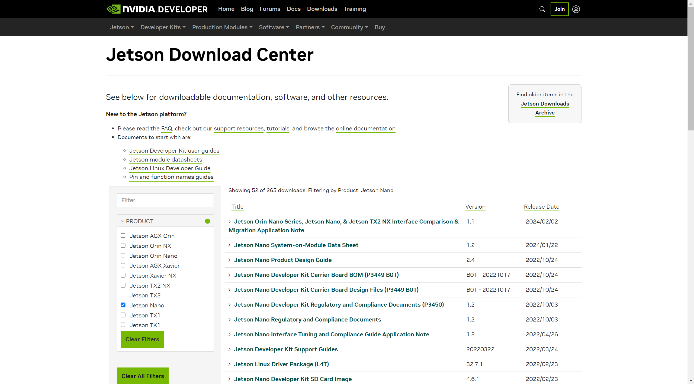

    

2. 下载jeston nano developer kit sd card image

    下载到桌面上即可

    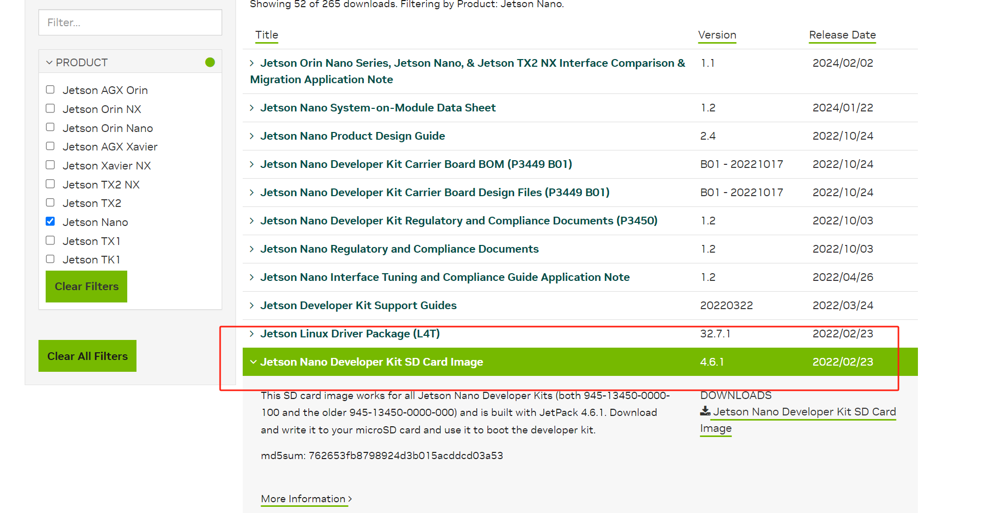

3. 解压得到镜像文件

    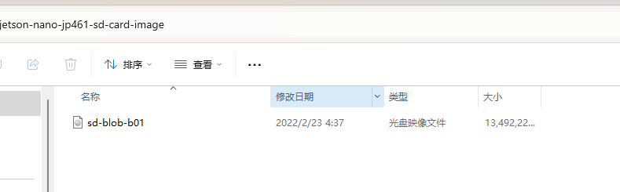

4. 准备烧录工具

    [balenaEtcher](https://etcher.balena.io/)

    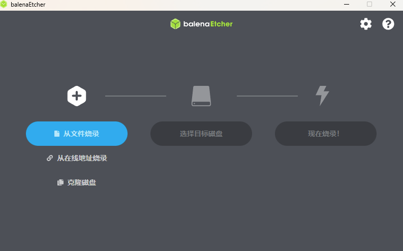

5. 选择文件

    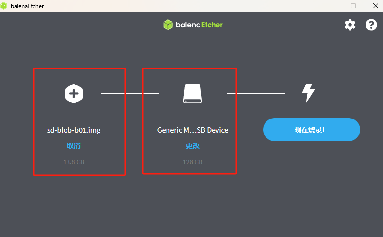

    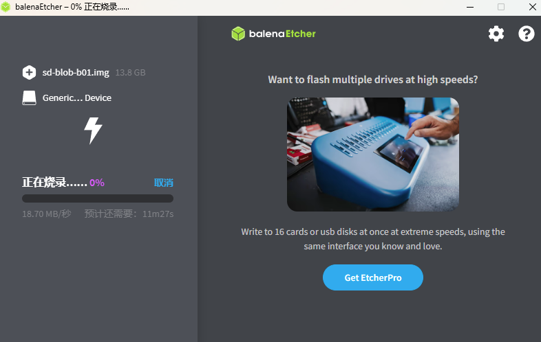

6. 烧录成功

    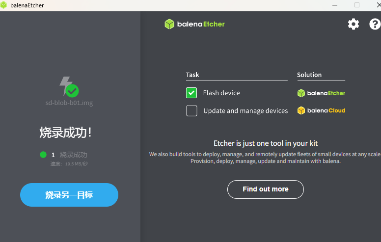

## 初始化linux系统

连接键盘鼠标，插上sd卡，连好屏幕，直接使用