# Yolo-Fastv2安全帽检测

## 下载数据集

- [kaggle安全帽数据集](https://www.kaggle.com/datasets/andrewmvd/hard-hat-detection?resource=download)

- 上传到服务器

    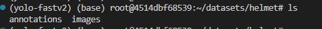

- 创建软链接，链接到当前项目目录datasets文件夹下

    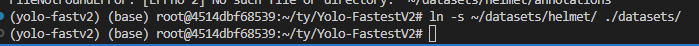


## 修改标注格式，将VOC格式改为Yolo格式

- 在data目录下，创建labels和images文件夹

    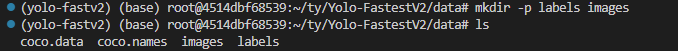

- 创建脚本convert_labels.py

    ```python
    from pathlib import Path
    import xml.etree.ElementTree as ET
    from shutil import copyfile
    import os
    import numpy as np
    import pandas as pd
    
    
    classes = ['helmet','	head','person']
    
    def convert_annot(size , box):
        x1 = int(box[0])
        y1 = int(box[1])
        x2 = int(box[2])
        y2 = int(box[3])
        
    
        dw = np.float32(1. / int(size[0]))
        dh = np.float32(1. / int(size[1]))
    
        w = x2 - x1
        h = y2 - y1
        x = x1 + (w / 2)
        y = y1 + (h / 2)
    
        x = x * dw
        w = w * dw
        y = y * dh
        h = h * dh
        return [x, y, w, h]
    
    
    def save_txt_file(img_jpg_file_name, size, img_box):
        save_file_name = './data/labels/' +  img_jpg_file_name + '.txt'
        
        #file_path = open(save_file_name, "a+")
        with open(save_file_name ,'a+') as file_path:
            for box in img_box:
    
                cls_num = classes.index(box[0])
    
                new_box = convert_annot(size, box[1:])
    
                file_path.write(f"{cls_num} {new_box[0]} {new_box[1]} {new_box[2]} {new_box[3]}\n")
    
            file_path.flush()
            file_path.close()
    
    
    def get_xml_data(file_path, img_xml_file):
        img_path = file_path + '/' + img_xml_file + '.xml'
    
        tree = ET.parse(img_path)
        root = tree.getroot()
    
        img_name = root.find("filename").text
        img_size = root.find("size")
        img_w = int(img_size.find("width").text)
        img_h = int(img_size.find("height").text)
        img_c = int(img_size.find("depth").text)
    
        img_box = []
        for box in root.findall("object"):
            cls_name = box.find("name").text
            x1 = int(box.find("bndbox").find("xmin").text)
            y1 = int(box.find("bndbox").find("ymin").text)
            x2 = int(box.find("bndbox").find("xmax").text)
            y2 = int(box.find("bndbox").find("ymax").text)
    
            img_box.append([cls_name, x1, y1, x2, y2])
    
        img_jpg_file_name = img_xml_file + '.jpg'
        save_txt_file(img_xml_file, [img_w, img_h], img_box)
    
    
    from tqdm import tqdm
    
    files = os.listdir('./datasets/helmet/annotations')
    for file in tqdm(files, total=len(files)):
        file_xml = file.split(".")
        get_xml_data('./datasets/helmet/annotations', file_xml[0])
    
    
    ```

- 改动

    修改数据集标注存放的路径

    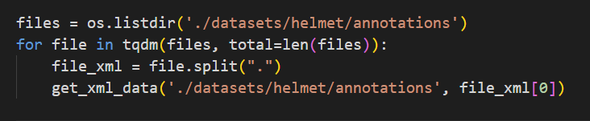

    

    修改标签存放的路径

    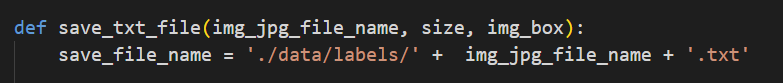

    

- 执行转换 python convert_labels.py

    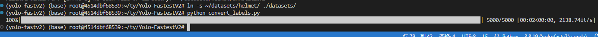

    观察到转换成功，并且输出了yolo格式的标注

    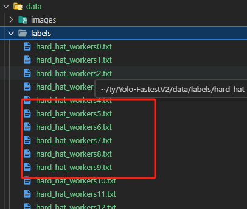

    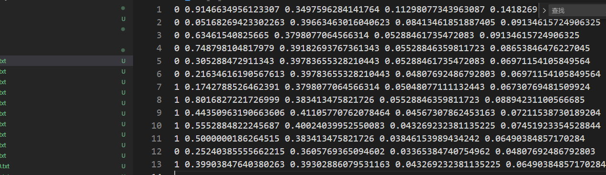


## 分割数据集，80%train 10%val 10%test

- 创建脚本 spilit_datasets.py

    ```python
    import os
    import random
    import shutil
    
    # 定义数据集路径
    dataset_dir = 'datasets/helmet'
    images_dir = 'datasets/helmet/images'
    labels_dir = 'data/labels'
    
    # 创建训练集和验证集目录
    train_dir = os.path.join(dataset_dir, 'train')
    val_dir = os.path.join(dataset_dir, 'val')
    os.makedirs(train_dir, exist_ok=True)
    os.makedirs(val_dir, exist_ok=True)
    
    # 获取图片列表
    image_files = os.listdir(images_dir)
    random.shuffle(image_files)
    
    # 计算划分的边界索引
    split_index = int(len(image_files) * 0.8)
    
    # 复制训练集图片和标签到训练集目录
    for image_file in image_files[:split_index]:
        image_path = os.path.join(images_dir, image_file)
        label_file = os.path.join(labels_dir, os.path.splitext(image_file)[0] + '.txt')
        shutil.copy(image_path, train_dir)
        shutil.copy(label_file, train_dir)
    
    # 复制验证集图片和标签到验证集目录
    for image_file in image_files[split_index:]:
        image_path = os.path.join(images_dir, image_file)
        label_file = os.path.join(labels_dir, os.path.splitext(image_file)[0] + '.txt')
        shutil.copy(image_path, val_dir)
        shutil.copy(label_file, val_dir)
    
    ```

- 需要改动的地方

    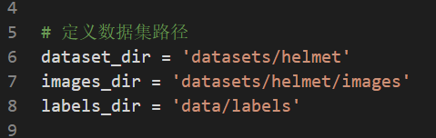

- 组织好数据集

    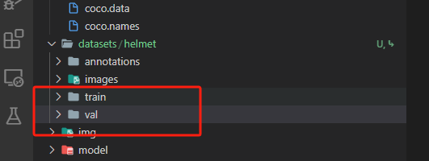


## 生成照片的路径.txt文档

- 创建脚本 generate_path.py

    ```python
    import os
    from tqdm import tqdm
    
    # import debugpy
    # try:
    #     # 5678 is the default attach port in the VS Code debug configurations. Unless a host and port are specified, host defaults to 127.0.0.1
    #     debugpy.listen(("localhost", 9501))
    #     print("Waiting for debugger attach")
    #     debugpy.wait_for_client()
    # except Exception as e:
    #     pass
    
    
    # 定义数据集路径
    dataset_dir = 'datasets/helmet'
    train_dir = os.path.join(dataset_dir, 'val')
    
    # 获取train文件夹中所有.png文件的相对路径
    image_paths = []
    for root, _, files in os.walk(train_dir):
        for file in tqdm(files, desc='Processing files', unit='files'):
            if file.endswith('.png'):
                relative_path = os.path.join(root, file)
                image_paths.append(relative_path)
    
    # 保存相对路径到train.txt文档
    with open(os.path.join(dataset_dir, 'val.txt'), 'w') as f:
        for path in tqdm(image_paths, desc='Writing to file', unit='paths'):
            f.write("%s\n" % path)
    
    ```

    

- 可以发现成功生成了路径信息

    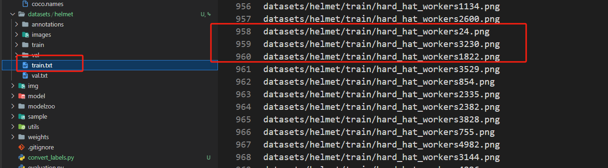

    

    

## 修改coco.names coco.data

- 修改coco.names

    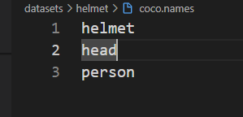

    三类

- 修改coco.data

    修改路径以及类别数

    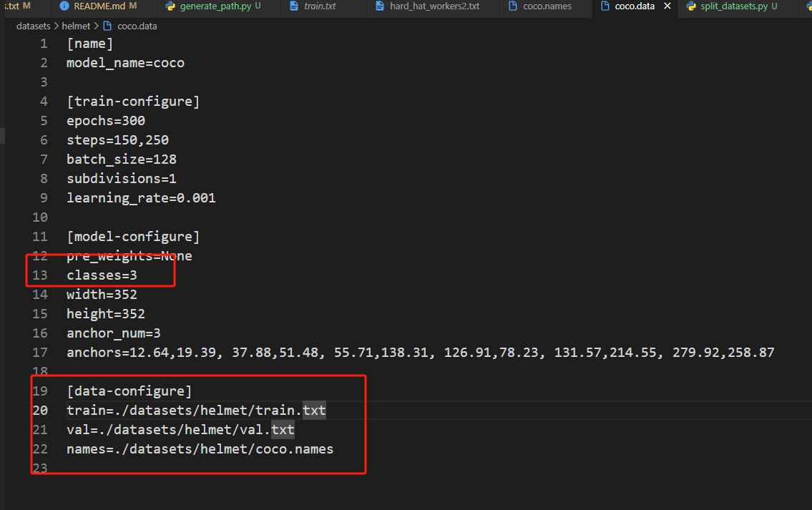

- 生成当前数据集下的anchors尺寸

    使用kmeans聚类做法

    运行脚本

    python3 genanchors.py --traintxt ./datasets/helmet/train.txt 

    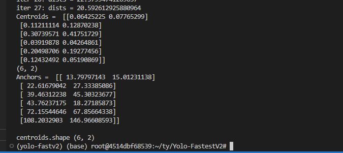

    

    
    
- 修改anchor
  
  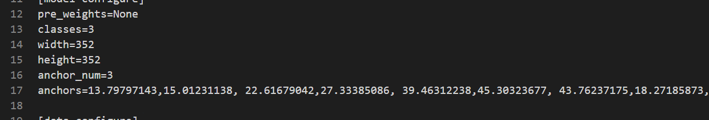
  
  
  
  
  
  
  
  
  
## 训练

   type python python2 python3

查看python环境变量


执行脚本

```shell
python3 train.py --data datasets/helmet/coco.data 
```

   


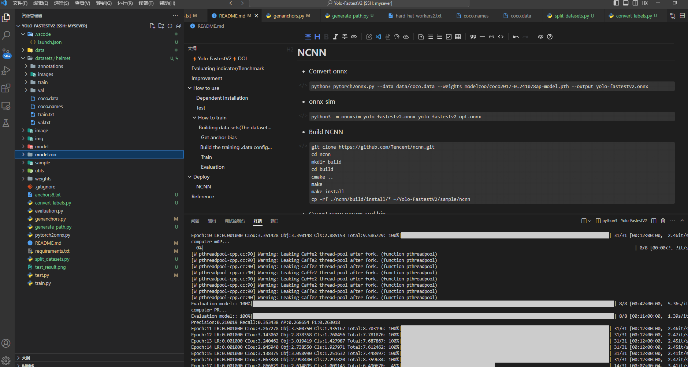

300个epoch 大概训一个小时左右


得到290个epoch下的权重文件 

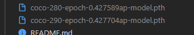

## 测试

```
python3 evaluation.py --data datasets/helmet/coco.data --weights weights/coco-290-epoch-0.427704ap-model.pth 
```


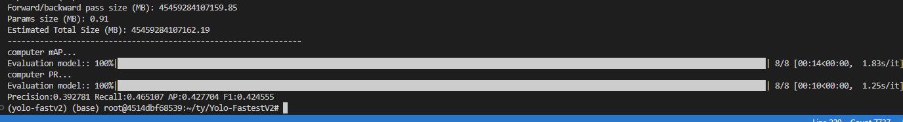


**精确度达到40%左右**


**相比较于yolov5s，参数量少了接近30倍**


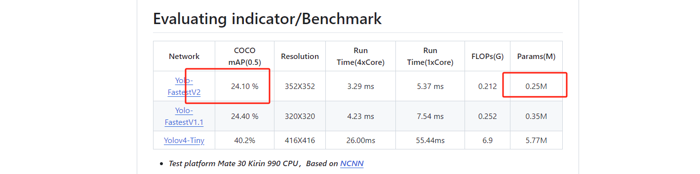


## 单张推理


```shell
python3 test.py --data datasets/helmet/coco.data --weights weights/coco-290-epoch-0.427704ap-model.pth --img datasets/helmet/images/hard_hat_workers0.png 
```


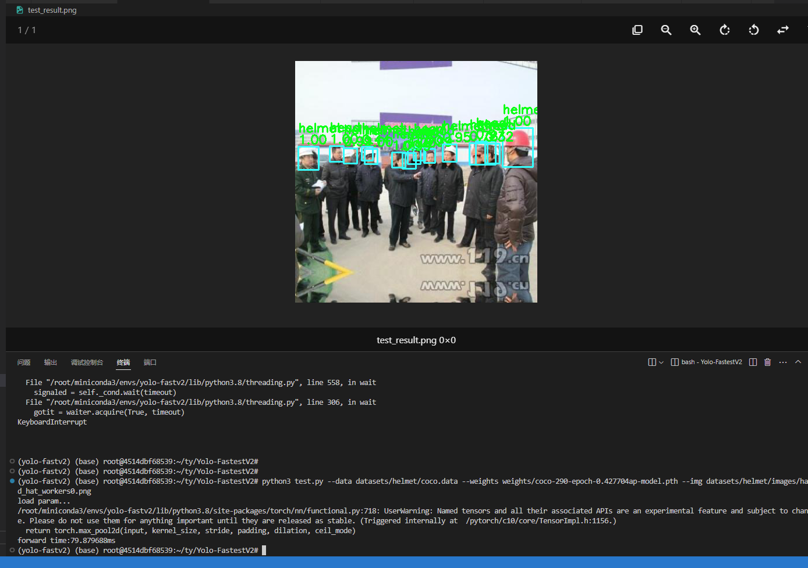


单张图片推理速度在79ms左右


