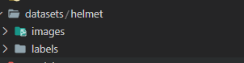
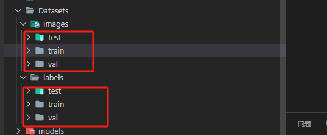
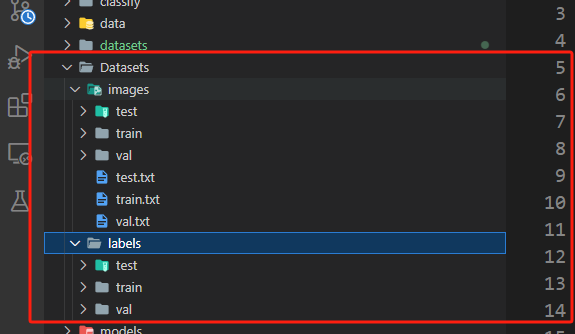
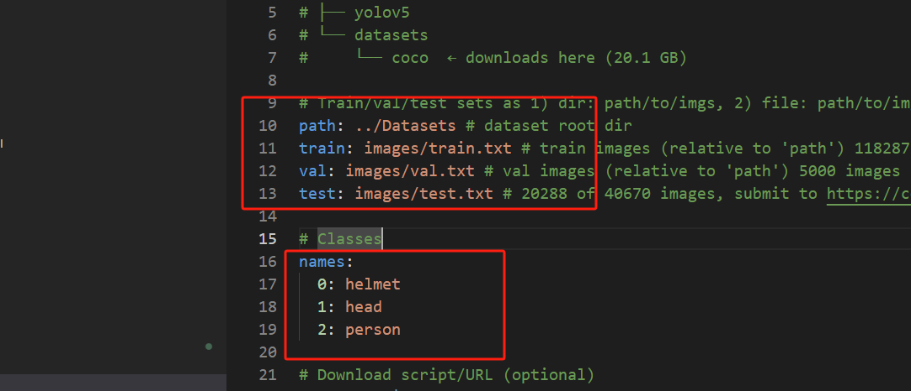

# Yolo-v5s-安全帽检测

## 准备数据集

数据集使用了yolo-fastv2同款数据集，原数据集结构组织如下：

其中labels是yolo格式的标注（已经完成了转换）



## 划分训练集、验证集、测试集

```python
import os
from sklearn.model_selection import train_test_split
from pathlib import Path
from shutil import copyfile

image_list = os.listdir('./datasets/helmet/images')
train_list, test_list = train_test_split(image_list, test_size=0.2, random_state=42)
val_list, test_list = train_test_split(test_list, test_size=0.5, random_state=42)
print('total =',len(image_list))
print('train :',len(train_list))
print('val   :',len(val_list))
print('test  :',len(test_list))


def copy_data(file_list, img_labels_root, imgs_source, mode):

    root_file = Path( './Datasets/images/'+  mode)
    if not root_file.exists():
        print(f"Path {root_file} does not exit")
        os.makedirs(root_file)

    root_file = Path('./Datasets/labels/' + mode)
    if not root_file.exists():
        print(f"Path {root_file} does not exit")
        os.makedirs(root_file)

    for file in file_list:               
        img_name = file.replace('.png', '')        
        img_src_file = imgs_source + '/' + img_name + '.png'        
        label_src_file = img_labels_root + '/' + img_name + '.txt'

        #print(img_sor_file)
        #print(label_sor_file)
        # im = Image.open(rf"{img_sor_file}")
        # im.show()

        # Copy image
        DICT_DIR = './Datasets/images/'  + mode
        img_dict_file = DICT_DIR + '/' + img_name + '.png'

        copyfile(img_src_file, img_dict_file)

        # Copy label
        DICT_DIR = './Datasets/labels/' + mode
        img_dict_file = DICT_DIR + '/' + img_name + '.txt'
        copyfile(label_src_file, img_dict_file)


# 原数据的标注文件路径和图片路径
copy_data(train_list, './datasets/helmet/labels', './datasets/helmet/images', "train")
copy_data(val_list,   './datasets/helmet/labels', './datasets/helmet/images', "val")
copy_data(test_list,  './datasets/helmet/labels', './datasets/helmet/images', "test")

```


组织好




## 使用generate_path.py生成各个数据集的照片路径

```python
import os
from tqdm import tqdm

# import debugpy
# try:
#     # 5678 is the default attach port in the VS Code debug configurations. Unless a host and port are specified, host defaults to 127.0.0.1
#     debugpy.listen(("localhost", 9501))
#     print("Waiting for debugger attach")
#     debugpy.wait_for_client()
# except Exception as e:
#     pass


# 定义数据集路径
# 不要写成dataset_dir = '/Datasets/images'
dataset_dir = 'Datasets/images'
train_dir = os.path.join(dataset_dir, 'test')

# 获取train文件夹中所有.png文件的相对路径
image_paths = []
for root, _, files in os.walk(train_dir):
    for file in tqdm(files, desc='Processing files', unit='files'):
        if file.endswith('.png'):
            relative_path = os.path.join(root, file)
            image_paths.append(relative_path)

# 保存相对路径到train.txt文档
with open(os.path.join(dataset_dir, 'test.txt'), 'w') as f:
    for path in tqdm(image_paths, desc='Writing to file', unit='paths'):
        f.write("%s\n" % path)

```


处理完之后的目录结构




## 使用coco.yaml格式的数据

data/my.ymal




## 下载权重文件yolov5s.pt


## 训练

```
python train.py --img 640 --batch 32 --epoch 300 --data data/my.yaml --cfg models/yolov5s.yaml --weights ./yolov5s.pt 
```

