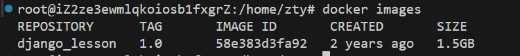
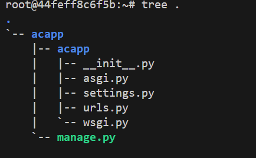
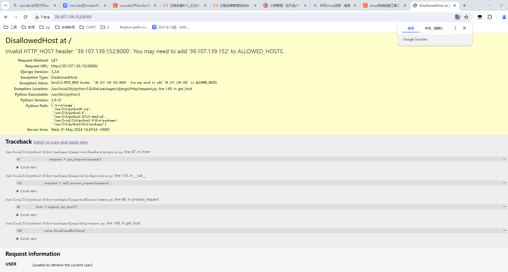
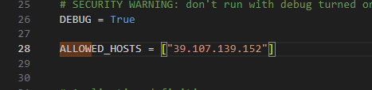
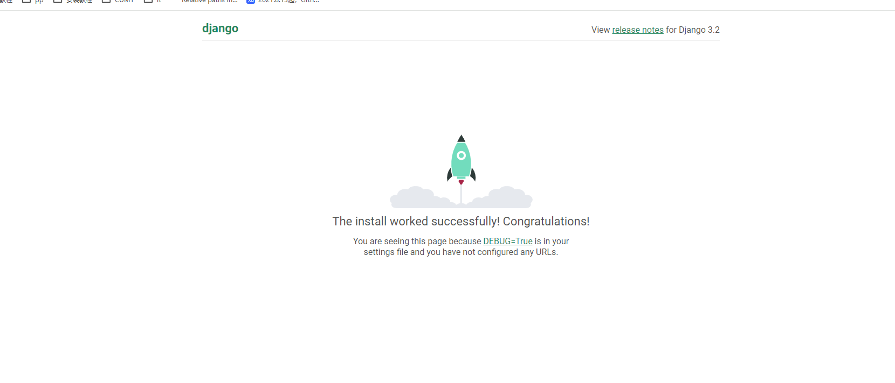
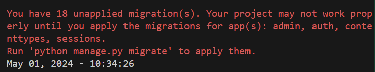

# 配环境

1. 创建用户组

    ```shell
    adduser zty
    usermod -aG zty
    ```

2. 安装docker

    https://docs.docker.com/engine/install/ubuntu/

    ```shell
    # Add Docker's official GPG key:
    sudo apt-get update
    sudo apt-get install ca-certificates curl
    sudo install -m 0755 -d /etc/apt/keyrings
    sudo curl -fsSL https://download.docker.com/linux/ubuntu/gpg -o /etc/apt/keyrings/docker.asc
    sudo chmod a+r /etc/apt/keyrings/docker.asc
    
    # Add the repository to Apt sources:
    echo \
      "deb [arch=$(dpkg --print-architecture) signed-by=/etc/apt/keyrings/docker.asc] https://download.docker.com/linux/ubuntu \
      $(. /etc/os-release && echo "$VERSION_CODENAME") stable" | \
      sudo tee /etc/apt/sources.list.d/docker.list > /dev/null
    sudo apt-get update
    ```

    ```shell
    sudo apt-get install docker-ce docker-ce-cli containerd.io docker-buildx-plugin docker-compose-plugin
    ```

    检查docker版本

    ```shell
    docker --version
    ```

    上传docker镜像

3. 部署docker

    ```shell
    docker load -i django_lesson_1_0.tar
    ```

    查看docker镜像列表

    ```
    docker images
    ```

    

    调整端口映射, 启动docker

    ```
    docker run -p 20000:22 -p 8000:8000 -p 10088:10088 --name django_server -itd django_lesson:1.0
    ```

    进入docker

    ```
    docker attach django_server
    ```

    docker attach命令卡死，换下面的方式进入

    https://blog.csdn.net/weixin_45817309/article/details/134787121

    ```
    docker exec -it django_server /bin/bash
    ```

    ctrl + d 关掉容器

4. 创建项目

    ```
    django-admin startproject acapp
    ```

    tree .

    


## git维护

1. 初始化仓库

    git init

2. 绑定邮箱账户

    ```
    git config --global user.name "tianyaozhao"
    git config --global user.email "08213000@cumt.edu.cn"
    ```

3. 生成ssh

    ssh-keygen

    将root/.ssh/isa.pub 放进仓库

4. 绑定仓库

    ```
    git add .
    git commit -m "first commit"
    git remote add origin https://gitee.com/tianyaozhao/warlocks-war.git
    ```


## 项目跑起来

```
 python3 manage.py runserver 0.0.0.0:8000
```

登录到ip地址，发现需要修改



在settings.py修改allowed host



成功运行



## 创建文件

python3 manage.py startapp game


## 登录管理员界面



python3 manage.py migrate 

http://39.107.139.152:8000/admin/


- 创建管理员

    python3 manage.py createsupersuer 

    admin 123456


## 创建自己的页面

models.py     存class

urls.py   路由

views.py      存视图 函数逻辑

templates 存网页模板  html

## 创建菜单界面


​    
