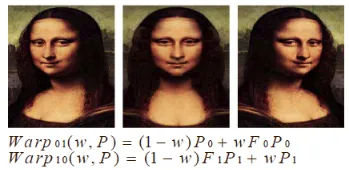

# 题目：什么是「实时渲染」技术？  --基于图像的实时绘制

## 一、引言

不知道是不是有人好奇空间中的场景模型是怎么渲染成屏幕上的**（ image /pixels）**呢？

Unreal Engine Kite Demo (Epic Games 2015)

黑神话:悟空

## 二、传统图像绘制与IBR（Image-Based-Rendering）比较

## 三、IBR的绘制过程

过程

拍摄相片，交互指定建筑物边缘
生成建筑物粗模型
利用基于模型的立体视觉算法精化模型
利用基于视点的纹理映射合成新视图

## 四、IBR绘制中的重要方法

### 4.1全视函数(Plenoptic Function-based)

Plenoptic Function-based
$$
\begin{matrix}R\left(x,y,z,\theta,\phi,\lambda,t\right)\end{matrix}
$$

- 其中，$(x,y,z)$是位置，$(\theta,\phi)$ 是方向（极坐标），$\lambda$ 是光的波长，$t$是时刻；
- 准确地描述了**任一时刻三维空间中任意一点向任意方向传播的光的信息**，是 7 维的函数；

### 4.2视图插值和变换(View Interpolation / View Morphing)

特点

简单方便，只要求几幅参考图像

漫游范围受限，只能在几幅参考图像的视点连线之间作有限运动

常用于加速图形学中的绘制速度

**视图插值方法(View Interpolation)：**

要求新视点位于两参考图象视点所决定的直线(基线， baseline)上。由参考图线性插值产生新视图。

一般情况下不能产生正确的透视投影结果，而只生成近似的中间视图。

**视图变换方法(View Morphing)：**

利用参考图像上像素点重投影生成新视图
利用投影知识决定的变形位置

### 4.3**几何和图像混合建模(Hybrid Geometry- and Image-based Approach )**

特点

可以通过拍摄的几张照片合成逼真的新视图，简单快捷

只能适用于普通建筑物等外形规整的景物

### 4.4**图象拼接(mosaic)**

图像拼接（Image Mosaics）技术就是把针对同一场景的相互有部分重叠的一系列图片合成一张大的宽视角的图像，并且要求拼接后的图像最大程度地与原始图像接近，失真尽可能小，没有明显的缝合线川。随着数字图像处理理论的丰富，近年来的发展趋势是利用PC机通过一定的算法来完成多幅图像的拼接，从而生成一幅完整的大图像。2003年，美国“勇气号”和“机遇号”火星探测器发回了大量的火星地面照片，科学家们就是运用图像拼接技术合成了火星表面的宽视角全景图像。
早期的图像拼接研究一直用于照相绘图学,主要是对大量航拍或卫星的图像的整合。近年来随着图像拼接技术的研究和发展，它使基于图像的绘制（IBR）成为结合两个互补领域，计算机视觉和计算机图形学的研究焦点。

1. 特征提取

    特征是要匹配的两个输入图像中的元素，它们是在图像块的内部，这些图像块是图像中的像素组。

    **Patch匹配：**fig1和fig2给出了一个很好的patch匹配，因为fig2中有一个patch看起来和fig1中的patch非常相似。当我们考虑到fig3和fig4时，这里的patch并不匹配，因为fig4中有很多类似的patch，它们看起来与fig3中的patch很相似。由于像素强度很相近，所以无法进行精确的特征匹配，

    

    

    为了给图像对提供更好的特征匹配，采用角点匹配，进行定量测量。角点是很好的匹配特性，在视点变化时，角点特征是稳定的，此外，角点的邻域具有强度突变，因此我们经常利用角点检测算法对图像进行角点检测。

    **Harris角点检测算法：**通过在不同的方向上移动少量窗口，可以确定强度的平均变化。我们可以通过观察小窗口内的强度值很容易地识别角点。**在移动窗口时，平坦区域在所有方向上均不会显示强度的变化，边缘区域在沿边缘方向强度不会发生变化。对于角点，则在各个方向上产生显著强度变化**

    

    

    **SIFT特征点检测算法**：SIFT的图像特征表示为**关键点描述符（key-point-descriptors）**。在检查图像匹配时，将两组关键点描述符作为输入提供给**最近邻搜索(Nearest Neighbor Search，NNS)**，并生成一个紧密匹配的关键点描述符

    

    

2. 图像配准

    在特征点被检测出来之后，我们需要以某种方式将它们关联起来,可以通过NCC或者SDD（Sum of Squared Difference）方法来确定其对应关系。

    **归一化积相关算法（NCC）：**是模板匹配中较为常见的互相关计算方法。来描述两个同维向量，窗口或样本之间的相关性。其取值范围是-1~1，-1代表两向量不相关，1代表两向量相关
    $$
    \frac{1}{n}\sum_{x,y}\frac{1}{\sigma_f\sigma_t}\left(f(x,y)-\mu_f\right)(t(x,y)-\mu_t).
    $$
    其中f,t,为两个样本，n为样本向量维数，σ为各种样本的标准差，μ为各自样本的均值。

    **误差平方和算法（SSD）：**
    $$
    D(i,j)=\sum_{s=1}^M\sum_{t=1}^N[f(i+s-1,j+t-1)-t(s,t)]^2
    $$
    SSD计算像素值的差的平方和，D取误差平方和最小的地方

    

    

    输入图像：

    

    模板图像：

    

    输出图像：

    

    

3. 计算单应矩阵

    单应矩阵估计是图像拼接的第三步。在单应矩阵估计中，不属于重叠区域的不需要的角被删除。采用随机抽样一致算法（RANSAC）进行单应。

    随机抽样一致算法（RANSAC）从可能含有异常值的观测数据集中拟合数学模型，是一种鲁棒参数估计的迭代方法。该算法是不确定性的，因为它只在一定的概率下产生一个合理的结果，随着执行更多的迭代，这个概率会增加。

    

    有了两组相关点，接下来就需要建立两组点的转换关系，也就是图像变换关系。单应性是两个空间之间的映射，常用于表示同一场景的两个图像之间的对应关系，可以匹配大部分相关的特征点，并且能实现图像投影，使一张图通过投影和另一张图实现大面积的重合。

    

4. 变形和融合

    将所有输入图像变形并融合到一个符合的输出图像中，这个图像就是我们得到的全景图像

