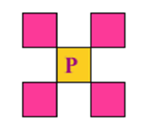
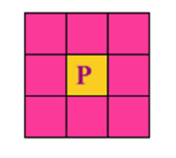

# 图像处理与计算机视觉

## 数字图像处理基础

### 图像感知与获取

- 人眼亮度有适应范围，不同情况识别不同级数的灰度

- 感受亮度与实际亮度呈现非线性关系

    - 马赫带效应，在亮度变化的边界存在一条更亮/更暗的马赫带

        

    - 同时对比度：人眼对某个区域的亮度感受也受到背景的影响

### 图像的采样与量化

1. 采样：对空间坐标x和y进行离散化，即确定**水平方向和垂直方向上的像素数**  M列×N行

2. 量化：把像素的浓淡变换为**离散的整数值**，对于灰度图像0~255（黑白），8bit量化

3. 数字图像表示：二维矩阵（$$F_{N×N}$$）彩色图像采用3层的二维矩阵对应RGB

4. 空间分辨率和灰度级分辨率

    1. 空间分辨率：图像空间中可分辨的最小细节。一般用**单位长度上采样的像素数**表示 DPI

    2. 灰度级分辨率：通常把**灰度级的数目**称为灰度级分辨率

5. 采样和量化的原则：
    1. 对于缓变的图像：粗采样，细量化，避免假轮廓
    2. 对于细节丰富的图像：细采样，粗量化，避免模糊

### 数字图像的类型

1. 静态图像：矢量图和位图

2. 矢量图：用**绘图指令**来描述一幅图，与分辨率无关

3. 位图：通过像素点来表示一幅图像，分为**二值图像、灰度图像、索引颜色图像、真彩色图像**

4. 位图图像类型

    1. 二值图像：只有0和1，0黑1白

        

    2. 灰度图像：灰度级介于0~255，8bit量化

        

    3. 真彩色图像RGB：每一个像素由RGB三个字节表示，可以产生$2^{24}$种不同的颜色

        

    4. 动态图像：多帧位图的有序组合

5. 图像类型的转化

    1. 灰度图像→二值图像：二值化
    2. 灰度图像→彩色图像：伪彩色增强
    3. 彩色图像→灰度图像：灰度化

6. 图像像素间的一些基本关系

    1. 相邻像素

        1. 像素p的**4邻域** $N_4(P)$

            $(x+1, y), (x-1,y), (x, y-1), (x, y+1)$

            

        2. 像素p的**4个对角邻域**$N_D(P)$

            $(x-1,y-1),(x+1,y-1),(x+1,y+1),(x-1,y+1)$

            

        3. 像素p的**8邻域** $N_8(P) = N_4(P)+N_D(P)$

            

            

    2. 邻接性、连通性

        1. 邻接性

            令V是具有**特定相似性准则的灰度值集合**，$V=\{v_1,v_2,...\}$

            4邻接：如果q在$N_4(p)$中，则p和q是4邻接的

            

            8邻接：如果q在$N_8(p)$中，则p和q是8邻接的

            

            ==m邻接：==

            两个像素之间是m邻接的同时，也可以是4邻接的，也可以是8邻接的！

            1. q在$N_4(p)$中  或

            2. q在$N_D(p)$中，且集合$N_4(p)∩N_4(q)$所有像素的灰度值**不属于**集合V

                则具有V值的p和q是m邻接的

                

        2. 连通性

            从$(x,y)$像素p到$(s,t)$像素q，特定的**像素序列**，并且像素$(x_{i},y{i}),(x_{i-1},y_{i-1})$是**邻接的**

            4通路、8通路（**存在非m邻接**）

            ==m通路==：在像素之间**同时存在4连接和8连接时**，优先采用**4连接**  （**不存在非m邻接**）

            

    3. 距离度量

        1. 明考夫斯基距离，模为r
            $$
            d(p,q)=[|x-s|^r+|y-t|^r]^{\frac{1}{r}}
            $$

        2. 欧式距离：像素在以$(x,y)$为中心半径为d的圆上
            $$
            d_e(p,q)=[(x-s)^2+(y-t)^2]^{\frac{1}{2}}
            $$

        3. 城区距离
            $$
            d_4(p,q)=|x-s|+|y-t|
            $$
            

        4. 棋盘距离：像素在以(x,)为中心的正方形上
            $$
            d_8(p,q)=max(|x-s|,|y-t|)
            $$
            

## 图像基本运算

### 图像几何变换

图像的几何变换是**将图像中任意一个像素映射到一个新的位置**，是一种空间变换，**关键在于确定图像中点与点的映射关系**

1. 图像几何变换基础

    1. 齐次坐标：用$n+1$维向量表示$n$维向量的办法，图像采用$[x,y,1]^T$表示

    2. 图像几何变换：**平移、缩放、旋转**可以用一个**变换矩阵**表示

        $T=\begin{bmatrix}a&b&k\\c&d&m\\p&q&s\end{bmatrix}$

        其中，$a,b,c,d$用于图像比例、对称、错切、旋转等基本变换；$k,m$用于图像的平移变换；$p,q$用于投影变换，$s$用于全比例变换

    3. 2d图像变换：
        $$
        T×[x,y,1]^T=\begin{bmatrix}a&b&k\\c&d&m\\p&q&s\end{bmatrix}\begin{bmatrix}x\\y\\1\end{bmatrix}=[ax+by+k,cx+dy+m,px+qy+s]^T
        $$

    4. 图像的插值运算

        利用已知的临近像素点的灰度值来产生未知像素点的灰度值

        1. 最近邻插值：等于距离最近的像素的灰度值
        2. 双线性插值：利用周围4个像素点的相关性，通过双线性算法计算得到
        3. 双三次插值：利用周围16个像素点的相关性计算得到

### 图像代数运算

### 邻域及模板运算
