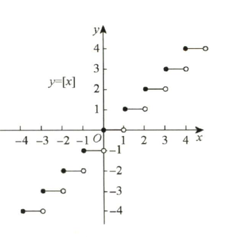

## 函数极限与连续

### 函数概念与特性

1. **函数**

    给定数集$D$，对于每一个$x \in D$，按照一定的法则$f$，有一个确定的值$y$与之对应，则$y$是$x$的函数，记作$y = f(x)$，$x$是自变量，$y$是因变量

2. **反函数**

    函数$y=f(x)$的定义域为$D$值域为$R$，对于每一个$y\in R$存在唯一的$x \in D$使得$y=f(x)$成立，则定义了一个新函数$x=f^{-1}(y)$，定义域为$R$值域为$D$

    1. 严格单调的函数**一定有反函数**

    2. 有反函数的函数不一定是单调函数

        

3. **复合函数**

    设函数$y=f(u)$的定义域为$D_1$，函数$u=g(x)$在$D$上有定义，且$g(D) \subset D_1$，则由
    $$
    y=f[g(x)](x \in D)
    $$
    确定的函数称为由函数$u=g(x)$和$y=f(u)$构成的**复合函数**

4. **隐函数**

    设方程$F(x,y)=0$，当$x$取某区间内的任一值时，总有满足该方程的唯一值$y$存在，则称方程$F(x,y)=0$在区间上确定了一个**隐函数**$y=y(x)$

5. **函数的四种特性**

    1. 有界性

        设$f(x)$的定义域为$D$，数集$I \subset D$，$\exist M > 0$，对于$\forall x \in I$有$|f(x)| \leq M $，则称$f(x)$在$I$上**有界**；如果这样的$M$不存在，则称$f(x)$在$I$上无界

        1. 几何上看，在给定区间，函数$y=f(x)$能被直线$y=M$和$y=-M$全“包起来”
        2. 讨论有界无界要**指明区间**

    2. 单调性

        设$f(x)$的定义域为$D$，数集$I \subset D$，对于区间$I$上的任意两点$x_1,x_2$，当$x_1 < x_2$，恒有$f(x_1) < f(x_2)$，则$f(x)$在区间$I$上**单调增加**，恒有$f(x_1) > f(x_2)$，则$f(x)$在区间$I$上**单调减少**

    3. 奇偶性

        设$f(x)$的定义域$D$关于原点对称，对于$\forall X \in D$，恒有$f(x) = f(-x)$则是**偶函数**，恒有$f(-x) = -f(x)$则是奇函数

        1. 形如$f(x) + f(-x)$必是偶函数
        2. 形如$f(x) - f(-x)$必是奇函数
        3. **内偶则偶，内奇同外**

    4. 周期性

        设$f(x)$的定义域$D$，存在一个正数$T$，使得$f(x+T)=f(x)$，则称$f(x)$是周期函数，$T$是周期

        1. $f(x)$以$T$为周期，则$f(ax+b)$以$\frac{T}{|a|}$为周期
        2. 若$g(x)$是周期函数，则复合函数$f[g(x)]$也是周期函数

### 函数的图像

1. **基本初等函数与初等函数**

    基本初等函数：常数函数、幂函数、指数函数、对数函数、三角函数、反三角函数
    

    初等函数：由基本初等函数经过有限次的四则运算以及有限次的复合步骤构成的，并且可以由一个式子所表示的函数称为**初等函数**

2. **分段函数**

    符号函数$y=sgnx$、取整函数$y=[x]$
    

### 函数极限的概念与性质

1. **邻域**

    1. $\delta$邻域

        $(x_{0}-\delta,x_{0}+\delta)$为点$x_0$的$\delta$邻域，记作$U(x_{0},\delta)$，$x_0$为邻域中心，$\delta$为邻域半径
        $$
        U(x_{0},\delta)=\left\{\left.x\right|x_{0}-\delta<x<x_{0}+\delta\right\}=\left\{\left.x\right|\left|\left.x-x_{0}\right|<\delta\right\}\right.
        $$

    2. 去心$\delta$邻域
        $$
        \mathring{U}(x_0\text{,}\delta)=\left\{x|0<\left|x-x_0\right|<\delta\right\}
        $$

    3. 左右$\delta$邻域
        $$
        右：U^{+}(x_{0},\delta)=\left.\left\{\begin{matrix}x|0<x-x_0<\delta\\\end{matrix}\right.\right\}\\
        左：U^{-}(x_{0},\delta)=\left.\left\{\begin{matrix}x|0<x_{0}-x<\delta\\\end{matrix}\right.\right\}\\
        $$

2. **函数极限的定义**

    设函数$f(x)$在点$x_0$的某一去心邻域内有定义，若存在常数$A$，对于$\forall\varepsilon>0$，总存在正数$\delta$，使得当

    $0<\left|x-x_{0}\right|<\delta $时，满足$\left|f(x)-A\right|<\varepsilon $，则$A$叫做函数$f(x)$当$x\rightarrow x_{0}$时的极限

    **$\varepsilon-\delta$语言：**
    $$
    \lim_{x\to x_0}f\left(x\right)=A\Leftrightarrow\forall\varepsilon>0\ \text{,}\exists\delta>0\ \text{,当}0<\left|x-x_0\right|<\delta\text{时,有}\left|f\left(x\right)-A\right|<\varepsilon
    $$
    

    

3. **函数极限的性质**

    1. 唯一性

        极限存在，则唯一

    2. 局部有界性

        如果$ \lim _{x\to x_0}f(x)=A$，则存在正常数$M$和$\delta$，使得当$0<\left|x-x_0\right|<\delta$时，有$|f(x)| \le M$

    3. 局部保号性

        如果$f(x) \to A(x \to x_0)$，$A>0$或$(A<0)$那么在$x_0$的去心邻域内有$f(x) > 0$(或$f(x) < 0$)

4. **无穷小定义**

## 数列极限

## 一元函数微分学概念

## 一元函数积分学计算

## 一元函数微分学-几何应用

## 一元函数微分学-中值定理、微分等式、微分不等式

## 一元函数微分学-物理应用与经济应用

## 一元函数积分学的概念与性质

## 一元函数积分学的计算

## 一元函数积分学-几何应用

## 一元函数积分学-积分等式、积分不等式

## 一元函数积分学-物理应用与经济应用

## 多元函数微分学

## 二重积分

## 微分方程

## 无穷级数

## 多元函数积分学预备知识

## 多元函数积分学

