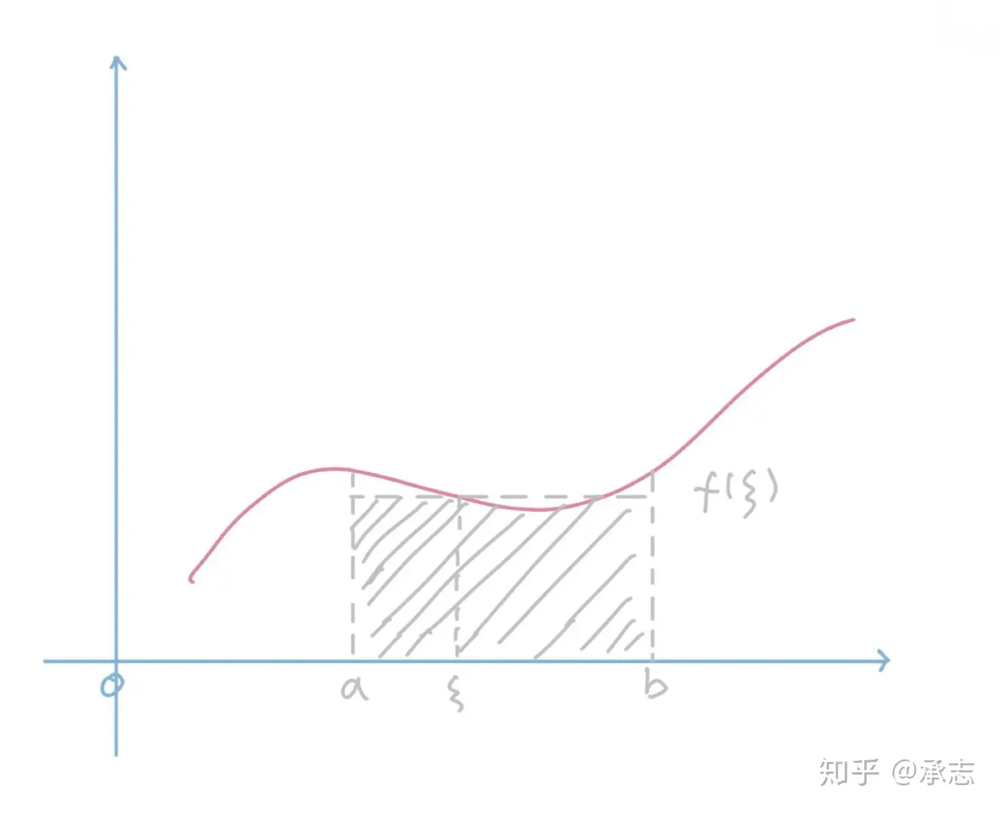

# 数学

## 高等数学

### **五种基本初等函数**

指数函数、对数函数、幂函数、三角函数、反三角函数

### **函数的零点怎么求**？

1. 解方程：令$f(x)=0$得到零点

2. 数形结合：转化成两个函数交点的问题

3. 利用**零点存在性定理**：函数$f(x)$在区间$[a,b]$上的图像是连续的曲线，有$f(a)f(b)<0$那么函数在$[a,b]$上至少有一个零点

4. 浮点数二分法：取区间中点$mid$，计算$f(mid)$如果$f(mid)<0$,$a=mid$,如果$f(mid)>0$,$b=mid$，直到满足精度

5. 牛顿迭代法：设$f(r)=0$,选取$x_0$为初始值

    过$(x_0,f(x_0))$做切线L:$y-f(x_0)=f'(x_0)(x-x_0)$,求出与x轴交点的横坐标$x_1$

    过$(x_1,f(x_1))$做切线L:$y-f(x_1)=f'(x_1)(x-x_1)$,求出与x轴交点的横坐标$x_2$

    过$(x_{n-1},f(x_{n-1}))$做切线L:$y-f(x_{n-1})=f'(x_{n-1})(x-x_{n-1})$,求出与x轴交点的横坐标$x_n$,迭代循环

### **函数极限和数列极限**

1. 函数极限

    设函数$f(x)$在点$x_0$的某一**去心邻域**内有定义，若存在常数$A$，对于$\forall\varepsilon>0$，$\exists\delta>0$，使得当

    $0<\left|x-x_{0}\right|<\delta $时，满足$\left|f(x)-A\right|<\varepsilon $，则$A$叫做函数$f(x)$当$x\rightarrow x_{0}$时的极限

    **$\varepsilon-\delta$语言：**
    $$
    \lim_{x\to x_0}f\left(x\right)=A\Leftrightarrow\forall\varepsilon>0\ \text{,}\exists\delta>0\ \text{,当}0<\left|x-x_0\right|<\delta\text{时,有}\left|f\left(x\right)-A\right|<\varepsilon
    $$

2. 数列极限

    设数列$a_n$，若存在常数$a$，对于$\forall\varepsilon>0$,若存在正整数$N$，使得当$n>N$时，满足$\left|a_n-a\right|<\varepsilon $，则$a$叫做数列$a_n$收敛时的极限
    $$
    \lim_{n\to \infty}a_n=a\Leftrightarrow\forall\varepsilon>0\ \text{,}\exists N>0\ \text{,当}n>N{时,有}\left|a_n-a\right|<\varepsilon
    $$

### **连续、可导、可微**

1. 连续：左极限等于右极限等于函数值，$\lim_{x \to x_0}f(x)=f(x_0)$

2. 可导：$\lim_{\Delta x\to0}\frac{f(x_0+\Delta x)-f(x_0)}{\triangle x}$存在。则$y=f(x)$在$x_0$处可导

    **函数在一点的导数，反映了因变量随自变量变化的快慢**

    对于**一元函数**，可导一定连续，连续不一定可导

    对于**多元函数**，可导不一定连续，连续不一定可导

3. 可微

    对于**一元函数**，$dy=A\Delta x=f^{\prime}(x_0)\Delta x$

    对于**多元函数**，$dz=f_x\left(x,y\right)dx+f_y\left(x,y\right)dy$

    导数：描述函数变化快慢。微分：描述函数变化程度

### **什么是解析？什么是奇点？**

1. 解析：函数在**某点**及其**邻域**内处处可导
2. 奇点：函数**没有定义**的点

### **微分中值定理**

1. 费马引理

    

    通俗化解释：在邻域内，$f(x_0)$是极小值点或者是极大值点，那么该点的导数值为0，前提是这一点得可导

    **费马将极值点可导的情况拿出来研究，得到了极值点处的函数导数为0**

    如果函数$y=f(x)$在点$x_0$处可导，且在$x_0$的某邻域$U(x_0)$内有$f(x) \leq f(x_0)$或$f(x) \geq f(x_0)$,则$f'(x_0)=0$

    [微分中值定理](https://www.zhihu.com/tardis/zm/art/47436090?source_id=1005)

2. 罗尔中值定理

    若$y=f(x)$满足

    1. 在闭区间$[a,b]$上连续
    1. 在开区间$(a,b)$上可导
    1. $f(a)=f(b)$

    则在$(a,b)$内，至少存在一点$\xi$ 使得$f^{\prime}(\xi)=0$

    

    **通俗化解释：只要重新回到起点，中途必然有速度为0的点**

    **不连续不可导一定不行**

    

    

    

3. 拉格朗日中值定理

    若$y=f(x)$满足

    1. 在闭区间$[a,b]$上连续
    2. 在开区间$(a,b)$上可导

    则在$(a,b)$内，至少存在一点$\xi$ 使得$f^{\prime}(\xi)=\frac{f(b)-f(a)}{b-a}$

    

    **通俗化解释：必然有一个点的瞬时速度等于全程的平均速度**

    **把拉格朗日中值定理，旋转一下，得到的就是罗尔中值定理**

    

    

4. 柯西中值定理

    若$y=f(x)$和$y=g(x)$满足

     1. 在闭区间$[a,b]$上连续
     2. 在开区间$(a,b)$上可导
     3. 在开区间$(a,b)$上$g'(x) ≠ 0$

    则在$(a,b)$内，至少存在一点$\xi$ 使得$\frac{f^{\prime}(\xi)}{g^{\prime}(\xi)}=\frac{f(b)-f(a)}{g(b)-g(a)}$
    
    
    
    
    
    **通俗化解释：二维运动，起点和终点的斜率，必然等于某一点的切线的斜率**
    
    

### **泰勒公式**

1. 概述：泰勒公式的初衷是**用多项式近似地表示函数在某点周围的情况**

    如果函数满足一定的条件，泰勒公式可以用函数在**某一点**的**各阶导数值**作为**系数**构建一个多项式

2. 泰勒公式

    设$n$是一个正整数，$f(x)$在$x=a$处$n+1$阶可导，对于这个区间的任意$x$
    $$
    f(x)=\frac{f^{(0)}(a)}{0!}(x-a)^0+\frac{f^{(1)}(a)}{1!}(x-a)^1+\frac{f^{(2)}(a)}{2!}(x-a)^2+\cdots+\frac{f^{(n)}(a)}{n!}(x-a)^n+R_n(x)
    $$
    称为函数在$a$处的泰勒展开式

3. 常见余项

    皮亚诺余项：$R_n\left(x\right)=o([\left(x-a\right.)]^n)$

    拉格朗日余项：$\begin{aligned}R_n\left(x\right)=\frac{f^{\left(n+1\right)}}{\left(n+1\right)!}\left(x-a\right)^{\left(n+1\right)}\end{aligned}$ 

4. 麦克劳林公式

    **在$x=0$处的泰勒展开式**
    $$
    f(x)=\frac{f^{(0)}(0)}{0!}x^0+\frac{f^{(1)}(0)}{1!}x^1+\frac{f^{(2)}(0)}{2!}x^2+\cdots+\frac{f^{(n)}(0)}{n!}x^n+\frac{f^{(n+1)}(\theta x)}{(n+1)!}x^{n+1}
    $$

### 函数的凹凸性

1. 驻点：一阶导数为0的点

2. 拐点：二阶导数为0的点

3. 凸函数与凹函数

    1. 凸函数：$f(\frac{x_1+x_2}{2}) \geq \frac{f(x_1)+f_(x_2)}{2}$     $f''(x)<0$  斜率减小

        

        

    2. 凹函数；$f(\frac{x_1+x_2}{2}) \leq \frac{f(x_1)+f_(x_2)}{2}$     $f''(x)>0$  斜率增大

        

        

### 积分

1. 积分定理

    若函数$f(x)$在区间$[a,b]$上连续，将其划分为$n$个区间长度为$\frac{b-a}{n}$的区间，则$x=a,x=b,f(x)$围成面积$A$
    $$
    A=\lim_{n\to\infty}\sum_{i=0}^{n-1}f(x_i)\frac{b-a}n
    $$

2. 积分中值定理

    若$f(x)∈C[a,b]$，则至少存在一点$\xi ∈ [a,b]$,使得$\int_{a}^{b}f(x)\mathrm{d}x=f(\xi)(b-\alpha)$

    **几何理解：曲边梯形的面积等于某个矩形的面积，$f(\xi)$是平均高度**

    

3. 微积分的基本公式（牛顿-莱布尼茨公式）

    设$f(x)$在$[a,b]$上连续，$F(x)$是$f(x)$的一个**原函数**，则$\int_a^bf(x)\mathrm{d}x=F(b)-F(a)$

    **表明：一个连续函数在区间$[a,b]$上的定积分等于它任意一个原函数在区间$[a,b]$上的增量，故求定积分转为求原函数的问题**

4. 定积分如何求？

    1. 换元积分法
    2. 分部积分法

5. 定积分的几何意义

    $\int_a^bf(x)\mathrm{d}x=A$  （曲边梯形的面积）

6. 二重积分的几何意义

    $\iint_Df(x,y)\operatorname{d}\sigma =V$ （以$z=f(x,y)$为顶，以D为底的曲顶柱体的体积）

7. 黎曼积分

    1. 黎曼和

        对一个在闭区间$[a,b]$内有实值的函数$f$，$f$取样分割$x_0,...x_n、t_0,...,t_n$的黎曼和定义为以下和式
        $$
        \sum_{i=0}^{n-1}f(t_i)(x_{i+1}-x_i)
        $$
        **和式中的每一项是子区间长度$x_{i+1}-x_i$**在$t_i$处的函数值$f(t_i)$的乘积。

    2. 黎曼积分

        对于一个函数，在闭区间$[a，b]$上，无论取怎样的分割，只要它的**子区间长度的最大值足够小**，函数f的黎曼和都会趋向一个确定的值S，那么f在闭区间的黎曼积分存在，并且说此时函数f是黎曼可积的

### 向量的内积、外积

1. 内积（数量积、点积、点乘） 得到的是**数**
    $$
    |\vec{a}||\vec{b}|\cos\theta=\vec{a} \cdot \vec{b}
    $$
    
2. 外积（向量积、叉积、叉乘） 得到的是**向量**

    方向：$\vec c ⊥ \vec a , \vec c ⊥ \vec b$,符合右手法则

    数量：$|\vec{a}||\vec{b}|\sin\theta=\vec{a} × \vec{b}$

    几何意义：以$\vec a ,\vec b$为邻边的平行四边形的面积

### 场论中的梯度、散度、旋度

1. 方向导数与梯度（数量场）

    1. 方向导数：在函数定义域内的点，对某一方向求导得到的导数

        在某一点处沿方向$l$，函数对距离的变化率
        $$
        方向导数=梯度*I的单位向量=\frac{\partial f}{\partial l}=\mathrm{grad}f\cdot\frac{\vec{l}}{\left|\vec{l}\right|}
        $$

    2. 梯度：一个向量
        $$
        \mathrm{grad}f=(\frac{\partial f}{\partial x},\frac{\partial f}{\partial y})
        $$
        对多元函数的参数求偏导数，把求得的偏导数以向量的形式写出来，就是梯度，梯度反映了**函数变化增加最快的地方**，沿着梯度向量的方向，更容易找到函数的最大值，反过来说，**沿着梯度向量的反方向，更容易找到函数的极小值**

2. 散度：一个数，对应内积

    散度可用于表征空间各点矢量场发散的强弱程度，物理上，**散度的意义是场的有源性**

3. 旋度：一个向量，对应外积

### 各类级数

### 欧拉公式

$$
e^{ix}=\cos x+i\sin x
$$

​	

## 线性代数

### 余子式和代数余子式

1. 余子式

    n阶行列式中，划去元$a_{ij}$所在的第$i$行和第$j$列的元，剩下的元不改变原来的顺序结构构成的$n-1$阶**行列式**，称为元$a_{ij}$的余子式

    作用：能把$n$阶行列式化简为$n-1$阶

2. 代数余子式

    $a_{ij}$的代数余子式
    $$
    A_{ij}=(-1)^{i+j}M_{ij}
    $$
    **余子式只计算去掉某行某列之后剩余行列式的值，而代数余子式则需要考虑去掉的这一个元素对最后值正负所产生的影响**

### 行列式的含义

行列式，记作det(A)，是一个将**方阵A**映射到**实数**的函数。行列式等于矩阵特征值的乘积。**行列式的绝对值可用被认为是衡量矩阵相乘后的空间扩大或缩小了多少**。

如果行列式为0，那么空间至少沿着某一维完全收缩了，使其失去了所有的体积。

如果行列式为1，那么矩阵相乘没有改变空间的体积

**几何意义：行列式就是在给定的一组基下，N个向量张成的一个N维的广义四边形的体积。2阶行列式代表的是平面内的面积、三阶行列式自然是三维空间内的体积、四阶行列式是四维空间内的超体积**

**三阶行列式的对角线法计算：**

1. 将1、2列平移到右侧
2. 做出六条斜对角线
3. 对角线上的元素相乘，红色的相加减去蓝色的

### 矩阵的秩

1. 基本概念

    K阶子式：在一个矩阵中取k行k列，交叉处的$K^2$个元素按顺序构成的行列式

    从子式的角度定义：矩阵的秩就是矩阵中非零子式的最高阶数

    从极大线性无关的角度定义：矩阵中所有**行向量中极大线性无关组的个数**

    从标准型的角度定义：求一个矩阵的秩，可以先将其转化为行阶梯型，非零行的个数，即为矩阵的秩（**行阶梯型矩阵的秩等于其非零行的行数**）

2. 与向量组的关系

    矩阵的秩等于它列向量组的秩，也等于它行向量组的秩

    向量组的秩，定义为向量组的极大线性无关组所含的向量个数

3. 与向量空间的关系（几何意义）

    任何矩阵的行空间维数等于矩阵的列空间维数等于矩阵的秩

4. 与线性方程组解的关系

    设$A$是$m×n$的矩阵

    若$R(A)<n$,方程组有多个解

    若$R(A)=n$,方程组有唯一解

    

### 矩阵的迹

方阵$A(n×n)$的迹定义为对角线元素的和
$$
tr(A)=\sum_{i=1}^na_{ii}=a_{11}+a_{22}+...+a_{nn}
$$

### 线性方程组解的情况/判断一个线性方程组是否有解有哪几种方法？

1. 对于齐次线性方程组$AX=0$

    R(A)=n，有唯一解

    R(A)<n，有无穷多解

2. 对于非齐次线性方程组$AX=b$

    R(A)≠R(A,b)，无解

    R(A)=R(A,b)=n，有唯一解

    R(A)=R(A,b)<n，有无穷多解

    

### 线性相关与线性无关

1. 含义

    设$\alpha_1,\alpha_2,...,\alpha_m$都是$n$维向量，若存在一组**不完全为0的**$$k_1,k_2,...,k_m$$,使得$k_1\alpha_1+k_2\alpha_2+...+k_m\alpha_m=0$，则称向量组线性相关，否则称向量组线性无关

    **向量组线性无关的充要条件是R(A)=m,行满秩**

2. 几何意义

    一组向量线性相关的本质上，是描述它们**张成的广义平行四边形的体积是否为0**

    线性相关，行列式为0

    线性无关，行列式不为0

3. 线性无关的等价定义

    矩阵可逆，矩阵满秩、特征值没有0

### 向量空间的基与维数

1. 基

    设$V$是一向量空间，$\alpha_1,\alpha_2,...,\alpha_r∈V$满足

    $\alpha_1,\alpha_2,...,\alpha_r$**线性无关**

    $V$中的向量均可由$\alpha_1,\alpha_2,...,\alpha_r$**表示**，则$\alpha_1,\alpha_2,...,\alpha_r$是$V$的一个基

2. 维数

    基中所含的向量的个数$r$称为向量空间的维数

### 特征值和特征向量

1. 定义

    对于方阵$A$满足：$Ax=\lambda x$，其中$x$为非0向量，则称$x$为特征向量，$\lambda$为特征值

    向量$x$在几何空间中经过**矩阵A**的变换后得到向量$\lambda x$,由此可知，向量$x$经过矩阵A变换后，只是大小伸缩了$\lambda$倍

2. 矩阵的特征值和特征向量有什么关系

    一个特征值可能对应多个特征向量，一个特征向量只属于一个特征值

    属于不同特征值的特征向量一定线性相关

3. 特征值和特征向量的几何意义

    **如果一个向量投影到一个方阵定义的空间内只发生了伸缩变化，而没有发生旋转变化，那么该向量就是这个方阵的一个特征向量，伸缩比例就是特征值**

    特征向量的代数含义：将矩阵乘法转换为数乘操作

    特征向量的几何含义：特征向量通过方阵A变换只进行伸缩，而保持特征向量的方向不变

    特征值表示这个特征到底有多重要，类似于权重，而特征向量在几何上就是一个点，从原点到该点的方向表示向量的方向

​    

从线性代数的角度出发，如果把矩阵看作n维空间下的一个线性变换，这个变换有很多的变换方向，我们通过特征值分解得到的前N个特征向量，那么就对应了这个矩阵最主要的N个变化方向。我们利用这前N个变化方向，就可以近似这个矩阵（变换）。**其中的N个变化方向，就是这个矩阵最重要的“特征”。**

1. 如果把**矩阵看作是位移**，那么**特征值 = 位移的速度，特征向量 = 位移的方向**。
2. **特征向量在一个矩阵的作用下作伸缩运动，伸缩的幅度由特征值确定（注意观察定义式）**。特征值大于1，所有属于此特征值的特征向量变长；特征值属于(0, 1)，特征向量缩短；特征值小于0，特征向量则反向延长。

### 相似矩阵

设$A,B$都是n阶矩阵，若有可逆矩阵$P$,使得$P^{-1}AP=B$则称B是A的相似矩阵，或者说B和A相似

### 合同矩阵

设$A,B$都是n阶矩阵，若有可逆矩阵$C$,使得$C^{T}AC=B$则称A和B合同

### 什么是向量正交，什么是矩阵正交

若$(\alpha,\beta)=0$，则向量$\alpha，\beta$正交

若$AB=E$，则矩阵$A，B$正交

若$A^TA=E$,则矩阵$A$为正交矩阵

### 什么是正定矩阵？什么是半正定矩阵

### 相似与对角化

### 向量范数与矩阵范数

1. 向量范数

    1. 1-范数：向量元素的绝对值之和（曼哈顿距离）
        $$
        \|X\|_1=\sum_{i=1}^n\lvert x_i\rvert
        $$
        

    2. 2-范数：向量元素的平方和再开方（欧几里得距离）
        $$
        \|X\|_2=(\sum_{i=1}^nx_i^2)^{1/2}
        $$

    3. p-范数：向量元素绝对值的p次方再开p次方
        $$
        ||x||_p=(\sum_{i=1}^m|x_i|^p)^{\frac1p}
        $$
        

2. 矩阵范数

    1. 列和范数：所有矩阵**列向量绝对值之和的最大值**
        $$
        ||A||_1=\max_j\sum_{i=1}^m|a_{i,j}|
        $$
        

    2. 谐范数

        $\lambda_1$是$A^TA$的最大特征值
        $$
        ||A||_2=\sqrt{\lambda_1}
        $$
        

## **概率论**