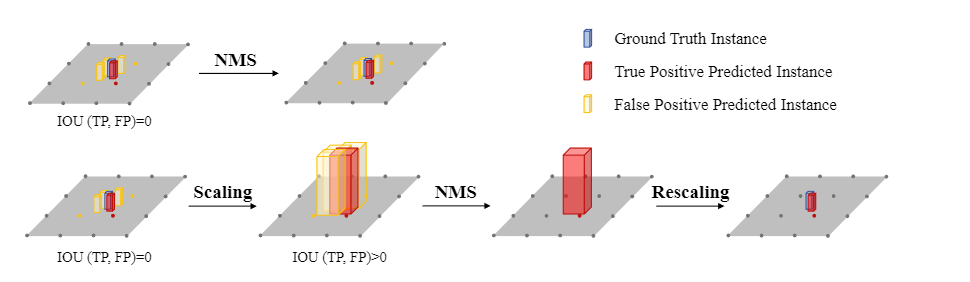

# 简历面

## BEV感知

1. 什么是BEV感知？

    **2D感知任务**是从单张图像/时间序列中检测或者分割目标，但是对于**自动驾驶**任务来说，最终需要目标在**自车坐标系**下的相关信息，因此2D的感知结果，需要映射到3D空间。即便是2D视觉感知自身发展比较成熟，但是直接从场景中获取目标的3D信息是一件比较困难的事情。对于**单目相机**，由于相机成像几何的局限性，深度估计是一个病态的问题。更好的方式是通过**双目相机**来进行深度估计，但是视野范围小，作用有限。因此有了**多目感知**，通过安装在车身上的六个摄像头来进行**3D感知任务**，也是在这个系统中提出了**BEV感知**的概念。也就是**将来自多个摄像头的图像，从透视图变换到鸟瞰图（Bird‘s Eye View）**，BEV视图包含了对自动驾驶任务重要的**位置信息**，对于**目标的高度信息**隐藏在了BEV特征图中，因此BEV感知的结果，可以直接用于下游的各种任务，对于BEV感知任务，最重要的我认为就是**从2D空间到3D空间的变换**，同样为了提高准确率，也有**点云激光雷达、毫米波雷达以及图像**的**多模态融合**方案来进行BEV感知任务

2. BEV感知任务采用的数据集和指标？

    nuScenes数据集

    **IOU**：IoU采用BEV视图下，2D检测框的中心点的距离来进行匹配，而不是采用3D框的交并比来实现，这样可以提高小目标的匹配成功率。

    **TP（True Postive）**：真正例，IOU>0.5的检测框数目

    **FP（False Postive）**：假正例，IOU<0.5的检测框数目

    **TN（True Negative）**：真负例，没有检测框

    **FN（False Negative）**：假负例，没有检测到GT框的数目

    **Precision**： $查准率=\frac{TP}{TP+FP}$

    **Recall**：$查全率 = \frac{TP}{TP + FN}$

    **AP（Average Precision）**：Precision和Recall在某些情况下是矛盾的，查得准，但是不一定全，查的全，但是不一定查的准，我们绘制PR曲线，计算PR曲线的面积（平均值）

    

    **mAP**：**针对每个类别**求AP，多个类别AP求平均值，即为mAP

    **NDS（nuScenes Detection Score）**：nuScenes数据集的一个指标，在mAP的基础上，还预测物体框的位置，大小，朝向，速度以及其他属性。可以更全面的评价3D目标检测算法的优劣

3. BEV感知中的**BaseLine**工作？

    1. **从2D空间到3D空间**

        1. LSS（Lift，Splat，Shoot）

            **a.**多张视图通过共享的CNN主干网络提取特征，对每一个特征图进行**视图转换**，核心步骤是**估计特征图每个像素处的深度分布**，这里没有预测具体的深度值，而是设置**D个离散的深度值**，网络在**每个像素处预测D个概率值**$\alpha_1,\alpha_2,\ldots,\alpha_D$，以及该**像素处的通道特征c（维度是C）**，用$\alpha$对$c$加权就得到了对应每个深度的上下文特征，这个过程叫做**Lift**

            

            **b.**假设特征图的大小为$H×W$，每个像素有$D$个可能的深度值。通过相机的内外参数，每个像素可以转换为3D空间中的D个点，因此每个特征图可以转换为$H×W×D$个点，有$N$个相机，一共有$N×H×W×D$个3D点，这些三维点可以利用**PointPillar**的方式进行投影，一个Pillar对应一个BEV网格，对落到网格中的点进行Pooling操作，得到$C$维的特征，所以BEV特征图的维度是$X×Y×C$，$X、Y$是BEV网格横向和纵向的个数，这个过程叫**Splat**。

            **c.**Shoot就是用得到的BEV特征图做下游任务（检测、分割）

        2. BEVDet

            

            **a.**BEVDet以LSS的视图转换为基础，**但是在BEV视图中采用了额外的特征提取网络来进行进一步的特征提取**，对进一步提取生成的BEV特征进行检测。

            **b.**其特征提取的主干网络可以采用ResNet、也可以采用Swin—Transformer，最后采用**CenterPoint**的Head结构来进行3D检测任务，同时改进了**非极大值抑制策略**

            

        3. BEVDet4D

            

            **a.**BEVDet在**时序融合上的扩展**，对于单帧图像的处理采用了BEVDet同样的方法，将图像转换到BEV视图上，并进行特征提取。时序处理的方式非常简单：**将T-1时刻和T时刻的BEV特征进行空间对齐**

            **b.**对于自车的运动，通过平移和旋转，将T-1时刻的坐标对齐到T时刻，因此可以通过简单的叠加操作来完成时序的融合

            

        4. BEVDepth

            

            为了改善LSS方式的深度估计质量较差的问题，**BEVDepth在训练过程中加入额外的深度信息监督**。具体来说，**激光雷达的点云被投影到图像上，为深度提供显式的监督信息**

        5. BEVFusion

            

            **a.**图像与点云激光雷达的**并行**融合方案

            **b.**图像之路仍然采用LSS式的特征提取

            **c.**点云之路采用点云BEV特征提取，然后经过和图像的融合模块得到最终的BEV特征图

            **d.**在每一条分支上加上Head，以此来监督每一条分支，使结果更准确

    2. **从3D空间到2D空间**

        1. DETR3D

            

            **a.**采用**稀疏的目标级别的query，每一个query对用一个目标的3D中心点**，通过相机成像几何，**将3D点投影到2D平面中，从图像取特征，填回到BEV特征中**，通过这个BEV特征进行检测，来更新query，反复迭代

            

        2. PETR

            **a.** 和DETR一样，不同的是，PETR的query并没有和DETR一样**通过3D到2D的映射与图像特征建立联系**，而是通过**PostionEnbeding**，**在2D图像特征上编码3D空间信息**

            **b.**缺点是显而易见的，必须要计算query和图像特征之间的**全局注意力，因为query无法直接与图像的局部区域建立联系**，计算量非常大。

        3. BEVFormer

            **多尺度可变形注意力**

            

            规而言 Attention Map = Query 和 Key 做内积运算，将 Attention Map 再和 Value 做加权；但是由于这种方式计算量开销会比较大，所以在 Deformable DETR 中**用局部注意力机制代替了全局注意力机制**，只对几个采样点进行采样，**而采样点的位置相对于参考点的偏移量和每个采样点在加权时的比重均是靠 Query 经过 Linear 层学习得到的**。

            

            

            **a.**BEVFormer采用**空间交叉注意力**来进行**图像到BEV视图**的转换，其中**query来自BEV视图，而key和value来自于图像视图**，query被定义为**可学习的BEV网格特征**，大小为$H×W×C$，$HW$是BEV网格个数，C是特征维度

            **交叉注意力中query和key/value的来源不同，它经常被用于不同域（Domain）之间的数据转换。**

            **b.**为了提取3D特征，BEV query的每个网格都被扩展为高度不同的 $N_{ref}$个三维点，从而通过高度信息，更好的从2D图像上取特征

            **c.**时序融合上采用**时序自注意力机制**，其中**query来自当前帧的BEV特征图，key和value来自历史BEV特征图**

        4. BEVFormerV2

            该方法没有用额外的激光雷达点云来提供深度信息监督，而是**给主干网络增加一个额外的3D物体检测任务（**下图中绿框的部分）。这是一个辅助任务，可以帮助主干网络更好的提取3D信息

            

    3. 什么是BEV Occupancy

        ​	直接在BEV空间中完成动态障碍物的3D检测这是BEV感知的任务，直接在3D空间中感知占用关系这是occupancy

        BEV模型和Occ有很多相似之处，bev特征生成范式和occ几乎完全相同，时序方法也适用。

        ​	**数据生成和优化**占据了occ任务的主要部分，occ的真值很难人工标注，需要借助3dbbx间接生成。这就需要优化真值

        相比于之前的3D感知算法而言，基于栅格网络的感知算法更类似于**基于3D空间的语义分割任务**，算法将当前的感知空间划分成**体素**进行表示，然后对空间中的每个体素预测其**是否被占用**以及**被占用的体素所属的类别信息**

        1. 更准确的描述物体的外部轮廓
        2. 可以预测数据集以外的目标类别，general object


## YoloV5

## TensorRT

1. 什么是TensorRT

    TensorRT是可以在**NVIDIA**各种**GPU硬件平台**下运行的一个**C++推理框架**。我们利用Pytorch、TF或者其他框架训练好的模型，可以转化为TensorRT的格式，然后利用TensorRT推理引擎去运行我们这个模型，从而提升这个模型在英伟达GPU上运行的速度。速度提升的比例是**比较可观**的。

2. TensorRT的加速效果怎么样

    加速效果取决于模型的类型和大小，也取决于我们所使用的显卡类型。

    对于GPU来说，因为底层的硬件设计，更适合[并行计算](https://cloud.tencent.com/product/gpu?from_column=20065&from=20065)也更喜欢密集型计算。TensorRT所做的优化也是**基于GPU**进行优化，当然也是更**喜欢那种一大块一大块的矩阵运算**，尽量直通到底。因此**对于通道数比较多的卷积层和反卷积层，优化力度是比较大的**；如果是比较繁多复杂的各种细小op操作(例如**reshape、gather、split**等)，那么TensorRT的优化力度就没有那么夸张了。

3. TensorRT有哪些黑科技？

    - 算子融合(层与张量融合)：简单来说就是通过**融合一些计算op或者去掉一些多余op来减少数据流通次数**以及显存的频繁使用来提速
    - 量化：量化即IN8量化或者FP16以及TF32等不同于常规FP32精度的使用，这些精度可以显著提升模型执行速度并且不会保持原先模型的精度
    - 内核自动调整：根据不同的显卡构架、SM数量、内核频率等(例如1080TI和2080TI)，选择不同的优化策略以及计算方式，寻找最合适当前构架的计算方式
    - **动态张量显存**：我们都知道，显存的开辟和释放是比较耗时的，通过调整一些策略可以减少模型中这些操作的次数，从而可以减少模型运行的时间
    - 多流执行：使用CUDA中的stream技术，**最大化实现并行操作**

4. 什么模型可以转换为TensorRT

    TensorRT官方支持Caffe、Tensorflow、Pytorch、ONNX等模型的转换(不过Caffe和Tensorflow的转换器Caffe-Parser和UFF-Parser已经有些落后了)，也提供了三种转换模型的方式：

    - 使用`ONNX2TensorRT`，即ONNX转换trt的工具
    - Pytorch->ONNX->TensorRT

## OpenMMlab


1. 介绍一下openmmlab的框架

    openmmlab为计算机视觉方向创建了一个**统一且开源**的代码库。

2. openmmlab的特点

    1. 模块化组合设计：将网络框架拆分为不同的组件。将数据集的构建、模型的搭建、训练过程封装为模块，在一个统一的架构上供用户自定义创建网络架构
    2. 高性能：基于底层库mmcv，几乎所有的操作都在GPU上运行
    3. SOTA方法：开源框架不断集成计算机视觉领域的先进算法

3. mmcv核心组件分析

    1. config

        通过Config.fromfile遍历config.py文件

        遍历所有的base文件，然后再合并自己定义的配置文件，最终得到配置文件字典

    2. registry

        提供全局的类注册器功能，Registry类维护一个全局的key-value对，比如backbone、head、neck等，用户可以通过字符串的方式实例化任何想要的模块

    3. hook

        通过注册hook，可以拦截和修改某些中间变量的值。随意插入任何函数来捕获中间过程，本质上是pytorch内部的回调函数

        mmcv中，当runner运行到预定义的点位时，就会调用hook中对应的方法，例如保存ckpt，学习率调度，参数更新，日志打印等等

        

    4. runner

        runnner的使用过程可以分为4个步骤

        1. runner对象初始化
        2. 注册各种hook到runner中
        3. 调用runner的resume或load_ckpt对权重进行加载
        4. 执行给定的工作流


## RTK

**RTK，英文全名叫做Real-time kinematic，也就是实时动态**。这是一个简称，全称其实应该是RTK（Real-time kinematic，实时动态）载波相位差分技术。（为了方便阅读，下面将继续简写为RTK。）


找至少4颗卫星，分别计算**各个卫星**与**终端**之间的距离△L（这个距离也被称为“伪距”），就可以列出4个方程组。计算之后，就能得出终端的四个参数，分别是经度、纬度，高程（海拔高度）和时间。


1. **RTK的工作原理**

    

    基准站是提供参考基准的基站。而流动站，是可以不断移动的站。流动站其实就是要测量自身三维坐标的那个对象目标，也就是用户终端

    **第①步，**基准站先观测和接收卫星数据；

    **第②步，**基准站通过旁边的无线电台（数据链），将观测数据实时发送给流动站（距离一般不超过20公里；

    **第③步，**流动站收到基准站数据的同时，也观测和接收了卫星数据；

    **第④步，**流动站在基准站数据和自身数据的基础上，根据**相对定位原理**，**进行实时差分运算**，从而解算出流动站的三维坐标及其精度，其定位精度可达1cm~2cm。

2. 

## Transformer

[transformer面试题的简单回答 - 知乎 (zhihu.com)](https://zhuanlan.zhihu.com/p/363466672)

1. 介绍自注意力机制和数学公式

   [Transformer学习笔记二：Self-Attention（自注意力机制） - 知乎 (zhihu.com)](https://zhuanlan.zhihu.com/p/455399791)

   Self-attention的意思是，我们给Attention的输入都来自同一个序列，其计算方式如下：

   

   对于每个token，产生三个向量，query，key，value

   query：类比询问，某个token问“其余的token”和我有多大程度的相关啊？

   key：类比索引，某个token说“我把每个询问的内容的回答都压缩了下，装在了我的key里”

   value：类比回答，某个token说“我把我自身涵盖的信息又抽取了一层封装在我的value中”

   **产生query、key、value**

   

   

   

   为什么要除以dk？QK的数值可能会比较大，交叉熵比较小，不方便计算

   

2. VIT

   将图像转换成一系列的token，将图像分割开，每一个作为一个token，显然比较吃计算

   因此选择将图像分割成小的patchs，将每一个patchs enbedding成一个token

   

   

   

   1. patch embeding

      

   

   

   2. class embedding and positional embedding

      **位置编码和class编码**都是可学习的编码

      

3. 介绍Transformer的QKV

   以图中的token a2为例：

   - 它产生一个query，每个query都去和别的token的key做“**某种方式**”的计算，得到的结果我们称为attention score（即为图中的$$\alpha $$）。则一共得到四个attention score。（attention score又可以被称为attention weight）。
   - 将这四个score分别乘上每个token的value，我们会得到四个抽取信息完毕的向量。
   - 将这四个向量相加，就是最终a2过attention模型后所产生的结果b2

4. 介绍Layer Normalization

   nlp用ln，图像用bn

5. Transformer的训练和部署技巧

6. 介绍Transformer的位置编码

   [Transformer学习笔记一：Positional Encoding（位置编码） - 知乎 (zhihu.com)](https://zhuanlan.zhihu.com/p/454482273)

   因此，我们需要这样一种位置表示方式，满足于：
   （1）它能用来表示一个token在序列中的绝对位置
   （2）在序列长度不同的情况下，不同序列中token的相对位置/距离也要保持一致
   （3）可以用来表示模型在训练过程中从来没有看到过的句子长度。

7. multi-head attention

   

   将qkv拆分为h份，然后在每一层上计算self-attention，最后再把每个token产生的b1~bh拼接起来，类似于不同的channel数

   

8. 介绍Transformer的Encoder模块

   

9. 介绍Transformer的Decoder模块

10. Transformer和Mamba（SSM）的区别

11. Transformer的残差结构和意义

12. 为什么Transformer适合多模态任务

13. Transformer的并行化体现在哪些方面

    Transformer的并行化主要体现在self-attention模块，在Encoder端Transformer可以并行处理整个序列，并得到整个输入序列经过Encoder端的输出，但是rnn只能从前到后的执行

14. 为什么Transformer一般使用LayerNorm

15. Transformer为什么使用多头注意力机制

    多头可以使参数矩阵形成多个子空间，矩阵整体的size不变，只是改变了每个head对应的维度大小，这样做使矩阵对多方面信息进行学习，但是计算量和单个head差不多。

16. Transformer训练的Dropout是如何设定的

## ARMA Model

 （1）对输入的数据进行判断，判断其是否为平稳非纯随机序列，若平稳则直接进入步骤2；若不平稳则进行数据处理，处理后才能进入步骤2。

（2）通过自相关和偏自相关函数，并结合AIC或BIC准则对建立的模型进行模型识别和定阶。

（3）完成模型识别和定阶后，进入模型的参数估计阶段。

（4）完成参数估计后，对拟合的模型进行适应性检验。如果拟合模型通过检验，则开始进行预测阶段。若模型检验不通过，则重新进行模型识别和检验，即重复步骤2，重新选择模型。

（5）最后，利用适应性高的拟合模型，来预测序列的未来变化趋势。


## LSTM

按照八股文来说：RNN实际上就是一个带有 **记忆**的时间序列的预测模型，长期依赖问题导致的梯度消失：众所周知RNN模型是一个具有记忆的模型，每一次的预测都和当前输入以及之前的状态有关，但是我们试想，如果我们的句子很长，他在第1000个记忆细胞还能记住并很好的利用第1个细胞的记忆状态吗？答案显然是否定的。RNN模型会出现**梯度消失**和**梯度爆炸**的问题

1. 什么是LSTM

    八股文解释：LSTM（长短时记忆网络）是一种常用于处理序列数据的深度学习模型，与传统的 RNN（循环神经网络）相比，LSTM**引入了三个门（ 输入门、遗忘门、输出门，如下图所示）和一个 细胞状态（cell state）**，这些机制使得LSTM能够更好地处理序列中的长期依赖关系。注意：小蝌蚪形状表示的是sigmoid激活函数
    

    用最朴素的语言解释一下三个门，并且用两门考试来形象的解释一下LSTM：

    **遗忘门： 通过x和ht的操作 **，并经过sigmoid函数，得到**0,1的向量**，0对应的就代表之前的记忆某一部分要忘记，1对应的就代表之前的记忆需要留下的部分

    **输入门：**通过**将之前的需要留下的信息和现在需要记住的信息相加**，也就是得到了新的记忆状态。

    **输出门**：整合，得到一个输出

2. LSTM的反向传播的数学推导很繁琐，因为涉及到的变量很多，但是LSTM确实是可以在一定程度上解决梯度消失和梯度爆炸的问题。我简单说一下，RNN的连乘主要是W的连乘，而W是一样的，因此就是一个指数函数（在梯度中出现指数函数并不是一件友好的事情）；相反，LSTM的连乘是对的偏导的不断累乘，如果前后的记忆差别不大，那偏导的值就是1，那就是多个1相乘。当然，也可能出现某一一些偏导的值很大，但是一定不会很多（换句话说，一句话的前后没有逻辑，那完全没有训练的必要）。
    

## C++

1. 什么是虚函数、什么是纯虚函数

   [C++ 虚函数、纯虚函数 - 知乎 (zhihu.com)](https://zhuanlan.zhihu.com/p/37331092)

   多态是面向对象编程语言的一大特点，而虚函数是实现多态的机制。**核心理念是**通过基类访问派生类定义的函数，**使用一个基类的指针或引用，进而调用子类复写的个性化虚函数，是C++实现多态的一个场景**

   虚函数：在类成员方法中声明 `virtual void func()`

   纯虚函数：在类成员方法中生命`virtual void func()=0`

   对于虚函数，子类也可以定义也可以不重新定义基类的虚函数

   对于纯虚函数，子类**必须重新定义**基类的纯虚函数

2. 

## PYTHON

1. 什么是装饰器

   [一文搞懂什么是Python装饰器？Python装饰器怎么用？ - 知乎 (zhihu.com)](https://zhuanlan.zhihu.com/p/107917604)

   装饰器，顾名思义，就是**增强**函数或者类功能的一个函数

   **定义装饰器：**

   ```python
   def decorator(func):
       def wrapper(*args,**kargs): 
           # 可以自定义传入的参数        
           print(func.__name__)
           # 返回传入的方法名参数的调用
           return func(*args,**kargs) 
       # 返回内层函数函数名
       return wrapper
   
   ```

   

2. 

