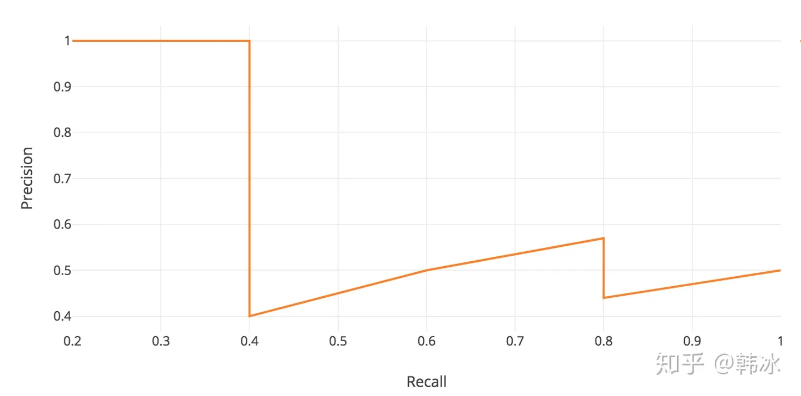

## 传统分类网络

## 传统2D目标检测网络

## Transformer

1. 介绍Transformer和VIT
2. 介绍Transformer的QKV
3. 介绍Layer Normalization
4. Transformer的训练和部署技巧
5. 介绍Transformer的位置编码
6. 介绍自注意力机制和数学公式
7. 介绍Transformer的Encoder模块
8. 介绍Transformer的Decoder模块
9. Transformer和Mamba（SSM）的区别
10. Transformer的残差结构和意义
11. 为什么Transformer适合多模态任务
12. Transformer的并行化体现在哪些方面
13. 为什么Transformer一般使用LayerNorm
14. Transformer为什么使用多头注意力机制
15. Transformer训练的Dropout是如何设定的

## BEV感知

1. 什么是BEV感知？

    **2D感知任务**是从单张图像/时间序列中检测或者分割目标，但是对于**自动驾驶**任务来说，最终需要目标在**自车坐标系**下的相关信息，因此2D的感知结果，需要映射到3D空间。即便是2D视觉感知自身发展比较成熟，但是直接从场景中获取目标的3D信息是一件比较困难的事情。对于**单目相机**，由于相机成像几何的局限性，深度估计是一个病态的问题。更好的方式是通过**双目相机**来进行深度估计，但是视野范围小，作用有限。因此有了**多目感知**，通过安装在车身上的六个摄像头来进行**3D感知任务**，也是在这个系统中提出了**BEV感知**的概念。也就是**将来自多个摄像头的图像，从透视图变换到鸟瞰图（Bird‘s Eye View）**，BEV视图包含了对自动驾驶任务重要的**位置信息**，对于**目标的高度信息**隐藏在了BEV特征图中，因此BEV感知的结果，可以直接用于下游的各种任务，对于BEV感知任务，最重要的我认为就是**从2D空间到3D空间的变换**，同样为了提高准确率，也有**点云激光雷达、毫米波雷达以及图像**的**多模态融合**方案来进行BEV感知任务

2. BEV感知任务采用的数据集和指标？

    nuScenes数据集

    **IOU**：IoU采用BEV视图下，2D检测框的中心点的距离来进行匹配，而不是采用3D框的交并比来实现，这样可以提高小目标的匹配成功率。

    **TP（True Postive）**：真正例，IOU>0.5的检测框数目

    **FP（False Postive）**：假正例，IOU<0.5的检测框数目

    **TN（True Negative）**：真负例，没有检测框

    **FN（False Negative）**：假负例，没有检测到GT框的数目

    **Precision**： $查准率=\frac{TP}{TP+FP}$

    **Recall**：$查全率 = \frac{TP}{TP + FN}$

    **AP（Average Precision）**：Precision和Recall在某些情况下是矛盾的，查得准，但是不一定全，查的全，但是不一定查的准，我们绘制PR曲线，计算PR曲线的面积（平均值）

    

    **mAP**：**针对每个类别**求AP，多个类别AP求平均值，即为mAP

    **NDS（nuScenes Detection Score）**：nuScenes数据集的一个指标，在mAP的基础上，还预测物体框的位置，大小，朝向，速度以及其他属性。可以更全面的评价3D目标检测算法的优劣

3. BEV感知中的**BaseLine**工作？

    1. **从2D空间到3D空间**

        1. LSS（Lift，Splat，Shoot）

            **a.**多张视图通过共享的CNN主干网络提取特征，对每一个特征图进行**视图转换**，核心步骤是**估计特征图每个像素处的深度分布**，这里没有预测具体的深度值，而是设置**D个离散的深度值**，网络在**每个像素处预测D个概率值**$\alpha_1,\alpha_2,\ldots,\alpha_D$，以及该**像素处的通道特征c（维度是C）**，用$\alpha$对$c$加权就得到了对应每个深度的上下文特征，这个过程叫做**Lift**

            

            **b.**假设特征图的大小为$H×W$，每个像素有$D$个可能的深度值。通过相机的内外参数，每个像素可以转换为3D空间中的D个点，因此每个特征图可以转换为$H×W×D$个点，有$N$个相机，一共有$N×H×W×D$个3D点，这些三维点可以利用**PointPillar**的方式进行投影，一个Pillar对应一个BEV网格，对落到网格中的点进行Pooling操作，得到$C$维的特征，所以BEV特征图的维度是$X×Y×C$，$X、Y$是BEV网格横向和纵向的个数，这个过程叫**Splat**。

            **c.**Shoot就是用得到的BEV特征图做下游任务（检测、分割）

        2. BEVDet

            

            **a.**BEVDet以LSS的视图转换为基础，**但是在BEV视图中采用了额外的特征提取网络来进行进一步的特征提取**，对进一步提取生成的BEV特征进行检测。

            **b.**其特征提取的主干网络可以采用ResNet、也可以采用Swin—Transformer，最后采用**CenterPoint**的Head结构来进行3D检测任务，同时改进了**非极大值抑制策略**

            

        3. BEVDet4D

            

            **a.**BEVDet在**时序融合上的扩展**，对于单帧图像的处理采用了BEVDet同样的方法，将图像转换到BEV视图上，并进行特征提取。时序处理的方式非常简单：**将T-1时刻和T时刻的BEV特征进行空间对齐**

            **b.**对于自车的运动，通过平移和旋转，将T-1时刻的坐标对齐到T时刻，因此可以通过简单的叠加操作来完成时序的融合

            

        4. BEVDepth

            

            为了改善LSS方式的深度估计质量较差的问题，**BEVDepth在训练过程中加入额外的深度信息监督**。具体来说，**激光雷达的点云被投影到图像上，为深度提供显式的监督信息**

        5. BEVFusion

            

            **a.**图像与点云激光雷达的**并行**融合方案

            **b.**图像之路仍然采用LSS式的特征提取

            **c.**点云之路采用点云BEV特征提取，然后经过和图像的融合模块得到最终的BEV特征图

            **d.**在每一条分支上加上Head，以此来监督每一条分支，使结果更准确

    2. **从3D空间到2D空间**

        1. DETR3D

            

            **a.**采用**稀疏的目标级别的query，每一个query对用一个目标的3D中心点**，通过相机成像几何，**将3D点投影到2D平面中，从图像取特征，填回到BEV特征中**，通过这个BEV特征进行检测，来更新query，反复迭代

            

        2. PETR

            **a.** 和DETR一样，不同的是，PETR的query并没有和DETR一样**通过3D到2D的映射与图像特征建立联系**，而是通过**PostionEnbeding**，**在2D图像特征上编码3D空间信息**

            **b.**缺点是显而易见的，必须要计算query和图像特征之间的**全局注意力，因为query无法直接与图像的局部区域建立联系**，计算量非常大。

        3. BEVFormer

            **多尺度可变形注意力**

            

            规而言 Attention Map = Query 和 Key 做内积运算，将 Attention Map 再和 Value 做加权；但是由于这种方式计算量开销会比较大，所以在 Deformable DETR 中**用局部注意力机制代替了全局注意力机制**，只对几个采样点进行采样，**而采样点的位置相对于参考点的偏移量和每个采样点在加权时的比重均是靠 Query 经过 Linear 层学习得到的**。

            

            

            **a.**BEVFormer采用**空间交叉注意力**来进行**图像到BEV视图**的转换，其中**query来自BEV视图，而key和value来自于图像视图**，query被定义为**可学习的BEV网格特征**，大小为$H×W×C$，$HW$是BEV网格个数，C是特征维度

            **交叉注意力中query和key/value的来源不同，它经常被用于不同域（Domain）之间的数据转换。**

            **b.**为了提取3D特征，BEV query的每个网格都被扩展为高度不同的 $N_{ref}$个三维点，从而通过高度信息，更好的从2D图像上取特征

            **c.**时序融合上采用**时序自注意力机制**，其中**query来自当前帧的BEV特征图，key和value来自历史BEV特征图**

        4. BEVFormerV2

            该方法没有用额外的激光雷达点云来提供深度信息监督，而是**给主干网络增加一个额外的3D物体检测任务（**下图中绿框的部分）。这是一个辅助任务，可以帮助主干网络更好的提取3D信息

            

    

    ## OpenMMlab
